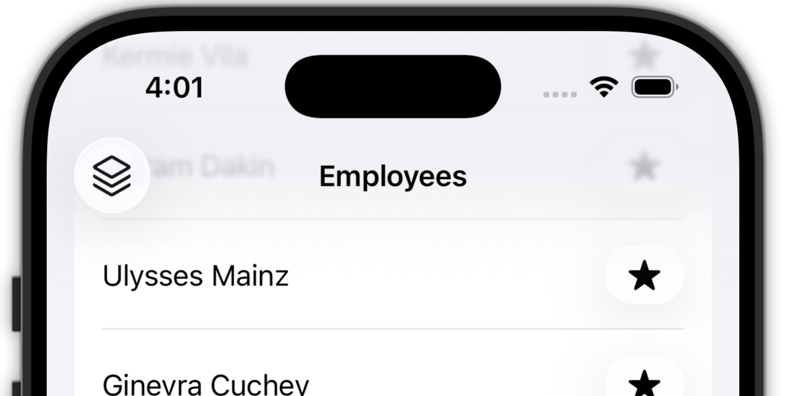
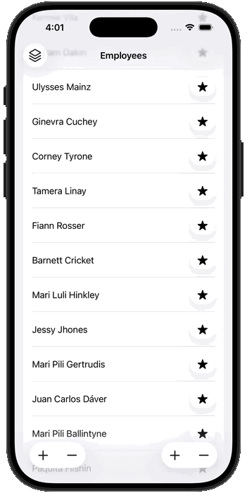
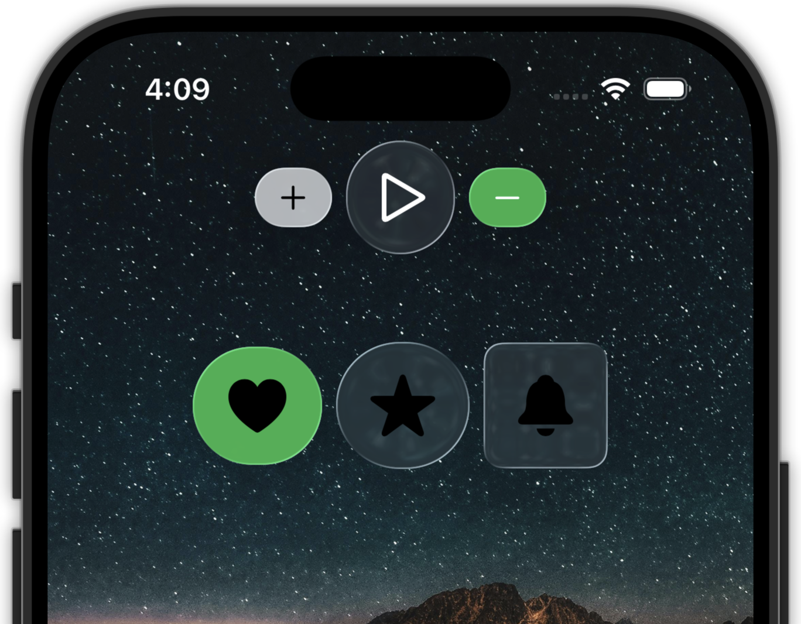

## Introducción

El Día 2 del **Swift Refresh Workshop 2025** fue una combinación poderosa:

- **Swift 6** nos obliga a ser explícitos con la concurrencia.
- **iOS 26** define un lenguaje visual con Liquid Glass.

Dos cambios distintos, misma dirección: menos hacks, más intención.

---

## 1. Swift 6 y concurrencia estricta en una app real

### Contexto del workshop

Trabajamos una app que consume un servicio REST con esta configuración:

```bash
SWIFT_VERSION = 6.0
SWIFT_STRICT_CONCURRENCY = complete
SWIFT_DEFAULT_ACTOR_ISOLATION = MainActor
```

`SWIFT_DEFAULT_ACTOR_ISOLATION = MainActor` cambia el juego: tipos y miembros no anotados quedan aislados al MainActor. Resultado:

- Hay que ser explícitos.
- Las capas importan.
- Piensas en dominios de ejecución, no solo en hilos.

---

## 2. Sendable: no es performance, es integridad

```swift
protocol HTTPClientProtocol: Sendable {
  func fetch<T>(from url: URL) async throws -> T
    where T: Decodable & Sendable
}
```

`Sendable` significa:

- El tipo puede cruzar dominios de concurrencia.
- No comparte estado mutable.
- Es seguro moverlo entre actores.

No es un tema de performance. Es de correctness.

---

## 3. Por qué Sendable es obligatorio en networking

```swift
let (data, _) = try await URLSession.shared.data(from: url)
let result = try decoder.decode(T.self, from: data)
return result
```

- `URLSession` trabaja en background.
- La decodificación también puede ocurrir fuera del MainActor.
- El resultado debe volver al actor que llamó.

Ese cruce exige `Sendable`.

---

## 4. El problema del MainActor por defecto

Un struct inocente:

```swift
struct Employee: Decodable {
  let id: Int
  let name: String
}
```

Con la config del proyecto, en realidad es:

```swift
@MainActor struct Employee { ... }
```

Un tipo aislado a un actor no puede ser `Sendable`.

---

## 5. nonisolated: liberar el tipo

```swift
nonisolated struct Employee: Decodable, Identifiable, Hashable {
  let id: Int
  let firstName: String
  let lastName: String
}
```

Esto hace que:

- No esté ligado a ningún actor.
- Pueda conformar a `Sendable`.
- Viaje entre capas.

Nota importante: `nonisolated` no hace al tipo `Sendable` por sí solo, solo quita el aislamiento.

---

## 6. Global Actor para la capa de datos

Creamos un actor propio:

```swift
@globalActor
actor DataLayer {
  static let shared = DataLayer()
}
```

Objetivo:

- Aislar la capa de red.
- Evitar el MainActor.
- Forzar background para IO y decode.

---

## 7. Repository aislado al DataLayer

```swift
@DataLayer
final class EmployeeRepository: EmployeeRepositoryProtocol {
  private let client: HTTPClientProtocol

  nonisolated init(
    client: HTTPClientProtocol = HTTPClient()
  ) {
    self.client = client
  }

  func fetchEmployees() async throws -> [Employee] {
    let dto: [Employee.DTO] = try await client.fetch(from: .getEmployees)
    return dto.map { $0.toDomain() }
  }
}
```

Detalles importantes:

- `init` debe ser `nonisolated`.
- El `HTTPClient` tambien.
- El ViewModel vive en MainActor y necesita cruzar el puente.

---

## 8. Protocolos también se aíslan

Error común:

"Por qué el método aparece como @MainActor si el tipo no lo es?"

Respuesta:

- Los protocolos heredan aislamiento.
- Si no se especifica, quedan en MainActor.

Solución:

```
@DataLayer
protocol EmployeeRepositoryProtocol {
  func fetchEmployees() async throws -> [Employee]
}
```

---

## 9. Flujo real de ejecución

```text
MainActor
 └─ ViewModel.load()
     └─ await repository.fetchEmployees()
           └─ DataLayer
                ├─ URLSession (background)
                ├─ decode (background)
                └─ return [Employee]
     └─ assign to @MainActor state
```

El `await` no solo espera. Cambia de dominio.

---

## 10. Previews y el detalle del aislamiento

Preview data:

```
extension [Employee] {
  static let preview: [Employee] = [...]
}
```

Error:

"Main actor-isolated static property cannot be used..."

Solución:

```
return await .preview
```

`await` cruza dominio. No convierte el valor, pero permite el acceso seguro.

---

## 11. Regla mental: await es un puente

`await` no es solo espera. Es un puente entre dominios.

---

## 12. Liquid Glass ya es el default en iOS 26

En iOS 26:

- No se activa.
- No se configura.
- Ya está ahí.

Si usas SwiftUI moderno, ya lo estas usando.

---

## 13. Dónde vive Liquid Glass

Vive en capas superiores:

- Toolbars
- Menus
- Sheets
- Bottom bars
- Overlays

No vive en:

- Layouts
- Filas de contenido
- Botones dentro de listas

---

## 14. Toolbars y Labels

Apple empuja:

```
Label("Sort", systemImage: "square.3.layers.3d")
```

Porque mejora:

- Accesibilidad
- Semantica
- Consistencia con Liquid Glass



---

## 15. ToolbarItemGroup y fusión automática

```
ToolbarItemGroup(placement: .bottomBar) {
  Button { } label: { Label("Add", systemImage: "plus") }
  Button { } label: { Label("Remove", systemImage: "minus") }
}
```

El sistema agrupa y aplica Liquid Glass sin stacks manuales.

---

## 16. ToolbarSpacer (iOS 26+)

```
ToolbarSpacer(placement: .bottomBar)
```

- Separación visual limpia.
- Coherencia con el sistema.
- Solo iOS 26+.

---

## 17. Menús con Liquid Glass automático

```
Menu {
  Button { } label: {
    Label("Ascending", systemImage: "arrowshape.up")
  }
} label: {
  Label("Sort", systemImage: "square.stack.3d.up")
}
```

Menús ya vienen con blur y animación.



---

## 18. Sheets y detents

- `.medium` -> translúcido
- `.large` -> más opaco

```
.presentationBackgroundInteraction(
  .enabled(upThrough: .medium)
)
```

El sistema comunica jerarquía visual por ti.


---

## 19. UIDesignRequiresCompatibility

```
UIDesignRequiresCompatibility = YES
```

- Desactiva Liquid Glass.
- Mantiene el look iOS 18.
- Es temporal (desaparece en Xcode 27).

No es un opt-out permanente.

---

## 20. Nuevos ButtonStyles (iOS 26)

- `.glass`
- `.glassProminent`

```
.buttonStyle(.glass)
```

`.glass` es translúcido y `.glassProminent` más sólido.



---

## 21. Abstracción de botones (recomendado)

```
struct AppButton<Content: View>: View {
  ...
  if #available(iOS 26, *) {
    .buttonStyle(.glass)
  } else {
    .buttonStyle(.bordered)
  }
}
```

El estilo se adapta sin duplicar vistas.

---

## 22. glassEffect (con moderación)

```
.glassEffect(.clear, in: .rect(cornerRadius: 11))
```

Es costoso si lo usas en listas largas o grids con scroll intenso.

---

## 23. GlassEffectContainer (performance)

```
GlassEffectContainer {
  HStack {
    Image(systemName: "heart")
    Image(systemName: "star")
    Image(systemName: "bell")
  }
}
```

- Un solo render pass.
- Mejor performance.
- Movimiento coherente.


---

## 24. Roles de botones

```
Button(role: .confirm) { }
Button(role: .close) { }
```

Roles = apariencia correcta + accesibilidad + consistencia.

---

## 25. Regla mental: Liquid Glass es un lenguaje

Liquid Glass no es decoración. Es el lenguaje visual del sistema.

---

## Conclusión

Swift 6 te obliga a ser explícito con la concurrencia. iOS 26 te obliga a confiar en el sistema visual.

Ambos cambios apuntan a lo mismo: menos hacks, más intención.

---

*Notas tomadas durante el Swift Developer Workshop 2025 (Apple Coding Academy: https://acoding.academy/) y reinterpretadas desde una perspectiva práctica y real‑world.*
