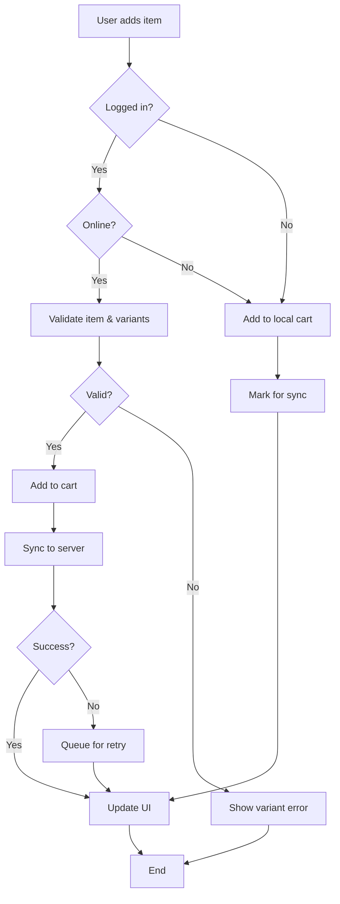
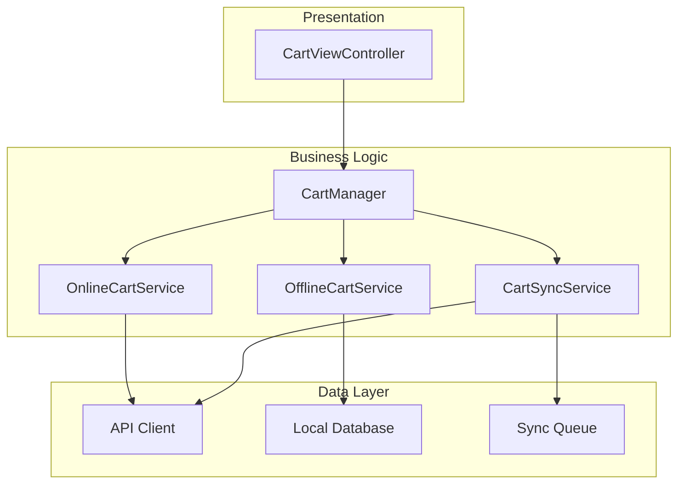

## The Problem We All Face

You've been there. A product manager walks up and says: "We need a feed feature." A stakeholder emails: "Users should see a dashboard." Your client Slacks you: "Can we add notifications?"

**Vague requirements. Unclear expectations. Missing edge cases.**

And somehow, you're expected to translate these into production-ready code that actually works.

This is where most projects start to derail-not because developers can't code, but because we're building on quicksand.
Requirements that are "susceptible to personal interpretation" instead of having a shared understanding of what needs to be built.

### The Cost of Vague Requirements

Let me share a real scenario:

* **Project:** Social media app feed feature
* **Initial requirement:** "Users should see a feed"
* **Time spent in meetings:** 3 days
* **Missing edge cases found in QA:** 7 critical scenarios
* **Rework needed:** 2 weeks
* **Team morale:** Uff, getting down I would say

Sound familiar? - I bet it does!

---

## The Essential Developer's Proven Approach

The team at [Essential Developer](https://www.essentialdeveloper.com/) has a battle-tested methodology for exactly this problem. In their comprehensive [Feed Feature Case Study](https://github.com/essentialdevelopercom/essential-feed-case-study/), they demonstrate how to transform a simple requirement like "load a feed" into:

* **Clear BDD stories** with multiple user narratives
* **Detailed use cases** covering happy paths and error scenarios
* **Visual diagrams** showing workflows and architecture
* **Test-driven specifications** ready for implementation

The methodology is brilliant. **But it requires discipline, experience, and time**-things that are often in short supply during the chaos of a sprint.

### What if your AI agent could do this for you?

That's exactly what I built: **The Requirements Engineering Agent Skill**.

---

## Introducing the Requirements Engineering Agent Skill

This skill teaches AI agents (Claude, Cursor, Windsurf, Cline, etc.) to follow the Essential Developer's proven methodology, transforming vague requirements into clear, testable specifications **automatically**.

### How It Works: The 6-Step Process

The skill guides AI agents through a structured workflow:

1. **Identify the Problem** → Recognize vague requirements
2. **Ask Clarifying Questions** → Eliminate assumptions
3. **Write BDD Stories** → Multiple narratives with scenarios
4. **Create Use Cases** → Step-by-step procedural documentation
5. **Generate Diagrams** → Visualize workflows and architecture
6. **Document Everything** → Structure it all in a README

Let me show you this in action with a real example.

---

## Real-World Example: E-commerce Shopping Cart

### The Vague Requirement

You receive this from your product manager:

> "Users should be able to add items to cart"

### Step 1: You Ask Your AI Agent

```plaintext
I'm building a shopping cart feature for a mobile e-commerce app.
The requirement is: "Users should be able to add items to cart"

Help me refine this using requirements engineering best practices.
```

### Step 2: Agent Asks Clarifying Questions

Instead of making assumptions, the agent asks:

```plaintext
I'll help refine this requirement. First, let me ask some clarifying questions:

**User Types:**
- Are there different user types (guest users vs logged-in users)?
- Do admins or support staff need to view/modify carts?

**Data & Connectivity:**
- Should the cart work offline?
- Should carts sync across devices?
- What's the maximum number of items per cart?

**Business Rules:**
- Can users add out-of-stock items?
- What happens when item prices change?
- Should we validate stock availability when adding?
- Do items have size/color variants?

**Edge Cases:**
- What if the user's session expires?
- What if they add an item that gets discontinued?
- Should cart items persist after logout?
- How long should cart data be saved?
```

**This is already invaluable.** These are questions you should ask but often don't think to ask.

### Step 3: You Provide Answers

```plaintext
- Yes, we have guest users and logged-in users
- Cart should work offline and sync when online
- Out-of-stock items should show a warning but can be added
- Carts persist 30 days for logged-in, 7 days for guests
- Items have size/color variants
- Validate stock at checkout, not when adding
```

### Step 4: Agent Creates BDD Stories

The agent generates complete BDD specifications:

```gherkin
Story: Customer adds item to shopping cart

Narrative #1: Logged-in customer adding item online
As a logged-in customer
I want to add items to my cart from any device
So I can purchase them later across all my devices

Scenarios (Acceptance criteria)
Given the customer is logged in
And has connectivity
When the customer adds an item to cart
Then the item should be added to the cart
And the cart should sync to the server
And the cart count should update

Given the customer is logged in
And adds an item with variants
When the customer doesn't select required variants
Then the system should prompt for variant selection
And not add the item until variants are selected

---

Narrative #2: Guest customer adding item offline
As a guest customer
I want to add items to my cart even when offline
So I can continue shopping without interruption

Scenarios (Acceptance criteria)
Given the customer is a guest
And doesn't have connectivity
When the customer adds an item to cart
Then the item should be saved locally
And marked for sync when connectivity returns

---

Narrative #3: Customer adding out-of-stock item
As a customer
I want to add out-of-stock items with a notification
So I can complete my purchase when items are restocked

Scenarios (Acceptance criteria)
Given an item is out of stock
When the customer adds it to cart
Then the item should be added
And a warning message should display
And the item should be marked as "out of stock"
```

**Notice what happened:** That vague "add items to cart" turned into **3 detailed narratives** covering online/offline, logged-in/guest, and in-stock/out-of-stock scenarios.

### Step 5: Agent Creates Use Cases

Now you get the procedural steps—the "recipes" for implementation:

```plaintext
Add Item to Cart Use Case

Data (Input):
- Item ID
- Quantity
- Selected variants (size, color, etc.)
- User session token (if logged in)

Primary course (happy path):
1. Execute "Add Item to Cart" command with above data
2. System validates item exists
3. System validates variants match item requirements
4. System adds item to cart
5. System calculates cart total
6. If user is logged in: System syncs cart to server
7. System delivers success confirmation

Invalid variants – error course:
1. System delivers variant validation error
2. System prompts for required variants

No connectivity (logged-in user) – partial success:
1. System adds item to local cart
2. System queues sync for later
3. System delivers success with sync pending notice

Cart limit reached – error course:
1. System delivers cart limit error
2. System suggests removing items

---

Sync Cart Use Case

Data (Input):
- Local cart data
- User session token
- Server timestamp

Primary course (happy path):
1. Execute "Sync Cart" command with above data
2. System retrieves server cart version
3. System merges local and server carts
4. System resolves conflicts (most recent wins)
5. System updates server cart
6. System updates local cart
7. System delivers sync success

Conflict resolution – alternative course:
1. System detects conflicting changes
2. System applies merge strategy (latest timestamp wins)
3. System notifies user of merged items

No connectivity – error course:
1. System queues sync for retry
2. System delivers sync pending status
```

These use cases become your **implementation guide**. Every step is clear. Every error case is documented.

### Step 6: Agent Generates Diagrams

Visual representations help communicate the design:

**Flowchart (Feature Workflow):**



**Architecture Diagram (Component Structure):**



These diagrams become **part of your documentation** and help onboard new team members.

### Step 7: Complete README Documentation

Finally, the agent structures everything into a comprehensive README:

```markdown
# Shopping Cart Feature

## Table of Contents
- [Use Cases](#use-cases)
- [Flowchart](#flowchart)
- [Architecture](#architecture)
- [BDD Specifications](#bdd-specifications)

## Use Cases

### Add Item to Cart Use Case
[Complete use case with all paths]

### Sync Cart Use Case
[Complete use case with all paths]

## Flowchart
[Mermaid diagram showing workflow]

## Architecture
[Component diagram]

## BDD Specifications

### Story: Customer adds item to shopping cart

#### Narrative #1: Logged-in customer adding item online
[Complete scenarios]

#### Narrative #2: Guest customer adding item offline
[Complete scenarios]

#### Narrative #3: Customer adding out-of-stock item
[Complete scenarios]

## Implementation Notes

### Sync Strategy
- Last-write-wins for conflict resolution
- Retry with exponential backoff
- Maximum 3 retry attempts

### Data Persistence
- Logged-in users: 30 days
- Guest users: 7 days
- SQLite for local storage
```

---

## The Results

### Before Using the Skill

**Time to clear requirements:** 3 days of back-and-forth meetings  
**Missing scenarios found in QA:** 7 critical edge cases  
**Rework needed:** 2 weeks of development time  
**Developer confidence:** Low ("Hope I understood correctly...")

### After Using the Skill

**Time to clear requirements:** 15 minutes with AI agent  
**Missing scenarios found in QA:** 0 (all covered upfront)  
**Rework needed:** 0 weeks  
**Developer confidence:** High ("I know exactly what to build")

**That's a 96% time reduction** on requirements clarification, with **100% coverage** of edge cases.

---

## More Quick Examples

### Example 2: Notification System

**Vague Input:**

```plaintext
I need a notification system. Users should get notifications.
```

**After clarifying questions, you get:**

* **3 BDD Narratives:** Real-time for online users, push for offline, history for missed alerts
* **5 Use Cases:** Send real-time, queue push, load history, mark as read, handle permissions
* **2 Diagrams:** Delivery flowchart + system architecture
* **Complete README** with all specifications

**Time:** 10 minutes

### Example 3: User Authentication

**Vague Input:**

```plaintext
Add login functionality
```

**After clarifying questions, you get:**

* **4 BDD Narratives:** Email/password, biometrics, social OAuth, password reset
* **8 Use Cases:** All auth flows + session management
* **3 Diagrams:** Auth flow + security architecture + session sequence
* **Complete README** ready for security review

**Time:** 12 minutes

---

## What's Included in the Skill

The skill provides comprehensive templates and patterns:

### 📝 BDD Templates

* User story patterns for different scenarios
* Given/When/Then scenario structures
* Multiple narrative patterns (online/offline, authenticated/guest, power user/new user)
* Anti-patterns to avoid (with examples)

### 📋 Use Case Patterns

* **CRUD operations:** Create, Read, Update, Delete
* **Offline support:** Caching, sync, conflict resolution
* **Error handling:** Network, validation, permissions
* **Authentication:** Login, tokens, sessions
* **Data fetching:** Pagination, infinite scroll, refresh

### 📊 Diagram Generation

* **Flowcharts:** Feature workflows with Mermaid
* **Architecture:** Component structure and dependencies
* **Sequence diagrams:** Interaction flows
* **State diagrams:** Feature states and transitions

### 🤖 Automation

* Python script for README generation
* Templates for consistent documentation
* Repeatable process for any feature

---

## Integration with Your Stack

### SwiftUI Example

The skill helps you go from requirement to SwiftUI architecture:

**Requirement:**

```plaintext
Users should see a feed that updates in real-time
```

**Generated Architecture Guidance:**

```swift
// Protocols suggested by use cases
protocol LoadFeedUseCase {
    func execute() async throws -> [FeedItem]
}

protocol CacheFeedUseCase {
    func execute(_ items: [FeedItem]) async throws
}

// Architecture pattern suggested
FeedView (SwiftUI)
  ↓
FeedViewModel (ObservableObject)
  ↓
RemoteWithLocalFallbackFeedLoader
  ↓                    ↓
RemoteFeedLoader    LocalFeedLoader
```

### Combine Example

**For reactive flows:**

```swift
protocol FeedLoader {
    func load() -> AnyPublisher<[FeedItem], Error>
}

// Scenarios with Combine:
// - Success: Publisher emits items
// - Network error: Publisher emits error
// - Fallback: Retry with cached data
```

The skill doesn't write code for you, but it gives you the **clear specifications** you need to write the right code.

---

## Installation

The skill works with any AI agent supporting the [Agent Skills format](https://agentskills.io).

### Quick Install

```bash
npx skills add juanpablomancera/requirements-engineering-skill
```

This works with Claude, Cursor, Windsurf, Cline, and other compatible tools.

### For Claude.ai

1. Download `requirements-engineering.skill` from [GitHub Releases](https://github.com/juanpablomancera/requirements-engineering-skill/releases)
2. Upload to your Claude project
3. Start using immediately

### Manual Installation

```bash
git clone https://github.com/juanpablomancera/requirements-engineering-skill.git

# For Cursor (macOS)
cp -r requirements-engineering-skill/requirements-engineering \
  ~/Library/Application\ Support/Cursor/User/globalStorage/skills/

# For other tools, see INSTALLATION.md
```

Full installation guide: [INSTALLATION.md](https://github.com/juanpablomancera/requirements-engineering-skill/blob/main/INSTALLATION.md)

---

## Tips for Best Results

### 1. Provide Context

**Basic:**

```plaintext
I need a search feature
```

**Better:**

```plaintext
I need a search feature for an e-commerce app. Users should search 
products by name, category, and price range. Search should work 
offline using cached results.
```

### 2. Mention Your Tech Stack (Optional)

```plaintext
I'm building this in Swift/SwiftUI for iOS 16+. I need a search feature...
```

The agent can tailor architectural suggestions to your stack.

### 3. Iterate on Specific Scenarios

```plaintext
The offline sync scenario needs more detail. Can you expand on 
how conflict resolution should work when the same item is modified 
on different devices?
```

### 4. Request Specific Outputs

```plaintext
Create BDD stories with at least 3 narratives covering online, 
offline, and error cases. Generate both a flowchart and a 
sequence diagram.
```

---

## Why This Matters

### For Individual Developers

* ✅ **Clarify requirements** before writing a single line of code
* ✅ **Reduce rework** from misunderstood specifications
* ✅ **Document decisions** for future reference
* ✅ **Learn best practices** through guided examples

### For Teams

* ✅ **Shared understanding** across product, design, and engineering
* ✅ **Consistent documentation** format across all features
* ✅ **Fewer meetings** to clarify requirements
* ✅ **Better estimates** based on clear specifications

### For Products

* ✅ **Fewer bugs** from missed edge cases
* ✅ **Better UX** from considering all user types upfront
* ✅ **Faster iterations** with clear acceptance criteria
* ✅ **Easier onboarding** with comprehensive documentation

---

## The Philosophy Behind It

This skill embodies a core principle from the Essential Developer:

> **"Good architecture is a byproduct of good team processes"**

The goal isn't to generate documentation for documentation's sake. It's to:

* **Maximize understanding** of how the system should behave
* **Minimize assumptions** through effective communication
* **Bridge the gap** between technical and business requirements
* **Provide maximum value** to customers

When everyone understands what needs to be built, the architecture naturally emerges.

---

## Try It Yourself

Ready to transform your next vague requirement? Start with this:

```plaintext
I need help refining this requirement:
"As a user, I want to see notifications"

Use requirements engineering best practices.
```

Watch as your AI agent:

1. Asks clarifying questions you hadn't thought of
2. Creates multiple BDD narratives
3. Writes complete use cases
4. Generates visual diagrams
5. Structures everything in documentation

**It's like having a senior engineer who specializes in requirements engineering sitting next to you.**

---

## Resources

* **🔗 GitHub Repository:** [requirements-engineering-skill](https://github.com/juanpablomancera/requirements-engineering-skill)
* **⚡ Quick Start Guide:** [Get started in 5 minutes](https://github.com/juanpablomancera/requirements-engineering-skill/blob/main/QUICKSTART.md)
* **📚 Complete Visual Guide:** [Detailed examples and patterns](https://github.com/juanpablomancera/requirements-engineering-skill/blob/main/VISUAL_GUIDE.md)
* **🎓 Essential Developer:** [Original methodology](https://www.essentialdeveloper.com/)
* **💡 Feed Case Study:** [Complete example](https://github.com/essentialdevelopercom/essential-feed-case-study)

---

## Conclusion

Requirements engineering is hard. It requires experience, discipline, and a methodology that many developers never learn formally.

But with AI agents and the right skill, you can apply proven best practices to every feature you build.

**No more vague requirements.**  
**No more missing edge cases.**  
**No more building the wrong thing.**

Transform "Users need a feed" into production-ready specifications—automatically.

---

## Get Started Now

```bash
npx skills add SwiftyJourney/requirements-engineering-skill
```

Then try:

```plaintext
Help me refine: "Users should be able to share content"
```

⭐ **Found this useful?** Star the [repository on GitHub](https://github.com/SwiftyJourney/requirements-engineering-skill) and share with your team!

---

*Special thanks to the Essential Developer team for their excellent teaching and open-source case studies that inspired this work.*
