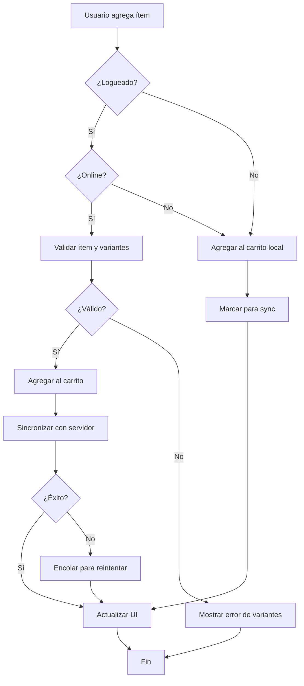
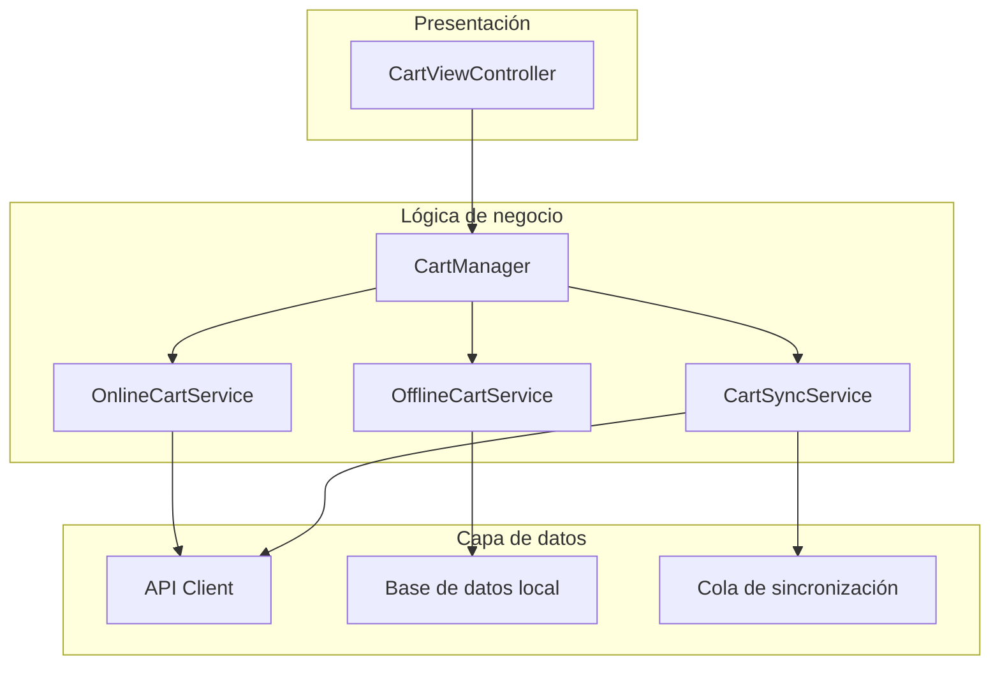

## El problema que todos enfrentamos

Ya te ha pasado. Un product manager se acerca y dice: "Necesitamos una funcionalidad de feed". Un stakeholder te escribe: "Los usuarios deberían ver un dashboard". Tu cliente te manda por Slack: "¿Podemos agregar notificaciones?"

**Requisitos vagos. Expectativas poco claras. Casos límite que faltan.**

Y de alguna forma, se espera que traduzcas todo eso en código listo para producción que realmente funcione.

Ahí es donde la mayoría de los proyectos empiezan a descarrilarse: no porque los desarrolladores no sepan programar, sino porque estamos construyendo sobre arena movediza. Requisitos "sujetos a interpretación personal" en lugar de tener un entendimiento compartido de qué hay que construir.

### El costo de los requisitos vagos

Comparto un escenario real:

* **Proyecto:** funcionalidad de feed de una app de redes sociales
* **Requisito inicial:** "Los usuarios deberían ver un feed"
* **Tiempo en reuniones:** 3 días
* **Casos límite que faltaban y se encontraron en QA:** 7 escenarios críticos
* **Retrabajo necesario:** 2 semanas
* **Morale del equipo:** uff, para abajo, diría yo

¿Te suena? — Apuesto a que sí.

---

## El enfoque probado de Essential Developer

El equipo de [Essential Developer](https://www.essentialdeveloper.com/) tiene una metodología probada en batalla para exactamente este problema. En su [estudio de caso del feed](https://github.com/essentialdevelopercom/essential-feed-case-study/), muestran cómo transformar un requisito simple como "cargar un feed" en:

* **Historias BDD claras** con múltiples narrativas de usuario
* **Casos de uso detallados** que cubren flujos felices y escenarios de error
* **Diagramas visuales** que muestran flujos de trabajo y arquitectura
* **Especificaciones orientadas a pruebas** listas para implementar

La metodología es brillante. **Pero exige disciplina, experiencia y tiempo** — cosas que suelen escasear en el caos del sprint.

### ¿Y si tu agente de IA pudiera hacer esto por ti?

Eso es justo lo que armé: **la skill de agente de ingeniería de requisitos**.

---

## Presentando la skill de agente de ingeniería de requisitos

Esta skill enseña a los agentes de IA (Claude, Cursor, Windsurf, Cline, etc.) a seguir la metodología probada de Essential Developer, transformando requisitos vagos en especificaciones claras y testeables **de forma automática**.

### Cómo funciona: el proceso en 6 pasos

La skill guía a los agentes de IA por un flujo estructurado:

1. **Identificar el problema** → Reconocer requisitos vagos
2. **Hacer preguntas de clarificación** → Eliminar suposiciones
3. **Escribir historias BDD** → Múltiples narrativas con escenarios
4. **Crear casos de uso** → Documentación procedural paso a paso
5. **Generar diagramas** → Visualizar flujos y arquitectura
6. **Documentar todo** → Estructurarlo en un README

Te muestro esto en acción con un ejemplo real.

---

## Ejemplo real: carrito de compras de e-commerce

### El requisito vago

Te llega esto de tu product manager:

> "Los usuarios deberían poder agregar ítems al carrito"

### Paso 1: Le pides ayuda a tu agente de IA

```plaintext
Estoy construyendo la funcionalidad de carrito de compras para una app de e-commerce móvil.
El requisito es: "Los usuarios deberían poder agregar ítems al carrito"

Ayúdame a refinar esto usando buenas prácticas de ingeniería de requisitos.
```

### Paso 2: El agente hace preguntas de clarificación

En lugar de asumir, el agente pregunta:

```plaintext
Te ayudo a refinar este requisito. Primero, algunas preguntas de clarificación:

**Tipos de usuario:**
- ¿Hay distintos tipos de usuario (invitados vs usuarios logueados)?
- ¿Los admins o soporte necesitan ver/modificar carritos?

**Datos y conectividad:**
- ¿El carrito debe funcionar offline?
- ¿Los carritos deben sincronizarse entre dispositivos?
- ¿Cuál es el número máximo de ítems por carrito?

**Reglas de negocio:**
- ¿Los usuarios pueden agregar ítems sin stock?
- ¿Qué pasa cuando cambia el precio de un ítem?
- ¿Validamos disponibilidad al agregar?
- ¿Los ítems tienen variantes (talle, color)?

**Casos límite:**
- ¿Qué pasa si expira la sesión del usuario?
- ¿Qué pasa si agregan un ítem que se discontinuó?
- ¿Los ítems del carrito persisten después del logout?
- ¿Cuánto tiempo se guardan los datos del carrito?
```

**Esto ya es invaluable.** Son preguntas que deberías hacer pero que muchas veces no se te ocurren.

### Paso 3: Vos respondés

```plaintext
- Sí, tenemos usuarios invitados y usuarios logueados
- El carrito debe funcionar offline y sincronizar cuando hay conexión
- Los ítems sin stock pueden agregarse pero mostrando una advertencia
- Los carritos persisten 30 días para logueados, 7 días para invitados
- Los ítems tienen variantes de talle y color
- Validar stock al hacer checkout, no al agregar
```

### Paso 4: El agente crea historias BDD

El agente genera especificaciones BDD completas:

```gherkin
Historia: El cliente agrega un ítem al carrito de compras

Narrativa #1: Cliente logueado agregando ítem online
Como cliente logueado
Quiero agregar ítems a mi carrito desde cualquier dispositivo
Para poder comprarlos después en todos mis dispositivos

Escenarios (Criterios de aceptación)
Dado que el cliente está logueado
Y tiene conectividad
Cuando el cliente agrega un ítem al carrito
Entonces el ítem debe agregarse al carrito
Y el carrito debe sincronizarse con el servidor
Y el contador del carrito debe actualizarse

Dado que el cliente está logueado
Y agrega un ítem con variantes
Cuando el cliente no selecciona las variantes requeridas
Entonces el sistema debe pedir la selección de variantes
Y no agregar el ítem hasta que se seleccionen las variantes

---

Narrativa #2: Cliente invitado agregando ítem offline
Como cliente invitado
Quiero agregar ítems a mi carrito aunque esté offline
Para poder seguir comprando sin interrupciones

Escenarios (Criterios de aceptación)
Dado que el cliente es invitado
Y no tiene conectividad
Cuando el cliente agrega un ítem al carrito
Entonces el ítem debe guardarse localmente
Y marcarse para sincronizar cuando vuelva la conectividad

---

Narrativa #3: Cliente agregando ítem sin stock
Como cliente
Quiero agregar ítems sin stock con una notificación
Para poder completar mi compra cuando repongan

Escenarios (Criterios de aceptación)
Dado que un ítem está sin stock
Cuando el cliente lo agrega al carrito
Entonces el ítem debe agregarse
Y debe mostrarse un mensaje de advertencia
Y el ítem debe marcarse como "sin stock"
```

**Fijate qué pasó:** ese "agregar ítems al carrito" vago se convirtió en **3 narrativas detalladas** que cubren online/offline, logueado/invitado y con stock/sin stock.

### Paso 5: El agente crea casos de uso

Ahora tenés los pasos procedurales — las "recetas" para implementar:

```plaintext
Caso de uso: Agregar ítem al carrito

Datos (entrada):
- ID del ítem
- Cantidad
- Variantes seleccionadas (talle, color, etc.)
- Token de sesión (si está logueado)

Curso principal (flujo feliz):
1. Ejecutar comando "Agregar ítem al carrito" con los datos anteriores
2. El sistema valida que el ítem existe
3. El sistema valida que las variantes coinciden con el ítem
4. El sistema agrega el ítem al carrito
5. El sistema calcula el total del carrito
6. Si el usuario está logueado: el sistema sincroniza el carrito con el servidor
7. El sistema entrega confirmación de éxito

Variantes inválidas – curso de error:
1. El sistema entrega error de validación de variantes
2. El sistema pide las variantes requeridas

Sin conectividad (usuario logueado) – éxito parcial:
1. El sistema agrega el ítem al carrito local
2. El sistema encola la sincronización para después
3. El sistema entrega éxito con aviso de sincronización pendiente

Límite del carrito alcanzado – curso de error:
1. El sistema entrega error de límite del carrito
2. El sistema sugiere quitar ítems

---

Caso de uso: Sincronizar carrito

Datos (entrada):
- Datos del carrito local
- Token de sesión del usuario
- Timestamp del servidor

Curso principal (flujo feliz):
1. Ejecutar comando "Sincronizar carrito" con los datos anteriores
2. El sistema obtiene la versión del carrito en el servidor
3. El sistema fusiona carrito local y del servidor
4. El sistema resuelve conflictos (el más reciente gana)
5. El sistema actualiza el carrito en el servidor
6. El sistema actualiza el carrito local
7. El sistema entrega éxito de sincronización

Resolución de conflictos – curso alternativo:
1. El sistema detecta cambios conflictivos
2. El sistema aplica estrategia de merge (gana el timestamp más reciente)
3. El sistema notifica al usuario de los ítems fusionados

Sin conectividad – curso de error:
1. El sistema encola la sincronización para reintentar
2. El sistema entrega estado de sincronización pendiente
```

Estos casos de uso se vuelven tu **guía de implementación**. Cada paso está claro. Cada caso de error está documentado.

### Paso 6: El agente genera diagramas

Las representaciones visuales ayudan a comunicar el diseño:

**Diagrama de flujo (flujo de la funcionalidad):**



**Diagrama de arquitectura (estructura de componentes):**



Estos diagramas pasan a ser **parte de tu documentación** y ayudan a incorporar nuevos miembros al equipo.

### Paso 7: Documentación README completa

Por último, el agente estructura todo en un README completo:

```markdown
# Funcionalidad de carrito de compras

## Índice
- [Casos de uso](#casos-de-uso)
- [Diagrama de flujo](#diagrama-de-flujo)
- [Arquitectura](#arquitectura)
- [Especificaciones BDD](#especificaciones-bdd)

## Casos de uso

### Caso de uso: Agregar ítem al carrito
[Caso de uso completo con todos los caminos]

### Caso de uso: Sincronizar carrito
[Caso de uso completo con todos los caminos]

## Diagrama de flujo
[Diagrama Mermaid del flujo de trabajo]

## Arquitectura
[Diagrama de componentes]

## Especificaciones BDD

### Historia: El cliente agrega un ítem al carrito de compras

#### Narrativa #1: Cliente logueado agregando ítem online
[Escenarios completos]

#### Narrativa #2: Cliente invitado agregando ítem offline
[Escenarios completos]

#### Narrativa #3: Cliente agregando ítem sin stock
[Escenarios completos]

## Notas de implementación

### Estrategia de sincronización
- Última escritura gana para resolución de conflictos
- Reintento con backoff exponencial
- Máximo 3 intentos de reintento

### Persistencia de datos
- Usuarios logueados: 30 días
- Invitados: 7 días
- SQLite para almacenamiento local
```

---

## Los resultados

### Antes de usar la skill

**Tiempo hasta tener requisitos claros:** 3 días de reuniones de ida y vuelta  
**Escenarios faltantes encontrados en QA:** 7 casos límite críticos  
**Retrabajo necesario:** 2 semanas de desarrollo  
**Confianza del desarrollador:** Baja ("Ojalá haya entendido bien...")

### Después de usar la skill

**Tiempo hasta tener requisitos claros:** 15 minutos con el agente de IA  
**Escenarios faltantes encontrados en QA:** 0 (todos cubiertos de entrada)  
**Retrabajo necesario:** 0 semanas  
**Confianza del desarrollador:** Alta ("Sé exactamente qué construir")

**Eso es una reducción del 96 %** en el tiempo de clarificación de requisitos, con **100 % de cobertura** de casos límite.

---

## Más ejemplos rápidos

### Ejemplo 2: Sistema de notificaciones

**Entrada vaga:**

```plaintext
Necesito un sistema de notificaciones. Los usuarios deberían recibir notificaciones.
```

**Después de las preguntas de clarificación, obtenés:**

* **3 narrativas BDD:** Tiempo real para usuarios online, push para offline, historial para alertas perdidas
* **5 casos de uso:** Enviar en tiempo real, encolar push, cargar historial, marcar como leído, manejar permisos
* **2 diagramas:** Flujo de entrega + arquitectura del sistema
* **README completo** con todas las especificaciones

**Tiempo:** 10 minutos

### Ejemplo 3: Autenticación de usuario

**Entrada vaga:**

```plaintext
Agregar funcionalidad de login
```

**Después de las preguntas de clarificación, obtenés:**

* **4 narrativas BDD:** Email/contraseña, biométricos, OAuth social, recuperación de contraseña
* **8 casos de uso:** Todos los flujos de auth + gestión de sesión
* **3 diagramas:** Flujo de auth + arquitectura de seguridad + secuencia de sesión
* **README completo** listo para revisión de seguridad

**Tiempo:** 12 minutos

---

## Qué incluye la skill

La skill provee plantillas y patrones completos:

### 📝 Plantillas BDD

* Patrones de historias de usuario para distintos escenarios
* Estructuras de escenarios Dado/Cuando/Entonces
* Patrones de múltiples narrativas (online/offline, autenticado/invitado, usuario avanzado/nuevo)
* Anti-patrones a evitar (con ejemplos)

### 📋 Patrones de casos de uso

* **Operaciones CRUD:** Crear, Leer, Actualizar, Eliminar
* **Soporte offline:** Caché, sincronización, resolución de conflictos
* **Manejo de errores:** Red, validación, permisos
* **Autenticación:** Login, tokens, sesiones
* **Obtención de datos:** Paginación, scroll infinito, refresh

### 📊 Generación de diagramas

* **Diagramas de flujo:** Flujos de funcionalidad con Mermaid
* **Arquitectura:** Estructura de componentes y dependencias
* **Diagramas de secuencia:** Flujos de interacción
* **Diagramas de estado:** Estados y transiciones de la funcionalidad

### 🤖 Automatización

* Script en Python para generación del README
* Plantillas para documentación consistente
* Proceso repetible para cualquier funcionalidad

---

## Integración con tu stack

### Ejemplo con SwiftUI

La skill te ayuda a pasar del requisito a la arquitectura en SwiftUI:

**Requisito:**

```plaintext
Los usuarios deberían ver un feed que se actualice en tiempo real
```

**Guía de arquitectura generada:**

```swift
// Protocolos sugeridos por los casos de uso
protocol LoadFeedUseCase {
    func execute() async throws -> [FeedItem]
}

protocol CacheFeedUseCase {
    func execute(_ items: [FeedItem]) async throws
}

// Patrón de arquitectura sugerido
FeedView (SwiftUI)
  ↓
FeedViewModel (ObservableObject)
  ↓
RemoteWithLocalFallbackFeedLoader
  ↓                    ↓
RemoteFeedLoader    LocalFeedLoader
```

### Ejemplo con Combine

**Para flujos reactivos:**

```swift
protocol FeedLoader {
    func load() -> AnyPublisher<[FeedItem], Error>
}

// Escenarios con Combine:
// - Éxito: el Publisher emite ítems
// - Error de red: el Publisher emite error
// - Fallback: reintentar con datos en caché
```

La skill no escribe código por vos, pero te da las **especificaciones claras** que necesitás para escribir el código correcto.

---

## Instalación

La skill funciona con cualquier agente de IA que soporte el [formato Agent Skills](https://agentskills.io).

### Instalación rápida

```bash
npx skills add juanpablomancera/requirements-engineering-skill
```

Funciona con Claude, Cursor, Windsurf, Cline y otras herramientas compatibles.

### Para Claude.ai

1. Descargá `requirements-engineering.skill` desde [GitHub Releases](https://github.com/juanpablomancera/requirements-engineering-skill/releases)
2. Subilo a tu proyecto de Claude
3. Empezá a usarlo de inmediato

### Instalación manual

```bash
git clone https://github.com/juanpablomancera/requirements-engineering-skill.git

# Para Cursor (macOS)
cp -r requirements-engineering-skill/requirements-engineering \
  ~/Library/Application\ Support/Cursor/User/globalStorage/skills/

# Para otras herramientas, ver INSTALLATION.md
```

Guía completa de instalación: [INSTALLATION.md](https://github.com/juanpablomancera/requirements-engineering-skill/blob/main/INSTALLATION.md)

---

## Tips para mejores resultados

### 1. Dá contexto

**Básico:**

```plaintext
Necesito una funcionalidad de búsqueda
```

**Mejor:**

```plaintext
Necesito una funcionalidad de búsqueda para una app de e-commerce. Los usuarios 
deben buscar productos por nombre, categoría y rango de precio. La búsqueda 
debe funcionar offline usando resultados en caché.
```

### 2. Mencioná tu stack (opcional)

```plaintext
Estoy construyendo esto en Swift/SwiftUI para iOS 16+. Necesito una funcionalidad de búsqueda...
```

El agente puede adaptar las sugerencias de arquitectura a tu stack.

### 3. Iterá sobre escenarios específicos

```plaintext
El escenario de sincronización offline necesita más detalle. ¿Podés expandir 
cómo debería funcionar la resolución de conflictos cuando el mismo ítem 
se modifica en distintos dispositivos?
```

### 4. Pedí salidas específicas

```plaintext
Creá historias BDD con al menos 3 narrativas cubriendo casos online, 
offline y de error. Generá tanto un diagrama de flujo como un 
diagrama de secuencia.
```

---

## Por qué importa esto

### Para desarrolladores individuales

* ✅ **Clarificar requisitos** antes de escribir una sola línea de código
* ✅ **Reducir retrabajo** por especificaciones mal entendidas
* ✅ **Documentar decisiones** para referencia futura
* ✅ **Aprender buenas prácticas** mediante ejemplos guiados

### Para equipos

* ✅ **Entendimiento compartido** entre producto, diseño e ingeniería
* ✅ **Formato de documentación consistente** en todas las funcionalidades
* ✅ **Menos reuniones** para clarificar requisitos
* ✅ **Mejores estimaciones** basadas en especificaciones claras

### Para productos

* ✅ **Menos bugs** por casos límite no considerados
* ✅ **Mejor UX** al considerar todos los tipos de usuario de entrada
* ✅ **Iteraciones más rápidas** con criterios de aceptación claros
* ✅ **Onboarding más fácil** con documentación completa

---

## La filosofía detrás

Esta skill encarna un principio central de Essential Developer:

> **"La buena arquitectura es un subproducto de buenos procesos de equipo"**

El objetivo no es generar documentación por documentar. Es:

* **Maximizar el entendimiento** de cómo debe comportarse el sistema
* **Minimizar suposiciones** mediante comunicación efectiva
* **Tender un puente** entre requisitos técnicos y de negocio
* **Entregar el máximo valor** a los clientes

Cuando todos entienden qué hay que construir, la arquitectura emerge de forma natural.

---

## Probala vos mismo

¿Listo para transformar tu próximo requisito vago? Empezá con esto:

```plaintext
Necesito ayuda para refinar este requisito:
"Como usuario, quiero ver notificaciones"

Usá buenas prácticas de ingeniería de requisitos.
```

Mirá cómo tu agente de IA:

1. Hace preguntas de clarificación en las que no habías pensado
2. Crea múltiples narrativas BDD
3. Escribe casos de uso completos
4. Genera diagramas visuales
5. Estructura todo en documentación

**Es como tener un ingeniero senior especializado en ingeniería de requisitos sentado al lado.**

---

## Recursos

* **🔗 Repositorio en GitHub:** [requirements-engineering-skill](https://github.com/juanpablomancera/requirements-engineering-skill)
* **⚡ Guía de inicio rápido:** [Empezá en 5 minutos](https://github.com/juanpablomancera/requirements-engineering-skill/blob/main/QUICKSTART.md)
* **📚 Guía visual completa:** [Ejemplos y patrones detallados](https://github.com/juanpablomancera/requirements-engineering-skill/blob/main/VISUAL_GUIDE.md)
* **🎓 Essential Developer:** [Metodología original](https://www.essentialdeveloper.com/)
* **💡 Estudio de caso del feed:** [Ejemplo completo](https://github.com/essentialdevelopercom/essential-feed-case-study)

---

## Conclusión

La ingeniería de requisitos es difícil. Requiere experiencia, disciplina y una metodología que muchos desarrolladores nunca aprenden de forma formal.

Pero con agentes de IA y la skill adecuada, podés aplicar buenas prácticas probadas a cada funcionalidad que construyas.

**No más requisitos vagos.**  
**No más casos límite que falten.**  
**No más construir la cosa incorrecta.**

Convertí "Los usuarios necesitan un feed" en especificaciones listas para producción — automáticamente.

---

## Empezá ahora

```bash
npx skills add SwiftyJourney/requirements-engineering-skill
```

Y probá:

```plaintext
Ayudame a refinar: "Los usuarios deberían poder compartir contenido"
```

⭐ **¿Te resultó útil?** Dejale una estrella al [repositorio en GitHub](https://github.com/SwiftyJourney/requirements-engineering-skill) y compartilo con tu equipo.

---

*Agradecimiento especial al equipo de Essential Developer por su excelente enseñanza y estudios de caso open source que inspiraron este trabajo.*
