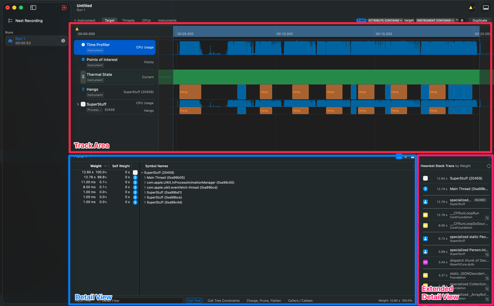
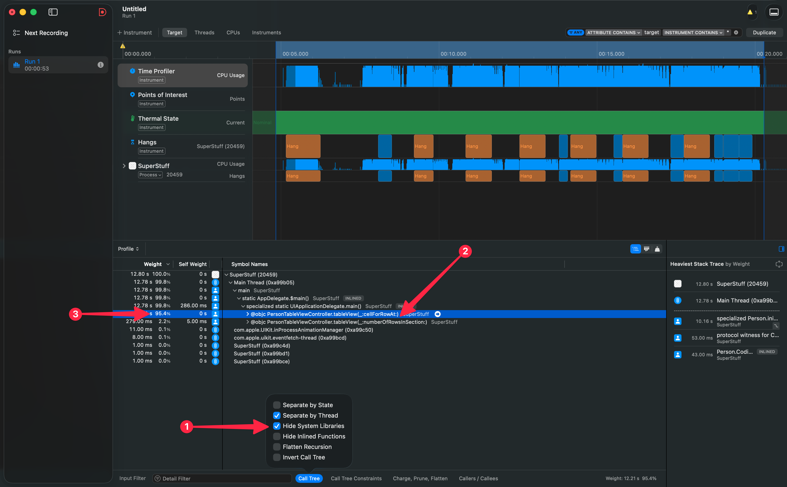
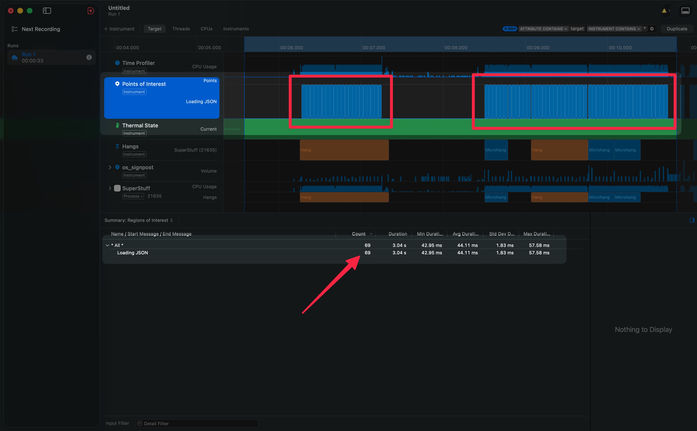
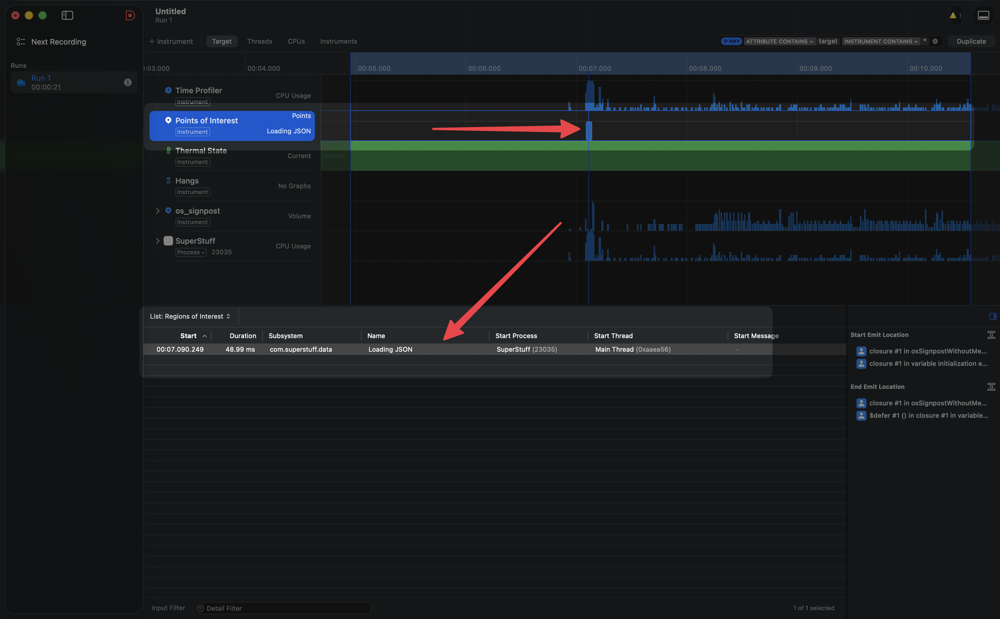

import Callout from '../../../../../components/Callout.astro';
import InfoBox from '../../../../../components/InfoBox.astro';

Hay una herramienta en el ecosistema de Apple que todos conocemos de nombre, que muchos abrimos alguna vez por curiosidad, y que casi nadie domina. Se llama Instruments. Y no es tu culpa si la has evitado — su interfaz intimida, sus datos abruman, y la curva de entrada es empinada.

Pero aquí va la verdad incómoda: si no sabes perfilar tu app, estás adivinando. Y adivinar en rendimiento es como intentar arreglar un motor con los ojos cerrados.

<div class="pull-quote">
Instruments no es solo una herramienta de profiling — es una plataforma completa para registrar, visualizar y analizar lo que realmente pasa dentro de tu app.
</div>

Este es el primer artículo de una serie donde vamos a desmenuzar Instruments pieza por pieza. No desde la teoría abstracta, sino desde problemas reales, código real y diagnósticos que puedes aplicar mañana en tu proyecto. Hoy arrancamos con los fundamentos: cómo pensar sobre rendimiento, cómo navegar Instruments sin perderte, y cómo usar Signposts para hacer visible lo invisible.

## Los tres modelos mentales del rendimiento

Antes de abrir Instruments, necesitas construir algo más importante que habilidad técnica: necesitas construir **modelos mentales**. Sin ellos, vas a ver datos sin entender qué significan.

Piensa en una resonancia magnética. Hay tres roles distintos involucrados:

1. **El técnico de la MRI** sabe exactamente qué botón presionar, cómo configurar la máquina, cómo posicionar al paciente. En nuestro mundo, esto es saber navegar Instruments — dónde hacer clic, qué plantilla elegir, cómo filtrar datos.

2. **El médico** estudió años para entender cómo funciona un cuerpo sano. Sabe qué es normal. Para nosotros, esto equivale a entender los fundamentos: cómo funciona la memoria (stack vs. heap), qué es el hilo principal, cómo el sistema operativo agenda el trabajo, por qué un frame tiene que estar listo cada 16.7ms en una pantalla de 60Hz — o cada 8.3ms en una de 120Hz.

3. **El patólogo** es quien mira los resultados y dice: "esto no está bien". Es el diagnóstico. En nuestro caso, es la capacidad de ver un trace en Instruments y decir: "aquí está el cuello de botella, y esto es lo que lo causa".

<Callout type="tip" title="El secreto que nadie te dice">
No necesitas dominar los tres modelos de golpe. Pero sí necesitas saber en cuál estás trabajando en cada momento. ¿Estás aprendiendo la herramienta? ¿Estás estudiando los fundamentos del sistema? ¿O estás diagnosticando un problema real? Separar esto mentalmente te ahorra horas de frustración.
</Callout>

Volverse experto en rendimiento no es más que el proceso de **refinar continuamente estos tres modelos mentales**. Y la buena noticia es que cada problema que resuelves, los fortalece.

## Navegando el arsenal de Instruments

En Instruments 16, Apple nos da **60 instrumentos diferentes y 25 plantillas** predefinidas. Suena abrumador, pero no necesitas memorizarlos todos — ni de cerca.

La estrategia es simple: domina los que aparecen con más frecuencia. El **Time Profiler** aparece en 13 plantillas diferentes. El instrumento de **Hangs** aparece en 10. Si dominas esos dos, ya cubres una enorme cantidad de escenarios.

### Cómo iniciar una sesión

Desde Xcode, tienes dos atajos clave:

- **`Cmd + I`** — Compila y abre Instruments para perfilar
- **`Ctrl + Cmd + I`** — Abre Instruments sin recompilar (útil cuando ya tienes un build reciente)

### Las tres áreas de la interfaz

Una vez que inicias una grabación y la detienes, la ventana de Instruments se divide en tres zonas que necesitas identificar:

- **Track Area (arriba):** Las líneas de tiempo. Cada instrumento tiene su propia pista visual. Aquí ves la película completa de lo que pasó.
- **Detail View (abajo):** Los datos agregados — árboles de llamadas, listas de eventos, conteos. Aquí está la evidencia.
- **Extended Detail View (panel derecho):** El stack trace más pesado. Cuando seleccionas algo en el Detail View, aquí ves exactamente qué cadena de llamadas consumió más recursos.

<Callout type="info" title="El atajo que más vas a usar">
Haz clic y arrastra en la línea de tiempo para crear un **Inspection Range** — un rango que filtra todos los datos a ese segmento de tiempo. Luego presiona `Cmd + Ctrl + Z` para hacer zoom a ese rango. Esto es fundamental: te permite enfocarte en el momento exacto del problema sin el ruido del resto de la sesión.
</Callout>



## Encontrando el cuello de botella: un caso real

La teoría está bien, pero vamos a ensuciarnos las manos. Tenemos una app llamada **SuperStuff** que muestra una lista de perfiles de GitHub cargados desde un archivo JSON. La app es simple: un `UITableView` con celdas que muestran el nombre de cada usuario.

El problema es que al hacer scroll, la app se traba. No es suave como la mantequilla. Ni siquiera como la margarina. Se siente como si estuvieras arrastrando la tabla a través de cemento.

### El código sospechoso

Veamos qué tiene `PeopleStore`, la clase que maneja los datos:

```swift
class PeopleStore {

    static var people: [Person] {
        guard let url = Bundle.main.url(forResource: "people", withExtension: "json") else {
            return []
        }

        guard let jsonData = try? Data(contentsOf: url) else {
            return []
        }

        let decoder = JSONDecoder()
        decoder.keyDecodingStrategy = .convertFromSnakeCase
        do {
            let returnValue = try decoder.decode([Person].self, from: jsonData)
            return returnValue
        }
        catch {
            print(error)
            return []
        }
    }
}
```

¿Lo ves? `people` es una **propiedad computada** (`var people: [Person]`). Cada vez que alguien accede a ella, se lee el archivo JSON del disco y se decodifican los 11,000+ registros desde cero. Cada. Vez.

Y ahora mira quién la usa:

```swift
class PersonTableViewController: UITableViewController {

    private var people: [Person] {
        PeopleStore.people  // ← Cada acceso dispara toda la decodificación
    }

    override func tableView(_ tableView: UITableView, numberOfRowsInSection section: Int) -> Int {
        return people.count  // ← Decodifica aquí
    }

    override func tableView(_ tableView: UITableView, cellForRowAt indexPath: IndexPath) -> UITableViewCell {
        let cell = tableView.dequeueReusableCell(withIdentifier: "PersonCell", for: indexPath)
        let person = people[indexPath.row]  // ← Y aquí, por CADA celda
        cell.textLabel?.text = person.login
        return cell
    }
}
```

Cada celda que se dibuja en pantalla dispara una lectura completa del JSON. Con scroll agresivo, eso pueden ser cientos de decodificaciones en segundos.

Pero supongamos que no conoces el código. Supongamos que heredaste este proyecto y solo sabes que "el scroll va lento". Aquí es donde Instruments brilla.

### El diagnóstico con Time Profiler

Al perfilar con la plantilla de **Time Profiler** y hacer scroll agresivo, verás dos cosas inmediatas en el Track Area:

1. **Picos masivos de CPU** — la gráfica se dispara cada vez que haces scroll
2. **Marcadores de Hangs** — bloques rojos y amarillos indicando que el hilo principal no respondió a tiempo

Al bajar al Detail View, el árbol de llamadas (Call Tree) puede ser abrumador. Miles de llamadas a frameworks internos de Apple que tú no escribiste. Es fácil perderse aquí.

### El truco de oro: Hide System Libraries

En la parte inferior del Detail View, hay un botón de filtro para el Call Tree. Selecciona **"Hide System Libraries"**. Esto es transformador: filtra todo el código de Apple y asigna ese tiempo directamente a **tu** código que originó la llamada.

En nuestro caso, el resultado es brutal: **el 95.4% del tiempo se gasta en `cellForRowAt`**. El cuello de botella queda expuesto sin ambigüedad.

<InfoBox title="Checklist para diagnosticar un hang con Time Profiler">
- Perfila con la plantilla Time Profiler (`Cmd + I`)
- Reproduce el problema (scroll, navegación, lo que sea lento)
- Crea un Inspection Range sobre la zona problemática
- Activa "Hide System Libraries" en el filtro del Call Tree
- Busca el porcentaje más alto — ese es tu punto de entrada
- Lee el stack trace en el Extended Detail View para entender la cadena completa
</InfoBox>



## Signposts: haz visible lo invisible en Instruments

Time Profiler es poderoso para medir CPU, pero tiene un punto ciego: **no entiende la semántica de tu código**. No sabe cuándo empieza una descarga, cuándo se procesa una imagen, o cuándo se lee un archivo. Solo ve funciones ejecutándose.

Aquí entra la API de **`OSSignposter`** del framework `os`. Según la [documentación oficial de Apple](https://developer.apple.com/documentation/os/ossignposter), `OSSignposter` te permite crear intervalos semánticos que aparecen como pistas visuales en Instruments, usando el mismo sistema de subsistemas y categorías del logging unificado.

Lo mejor: el impacto en rendimiento es prácticamente nulo. Puedes dejar los signposts incluso en builds de producción.

### Instrumentando el código

Vamos a envolver la carga del JSON con un signpost para ver exactamente qué está pasando:

```swift
import os

class PeopleStore {

    private static let signposter = OSSignposter(
        subsystem: "com.superstuff.data",
        category: .pointsOfInterest
    )

    static var people: [Person] {
        let signpostID = signposter.makeSignpostID()
        let state = signposter.beginInterval("Loading JSON", id: signpostID)
        defer { signposter.endInterval("Loading JSON", state) }

        guard let url = Bundle.main.url(forResource: "people", withExtension: "json") else {
            return []
        }

        guard let jsonData = try? Data(contentsOf: url) else {
            return []
        }

        let decoder = JSONDecoder()
        decoder.keyDecodingStrategy = .convertFromSnakeCase
        do {
            return try decoder.decode([Person].self, from: jsonData)
        }
        catch {
            print(error)
            return []
        }
    }
}
```

Fíjate en tres cosas clave:

1. Creamos un `OSSignposter` con la categoría `.pointsOfInterest` — esto hace que los intervalos aparezcan automáticamente en la pista **"Points of Interest"** de Instruments
2. Usamos `makeSignpostID()` para generar un identificador único que permite a Instruments distinguir entre invocaciones concurrentes del mismo intervalo
3. Usamos `defer` para cerrar el intervalo — así se cierra sin importar por cuál `return` salga la función

<Callout type="warning" title="defer es tu mejor amigo con Signposts">
Siempre usa `defer` para cerrar un intervalo de signpost. Si tu función tiene múltiples puntos de salida (como nuestros `guard` statements), olvidar cerrar el intervalo en alguno de ellos dejará intervalos huérfanos que ensuciarán tus datos en Instruments.
</Callout>

### Lo que los Signposts revelan

Ahora perfilamos de nuevo, hacemos scroll... y la pista de **Points of Interest** cuenta toda la historia sin necesidad de interpretar árboles de llamadas:

Una secuencia interminable de bloques "Loading JSON". Uno tras otro. Decenas — o cientos — de ellos. En la vista de resumen puedes ver el conteo exacto — por ejemplo, **69 veces en apenas 3 segundos** de scroll.

El error lógico queda expuesto visualmente. No necesitas ser experto en leer Call Trees. Los signposts lo gritan por ti.



## La solución: tres caracteres que lo cambian todo

El diagnóstico está hecho. Ahora el fix. Y es casi cómicamente simple — cambiar la propiedad computada por una que se evalúe una sola vez:

```swift
class PeopleStore {

    static let people: [Person] = {
        guard let url = Bundle.main.url(forResource: "people", withExtension: "json") else {
            return []
        }

        guard let jsonData = try? Data(contentsOf: url) else {
            return []
        }

        let decoder = JSONDecoder()
        decoder.keyDecodingStrategy = .convertFromSnakeCase
        do {
            return try decoder.decode([Person].self, from: jsonData)
        }
        catch {
            print(error)
            return []
        }
    }()
}
```

De `var` a `let`, y de propiedad computada a un closure que se ejecuta **una sola vez** en la inicialización. El JSON se lee y decodifica una vez, se guarda en memoria, y todas las lecturas posteriores son instantáneas.

El resultado al perfilar de nuevo: la gráfica de CPU baja a niveles mínimos, la pista de Hangs queda completamente vacía, y si mantienes los signposts activos, verás un solo bloque de "Loading JSON". Uno. El scroll vuelve a ser mantequilla.

<div class="pull-quote">
A veces la diferencia entre una app que se arrastra y una que vuela son tres caracteres en una línea de código. Pero encontrar esos tres caracteres sin las herramientas correctas puede tomar días.
</div>



## Un tip para el trabajo en equipo

Antes de cerrar, algo que ojalá más equipos supieran: las sesiones de Instruments se guardan como **documentos** (archivos `.trace`). Puedes guardar un trace, cerrarlo, y adjuntarlo a un ticket en Jira, Linear o GitHub Issues. Tu equipo de QA puede abrirlo en su Mac y explorar los datos exactamente como tú los viste — sin perder configuración, filtros ni datos recolectados.

Esto cambia la conversación de "la app va lenta" a "aquí tienes el trace, mira la línea 47 del Call Tree".

<Callout type="success" title="Lo que viene en la serie">
Este fue el primer artículo de la serie sobre Instruments. Construimos los modelos mentales, navegamos la interfaz, diagnosticamos un problema real y aprendimos a usar Signposts para hacer visible lo invisible. En los próximos artículos iremos más profundo — Memory Graph, Allocations, Network, y más. La idea es que al final de la serie, Instruments deje de ser esa herramienta que abres con miedo y se convierta en tu aliada de confianza.
</Callout>
