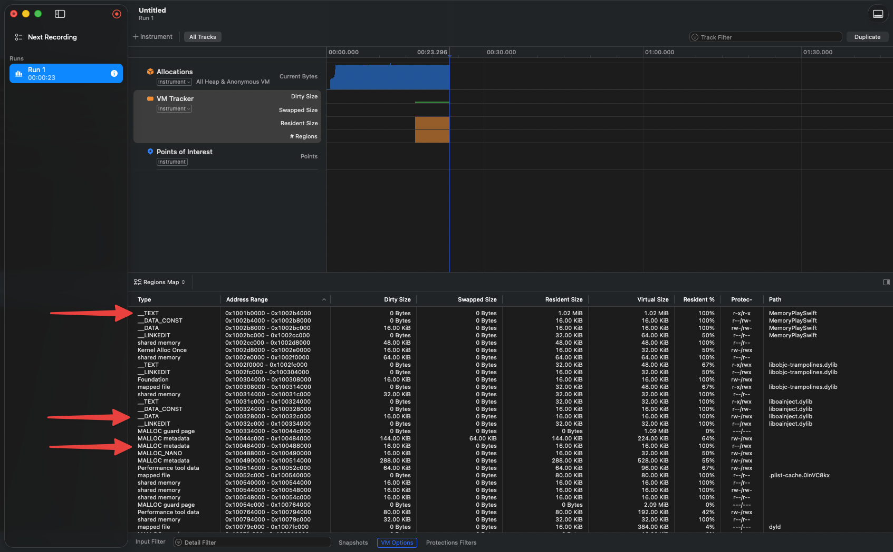
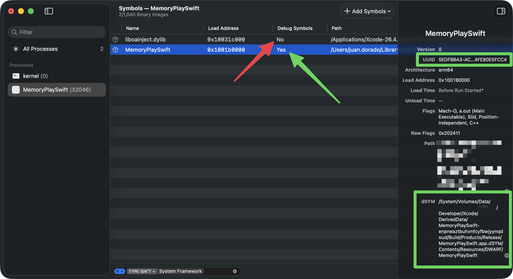
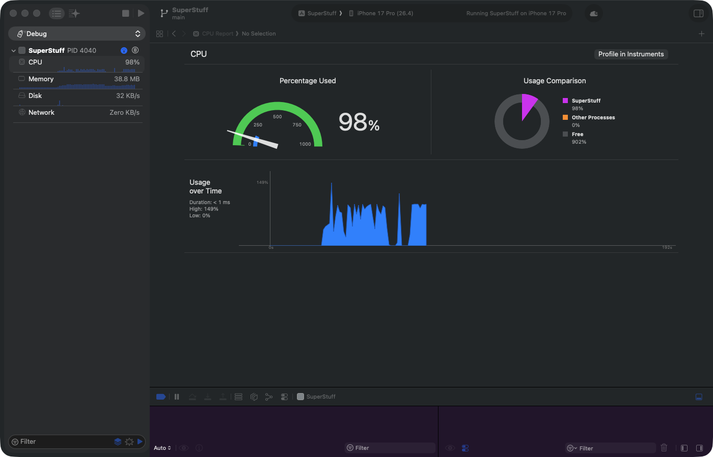
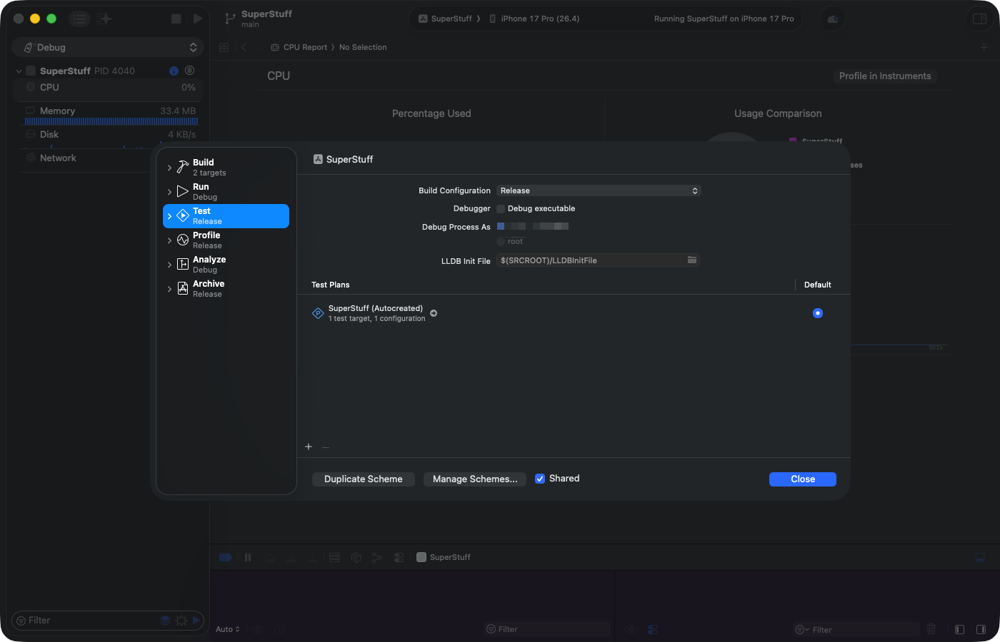
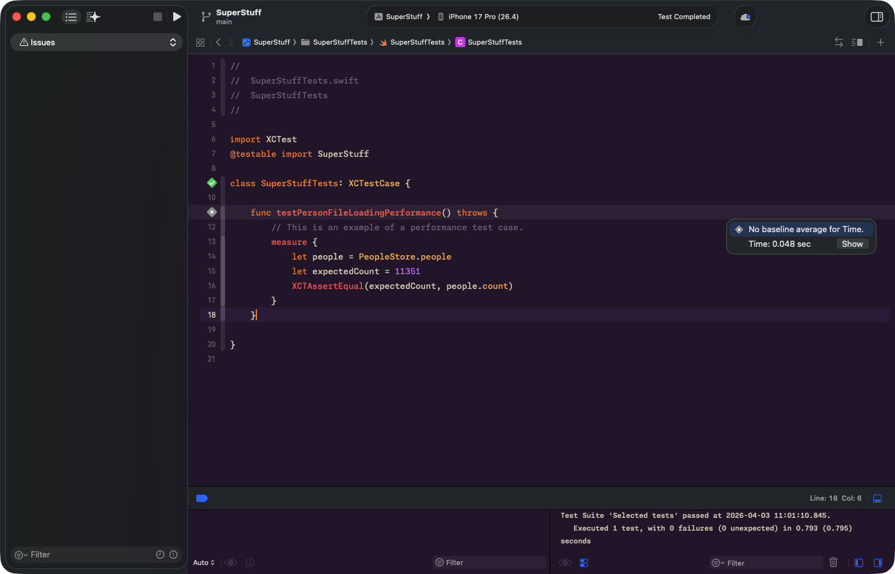
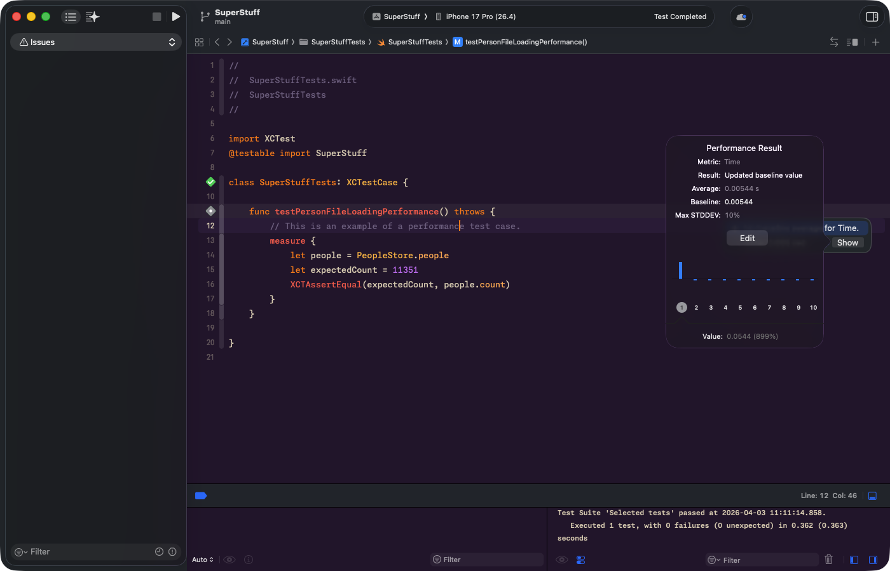

import Callout from '../../../../../components/Callout.astro';
import InfoBox from '../../../../../components/InfoBox.astro';

En el [artículo anterior](/blog/dominando-xcode-instruments-modelos-mentales-signposts) comparamos a Instruments con una máquina de resonancia magnética. Aprendimos a usar la máquina — los botones, las plantillas, los filtros. Pero el técnico de la MRI no interpreta los resultados. Eso lo hace el médico. Y el médico necesita entender la anatomía del paciente.

Hoy nos toca ser médicos. Vamos a abrir al paciente y estudiar lo que hay dentro: cómo tu app organiza la memoria, qué forma tiene el binario que se carga en el dispositivo, cómo el sistema traduce direcciones hexadecimales a nombres de funciones que podemos leer, y qué herramientas tenemos en Xcode para detectar problemas **antes** de siquiera pensar en abrir Instruments.

Te advierto: este artículo es más denso que el anterior. Pero no te preocupes — vamos a ir paso a paso, con metáforas y ejemplos concretos. Al final, vas a entender cosas que la mayoría de los desarrolladores iOS nunca se detienen a aprender. Y eso te va a dar una ventaja enorme.

<div class="pull-quote">
Si no entiendes cómo funciona la memoria de tu app, estás leyendo una radiografía sin haber estudiado anatomía.
</div>

## La anatomía de la memoria: Stack vs. Heap

Cada vez que tu app se lanza, el sistema operativo le asigna su propio espacio de **memoria virtual** — imagínalo como un edificio gigante lleno de departamentos vacíos, cada uno con una dirección hexadecimal en la puerta. Este espacio virtual se mapea después a la memoria física del dispositivo. No necesitas saber los detalles de ese mapeo, pero sí necesitas entender las dos zonas que están en constante movimiento mientras tu app vive: el **Stack** y el **Heap**.

### El Stack: rápido y predecible

Cada hilo de ejecución tiene su propio Stack. Es un bloque de memoria contigua — piénsalo como una pila de platos en un restaurante. Cuando llamas a una función, un puntero (el Frame Pointer) avanza para reservar espacio para los argumentos y variables locales. Cuando la función termina, el puntero retrocede. Un plato se pone, un plato se quita. No hay búsqueda, no hay negociación, no hay contabilidad.

**Asignar memoria en el Stack es de las operaciones más rápidas que existen.** Es literalmente mover un número.

### El Heap: flexible pero costoso

Aquí vive la memoria asignada dinámicamente. En Swift, los tipos por referencia — `class`, `actor`, closures — se almacenan en el Heap. E incluso algunos tipos de valor que crecen más allá de cierto umbral, como un `String` muy largo o un `Array` grande, terminan ahí también.

A diferencia del Stack, el Heap requiere trabajo extra. El sistema usa primitivas como `malloc` para encontrar un bloque de memoria libre, registrar su tamaño, y luego liberarlo con `free` cuando ARC (Automatic Reference Counting) determina que nadie más lo necesita. Esa contabilidad tiene un costo. Y cuando tu app crea miles de objetos en el Heap por segundo — como decodificar un JSON masivo decenas de veces por segundo, como vimos en la Parte 1 — ese costo se multiplica.

<Callout type="info" title="¿Por qué importa esto para el rendimiento?">
Cuando ves un pico de CPU en Instruments, muchas veces la causa raíz no es que tu algoritmo sea lento — es que estás creando demasiados objetos en el Heap. Entender la diferencia entre Stack y Heap te ayuda a interpretar lo que Instruments te muestra, no solo a verlo.
</Callout>

<InfoBox title="Stack vs. Heap en Swift — guía rápida">
- Tipos de valor (`struct`, `enum`, tuplas) → generalmente en el Stack
- Tipos por referencia (`class`, `actor`, closures) → en el Heap
- `String`, `Array`, `Dictionary` → tipos de valor, pero su storage interno vive en el Heap
- Cada asignación en el Heap pasa por `malloc` + ARC — eso cuesta ciclos de CPU
- El Stack se limpia automáticamente al salir de la función — cero overhead
</InfoBox>

## Mach-O: la anatomía de tu binario

Ya entendemos dónde vive la memoria en tiempo de ejecución. Pero ¿qué forma tiene tu app *antes* de ejecutarse? ¿Qué hay dentro de ese archivo que Xcode compila y que el dispositivo carga en memoria?

La respuesta es **Mach-O** (Mach Object) — el formato de archivo binario que usan todas las plataformas de Apple. Cada `.app` que compilas, cada framework que importas, cada dylib del sistema... todos son archivos Mach-O.

### La maleta con compartimentos

Piensa en un archivo Mach-O como una maleta bien organizada con tres secciones:

1. **El Header** — La etiqueta de la maleta. Dice qué arquitectura contiene (arm64, x86_64), qué tipo de archivo es (ejecutable, biblioteca, objeto), y cuántos compartimentos tiene. Es lo primero que lee el sistema para saber qué hacer con el archivo.

2. **Los Load Commands** — El índice de contenidos. Una lista de instrucciones que le dicen al sistema *cómo* cargar el binario en memoria: qué segmentos crear, qué bibliotecas dinámicas necesita, dónde está la tabla de símbolos. Cada dependencia de tu app — UIKit, Foundation, SwiftUI — aparece aquí como un comando `LC_LOAD_DYLIB`.

3. **Los Segments y Sections** — Los compartimentos reales con la ropa. Aquí vive tu código, tus datos, tus constantes. Organizados jerárquicamente: los segmentos son los compartimentos grandes, y las secciones son los bolsillos dentro de cada compartimento.

### Los segmentos que importan

Cuando tu app se carga en memoria virtual, el binario Mach-O se mapea en segmentos. Estos son los que necesitas conocer:

**`__PAGEZERO`** — Un segmento invisible pero importante. Ocupa la dirección virtual cero sin protección de lectura ni escritura. ¿Para qué? Es una red de seguridad: si tu código intenta acceder a un puntero `nil` (dirección 0), el sistema atrapa el acceso inmediatamente y genera un crash en lugar de dejar que tu app corrompa memoria silenciosamente. No ocupa espacio en disco — solo en el mapa virtual.

**`__TEXT`** — Tu código ejecutable y datos constantes. Es **de solo lectura**. Este detalle es clave: como nadie puede escribir en `__TEXT`, el sistema operativo puede **compartir la misma copia física en RAM** entre todos los procesos que usan esa biblioteca. Tu app, la app de al lado, y otras diez corriendo al mismo tiempo comparten una sola copia de UIKit en `__TEXT`. Eficiente.

**`__DATA`** — Variables y datos que pueden cambiar. Lectura y escritura. Aquí aplica un mecanismo llamado **copy-on-write**: todos los procesos comparten la misma página física *hasta que alguien escribe en ella*. En ese momento, el sistema crea una copia privada solo para ese proceso. Así se ahorra memoria cuando los datos no cambian, pero se permite la mutación cuando es necesaria.

**`__LINKEDIT`** — Información para el enlazador dinámico (`dyld`): tablas de símbolos, datos de relocación, firmas de código. Tú nunca interactúas directamente con este segmento, pero sin él, nada funcionaría.

<Callout type="tip" title="¿Por qué deberías saber esto?">
Cuando uses VM Tracker en Instruments y veas regiones marcadas como `__TEXT` o `__DATA`, ahora sabes exactamente qué representan. Y cuando veas que el `__DATA` de tu app crece desmesuradamente, sabrás que estás mutando demasiados datos globales — algo que puedes optimizar.
</Callout>

### Fat Binaries: una maleta con dos maletas dentro

¿Alguna vez viste el término "Universal Binary"? Es un archivo Mach-O especial que contiene **múltiples binarios** — uno por arquitectura. Por ejemplo, un Universal Binary puede incluir una versión arm64 (para Apple Silicon) y una x86_64 (para Intel) en el mismo archivo.

Técnicamente, un Fat Binary no es un Mach-O — es un archivo que *contiene* varios Mach-Os. Tiene su propio header (`fat_header`) que dice cuántas arquitecturas incluye y dónde empieza cada una. El sistema lee este header, identifica la arquitectura del dispositivo, y salta directamente al Mach-O correcto.

### Lazy binding: buscar el número solo cuando necesitas llamar

Tu app depende de decenas de frameworks del sistema. Pero ¿te imaginas si al lanzarse tuviera que resolver *todas* las funciones de *todos* los frameworks antes de mostrar la primera pantalla? El tiempo de lanzamiento sería insoportable.

Por eso existe el **lazy binding**. Funciona así:

1. Cuando tu app se compila, las llamadas a funciones externas (como cualquier método de UIKit) no apuntan directamente a la función real. Apuntan a un **stub** — un pequeño trampolín en el segmento `__TEXT`.
2. La primera vez que tu código llama a esa función, el stub le pide a `dyld` (el enlazador dinámico) que busque la función real. `dyld` la encuentra, actualiza el puntero, y la siguiente vez la llamada va directo — sin intermediarios.

Es como tener una agenda telefónica pero no buscar el número de alguien hasta que realmente necesitas llamarlo. ¿Por qué buscar los 500 contactos al despertar si hoy solo vas a llamar a tres?

<div class="pull-quote">
Tu app no carga todo al inicio. Gracias al lazy binding, solo resuelve lo que necesita, cuando lo necesita. Así arranca rápido.
</div>



## El arte de la simbolización

Imagina que perfilas tu app, encuentras un cuello de botella, y cuando vas a ver qué función lo causa... Instruments te muestra `0x1047f3a8c`. Un número hexadecimal. Sin contexto. Sin nombre. Inútil.

Eso pasa cuando falla la **simbolización** — el proceso de convertir direcciones de memoria en nombres legibles como `cellForRowAt` o `loadPeople()`. Y para entenderla bien, necesitamos hablar de por qué las direcciones de tu app cambian cada vez que la ejecutas.

### Paso 1: Deshacer el ASLR slide

Por seguridad, iOS y macOS aplican **ASLR** (Address Space Layout Randomization) cada vez que se lanza una app. El kernel agrega un desplazamiento aleatorio — el "slide" — a las direcciones de memoria. Esto dificulta que un atacante prediga dónde vive cierto código en memoria.

Excelente para seguridad. Pero significa que la dirección `0x1047f3a8c` que ves en un crash log *no es* la dirección que tenía esa función cuando Xcode la compiló. Para encontrar la función, necesitas deshacer el slide.

La fórmula es simple:

```
ASLR Slide = Load Address - Linker Address
File Address = Runtime Address - ASLR Slide
```

- La **Linker Address** es la dirección que Xcode asignó al compilar. Puedes verla con `otool`:

```bash
otool -l MiApp | grep LC_SEGMENT -A8
# Busca el campo vmaddr del segmento __TEXT
```

- La **Load Address** es donde realmente se cargó en memoria. Aparece en la sección "Binary Images" de un crash log, o puedes obtenerla en tiempo real:

```bash
vmmap MiApp | grep __TEXT
```

Con esas dos, calculas el slide y restas. La dirección resultante es la que puedes buscar en la información de debug.

<Callout type="info" title="Un ejemplo concreto">
Si tu app tiene una Linker Address de `0x100000000` y se cargó en `0x10045c000`, el ASLR slide es `0x45c000`. Una dirección de crash `0x10045fb70` se convierte en `0x10045fb70 - 0x45c000 = 0x1000003b70` — y *esa* dirección es la que puedes buscar en los símbolos de debug.
</Callout>

### Paso 2: Consultar los símbolos de debug (DWARF)

Ya tienes la dirección en disco. Ahora necesitas traducirla a un nombre de función y número de línea. Esa traducción vive en el formato **DWARF** (Debugging With Attributed Record Formats) — la información de depuración que Xcode genera al compilar.

DWARF organiza la información en tres flujos principales:

- **`debug_info`** — La estructura jerárquica de tu código. Cada archivo fuente es un "Compile Unit", cada función es un "Subprogram", y las funciones que el compilador decidió hacer inline aparecen como "Inlined Subroutines" anidadas dentro de la función que las contiene.
- **`debug_abbrev`** — Define el significado de las entradas en `debug_info`. Es como el diccionario que le dice al debugger cómo interpretar los datos.
- **`debug_line`** — El mapa que conecta cada dirección de máquina con un archivo fuente y número de línea. Esto es lo que hace posible que Instruments te muestre `main.swift:36` en lugar de `0x1000003b70`.

### Las funciones que desaparecen: inlining

En builds de Release, el compilador optimiza agresivamente. Una de sus optimizaciones favoritas es el **inlining**: tomar una función pequeña y copiar su código directamente dentro de la función que la llama, eliminando la llamada en sí.

El resultado es que la función "desaparece" del binario. No existe como entidad separada. Y si no tuviéramos DWARF, no habría forma de saber que ese bloque de código alguna vez fue una función independiente.

DWARF resuelve esto con las **Inlined Subroutines** — entradas que registran "aquí había una función llamada X, fue inlineada en Y, y originalmente estaba en la línea Z del archivo W".

<Callout type="warning" title="El flag que no debes olvidar">
Cuando uses `atos` (la herramienta de línea de comandos para simbolizar direcciones), siempre incluye el flag `-i`. Sin él, `atos` ignora las funciones inlineadas y te muestra un stack trace incompleto. Con `-i`, ves la cadena completa — incluyendo las funciones que el compilador "desapareció".
</Callout>

```bash
# Simbolizar una dirección con soporte para inlined functions
atos -o MiApp.dSYM/Contents/Resources/DWARF/MiApp \
     -arch arm64 \
     -l 0x10045c000 \
     -i \
     0x10045fb70

# Resultado: selectMagicNumber(choices:) (in MiApp) (main.swift:11)
```

### dSYMs: la Piedra Rosetta de tus builds de producción

En tus builds de desarrollo (Debug), Xcode incrusta la información DWARF directamente en el binario. Todo funciona transparentemente — Instruments, el debugger, los crash logs, todo se simboliza sin que hagas nada.

Pero cuando compilas para la App Store (Release), Xcode **extrae** esa información y crea un archivo independiente: el **dSYM** (Debug Symbols Bundle). ¿Por qué? Porque la información DWARF puede ser enorme — hasta 4 GB por binario — y no quieres enviar todo eso a tus usuarios.

El dSYM se vincula a su binario mediante un **UUID** — una huella digital de 128 bits que Xcode genera en cada compilación. El mismo UUID aparece en el header del binario y en el dSYM. Cuando Instruments o Xcode necesitan simbolizar un crash, buscan el dSYM cuyo UUID coincida exactamente con el del binario que produjo el crash.

```bash
# Ver el UUID de un dSYM
symbols -uuid MiApp.dSYM

# Buscar un dSYM por UUID en tu Mac
mdfind "com_apple_xcode_dsym_uuids == ABC123-DEF456-..."

# Verificar que el DWARF del dSYM es válido
dwarfdump --verify MiApp.dSYM
```

<Callout type="warning" title="Si pierdes el dSYM, pierdes la traducción">
Sin el dSYM correspondiente a un build, los crash logs y traces de Instruments de ese build serán direcciones hexadecimales sin significado. Asegúrate de que tu pipeline de CI/CD archive los dSYMs de cada release. Xcode puede subirlos automáticamente a App Store Connect — verifica que la opción esté habilitada en tu configuración de archivado.
</Callout>

<div class="pull-quote">
El UUID es el puente entre tu binario en producción y la información de debug que se quedó en tu Mac. Si ese puente se rompe, estás a oscuras.
</div>

### Build Settings que importan

Para que la simbolización funcione correctamente en tus diferentes esquemas, revisa estos ajustes:

<InfoBox title="Configuración esencial para simbolización">
- **Debug Information Format** → `DWARF with dSYM File` para Release (genera el dSYM al compilar)
- **Strip Linked Product** → `Yes` para Release (reduce el tamaño del binario quitando símbolos innecesarios)
- **Strip Style** → `All Symbols` para máxima reducción, `Non-Global` para mantener APIs exportadas
- **Code Signing Inject Base Entitlements** → habilitado (necesario para que Instruments pueda leer símbolos en builds de desarrollo)
- El entitlement `get-task-allow` debe estar presente en builds de Debug — sin él, Instruments no puede simbolizar tu app al perfilarla
</InfoBox>

### Verificando la simbolización en Instruments

Si al abrir un trace ves funciones de tu código como `<Unknown>` o direcciones hex, la simbolización falló. Puedes verificar el estado desde Instruments.



## Detección temprana: tres líneas de defensa sin abrir Instruments

Instruments es la herramienta de diagnóstico definitiva. Pero no deberías necesitar abrirla para enterarte de que algo anda mal. Xcode te da tres mecanismos para detectar problemas temprano — y usarlos cambia tu relación con el rendimiento de reactiva a proactiva.

### 1. Xcode Gauges: el monitor en tiempo real

Mientras depuras tu app con `Cmd + R`, Xcode tiene algo escondido en el panel izquierdo que poca gente usa: los **Debug Gauges**. Están en el Debug Navigator (el ícono del escarabajo) y muestran medidores en vivo de CPU, Memoria, Disco y Red.

Son efímeros — la información desaparece cuando detienes la app. No son para análisis profundo. Pero son fantásticos como señal de alarma. Si haces scroll en una tabla y el medidor de CPU se dispara al 99%... algo está muy mal, y no necesitas Instruments para saberlo.



### 2. Pruebas de rendimiento con XCTest

Los Gauges son manuales — necesitas estar mirando. Pero ¿y si pudieras automatizar la detección? Para eso existen las pruebas de rendimiento en XCTest.

Envuelves el código crítico en un bloque `measure {}` y Xcode lo ejecuta **10 veces consecutivas**, calcula el promedio y lo establece como línea base. Si en el futuro alguien modifica el código y el tiempo se dispara más allá de la desviación estándar permitida, **el test falla automáticamente**.

Esto es oro para equipos. Un compañero cambia algo en `PeopleStore`, el CI corre los tests, y si el rendimiento se degradó, el pipeline lo atrapa antes de que el PR se mergee.

#### Configurando el Scheme para pruebas precisas

Para que los resultados sean realistas, necesitas cambiar la configuración del Scheme. Ve a **Product > Scheme > Edit Scheme**, selecciona la sección **Test**, cambia el Build Configuration a **Release** y desmarca **"Debug executable"**. El debugger inyecta overhead que distorsiona las mediciones — sin esto, tus baselines no reflejarán el rendimiento real de producción.



#### El error que vas a encontrar (y cómo resolverlo)

Si al correr el test te aparece el error *"Unable to resolve Swift module dependency to a compatible module: 'SuperStuff'"*, no te preocupes — es esperado. El culpable es `@testable import SuperStuff`.

`@testable` solo funciona en builds de **Debug** porque necesita que el módulo exponga sus símbolos internos. En **Release**, el compilador los oculta por optimización. La solución: quita el `@testable` y usa solo `import SuperStuff`. Eso sí, los tipos que necesites acceder desde el test (`PeopleStore`, `Person`) deben tener acceso `public` en el código fuente.

<Callout type="warning" title="@testable y Release no se llevan bien">
`@testable import` es una herramienta de Debug que le pide al compilador que exponga los tipos internos del módulo. En Release, esos símbolos se eliminan como parte de la optimización. Si necesitas correr tests de rendimiento en Release, declara como `public` los tipos que el test necesite acceder y usa `import` sin `@testable`.
</Callout>

#### Ejecutando el test y leyendo los resultados

Una vez resuelto el import, corre el test. Al terminar, verás un indicador junto al número de línea del `measure {}` con el tiempo promedio y un botón **"Show"**:



Haz clic en **"Show"** para abrir el popup completo de **Performance Result**. Aquí ves el promedio, la desviación estándar máxima (Max STDDEV), la gráfica con las 10 iteraciones, y el botón **"Set Baseline"**. Una vez que estableces la baseline, cualquier regresión futura que exceda la desviación permitida hará que el test falle automáticamente.



### 3. Xcode Organizer: métricas del mundo real

Las dos herramientas anteriores son para desarrollo. Pero ¿qué pasa cuando la app ya está en manos de los usuarios?

La ventana **Organizer** de Xcode (`Window > Organizer`) recolecta métricas reales de los dispositivos de tus usuarios — siempre que hayan optado por compartir diagnósticos con Apple. Aquí verás tasas de hangs, hitches de scroll, tiempos de lanzamiento y uso de batería, versión tras versión.

Lo mejor: no necesitas integrar SDKs pesados de terceros ni configurar MetricKit manualmente. Apple lo hace por ti, gratis, y lo presenta en gráficas comparativas entre versiones de tu app.

<InfoBox title="Las tres líneas de defensa del rendimiento">
- **Xcode Gauges** → Señal de alarma inmediata durante desarrollo (manual, efímera)
- **XCTest measure {}** → Automatización en CI/CD con baselines y detección de regresiones
- **Xcode Organizer** → Métricas reales de usuarios en producción, versión tras versión
</InfoBox>

## Conectando los puntos

Hoy cubrimos mucho terreno. Stack y Heap, la estructura interna de un binario Mach-O, cómo el sistema traduce direcciones a nombres de funciones, y tres herramientas de Xcode que te permiten detectar problemas sin necesitar Instruments.

Cada una de estas piezas conecta con la siguiente. Entender Stack vs. Heap te permite interpretar un Allocation trace. Entender Mach-O te permite leer VM Tracker. Entender la simbolización te evita perder horas frente a direcciones hexadecimales. Y usar las herramientas de detección temprana te convierte de bombero a arquitecto.

<div class="pull-quote">
Optimizar no es arreglar código lento. Es entender dónde y cómo tu código interactúa con el sistema — y anticiparte.
</div>

En la primera parte de esta serie aprendimos a usar Instruments como herramienta. Hoy aprendimos la anatomía del paciente. En el siguiente artículo vamos a combinar ambos — nos meteremos de lleno en **Allocations y el Memory Graph** para rastrear leaks, retain cycles y el crecimiento descontrolado de memoria. Ahí es donde la cosa se pone realmente interesante.

<Callout type="success" title="Lo que viene en la Parte 3">
Memory Graph Debugger, el instrumento de Allocations, cómo detectar retain cycles en la práctica, y por qué `weak` y `unowned` no son intercambiables. Nos vemos ahí.
</Callout>

---

## Referencias

- [Symbolication: Beyond the Basics — WWDC21](https://developer.apple.com/videos/play/wwdc2021/10211/) — Sesión de Apple que explica en profundidad el proceso de simbolización, ASLR, UUIDs, DWARF y el uso de herramientas como `atos`.
- [OS X ABI Mach-O File Format Reference](https://github.com/aidansteele/osx-abi-macho-file-format-reference) — Referencia completa de la estructura del formato Mach-O: headers, load commands, segmentos, secciones, symbol tables y lazy binding.
- [Recording Performance Data — Apple Documentation](https://developer.apple.com/documentation/os/recording-performance-data) — Documentación oficial de `OSSignposter` y cómo instrumentar tu código con signposts.
- [Improving App Responsiveness — Apple Documentation](https://developer.apple.com/documentation/xcode/improving-app-responsiveness) — Guía de Apple sobre hangs, hitches, y mejores prácticas para mantener el hilo principal libre.
