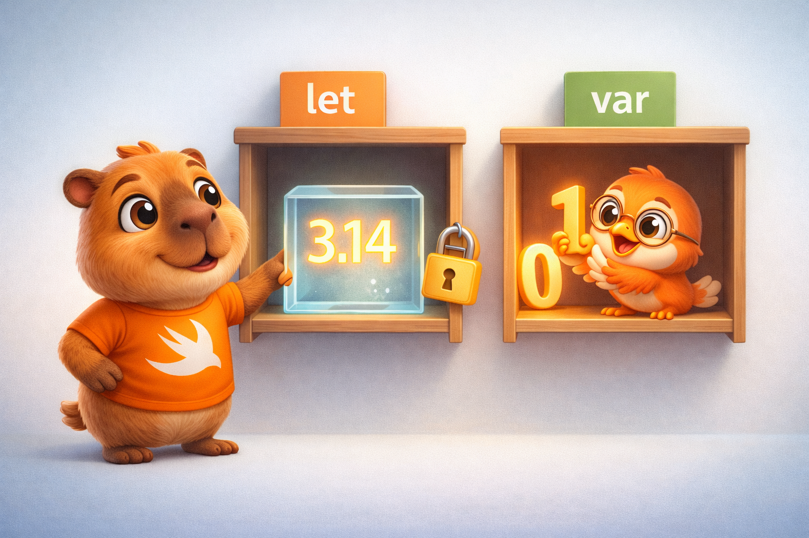
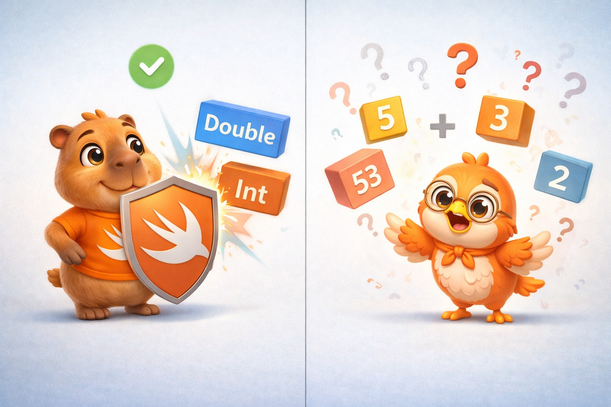
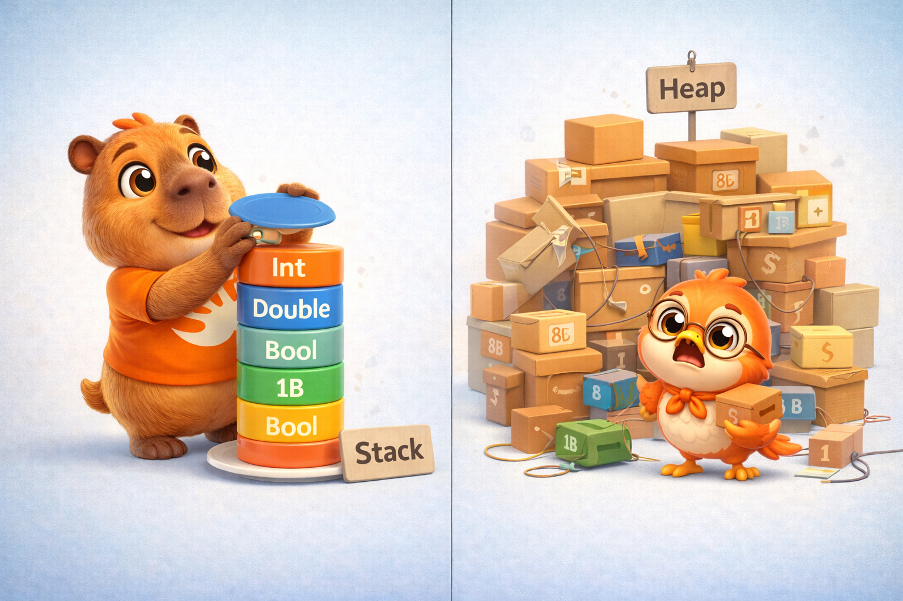
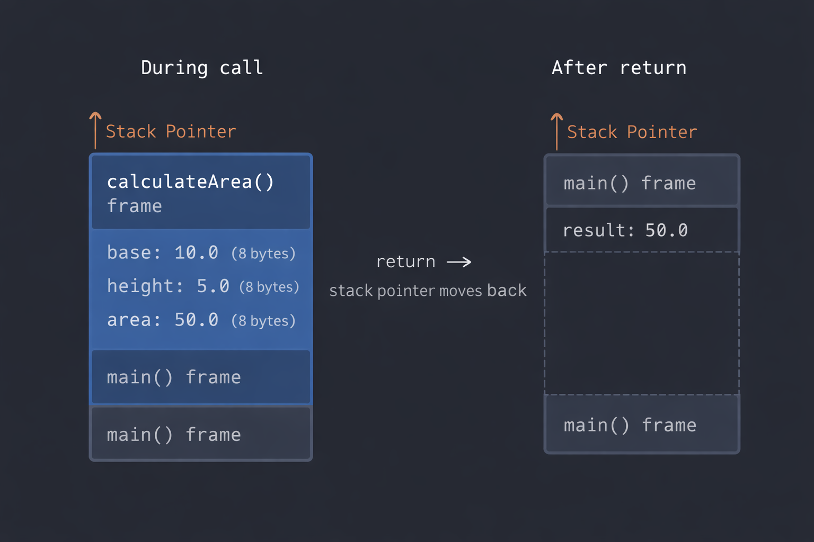

import Callout from '../../../../../components/Callout.astro';
import InfoBox from '../../../../../components/InfoBox.astro';
import StackMemoryVisualizer from '../../../../../components/blog/StackMemoryVisualizer';

¿Cuántos años llevas escribiendo Swift? ¿Dos, cinco, ocho? Ahora déjame hacerte otra pregunta: ¿sabes exactamente qué pasa cuando escribes `let nombre = "Juan"`? No me refiero a "se crea una constante". Me refiero a *dónde* vive esa constante en memoria, *por qué* el compilador elige ponerla ahí, y *qué implicaciones* tiene esa decisión para el rendimiento de tu app.

Si no puedes responder con confianza, no te preocupes. La mayoría de los desarrolladores iOS — incluso seniors — usan Swift sin entender realmente cómo piensa el lenguaje por debajo. Y eso no es un problema... hasta que lo es. Hasta que tu app se traba, consume memoria sin control, o tienes un memory leak que no logras rastrear.

<div class="pull-quote">
Usar Swift sin entender su modelo de memoria es como conducir un auto sin saber que tiene espejos retrovisores. Funciona, hasta que necesitas cambiar de carril.
</div>

## Bienvenido a Swift de Cero a Experto

Este es el primer artículo de una serie de 20 donde vamos a recorrer **todo** el lenguaje Swift — desde los tipos de datos más básicos hasta la programación funcional avanzada. Pero no va a ser un recorrido superficial. En cada artículo vamos a tejer un hilo conductor: **cómo Swift maneja la memoria y cómo el compilador se beneficia del diseño del lenguaje**.

¿Por qué? Porque entender esto te transforma de alguien que *usa* Swift a alguien que *domina* Swift. Y la diferencia entre esos dos perfiles se nota en las entrevistas, en el código que produces, y en los bugs que nunca llegas a crear.

<InfoBox title="Lo que vamos a cubrir en esta serie">
- Fase 1: Fundamentos — tipos, colecciones, strings, control de flujo, funciones
- Fase 2: Swift OO — closures, enums, structs vs classes, herencia, init/deinit
- Fase 3: Avanzado — opcionales, error handling, protocols, generics, macros
- Fase 4: Experto — ARC, memory safety, access control, operadores avanzados, programación funcional
</InfoBox>

Hoy arrancamos con los cimientos: constantes, variables, tipos de datos y operadores. Y al final, vamos a aterrizar todo en memoria — porque incluso algo tan simple como un `Int` tiene una historia que contar.

## Constantes y variables: `let` vs `var`

En Swift, todo empieza con una declaración. Tienes dos opciones:

```swift
let pi = 3.14159       // Constante — no puede cambiar
var contador = 0       // Variable — puede cambiar
contador += 1          // ✅ Esto funciona
// pi = 3.14           // ❌ Error de compilación
```

`let` declara una constante. `var` declara una variable. Simple. Pero hay algo más profundo aquí que vale la pena entender.



Cuando usas `let`, no solo estás comunicando tu intención al equipo — estás dándole **información al compilador**. Le estás diciendo: "este valor no va a cambiar jamás". Y el compilador usa esa promesa para tomar decisiones de optimización. Puede almacenar ese valor directamente en un registro del procesador, puede eliminar comprobaciones innecesarias, puede incluso sustituir las referencias al valor por el valor mismo (constant folding).

<Callout type="tip" title="Regla de oro">
Siempre empieza con `let`. Solo cambia a `var` cuando realmente necesites mutar el valor. No es solo buena práctica — es darle al compilador la mejor información posible para optimizar tu código.
</Callout>

### Type annotations vs type inference

Swift es un lenguaje **fuertemente tipado** — cada valor tiene un tipo, sin excepciones. Pero no siempre necesitas escribirlo explícitamente:

```swift
// Type annotation — tú declaras el tipo
let edad: Int = 30
let nombre: String = "Swift"

// Type inference — el compilador deduce el tipo
let edad = 30          // El compilador infiere Int
let nombre = "Swift"   // El compilador infiere String
```

Ambas formas producen exactamente el mismo resultado. La inferencia de tipos no es magia ni tiene costo en rendimiento — sucede completamente en **tiempo de compilación**. Para cuando tu código se ejecuta en el dispositivo, el compilador ya sabe el tipo exacto de cada variable. No hay ambigüedad, no hay decisiones en runtime.

<Callout type="info" title="¿Cuándo usar type annotation?">
Usa type annotations cuando el tipo no sea obvio a simple vista, cuando quieras ser explícito para legibilidad, o cuando necesites un tipo diferente al que el compilador inferiría por defecto (por ejemplo, `let precio: Float = 9.99` en lugar de `Double`).
</Callout>

## Los tipos de datos fundamentales

Swift tiene un conjunto de tipos primitivos que forman la base de todo lo demás. Vamos a conocerlos uno por uno — y a entender qué son realmente.

### Enteros: `Int`

```swift
let usuarios = 1_000_000    // Los guiones bajos mejoran legibilidad
let temperatura = -15        // Los enteros pueden ser negativos
```

`Int` en Swift se adapta a la plataforma: en un dispositivo de 64 bits (todos los iPhones desde el 5s), `Int` es un entero de 64 bits. Eso significa que puede almacenar valores desde -9,223,372,036,854,775,808 hasta 9,223,372,036,854,775,807.

Swift también ofrece variantes con tamaño explícito: `Int8`, `Int16`, `Int32`, `Int64`, y sus versiones sin signo: `UInt8`, `UInt16`, `UInt32`, `UInt64`.

```swift
let byte: UInt8 = 255        // Máximo valor para 8 bits sin signo
let small: Int8 = 127        // Máximo valor para 8 bits con signo
// let overflow: UInt8 = 256  // ❌ Error de compilación — fuera de rango
```

Ese último ejemplo es importante. En C o C++, un overflow como ese compilaría silenciosamente y te daría un resultado inesperado. En Swift, **el compilador lo atrapa antes de que tu código se ejecute**. Esto no es un detalle menor — es una filosofía de diseño.

<InfoBox title="Tamaño en memoria de los enteros">
- `Int8` / `UInt8` → 1 byte (8 bits)
- `Int16` / `UInt16` → 2 bytes (16 bits)
- `Int32` / `UInt32` → 4 bytes (32 bits)
- `Int64` / `UInt64` → 8 bytes (64 bits)
- `Int` / `UInt` → 8 bytes en plataformas de 64 bits
</InfoBox>

### Decimales: `Double` y `Float`

```swift
let pi = 3.14159             // El compilador infiere Double
let gravedad: Float = 9.8    // Explícitamente Float
```

`Double` tiene precisión de 64 bits (al menos 15 dígitos decimales). `Float` tiene precisión de 32 bits (6 dígitos). Swift infiere `Double` por defecto cuando escribes un número con punto decimal — y esa es la opción correcta en la mayoría de los casos. No uses `Float` a menos que tengas una razón específica (como interoperar con APIs gráficas que esperan `Float`).

### Booleanos: `Bool`

```swift
let estaActivo = true
let tienePermiso = false
```

Un `Bool` ocupa **1 byte** en memoria, aunque técnicamente solo necesita 1 bit. ¿Por qué? Porque la unidad mínima que el procesador puede direccionar es un byte. Es un trade-off entre eficiencia de memoria y eficiencia de acceso.

### Strings (introducción)

```swift
let saludo = "Hola, Swift"
let interpolado = "Tengo \(edad) años"
let multilinea = """
    Este es un string
    que ocupa varias líneas
    y respeta la indentación
    """
```

Los strings merecen su propio artículo — y lo tendrán en el #3 de esta serie. Por ahora, lo que necesitas saber es que `String` es un **tipo de valor** en Swift (es un `struct`), pero su contenido real — los caracteres — se almacena en un buffer que puede vivir en el heap. Volveremos a esto.

## Type Safety: el compilador como tu aliado

Swift no te deja mezclar tipos sin ser explícito:

```swift
let entero = 42
let decimal = 3.14
// let suma = entero + decimal  // ❌ Error: no puedes sumar Int + Double

let suma = Double(entero) + decimal  // ✅ Conversión explícita
```

¿Esto es molesto? A veces. ¿Es intencional? Absolutamente. Swift prefiere que seas explícito sobre las conversiones porque las conversiones implícitas son una fuente constante de bugs sutiles en otros lenguajes.

Piensa en JavaScript, donde `"5" + 3` da `"53"` (concatenación) pero `"5" - 3` da `2` (aritmética). Eso nunca pasa en Swift. El compilador te obliga a decir exactamente qué quieres.



<Callout type="tip" title="Type Safety no es burocracia">
Cada vez que el compilador te fuerza a ser explícito, está previniendo un bug que podrías haber descubierto a las 3 AM en producción. El type system es tu primera línea de defensa — y es gratis. No cuesta nada en rendimiento porque toda la verificación sucede en compilación.
</Callout>

## Operadores

Swift incluye los operadores que esperas de cualquier lenguaje moderno, pero con algunos detalles que vale la pena conocer.

### Operadores aritméticos

```swift
let suma = 10 + 3        // 13
let resta = 10 - 3       // 7
let producto = 10 * 3    // 30
let division = 10 / 3    // 3 (división entera)
let residuo = 10 % 3     // 1

let divisionReal = 10.0 / 3.0  // 3.333... (división decimal)
```

Un detalle clave: la división entre enteros **descarta el decimal**. `10 / 3` es `3`, no `3.333`. Esto no es un bug — es el comportamiento correcto para la aritmética de enteros. Si quieres el resultado decimal, al menos uno de los operandos debe ser `Double`.

Otro detalle importante: los operadores aritméticos de Swift **detectan overflow por defecto**. Si intentas sumar dos `Int8` que exceden su rango, tu app crashea en debug con un mensaje claro. Esto es intencional — es mejor un crash predecible que un resultado silenciosamente incorrecto.

```swift
// Si necesitas overflow wrapping (como en C), usa los operadores especiales:
let wrapped = Int8.max &+ 1  // -128 (overflow wrapping)
```

### Operadores de comparación y lógicos

```swift
// Comparación
1 == 1   // true
2 != 1   // true
2 > 1    // true
1 < 2    // true
1 >= 1   // true
2 <= 1   // false

// Lógicos
let a = true
let b = false
!a          // false (NOT)
a && b      // false (AND)
a || b      // true  (OR)
```

Los operadores lógicos `&&` y `||` usan **evaluación en cortocircuito** (short-circuit evaluation). Esto significa que `a && b` no evalúa `b` si `a` es `false` — porque el resultado ya es `false` sin importar qué sea `b`. Esto no es solo una optimización: es algo que puedes usar intencionalmente:

```swift
// El segundo check solo se ejecuta si el primero es true
if usuario != nil && usuario!.estaActivo {
    // Seguro — nunca llegamos al force unwrap si usuario es nil
}
```

### El operador ternario

```swift
let acceso = edad >= 18 ? "Permitido" : "Denegado"
```

Compacto y útil, pero no abuses. Si la condición o los resultados son complejos, un `if/else` es más legible.

### Nil-Coalescing: `??`

```swift
let nombre: String? = nil
let saludo = "Hola, \(nombre ?? "visitante")"
// "Hola, visitante"
```

Este operador merece un preview porque lo vas a usar constantemente. Dice: "usa el valor si existe, si no, usa este valor por defecto". Profundizaremos en opcionales en el artículo #11, pero vale la pena que lo veas desde ahora.

### Operadores de rango

```swift
// Rango cerrado — incluye ambos extremos
for i in 1...5 {
    print(i)  // 1, 2, 3, 4, 5
}

// Rango semi-abierto — excluye el límite superior
for i in 0..<5 {
    print(i)  // 0, 1, 2, 3, 4
}

// Rango parcial
let nombres = ["Ana", "Beto", "Carlos", "Diana"]
let primerosDos = nombres[..<2]   // ["Ana", "Beto"]
let desdeTercero = nombres[2...]  // ["Carlos", "Diana"]
```

El rango semi-abierto (`0..<array.count`) es particularmente útil para iterar arrays — y es tan común que Swift ofrece alternativas aún más expresivas que veremos en artículos futuros.

## Tuplas: agrupación ligera

Las tuplas permiten agrupar múltiples valores en uno solo — sin necesidad de crear un struct o una clase:

```swift
let coordenada = (latitud: 19.4326, longitud: -99.1332)
print(coordenada.latitud)   // 19.4326

// Descomposición
let (lat, lon) = coordenada
print(lat)  // 19.4326

// Ignorar valores con _
let respuestaHTTP = (200, "OK")
let (statusCode, _) = respuestaHTTP
print(statusCode)  // 200
```

Las tuplas son **tipos de valor** compuestos. Su tamaño en memoria es la suma del tamaño de sus componentes. La tupla `(Int, Bool)` ocupa 9 bytes: 8 del `Int` + 1 del `Bool` (más posible padding de alineación).

<Callout type="info" title="¿Tuplas o structs?">
Las tuplas son perfectas para retornos temporales de funciones. Pero si vas a reutilizar esa combinación de datos en varias partes de tu código, crea un `struct` con nombres claros. Las tuplas no pueden conformar protocolos ni tener métodos.
</Callout>

## Type Aliases: nombres que comunican

```swift
typealias Velocidad = Double
typealias Coordenada = (latitud: Double, longitud: Double)

let maxima: Velocidad = 120.0
let ubicacion: Coordenada = (19.4326, -99.1332)
```

Un `typealias` no crea un tipo nuevo — es simplemente otro nombre para un tipo existente. No tiene costo en memoria ni en rendimiento. Es azúcar sintáctica para mejorar la legibilidad de tu código.

## ¿Dónde vive todo esto? Pensando en memoria

Llegamos a la parte que hace diferente a esta serie. Todo lo que acabamos de ver — `Int`, `Double`, `Bool`, tuplas, `let`, `var` — son **tipos de valor**. Y los tipos de valor, en la mayoría de los casos, viven en el **Stack**.

Si ya leíste [Dominando Instruments (Parte 2)](/blog/dominando-instruments-stack-heap-simbolizacion), recordarás que el Stack es esa pila de memoria rápida y predecible donde cada función crea un "frame" al entrar y lo destruye al salir. No hay `malloc`, no hay `free`, no hay ARC. Solo un puntero que sube y baja.



Veamos esto con un ejemplo concreto. Navega paso a paso para ver cómo el stack crece y se destruye:

<div class="interactive-content">
  <StackMemoryVisualizer client:load lang="es" />
</div>

Todo este proceso es increíblemente rápido — mover un puntero es literalmente una instrucción del procesador.



<InfoBox title="¿Qué vive en el Stack?">
- Enteros (`Int`, `Int8`, `Int16`, `Int32`, `Int64`)
- Decimales (`Double`, `Float`)
- Booleanos (`Bool`)
- Tuplas (la suma de sus componentes)
- Variables locales de tipos de valor
- Parámetros de funciones
</InfoBox>

### ¿Y cuándo las cosas se van al Heap?

Hay casos donde incluso un tipo de valor termina en el Heap:

- Cuando es capturado por un **closure** (lo veremos en el artículo #6)
- Cuando se almacena en un **contenedor existencial** (artículo #13)
- Cuando el tipo de valor es demasiado grande para el stack
- Los **tipos por referencia** (`class`, `actor`) siempre van al Heap

Pero por ahora, con los tipos que hemos visto hoy, estamos firmemente en territorio del Stack. Y eso es una gran noticia para el rendimiento.

<Callout type="tip" title="¿Por qué importa saber esto?">
Cuando escribes código que opera con value types en el stack, estás escribiendo código que el compilador puede optimizar agresivamente. No hay conteo de referencias, no hay sincronización, no hay indirección. Es el tipo de código que hace que Swift sea rápido — y es el tipo de código que vas a escribir naturalmente si entiendes estos fundamentos.
</Callout>

### El compilador como tu copiloto

Algo que quiero que te quede de este primer artículo: **el compilador de Swift no es un obstáculo — es tu mejor herramienta**. Cada restricción que impone (type safety, overflow detection, conversiones explícitas) es una clase de bug que elimina antes de que tu código se ejecute.

Piensa en el costo: cero en runtime. El compilador hace todo su trabajo antes de generar el binario. Cuando tu app corre en el dispositivo del usuario, no hay verificaciones de tipo, no hay checks de overflow (en release), no hay inferencia. Todo eso ya pasó. Lo que queda es código limpio, optimizado, que sabe exactamente con qué tipos está trabajando.

<div class="pull-quote">
El compilador de Swift no te pone obstáculos — te construye una autopista. Y cuanta más información le des (tipos explícitos, constantes con let, value types), más lisa es esa autopista.
</div>

## Recapitulación

Hoy cubrimos los cimientos de Swift:

- **`let` y `var`** — constantes y variables, y por qué `let` ayuda al compilador
- **Tipos fundamentales** — `Int`, `Double`, `Float`, `Bool`, `String` (intro)
- **Type Safety** — el compilador verifica tipos en compilación, cero costo en runtime
- **Type Inference** — el compilador deduce tipos automáticamente
- **Operadores** — aritméticos (con detección de overflow), comparación, lógicos, ternario, nil-coalescing, rangos
- **Tuplas** — agrupación ligera de valores
- **Type aliases** — nombres descriptivos sin costo
- **Memoria** — todo lo de hoy vive en el Stack, rápido y predecible

## Lo que viene

En el próximo artículo vamos a sumergirnos en las **colecciones**: `Array`, `Set` y `Dictionary`. Y ahí es donde la historia de la memoria se pone interesante, porque las colecciones son tipos de valor... pero su contenido vive en el Heap. Vamos a hablar de **copy-on-write**, una de las optimizaciones más elegantes de Swift, y de por qué el compilador puede eliminar copias que nunca necesitaron existir.


Nos vemos la próxima semana.

<div class="pull-quote">
Dominar Swift no es memorizar sintaxis — es entender las decisiones de diseño que hicieron de este lenguaje lo que es. Y eso empieza aquí, desde los cimientos.
</div>
