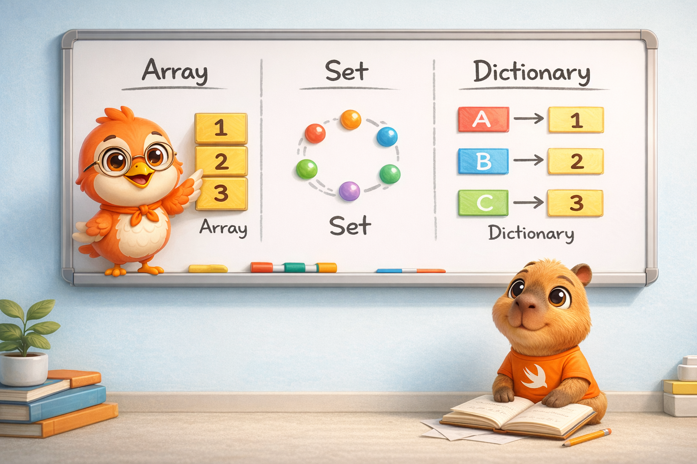
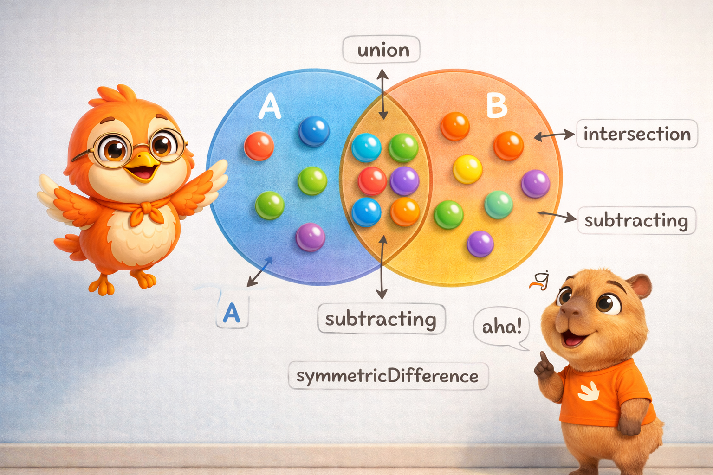
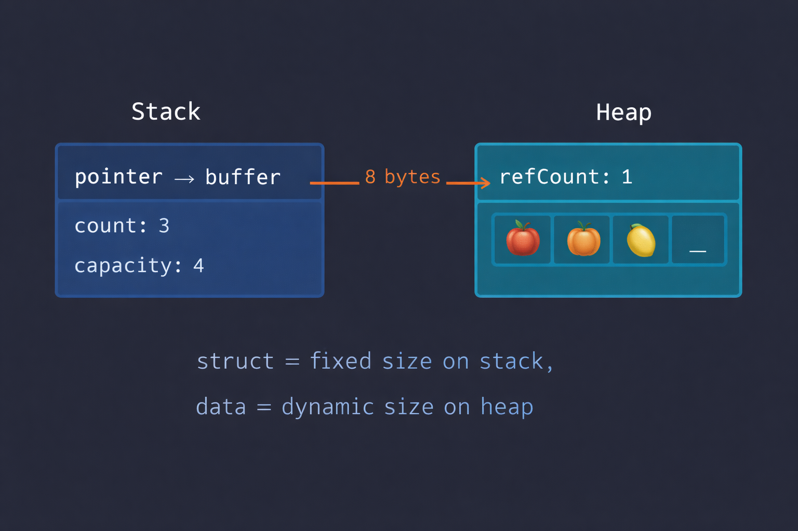

import Callout from '../../../../../components/Callout.astro';
import InfoBox from '../../../../../components/InfoBox.astro';
import CopyOnWriteVisualizer from '../../../../../components/blog/CopyOnWriteVisualizer';

In the [previous article](/blog/swift-zero-expert-data-types-operators) we explored fundamental data types — all value types living comfortably on the stack. Today the story changes. Swift's collections (`Array`, `Set`, `Dictionary`) are structs — value types on paper — but their actual content lives on the heap.

How does Swift resolve this contradiction? With one of the most elegant optimizations in the language: **copy-on-write**. And understanding it will change the way you think about your code's performance.

<div class="pull-quote">
Swift's collections are an act of magic: they behave like values, but inside they're as efficient as references.
</div>



## The three fundamental collections

Swift provides three collection types to cover virtually any data storage need. Each one has its own personality, its strengths, and its algorithmic complexity. The official documentation presents them in [Collection Types](https://docs.swift.org/swift-book/documentation/the-swift-programming-language/collectiontypes):

- **Array** — Ordered collection of values. Allows duplicates.
- **Set** — Unordered collection of unique values.
- **Dictionary** — Unordered collection of key-value pairs.

All three share something in common: they're **generic types**. When you write `[String]`, you're really writing `Array<String>`. The compiler generates specialized code for each concrete type — and that has performance implications we'll explore later.

<Callout type="info" title="Mutability with let and var">
If you assign a collection to `var`, you can add, remove, and modify elements. If you assign it to `let`, the collection is immutable — you can't change its size or contents. This isn't just good practice: as we saw in article #1, `let` gives the compiler information to optimize.
</Callout>

## Array: the collection you'll use the most

An `Array` stores values of the same type in an ordered list. The same value can appear multiple times at different positions.

### Creation

```swift
// Empty array
var numbers: [Int] = []
var anotherEmpty = [Int]()

// With initial values
var fruits = ["🍎", "🍊", "🍋"]

// With default value
var zeros = Array(repeating: 0, count: 5)
// [0, 0, 0, 0, 0]

// Combining arrays
let moreFruits = fruits + ["🍇", "🍓"]
// ["🍎", "🍊", "🍋", "🍇", "🍓"]
```

Notice how in `var fruits = ["🍎", "🍊", "🍋"]` you don't need to write the type — the compiler infers `[String]` automatically. Type inference in action, with zero runtime cost.

### Access and modification

```swift
var list = ["Eggs", "Milk", "Flour"]

// Read
let first = list[0]              // "Eggs"
list.count                        // 3
list.isEmpty                      // false

// Add
list.append("Butter")            // at the end
list.insert("Salt", at: 0)       // at specific position
list += ["Sugar", "Vanilla"]     // concatenate

// Modify
list[0] = "Sea salt"             // replace one
list[2...4] = ["Bread", "Cheese"] // replace range

// Remove
let removed = list.remove(at: 0)       // returns the element
let last = list.removeLast()            // avoids querying count
```

<Callout type="warning" title="Watch out for indices">
Accessing an out-of-bounds index causes a runtime crash: `list[list.count]` is an error. Swift prefers a predictable crash over a silently incorrect access — the same philosophy we saw with integer overflow.
</Callout>

### Iteration

```swift
// Simple
for fruit in fruits {
    print(fruit)
}

// With index
for (index, fruit) in fruits.enumerated() {
    print("\(index): \(fruit)")
}
```

### Performance

This is where a good developer stands out from a great one. It's not enough to know *what* each operation does — you need to know *how much it costs*:

<InfoBox title="Array complexity">
- Access by index `array[i]` → **O(1)** — instant
- `append(_:)` → **O(1)** amortized — almost always instant
- `insert(_:at:)` at beginning → **O(n)** — must shift all elements
- `remove(at:)` at beginning → **O(n)** — must shift all elements
- `contains(_:)` → **O(n)** — walks through element by element
- `count` → **O(1)** — stored as a property
</InfoBox>

Why is `append` O(1) *amortized*? Because Array pre-allocates extra space on the heap. When the buffer fills up, Swift creates a new one with double the capacity and copies everything over. That happens rarely, so on average each append is O(1).

```swift
var numbers = [Int]()
print(numbers.capacity) // 0

numbers.append(1)
print(numbers.capacity) // 2 — Swift pre-allocated space

numbers.append(2)
numbers.append(3)
print(numbers.capacity) // 4 — doubled when it filled up
```

<Callout type="tip" title="Performance tip">
If you know how many elements you'll be adding, use `reserveCapacity(_:)` to avoid re-allocations:

```swift
var results = [String]()
results.reserveCapacity(1000)
// Now the first 1000 appends won't need to re-allocate
```
</Callout>

## Set: when order doesn't matter but uniqueness does

A `Set` stores unique values of the same type with no defined ordering. It's your best option when you need to check whether an element exists — and you need it to be fast.

### Requirement: Hashable

To store a type in a `Set`, that type must conform to the `Hashable` protocol. All of Swift's basic types (`String`, `Int`, `Double`, `Bool`) are already `Hashable`. If you create your own types, you can make them `Hashable` — we'll talk about protocols in article #13.

### Creation

```swift
// Empty set
var letters = Set<Character>()

// With array literal (needs type annotation)
var genres: Set<String> = ["Rock", "Jazz", "Hip hop"]

// Short form (Set must be declared, element type is inferred)
var genres: Set = ["Rock", "Jazz", "Hip hop"]
```

Note that `Set` doesn't have syntactic sugar like `[Element]` for Array. You always need to write `Set<Element>` or at least `Set`.

### Access and modification

```swift
var genres: Set = ["Rock", "Jazz", "Hip hop"]

genres.count        // 3
genres.isEmpty      // false

genres.insert("Electronic")  // add

if let removed = genres.remove("Rock") {
    print("\(removed) removed")
}

genres.contains("Jazz")  // true — O(1)!
```



### Set operations

This is the real power of `Set` — mathematical set operations in a single line:

```swift
let oddDigits: Set = [1, 3, 5, 7, 9]
let evenDigits: Set = [0, 2, 4, 6, 8]
let primes: Set = [2, 3, 5, 7]

// Union — all elements from both
oddDigits.union(evenDigits).sorted()
// [0, 1, 2, 3, 4, 5, 6, 7, 8, 9]

// Intersection — only the common ones
oddDigits.intersection(primes).sorted()
// [3, 5, 7]

// Difference — those in A but not in B
oddDigits.subtracting(primes).sorted()
// [1, 9]

// Symmetric difference — in one or the other, but not both
oddDigits.symmetricDifference(primes).sorted()
// [1, 2, 9]
```

### Set relationships

```swift
let pets: Set = ["🐶", "🐱"]
let farm: Set = ["🐮", "🐔", "🐑", "🐶", "🐱"]
let city: Set = ["🐦", "🐭"]

pets.isSubset(of: farm)         // true
farm.isSuperset(of: pets)       // true
farm.isDisjoint(with: city)     // true — nothing in common
```

### Performance

<InfoBox title="Set complexity">
- `insert(_:)` → **O(1)** — uses hash table
- `remove(_:)` → **O(1)** — uses hash table
- `contains(_:)` → **O(1)** — this is the reason to use Set!
- `union`, `intersection`, etc. → **O(n)** — proportional to size
</InfoBox>

`contains` in O(1) is the key difference. If you have 1 million elements and need to check if one exists, an `Array` needs to check up to 1 million elements. A `Set` does it in constant time thanks to its hash table.

<Callout type="tip" title="When to use Set instead of Array?">
Whenever you need to check membership frequently and don't care about order. A classic case: checking if a user has a permission.

```swift
let permissions: Set = ["read", "write", "admin"]
if permissions.contains("admin") { /* O(1) */ }
```
</Callout>

## Dictionary: key-value pairs

A `Dictionary` stores associations between keys of the same type and values of the same type, with no defined ordering. It's like a real dictionary: you look up the word (key) and get the definition (value).

### Creation

```swift
// Empty
var names: [Int: String] = [:]

// With literal
var airports = ["LAX": "Los Angeles", "JFK": "New York"]

// Type inference
var airports = ["LAX": "Los Angeles", "JFK": "New York"]
// Inferred type: [String: String]
```

The key must conform to `Hashable` — just like in `Set`.

### Access and modification

```swift
var airports = ["LAX": "Los Angeles", "JFK": "New York"]

airports.count     // 2
airports.isEmpty   // false

// Add or update
airports["ORD"] = "Chicago"

// updateValue returns the old value (if it existed)
if let old = airports.updateValue("Los Angeles Intl", forKey: "LAX") {
    print("Was: \(old)")
}

// Read — always returns Optional
if let name = airports["LAX"] {
    print(name)  // "Los Angeles Intl"
}

// Remove
airports["JFK"] = nil  // short form
airports.removeValue(forKey: "ORD")  // returns removed value
```

<Callout type="info" title="Why does the subscript return Optional?">
Because the key might not exist. Instead of crashing like `Array` with an invalid index, `Dictionary` returns `nil`. It's a design decision: dictionary keys are dynamic and unpredictable, while array indices are sequential and verifiable.
</Callout>

### Iteration

```swift
// Key-value pairs
for (code, name) in airports {
    print("\(code): \(name)")
}

// Keys only
for code in airports.keys {
    print(code)
}

// Values only
for name in airports.values {
    print(name)
}

// Convert keys/values to Array
let codes = [String](airports.keys)
let names = [String](airports.values)
```

### Performance

<InfoBox title="Dictionary complexity">
- Access by key `dict[key]` → **O(1)** — uses hash table
- `updateValue(_:forKey:)` → **O(1)**
- Assign `dict[key] = value` → **O(1)**
- `removeValue(forKey:)` → **O(1)**
- `count` → **O(1)**
</InfoBox>

Dictionary shares the same hash table-based implementation as Set. All key access is O(1).

## Which collection to use?


The decision is simpler than it seems:

```swift
// Need order and positional access?
// → Array
let history = ["login", "dashboard", "profile"]

// Need uniqueness and fast lookup?
// → Set
let tags: Set = ["swift", "ios", "mobile"]

// Need to look up by key?
// → Dictionary
let config = ["theme": "dark", "language": "en"]
```

<InfoBox title="Quick decision guide">
- **Array** → order matters, duplicates allowed, index access
- **Set** → order doesn't matter, no duplicates, O(1) lookup
- **Dictionary** → key→value association, O(1) key lookup
</InfoBox>

## Copy-on-Write: the magic under the hood

We've arrived at the most important part of this article — and the one that connects collections to our memory thread.

All three Swift collections are **structs** — value types. That means, in theory, every time you assign an array to another variable, you should get a complete copy. With an array of 10,000 elements, that would mean copying 10,000 elements every time.

But Swift doesn't do that. It's much smarter.

<div class="pull-quote">
Copy-on-Write is the reason Swift can give you the safety of value types with the performance of reference types. The best of both worlds.
</div>

### How does it work?

The idea is brilliant in its simplicity:

1. **When you assign** an array to another variable, Swift **doesn't copy the elements**. Both variables point to the same buffer on the heap. It only increments a reference counter.
2. **When you mutate** one of the variables, Swift checks the counter: is there more than one reference to the buffer?
   - **Yes** → Creates a copy of the buffer, modifies the copy. Now each variable has its own buffer.
   - **No** → Modifies directly. Nobody else is using this buffer.

Navigate step by step to see it in action:

<div class="interactive-content">
  <CopyOnWriteVisualizer client:load lang="en" />
</div>

### Why does this matter?

Consider this code:

```swift
func processData(_ data: [Int]) -> [Int] {
    // data is a "copy" — but nothing was actually copied yet
    return data.filter { $0 > 0 }
    // filter creates a new array, but data was never copied
}

let original = Array(1...10_000)
let result = processData(original)
// original was passed "by value" but with zero copy cost
```

Without CoW, passing an array of 10,000 elements to a function would copy 80,000 bytes (10,000 × 8 bytes per Int). With CoW, only a pointer is copied — 8 bytes. The actual copy only happens if the function *modifies* the array.

<Callout type="tip" title="The compiler goes further">
Swift's compiler can even eliminate the refCount check altogether. If it analyzes your code and proves there's only one reference to the buffer (for example, a local variable that's never shared), it generates code that mutates directly without checking. This is called **guaranteed unique reference optimization**.
</Callout>

### The internal structure

Every Swift collection has this structure in memory:

```
┌─────────────────────────────┐
│         Stack               │
│  ┌───────────────────────┐  │
│  │ var fruits            │  │
│  │   → pointer to buffer │  │──────┐
│  │   → count: 3          │  │      │
│  │   → capacity: 4       │  │      │
│  └───────────────────────┘  │      │
└─────────────────────────────┘      │
                                     │
┌─────────────────────────────┐      │
│         Heap                │      │
│  ┌───────────────────────┐  │      │
│  │ Buffer                │◄─┼──────┘
│  │   refCount: 1         │  │
│  │   [🍎] [🍊] [🍋] [_] │  │
│  └───────────────────────┘  │
└─────────────────────────────┘
```

The struct on the stack is small — just a pointer, the count, and the capacity. The actual data lives in a buffer on the heap. This buffer has its own `refCount` that Swift uses to decide whether it needs to copy.



<Callout type="info" title="Why not put everything on the stack?">
Because the compiler needs to know the exact size of each type on the stack at compile time. An `Array` can have 3 elements or 3 million — that dynamic size can only live on the heap. The struct on the stack always has the same fixed size: pointer + count + capacity.
</Callout>

## Collections and the compiler

There's something we mentioned at the beginning that's worth digging into: Swift's collections are **generic types**. `Array<Int>` and `Array<String>` are different types, and the compiler generates specialized code for each one.

This is called **generic specialization**, and it's one of the reasons Swift is faster than languages with generics based on type erasure (like Java). When the compiler sees `Array<Int>`, it generates code that works directly with 64-bit integers — no boxing, no indirection, no overhead.

```swift
// The compiler generates specialized code for each type
let integers: [Int] = [1, 2, 3]       // Works with Int directly
let texts: [String] = ["a", "b"]      // Works with String directly
// There's no generic "Object[]" like in Java
```

<Callout type="tip" title="Whole Module Optimization">
With whole module optimization enabled (the default in Release), the compiler can specialize generics even across files within the same module. This means your own generic functions also benefit from specialization.
</Callout>

## Recap

Today we covered Swift's three fundamental collections:

- **Array** — ordered, duplicates allowed, O(1) index access, O(1) amortized append
- **Set** — unordered, unique values, O(1) `contains` thanks to hash tables, set operations
- **Dictionary** — unordered, key-value pairs, O(1) key access
- **Copy-on-Write** — collections share their heap buffer until someone mutates, only then is it copied
- **Generic specialization** — the compiler generates optimized code for each concrete type

<div class="pull-quote">
Swift's collections demonstrate something fundamental about the language: you don't have to choose between safety and performance. Copy-on-Write gives you value semantics with reference-type performance.
</div>

## What's next

In the next article we'll dive into **Strings and Characters**. If you think a String is "just text", get ready to discover why Swift decided `string[0]` shouldn't exist, what grapheme clusters are, how Substring shares memory with the original String, and the small string optimization that avoids hitting the heap for short text.

See you next week.

<div class="pull-quote">
Choosing the right collection isn't a minor detail — it's the difference between an app that flies and one that crawls. And now you know why.
</div>
