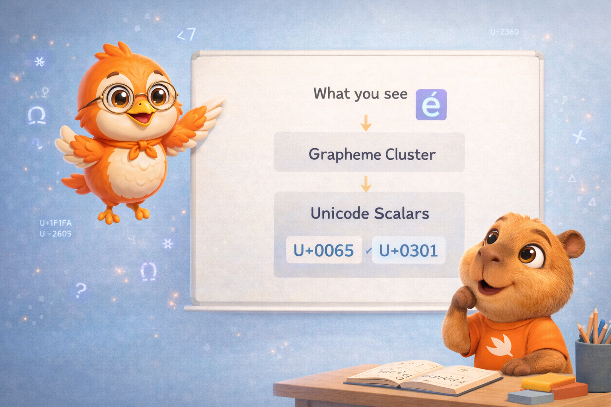
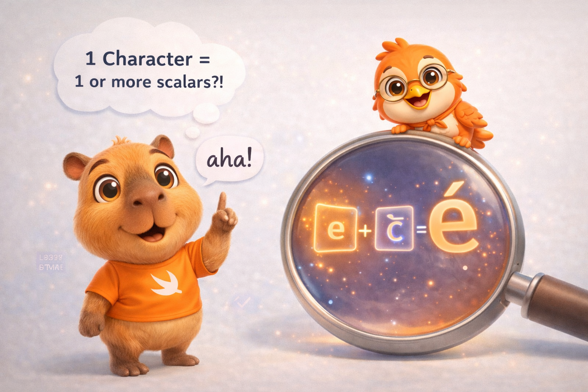
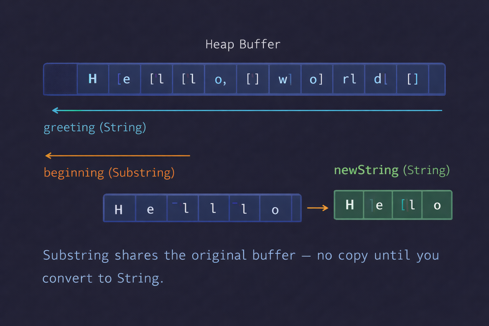

import Callout from '../../../../../components/Callout.astro';
import InfoBox from '../../../../../components/InfoBox.astro';

En el [artículo anterior](/es/blog/swift-cero-experto-colecciones) descubrimos que las colecciones son value types con su contenido en el heap y la magia de copy-on-write. Hoy vamos a explorar un tipo que parece simple pero esconde una de las decisiones de diseño más valientes de Swift: el `String`.

¿Por qué no puedes escribir `myString[0]`? ¿Por qué contar caracteres es O(n)? ¿Y qué tiene que ver un emoji con banderas con todo esto? La respuesta a todas estas preguntas es la misma: **Unicode**.

<div class="pull-quote">
Swift eligió correctitud sobre conveniencia. Y esa decisión cambió todo lo que sabes sobre strings.
</div>



## String Literals: creando texto

La forma más directa de crear un string es con un literal:

```swift
let greeting = "Hello, world"
```

Swift infiere el tipo `String` automáticamente. Pero los literals pueden ser más sofisticados de lo que parece.

### Multiline strings

```swift
let poem = """
    Roses are red,
    Violets are blue,
    Swift is amazing,
    And so are you.
    """
```

La indentación se controla con la posición de las `"""` de cierre — cualquier espacio *antes* de esa línea se ignora en todas las líneas.

### Caracteres especiales

```swift
let wiseWords = "\"Imagination is more important than knowledge\" - Einstein"
let dollarSign = "\u{24}"        // $  — Unicode scalar U+0024
let blackHeart = "\u{2665}"      // ♥  — Unicode scalar U+2665
let sparklingHeart = "\u{1F496}" // 💖 — Unicode scalar U+1F496
```

### Extended delimiters

```swift
// El \n se imprime literalmente, no como salto de línea
let raw = #"Line 1\nLine 2"#

// Si necesitas interpolación dentro de extended delimiters:
let value = 42
let message = #"The answer is \#(value)"#
// "The answer is 42"
```

Los extended delimiters (`#"..."#`) son perfectos cuando tu string contiene muchas comillas o backslashes — como expresiones regulares o JSON.

## String es un value type

Algo que vale la pena repetir: `String` es un **struct** en Swift. Es un value type, como `Int` o `Array`. Y al igual que `Array`, usa **copy-on-write** — el buffer de caracteres vive en el heap, pero solo se copia cuando mutas.

```swift
var original = "Hello"
var copy = original      // Comparten el mismo buffer (CoW)
copy += ", world"        // Ahora copy tiene su propio buffer
// original sigue siendo "Hello"
```

<Callout type="info" title="Mutabilidad con let y var">
`var` te permite modificar el string. `let` lo hace inmutable. Es la misma regla que para cualquier value type — y le da al compilador la misma información para optimizar.
</Callout>

## Characters: no son lo que piensas

Aquí es donde Swift se separa de la mayoría de los lenguajes. Un `Character` en Swift **no** es un byte, ni un code point, ni un `char` de C. Es un **extended grapheme cluster** — la unidad mínima que un ser humano percibe como "un carácter".

```swift
for character in "Dog!🐶" {
    print(character)
}
// D
// o
// g
// !
// 🐶
```

Hasta aquí parece normal. Pero mira esto:

```swift
let eAcute: Character = "\u{E9}"                // é — un scalar
let combinedEAcute: Character = "\u{65}\u{301}"  // e + ◌́ — dos scalars
// Ambos son é, ambos son UN solo Character
```

El carácter `é` puede representarse de dos formas en Unicode: como un único scalar (`U+00E9`) o como dos scalars combinados (`e` + acento). Swift los trata como el **mismo Character**, porque visualmente y lingüísticamente son idénticos.



### Esto se pone más interesante con emojis

```swift
let flag: Character = "\u{1F1FA}\u{1F1F8}"  // 🇺🇸
// Dos scalars → un Character
```

Una bandera de país es **un solo Character** compuesto por dos Unicode scalars (Regional Indicator Symbols). Y aún hay más:

```swift
let family = "👨‍👩‍👧‍👦"
print(family.count) // 1
// ¡Un solo Character compuesto por 7 Unicode scalars!
// 👨 + ZWJ + 👩 + ZWJ + 👧 + ZWJ + 👦
```

<Callout type="tip" title="¿Por qué importa esto?">
Porque significa que un `Character` en Swift puede ocupar un número variable de bytes en memoria. No puedes asumir que todos los caracteres tienen el mismo tamaño. Y esa es exactamente la razón por la que `string[0]` no existe.
</Callout>

## ¿Por qué no existe `string[0]`?

En C, `char *name = "hello"; name[2]` funciona porque cada `char` ocupa exactamente 1 byte. Saltar al tercer byte es una operación O(1) — solo sumas 2 a la dirección de memoria.

En Swift, eso es imposible. El carácter `é` puede ocupar 2 bytes o 4 bytes dependiendo de cómo esté codificado. Un emoji de familia puede ocupar 25 bytes. Para saber dónde empieza el tercer Character, Swift tiene que **recorrer los dos anteriores** y contar sus bytes.

Por eso Swift usa `String.Index` en lugar de enteros:

```swift
let greeting = "Guten Tag!"

greeting[greeting.startIndex]                          // G
greeting[greeting.index(after: greeting.startIndex)]   // u
greeting[greeting.index(greeting.startIndex, offsetBy: 7)] // a
greeting[greeting.index(before: greeting.endIndex)]    // !
```

<InfoBox title="Métodos de String.Index">
- `startIndex` → posición del primer Character
- `endIndex` → posición *después* del último Character
- `index(after:)` → siguiente posición
- `index(before:)` → posición anterior
- `index(_:offsetBy:)` → avanzar/retroceder N posiciones
</InfoBox>

<Callout type="warning" title="endIndex no es un índice válido">
`greeting[greeting.endIndex]` causa un crash. `endIndex` es la posición *después* del último carácter — existe para definir rangos, no para acceder.
</Callout>

### Iterando sobre índices

```swift
for index in greeting.indices {
    print("\(greeting[index]) ", terminator: "")
}
// G u t e n   T a g !
```

## Contando caracteres: O(n) por diseño

```swift
let zoo = "Koala 🐨, Snail 🐌, Penguin 🐧"
print(zoo.count) // 30
```

`.count` es **O(n)** — Swift tiene que recorrer todo el string para contar los extended grapheme clusters. Esto es una consecuencia directa de que los Characters tienen tamaño variable.

Y hay un caso que lo demuestra perfectamente:

```swift
var word = "cafe"
print(word.count) // 4

word += "\u{301}" // Agrega COMBINING ACUTE ACCENT

print(word)       // "café"
print(word.count) // 4 — ¡sigue siendo 4!
```

Agregar un combining accent no agrega un Character — modifica el último. La `e` y el acento se fusionan en `é`, un solo extended grapheme cluster.

<div class="pull-quote">
En Swift, el número de caracteres de un string no es el número de bytes, ni el número de code points. Es el número de unidades que un humano percibiría como "letras". Y eso requiere recorrer todo el string.
</div>

## Modificando strings

### Insertar y eliminar

```swift
var welcome = "hello"
welcome.insert("!", at: welcome.endIndex)
// "hello!"

welcome.insert(contentsOf: " there", at: welcome.index(before: welcome.endIndex))
// "hello there!"

welcome.remove(at: welcome.index(before: welcome.endIndex))
// "hello there"

let range = welcome.index(welcome.endIndex, offsetBy: -6)..<welcome.endIndex
welcome.removeSubrange(range)
// "hello"
```

### Concatenación

```swift
let start = "hello"
let end = " there"
var combined = start + end  // "hello there"

combined += "!"             // "hello there!"

let exclamation: Character = "!"
combined.append(exclamation)
```

### Interpolación

```swift
let multiplier = 3
let message = "\(multiplier) times 2.5 is \(Double(multiplier) * 2.5)"
// "3 times 2.5 is 7.5"
```

La interpolación de strings es type-safe — el compilador verifica que la expresión dentro de `\()` sea válida. No hay format strings peligrosos como `printf` en C.

## Substrings: compartir para no copiar

Cuando obtienes una porción de un string — con un subscript, `prefix(_:)`, o `suffix(_:)` — Swift no te da un `String`. Te da un `Substring`.

```swift
let greeting = "Hello, world!"
let index = greeting.firstIndex(of: ",") ?? greeting.endIndex
let beginning = greeting[..<index] // "Hello" — tipo Substring

// Para almacenar a largo plazo, convierte a String
let stored = String(beginning)
```

¿Por qué? **Memoria.** Un `Substring` comparte el buffer del `String` original. No se copia nada. Es instantáneo.



```
┌──────────────────────────────────────┐
│             Heap Buffer              │
│  [H][e][l][l][o][,][ ][w][o][r][l][d][!] │
│   ↑                                  │
│   │                                  │
│   └── greeting (String) ─────────────┘
│   ↑───────────┐
│               │
│   beginning (Substring) — solo apunta
│   al rango [0..<5] del MISMO buffer
└──────────────────────────────────────┘
```

<Callout type="warning" title="Cuidado con retener Substrings">
Si mantienes un `Substring` en memoria, el `String` original completo no puede liberarse — porque el `Substring` apunta a su buffer. Si tienes un string de 1 MB y solo necesitas los primeros 5 caracteres, convierte a `String` para liberar el buffer original:

```swift
let huge = String(repeating: "x", count: 1_000_000)
let tiny = String(huge.prefix(5)) // Copia solo 5 chars, libera el resto
```
</Callout>

<Callout type="info" title="StringProtocol">
Tanto `String` como `Substring` conforman `StringProtocol`. Si escribes funciones que aceptan texto, usa `some StringProtocol` como parámetro para aceptar ambos sin forzar una copia.
</Callout>

## Comparando strings

```swift
let quote = "We're a lot alike, you and I."
let sameQuote = "We're a lot alike, you and I."
quote == sameQuote // true
```

La comparación en Swift usa **equivalencia canónica**: dos strings son iguales si representan el mismo texto, aunque estén compuestos por diferentes Unicode scalars:

```swift
let eAcuteQuestion = "Voulez-vous un caf\u{E9}?"         // é como un scalar
let combinedQuestion = "Voulez-vous un caf\u{65}\u{301}?" // e + ◌́

eAcuteQuestion == combinedQuestion // true — misma representación visual
```

También tienes búsqueda de prefijos y sufijos:

```swift
let filename = "report-2026-Q1.pdf"
filename.hasPrefix("report")  // true
filename.hasSuffix(".pdf")    // true
```

## Representaciones Unicode

Un mismo string puede verse de formas diferentes dependiendo de la codificación:

```swift
let dogString = "Dog‼🐶"

// UTF-8 — bytes de 8 bits
for byte in dogString.utf8 {
    print("\(byte) ", terminator: "")
}
// 68 111 103 226 128 188 240 159 144 182

// UTF-16 — code units de 16 bits
for unit in dogString.utf16 {
    print("\(unit) ", terminator: "")
}
// 68 111 103 8252 55357 56374

// Unicode Scalars — valores de 21 bits
for scalar in dogString.unicodeScalars {
    print("\(scalar.value) ", terminator: "")
}
// 68 111 103 8252 128054
```

<InfoBox title="¿Cuándo usar cada representación?">
- `.utf8` → Interoperabilidad con C, networking, archivos
- `.utf16` → Interoperabilidad con Foundation/NSString
- `.unicodeScalars` → Procesamiento Unicode de bajo nivel
- `.count` (Characters) → Lo que el usuario ve y espera
</InfoBox>

## La memoria detrás de String

Todo lo que hemos visto tiene implicaciones directas en cómo Swift gestiona los strings en memoria.

### Small String Optimization

Para strings cortos (15 bytes o menos en plataformas de 64 bits), Swift almacena los caracteres **directamente en el struct**, sin ir al heap. Esto elimina la alocación dinámica para la mayoría de strings comunes — nombres de variables, códigos de país, etiquetas cortas.

```swift
let short = "Hello"      // 5 bytes — cabe inline, no hay heap allocation
let long = String(repeating: "x", count: 100) // 100 bytes — va al heap
```

### El costo de cada operación

<InfoBox title="Complejidad de String">
- `count` → **O(n)** — recorre todos los grapheme clusters
- `startIndex`, `endIndex` → **O(1)**
- `index(after:)` → **O(1)** amortizado
- `index(_:offsetBy: k)` → **O(k)** — recorre k positions
- Acceso por índice `string[i]` → **O(1)** si ya tienes el índice
- `hasPrefix`, `hasSuffix` → **O(n)** del prefijo/sufijo
- `==` → **O(n)** — debe verificar equivalencia canónica
- Concatenación `+` → **O(n)** — copia ambos buffers
</InfoBox>

<Callout type="tip" title="Tip de rendimiento">
Si necesitas acceso posicional frecuente a caracteres, considera convertir el string a un `Array<Character>` primero. El array te da acceso O(1) por índice a cambio de una copia O(n) inicial y más memoria.

```swift
let text = "Hello, world!"
let chars = Array(text) // O(n) una vez
chars[7]                // O(1) siempre — "w"
```
</Callout>

## Recapitulación

Hoy descubrimos por qué String en Swift es mucho más que "texto":

- **String Literals** — simples, multiline, extended delimiters, interpolación type-safe
- **Value Type con CoW** — struct en el stack, buffer en el heap, copy-on-write
- **Characters = Extended Grapheme Clusters** — lo que un humano percibe, no bytes
- **String.Index** — por qué `string[0]` no existe y cómo navegar correctamente
- **count es O(n)** — consecuencia directa de Characters de tamaño variable
- **Substring** — comparte el buffer del original para evitar copias
- **Equivalencia canónica** — `é` == `e` + `◌́` en comparaciones
- **Small String Optimization** — strings cortos evitan el heap
- **UTF-8, UTF-16, Unicode Scalars** — tres formas de ver el mismo texto

<div class="pull-quote">
Swift tomó la decisión difícil con los strings: ser correcto siempre, aunque eso signifique que `string[0]` no exista. Esa misma filosofía — correctitud sobre conveniencia — es lo que hace al lenguaje excepcional.
</div>

## Lo que viene

En el próximo artículo exploramos el **control de flujo**: `if/else`, `switch` con pattern matching exhaustivo, `guard` como filosofía de early exit, y cómo el compilador convierte tus switches en jump tables eficientes. Vamos a ver cómo las decisiones que tomas en cada `if` y `switch` le hablan directamente al compilador.

Nos vemos la próxima semana.

<div class="pull-quote">
Entender cómo Swift maneja texto es entender sus valores como lenguaje: correctitud primero, rendimiento después — y al final, consigues ambos.
</div>
