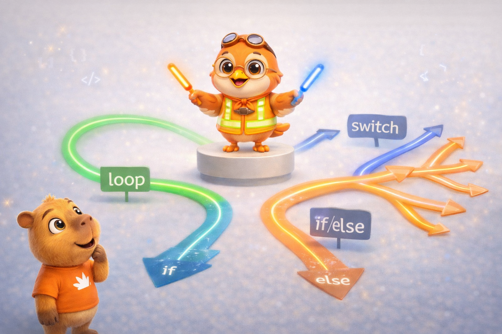
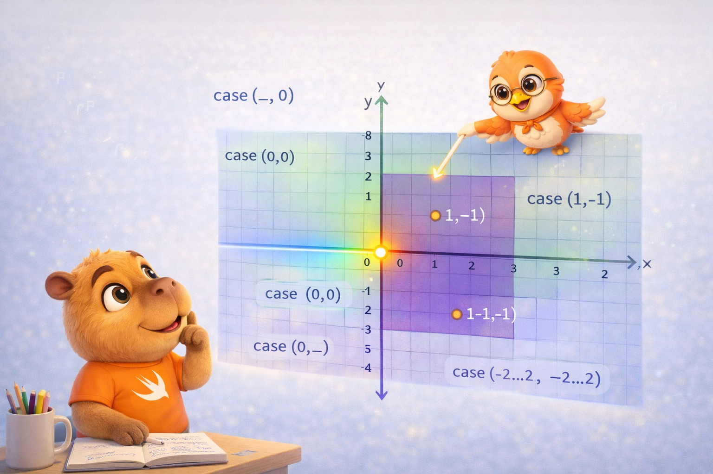
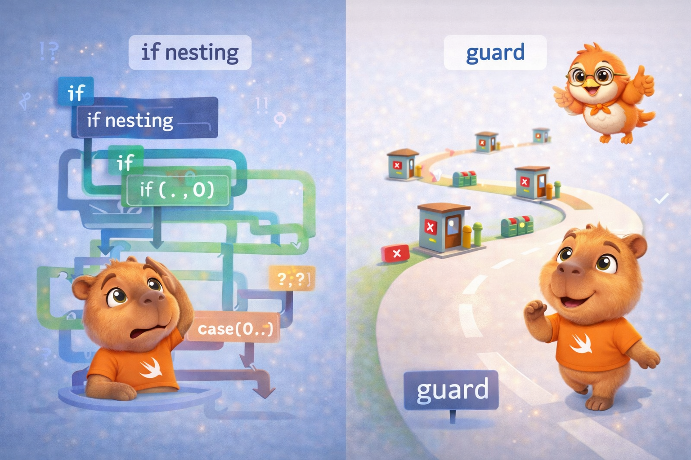

import Callout from '../../../../../components/Callout.astro';
import InfoBox from '../../../../../components/InfoBox.astro';
import JumpTableVisualizer from '../../../../../components/blog/JumpTableVisualizer';

En el [artículo anterior](/es/blog/swift-cero-experto-strings-characters) descubrimos que los Strings en Swift son mucho más que texto — son colecciones de grapheme clusters con implicaciones profundas en memoria. Hoy vamos a explorar cómo Swift toma decisiones: el control de flujo.

Y no pienses que esto es aburrido solo porque todos los lenguajes tienen `if` y `for`. El `switch` de Swift es una bestia completamente diferente a la de C. El `guard` es una filosofía de diseño, no solo una keyword. Y el compilador convierte tus decisiones en código máquina de formas que vale la pena entender.

<div class="pull-quote">
El control de flujo es donde un lenguaje muestra su personalidad. Y Swift tiene mucha personalidad.
</div>



## For-In Loops: iterando sobre todo

El `for-in` es la forma más natural de recorrer secuencias en Swift — arrays, diccionarios, rangos, strings, lo que sea que conforme `Sequence`.

```swift
// Iterando un array
let names = ["Anna", "Alex", "Brian", "Jack"]
for name in names {
    print("Hello, \(name)!")
}

// Iterando un diccionario
let legs = ["spider": 8, "ant": 6, "cat": 4]
for (animal, count) in legs {
    print("\(animal)s have \(count) legs")
}

// Iterando un rango
for index in 1...5 {
    print("\(index) times 5 is \(index * 5)")
}
```

Si no necesitas el valor de la iteración, usa `_`:

```swift
let base = 3
var power = 1
for _ in 1...10 {
    power *= base
}
// power = 59049 (3^10)
```

Con `stride` puedes controlar el paso de la iteración:

```swift
// De 0 a 60, de 5 en 5 (sin incluir 60)
for minute in stride(from: 0, to: 60, by: 5) {
    print(minute) // 0, 5, 10, 15, ... 55
}

// De 3 a 0, de -1 en -1 (incluyendo 0)
for countdown in stride(from: 3, through: 0, by: -1) {
    print(countdown) // 3, 2, 1, 0
}
```

## While y Repeat-While

```swift
// while — evalúa la condición ANTES
var counter = 0
while counter < 5 {
    print(counter)
    counter += 1
}

// repeat-while — evalúa la condición DESPUÉS (como do-while en C)
var attempts = 0
repeat {
    attempts += 1
    print("Attempt \(attempts)")
} while attempts < 3
```

`repeat-while` garantiza que el cuerpo se ejecuta al menos una vez. Útil para validaciones donde necesitas un primer intento antes de verificar.

## If/Else: la base de todo

```swift
let temperature = 35

if temperature > 30 {
    print("It's really hot!")
} else if temperature > 20 {
    print("Nice weather")
} else {
    print("A bit cold")
}
```

### If como expresión (Swift 5.9+)

Desde Swift 5.9, `if` puede usarse como **expresión** que retorna un valor:

```swift
let weather = if temperature > 30 {
    "hot"
} else if temperature > 20 {
    "warm"
} else {
    "cold"
}
// weather = "hot"
```

Esto elimina la necesidad de declarar una variable y luego asignarla dentro de cada rama. Es más limpio, más conciso, y el compilador verifica que todas las ramas retornen un valor del mismo tipo.

<Callout type="tip" title="If expression vs operador ternario">
Para condiciones simples, el ternario sigue siendo más compacto: `let status = isReady ? "go" : "wait"`. Para lógica con más de dos ramas, if expression es más legible.
</Callout>

## Switch: el superpoder de Swift

Aquí es donde Swift realmente brilla. El `switch` no es solo "compara un valor contra constantes" — es un **motor de pattern matching** completo. La documentación oficial lo describe en [Control Flow](https://docs.swift.org/swift-book/documentation/the-swift-programming-language/controlflow#Switch).

### Lo básico

```swift
let character: Character = "z"
switch character {
case "a":
    print("The first letter")
case "z":
    print("The last letter")
default:
    print("Some other character")
}
```

Dos diferencias fundamentales con C:

1. **No hay fallthrough implícito.** En C, si olvidas el `break`, la ejecución "cae" al siguiente case. En Swift, cada case termina automáticamente. Es más seguro por defecto.
2. **Debe ser exhaustivo.** El compilador te obliga a cubrir todos los casos posibles, o a incluir `default`. Esto elimina una clase entera de bugs.

<Callout type="info" title="Sin fallthrough implícito">
Cada case debe tener al menos una sentencia ejecutable. Si necesitas el comportamiento de fallthrough de C, existe el keyword `fallthrough` — pero raramente lo necesitas. Es opt-in, no opt-out.
</Callout>

### Switch como expresión

```swift
let description = switch character {
case "a":
    "The first letter of the Latin alphabet"
case "z":
    "The last letter of the Latin alphabet"
default:
    "Some other character"
}
```

### Interval matching

El switch puede comparar contra **rangos**:

```swift
let score = 85
switch score {
case 0..<60:
    print("Fail")
case 60..<70:
    print("D")
case 70..<80:
    print("C")
case 80..<90:
    print("B")
case 90...100:
    print("A")
default:
    print("Invalid score")
}
// "B"
```

### Tuples

Puedes hacer match contra **tuplas**, usando `_` para ignorar valores:

```swift
let point = (1, -1)
switch point {
case (0, 0):
    print("At the origin")
case (_, 0):
    print("On the x-axis")
case (0, _):
    print("On the y-axis")
case (-2...2, -2...2):
    print("Inside the box")
default:
    print("Outside the box")
}
// "Inside the box"
```



### Value bindings

Puedes **capturar** valores dentro de un case:

```swift
let anotherPoint = (2, 0)
switch anotherPoint {
case (let x, 0):
    print("On the x-axis with x = \(x)")
case (0, let y):
    print("On the y-axis with y = \(y)")
case let (x, y):
    print("At (\(x), \(y))")
}
// "On the x-axis with x = 2"
```

El último case con `let (x, y)` captura ambos valores y siempre coincide — funciona como un `default` pero con acceso a los valores.

### Where clauses

Agrega condiciones adicionales a un case:

```swift
let point3D = (1, -1, 0)
switch point3D {
case let (x, y, _) where x == y:
    print("On the line x == y")
case let (x, y, _) where x == -y:
    print("On the line x == -y")
case let (x, y, z):
    print("Arbitrary point (\(x), \(y), \(z))")
}
// "On the line x == -y"
```

### Compound cases

Múltiples patrones en un solo case:

```swift
let letter: Character = "e"
switch letter {
case "a", "e", "i", "o", "u":
    print("\(letter) is a vowel")
case "b", "c", "d", "f", "g", "h", "j", "k", "l", "m",
     "n", "p", "q", "r", "s", "t", "v", "w", "x", "y", "z":
    print("\(letter) is a consonant")
default:
    print("Not a letter")
}
```

<Callout type="tip" title="Exhaustividad y enums">
Cuando haces switch sobre un enum que cubre todos los cases, no necesitas `default`. Esto es poderoso: si agregas un nuevo case al enum, el compilador te marca un error en todos los switches que no lo manejan. Veremos esto en detalle en el artículo #7.
</Callout>

## Guard: la filosofía del early exit

`guard` es una de las features más subestimadas de Swift. Su propósito es validar condiciones al inicio de un scope y salir temprano si no se cumplen:

```swift
func processOrder(item: String?, quantity: Int) {
    guard let item = item else {
        print("No item provided")
        return
    }

    guard quantity > 0 else {
        print("Invalid quantity")
        return
    }

    // Aquí sabemos con certeza que item existe y quantity > 0
    print("Processing \(quantity)x \(item)")
}
```

La diferencia clave con `if`:

```swift
// Con if — nesting hell
func processWithIf(item: String?, quantity: Int) {
    if let item = item {
        if quantity > 0 {
            // Código real enterrado en indentación
            print("Processing \(quantity)x \(item)")
        } else {
            print("Invalid quantity")
        }
    } else {
        print("No item provided")
    }
}

// Con guard — flujo lineal
func processWithGuard(item: String?, quantity: Int) {
    guard let item = item else { return }
    guard quantity > 0 else { return }

    // Código real al nivel principal — limpio
    print("Processing \(quantity)x \(item)")
}
```



<div class="pull-quote">
Guard no es solo azúcar sintáctica — es una filosofía: valida tus precondiciones, sal temprano si fallan, y deja el happy path al nivel principal de indentación.
</div>

<Callout type="info" title="Guard y el compilador">
Cuando usas `guard let`, la variable unwrapped está disponible *después* del guard — en el resto del scope. Esto le dice al compilador que desde ese punto en adelante, la variable definitivamente tiene un valor. El compilador puede usar esa información para optimizar el layout del stack frame y eliminar comprobaciones redundantes.
</Callout>

## Defer: ejecutar código al salir

`defer` garantiza que un bloque de código se ejecute cuando el scope actual termina, sin importar cómo:

```swift
func readFile(at path: String) throws -> String {
    let file = open(path)
    defer {
        close(file) // Se ejecuta al salir de la función, pase lo que pase
    }

    guard let content = try? read(file) else {
        return "" // defer cierra el archivo
    }

    return content // defer cierra el archivo
}
```

Múltiples defers se ejecutan en orden **inverso** (LIFO):

```swift
func example() {
    defer { print("First defer") }
    defer { print("Second defer") }
    defer { print("Third defer") }
    print("Function body")
}
// Function body
// Third defer
// Second defer
// First defer
```

<Callout type="tip" title="¿Cuándo usar defer?">
Para cleanup de recursos: cerrar archivos, liberar locks, restaurar estados. Ponlo justo después de adquirir el recurso — así es imposible olvidar la limpieza.
</Callout>

## Control Transfer: break, continue, fallthrough

```swift
// continue — salta a la siguiente iteración
for number in 1...10 {
    if number % 2 == 0 { continue }
    print(number) // Solo impares: 1, 3, 5, 7, 9
}

// break — sale del loop
for number in 1...100 {
    if number > 5 { break }
    print(number) // 1, 2, 3, 4, 5
}

// fallthrough — fuerza la caída al siguiente case (raramente usado)
let value = 5
switch value {
case 5:
    print("Five")
    fallthrough
case 6:
    print("Five or six")
default:
    break
}
// "Five"
// "Five or six"
```

### Labeled Statements

Cuando tienes loops anidados, puedes etiquetar un loop para hacer `break` o `continue` sobre él específicamente:

```swift
let matrix = [[1, 2, 3], [4, 5, 6], [7, 8, 9]]

outerLoop: for row in matrix {
    for value in row {
        if value == 5 {
            print("Found 5!")
            break outerLoop // Sale de AMBOS loops
        }
    }
}
```

## Checking API Availability

Swift tiene una forma integrada de verificar disponibilidad de APIs:

```swift
if #available(iOS 17, macOS 14, *) {
    // Código que usa APIs de iOS 17+
} else {
    // Fallback para versiones anteriores
}

// Con guard
guard #available(iOS 17, *) else {
    return
}
// Código que usa APIs de iOS 17+
```

## El compilador y el control de flujo

Hablemos de lo que pasa bajo el capó — el hilo de memoria y compilador de esta serie.

### Switch y jump tables — ¿qué es una jump table?

Cuando escribes un `switch` con if/else, el procesador tiene que evaluar cada condición una por una. "¿Es 200? No. ¿Es 301? No. ¿Es 404? Sí." Eso es O(n) — con 50 cases, podría necesitar 50 comparaciones.

Una **jump table** es un truco elegante del compilador. En lugar de comparar, crea un **array de direcciones de memoria** en tiempo de compilación. Cada posición del array corresponde a un case, y su valor es la dirección del código que debe ejecutarse.

Funciona así:

1. El compilador crea un array interno: `table[200] = dirección_handleSuccess, table[301] = dirección_handleRedirect, ...`
2. En runtime, cuando llega `statusCode = 404`, el procesador simplemente hace `table[404]` — un acceso directo por índice
3. El procesador **salta** a esa dirección de memoria sin evaluar ninguna condición
4. Resultado: **O(1)** sin importar cuántos cases haya

Es como la diferencia entre buscar un nombre en una lista (recorres uno por uno) vs buscarlo en un diccionario indexado (vas directo a la letra).

```swift
// El compilador puede optimizar esto a una jump table
switch statusCode {
case 200: handleSuccess()
case 301: handleRedirect()
case 404: handleNotFound()
case 500: handleServerError()
default: handleUnknown()
}
```

Pruébalo tú mismo — selecciona un status code y compara cómo lo resuelve if/else vs jump table:

<div class="interactive-content">
  <JumpTableVisualizer client:load lang="es" />
</div>

<Callout type="info" title="¿Cuándo genera el compilador una jump table?">
No siempre. El compilador decide basándose en los valores:
- **Valores enteros cercanos** (0, 1, 2, 3...) → Jump table perfecta
- **Enums sin associated values** → Jump table (los cases son 0, 1, 2... internamente)
- **Valores dispersos** (200, 301, 404, 500) → El compilador puede usar una tabla hash o una cadena de comparaciones optimizada
- **Rangos o where clauses** → Cadena de comparaciones, sin jump table posible

El punto clave: el `switch` le da al compilador toda la información por adelantado (todos los cases, exhaustividad), y el compilador elige la mejor estrategia. Un if/else encadenado no le da esa visión global.
</Callout>

### Guard y el lifetime de variables

Cuando escribes `guard let value = optional else { return }`, el compilador sabe que después del guard, `value` existe con certeza. Eso tiene implicaciones directas:

- Puede reservar espacio en el stack frame para `value` solo una vez
- No necesita mantener comprobaciones de nil después del guard
- Puede optimizar el layout del stack sabiendo exactamente qué variables están vivas en cada punto

### Exhaustividad en compilación

La exhaustividad del `switch` es una verificación **en tiempo de compilación**. No genera código extra en runtime. El compilador simplemente verifica que cada valor posible del tipo está cubierto. Si falta uno, tu código no compila. Si los cubres todos, el resultado es tan eficiente como si hubieras escrito una cadena de `if/else`.

<InfoBox title="Optimizaciones del compilador en control de flujo">
- **Switch con enteros/enums** → Jump table O(1)
- **Switch con rangos** → Búsqueda binaria o comparaciones ordenadas
- **Switch con where** → Cadena de comparaciones optimizada
- **Guard** → Variable garantizada después del guard, zero overhead
- **Exhaustividad** → Verificación en compilación, zero cost en runtime
- **Defer** → Se traduce a cleanup code insertado en cada punto de salida
</InfoBox>

<div class="pull-quote">
Cada if, guard y switch que escribes es una conversación con el compilador. Cuanta más información le das — exhaustividad, early exit, tipos concretos — mejor código genera.
</div>

## Recapitulación

Hoy cubrimos todo el control de flujo de Swift:

- **For-in** — itera arrays, diccionarios, rangos, strings, con stride para pasos personalizados
- **While / Repeat-while** — loops condicionales, repeat garantiza al menos una ejecución
- **If/else** — condicionales clásicos, ahora también como expresión (Swift 5.9+)
- **Switch** — pattern matching exhaustivo con interval matching, tuples, value bindings, where clauses, compound cases
- **Guard** — early exit como filosofía, variables unwrapped disponibles después
- **Defer** — cleanup garantizado al salir del scope (LIFO)
- **Control transfer** — break, continue, fallthrough, labeled statements
- **API availability** — `#available` para verificar versiones
- **Compilador** — jump tables para switch, lifetime optimization con guard, exhaustividad sin costo en runtime

## Lo que viene

En el próximo artículo entramos a **funciones** — ciudadanos de primera clase en Swift. Parámetros con labels, `inout`, function types, funciones como valores, nested functions, y por qué todo esto es la puerta de entrada a los closures. Empezamos a ver cómo Swift trata al código como datos.

Nos vemos la próxima semana.

<div class="pull-quote">
El switch de Swift no es un if/else disfrazado — es un motor de pattern matching que el compilador convierte en código máquina eficiente. Cuando lo dominas, escribes código que es a la vez más expresivo y más rápido.
</div>
