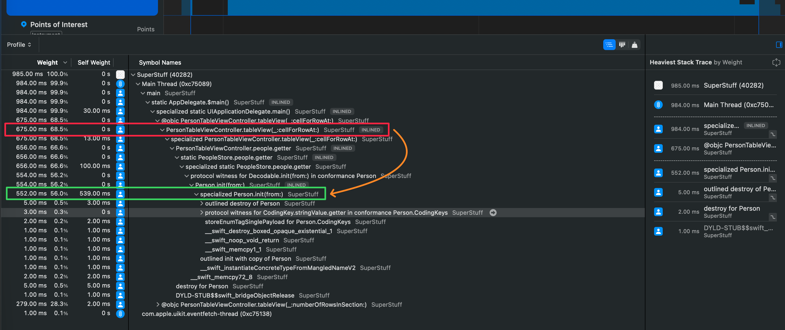
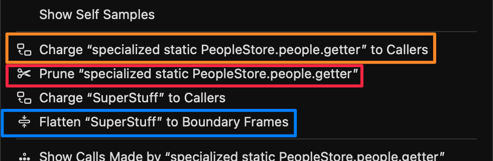
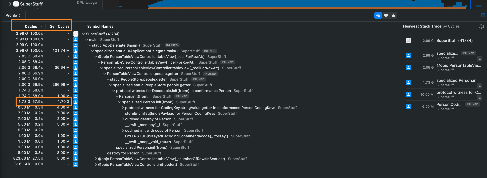
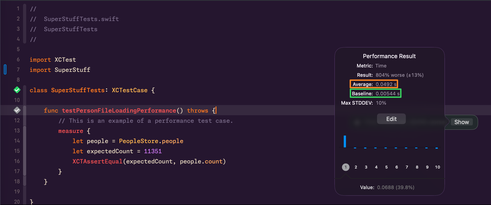

import Callout from '../../../../../components/Callout.astro';
import InfoBox from '../../../../../components/InfoBox.astro';
import CallTreeSurgeryVisualizer from '../../../../../components/blog/CallTreeSurgeryVisualizer';

In [Part 1](/blog/mastering-xcode-instruments-mental-models-signposts) we learned to use Instruments as technicians — buttons, templates, filters. In [Part 2](/blog/mastering-instruments-stack-heap-symbolication) we became doctors — studying the anatomy of memory and binaries. In [Part 2.5](/blog/mastering-instruments-malloc-free-arc) we saw that anatomy in action — malloc reserving blocks, ARC counting references, retain cycles trapping memory.

Today we take on the most demanding role: the **pathologist**. The pathologist doesn't guess. They observe evidence, form a hypothesis, design an experiment, and let the data confirm or refute the theory. That's exactly what we're going to do with our app's performance.

<div class="pull-quote">
A good diagnosis doesn't start with the tool. It starts with the right question.
</div>

## The Scientific Method of Performance Debugging

Imagine a doctor who, without examining the patient, says: "It's probably the heart. Let's operate." Sounds absurd, right? But in software development we do this constantly. "The app is slow — it's definitely the JSON." "The scroll stutters — must be the image downloads." And we spend hours optimizing the wrong part of the code.

The alternative is to treat performance debugging for what it is: a **scientific process**.

### The 5 Steps

1. **Observe** — Describe the symptom precisely. Not "the app is slow." Better: "scrolling drops below 30fps after loading more than 500 cells in `PersonTableViewController`."

2. **Form a hypothesis** — Based on your knowledge of the code, propose a specific, testable cause. Example: "I suspect `PeopleStore.people` is decoding the JSON on every cell access."

3. **Design the experiment** — Choose the right instrument. If you suspect CPU, use Time Profiler. If you suspect memory, Allocations. Define what you'll measure and under what conditions.

4. **Measure** — Run the profile. Resist the temptation to look at the source code before seeing the data. Let Instruments speak first.

5. **Interpret and iterate** — Do the data confirm your hypothesis? Great, now you have a clear direction. Do they refute it? Even better — you just saved yourself hours of wasted work. Form a new hypothesis and repeat.

<Callout type="warning" title="The assumption trap">
The most expensive mistake in performance debugging is jumping straight to "fixing" what you assume is wrong. Without data, you can spend days optimizing the wrong part of your code. Assumptions close mental paths — data opens them.
</Callout>

<Callout type="tip" title="Your secret weapon: the notebook">
Before opening Instruments, open a text document. Write down the symptom, your hypothesis, and what you're going to measure. This sounds excessive, but it saves you 80% of the time you'd normally waste going in circles. And when your tech lead asks "what did you try?", you'll have the answer documented.
</Callout>

<InfoBox title="The performance debugging notebook">
- **Date / Build / Device:** iPhone 15 Pro, iOS 18.2, build #47, Release
- **Observed symptom:** Scroll drops below 30fps when displaying the people table
- **Hypothesis:** PeopleStore.people decodes JSON on every cell access
- **Instrument chosen:** Time Profiler
- **Result:** Confirmed — JSONDecoder.decode appears 847 times in 5 seconds
- **Next step:** Cache the decoding result in a lazy property
</InfoBox>

## Time Profiler Anatomy

We already used Time Profiler in Part 1 to diagnose the SuperStuff problem. But do we really understand how it works? Because Time Profiler doesn't record every nanosecond of execution. It uses **sampling**.

### How sampling works

By default, Time Profiler fires a timer approximately **1,000 times per second** — one sample per millisecond. On each sample, it captures the **complete stack trace** of every active thread: which function is executing, who called it, who called that one, and so on up to `main()`.

This means Time Profiler is **statistical, not exact**. A function that executes for 0.5 milliseconds between two samples might never appear. But this isn't a limitation — it's a feature. Functions that appear in more samples are the ones consuming more time proportionally. And proportions are what matter for optimization.

### Weight vs Self-Weight: the manager and the worker

These two columns in the Call Tree are the key to understanding where the problem really is.

**Weight** is the total time a function appears in sampled stacks — including the time of all functions it calls. If `cellForRowAt` appears in 850 samples, its Weight is 850ms. But that doesn't mean `cellForRowAt` itself is slow — it may simply be the "gateway" to slower functions deeper down.

**Self-Weight** is the time that specific function was **at the top of the stack** — meaning it was the function actually executing when the sample was taken. If `cellForRowAt` has a Self-Weight of 5ms, it means only 5 of those 850 samples caught `cellForRowAt` doing its own work. The other 845 samples found it waiting for deeper functions to finish.

<div class="pull-quote">
Weight tells you who started the work. Self-Weight tells you who did it. The difference between the two is the difference between the manager and the worker.
</div>

<Callout type="tip" title="Rule of thumb">
When Weight and Self-Weight are nearly equal, you've found a leaf function doing heavy computation — that's the code you can optimize directly. When Weight is high but Self-Weight is low, keep drilling down the tree — the real work is deeper.
</Callout>



<InfoBox title="Weight vs Self-Weight — quick guide">
- **Weight** = total time the function appears in any sampled stack (includes descendants)
- **Self-Weight** = time the function is at the TOP of the stack (its own work)
- **High Weight + High Self** = leaf function doing heavy work. Direct optimization candidate
- **High Weight + Low Self** = coordinator calling expensive functions. Keep drilling down
- **Low Weight** = not a significant contributor to the problem
</InfoBox>

## Data Surgery: Charge, Prune, and Flatten

Filtering with "Hide System Libraries" is a great first step, but sometimes it's not enough. Your Call Tree is still full of intermediate functions, framework wrappers, and protocol witness thunks that add noise without adding insight. Instruments offers three precision operations to manipulate the call tree.

### Flatten

**What does it do?** Removes a function from the tree and moves its children directly to the parent. It's like removing a link from a chain — the adjacent links connect directly.

**When to use it?** When an intermediate function is just a "bridge" that adds no information. Protocol witness thunks, generic wrappers, or functions with Self-Weight near 0 are perfect candidates.

### Prune

**What does it do?** Removes a function **and all its descendants** from the analysis. The entire time of that branch disappears.

**When to use it?** When you've identified a subtree you know is irrelevant to your investigation. If you're chasing a CPU problem and the analytics SDK shows up with 50ms, you can prune it to clean up the noise.

### Charge

**What does it do?** Collapses all children of a function, absorbing their time. The function's Self-Weight becomes equal to its Weight — it becomes a **black box**.

**When to use it?** When you already know an operation is expensive and want to see its total consolidated cost to compare it with other branches of the tree.

<Callout type="warning" title="Prune is irreversible in the current analysis">
Prune permanently removes time from the analysis. If you prune a function that turns out to be relevant, you'll need to go back to the original trace. Flatten and Charge reorganize without removing — Prune actually removes. Use it with intention, not with haste.
</Callout>

<InfoBox title="Charge, Prune, Flatten — quick reference">
- **Flatten** → Removes the function, moves children to parent. No time lost. For noisy intermediaries.
- **Prune** → Removes the function AND its children. Time disappears. For irrelevant branches.
- **Charge** → Collapses children into the function. Self = Weight. To see total cost as a black box.
- **How to access:** Right-click any function in the Instruments Call Tree.
</InfoBox>

Reading about these operations isn't the same as seeing them in action. Use the interactive component below to experiment with each one on a Call Tree based on real SuperStuff data:

<CallTreeSurgeryVisualizer client:load lang="en" />



## From Time Profiler to Processor Trace

Not all time instruments are created equal. Think of them as three magnification levels on a microscope — each reveals more detail, but at a higher cost.

### Level 1: Time Profiler (timer-based)

This is what we've been using. A timer fires ~1,000 times per second and captures the stack trace. It's lightweight (~5% overhead), works on any Apple hardware, and is perfect as a **starting point**. The vast majority of performance issues can be diagnosed here.

Its limitation: being statistical, it can miss very short functions that execute between two samples.

### Level 2: CPU Profiler (hardware counter-based)

Instead of a timer, CPU Profiler uses the processor's **Performance Monitoring Counters (PMCs)** — hardware counters that measure actual clock cycles. This means samples are distributed based on how much real work each core does, not based on wall clock time.

In practice, this gives you units in **cycles** instead of milliseconds, which more faithfully reflects the real cost of code on the hardware. Available on all Apple Silicon.

### Level 3: Processor Trace (instruction-level recording)

The ultimate level. Processor Trace doesn't sample — it **records absolutely every instruction** executed by every core. Nothing escapes. Where Time Profiler gives you 1,400 samples in one second, Processor Trace can give you **117 million records** in the same interval.

It requires modern hardware (**M4 or A18** and later) and generates significant overhead, so it's designed for short, highly targeted recordings. Perfect for answering: "did this function execute at all?" or "what exact path did execution take inside this framework?"

<div class="pull-quote">
Time Profiler tells you where your app spends its time. CPU Profiler tells you where it spends its cycles. Processor Trace tells you exactly what happened — every instruction, every branch, every call.
</div>

<Callout type="info" title="About hardware requirements">
Processor Trace requires an M4 or A18 chip. If you don't have that hardware, Time Profiler and CPU Profiler cover 99% of your profiling needs. Don't let the lack of the latest hardware hold you back — methodology matters more than the tool.
</Callout>

<InfoBox title="Three profiling levels — comparison">
- **Time Profiler** → Timer ~1kHz | ~5% overhead | Statistical | All Apple hardware
- **CPU Profiler** → PMC counters | ~5-10% overhead | Statistical (cycle-accurate) | Apple Silicon
- **Processor Trace** → Every instruction | High overhead | Deterministic | M4/A18+ only
- **Recommendation:** Always start with Time Profiler. Scale up only when you need more precision.
</InfoBox>



## CI Profiling with xctrace

Everything we've done so far has been interactive — open Instruments, record manually, analyze with your eyes. But performance problems don't always happen while you're watching. You need automation.

**`xctrace`** is the command-line tool that lives behind Instruments. Everything you can do in the GUI, you can script.

### Recording a trace from Terminal

```bash
# Record a 10-second Time Profiler trace
xctrace record --template "Time Profiler" \
  --output ./traces/perf_$(date +%Y%m%d).trace \
  --time-limit 10s \
  --attach "SuperStuff"
```

### Exporting data for automated analysis

```bash
# Export trace data as XML
xctrace export --input ./traces/perf_20260514.trace \
  --xpath '/trace-toc/run/data/table[@schema="time-profile"]'
```

### Integration with performance tests

Remember the `testPersonFileLoadingPerformance` test from SuperStuff?

```swift
func testPersonFileLoadingPerformance() throws {
    measure {
        let people = PeopleStore.people
        XCTAssertEqual(11351, people.count)
    }
}
```

The `measure { }` block runs the code multiple times, calculates the average, and compares it against a **baseline** you define in Xcode. If the average exceeds the baseline by a configurable margin, the test fails. In CI, this becomes your safety net against performance regressions.

<Callout type="warning" title="Hardware consistency in CI">
CI machines must use consistent hardware for performance baselines to be meaningful. A test that passes on an M2 Pro might fail on an M1 simply because the baseline was set on faster hardware. Pin your performance tests to a specific machine or normalize for hardware capability.
</Callout>



<InfoBox title="xctrace — cheat sheet">
- `xctrace record` → Record a new trace (requires --template and --output)
- `xctrace export` → Export data from an existing trace
- `xctrace list devices` → List available devices
- `xctrace list templates` → List available Instruments templates
- `xctrace list instruments` → List individual instruments available
- `man xctrace` → Full documentation in your Terminal
</InfoBox>

## Connecting the Dots

Today we covered the full arc: from the emotional chaos of "something is slow" to the methodical process of observing, hypothesizing, measuring, and interpreting. We learned to read Weight and Self-Weight the way a pathologist reads a biopsy — not just looking at numbers, but understanding what they reveal about the structure of the problem. We mastered the three Call Tree surgery operations that separate beginners from experts. And we saw how to scale our profiling from local development to continuous integration.

The ladder is clear: **always start with Time Profiler**. It's the most balanced tool, the one that appears in most templates, and the one that solves 90% of problems. Only when you identify a section that needs micro-optimization or you want to do "archaeology" inside a closed framework, scale up to CPU Profiler or Processor Trace.

<div class="pull-quote">
If you can't measure performance automatically, you can't protect it automatically. And if you can't protect it, every deploy is a leap of faith.
</div>

So far we've focused on CPU — where processing time is spent. But there's another half of the equation that can silently degrade your app: **memory**. Retain cycles that never release, runaway allocations, zombie objects that crash your app days after being freed.

<Callout type="success" title="What's coming in Part 4">
Allocations, Leaks, and the Memory Graph Debugger — the Instruments tools for hunting memory problems. We'll connect everything we learned in Part 2.5 about malloc, free, and ARC with the tools that let you see those processes in your real app. See you there.
</Callout>

---

## References

- [Analyzing CPU Usage with the Time Profiler — Apple Documentation](https://developer.apple.com/documentation/xcode/analyzing-cpu-usage-with-the-time-profiler) — Apple's official documentation on the Time Profiler instrument.
- [Getting Started with Instruments — WWDC19](https://developer.apple.com/videos/play/wwdc2019/411/) — Apple session covering Instruments fundamentals, including Call Tree manipulation.
- [Improving App Responsiveness — Apple Documentation](https://developer.apple.com/documentation/xcode/improving-app-responsiveness) — Apple's guide on hangs, hitches, and best practices for keeping the main thread free.
- [xctrace — Apple Developer Man Pages](https://keith.github.io/xcode-man-pages/xctrace.1.html) — Complete reference for the xctrace command-line tool.
- [Hacking with Swift: How to use Instruments — Paul Hudson](https://www.hackingwithswift.com/read/30/4/fixing-the-bugs-slow-shadows) — Paul Hudson's practical guide to optimizing with Instruments.
- [Xcode Instruments Time Profiler — Antoine van der Lee](https://www.avanderlee.com/debugging/xcode-instruments-time-profiler/) — Antoine van der Lee's tutorial on effective Time Profiler usage.
