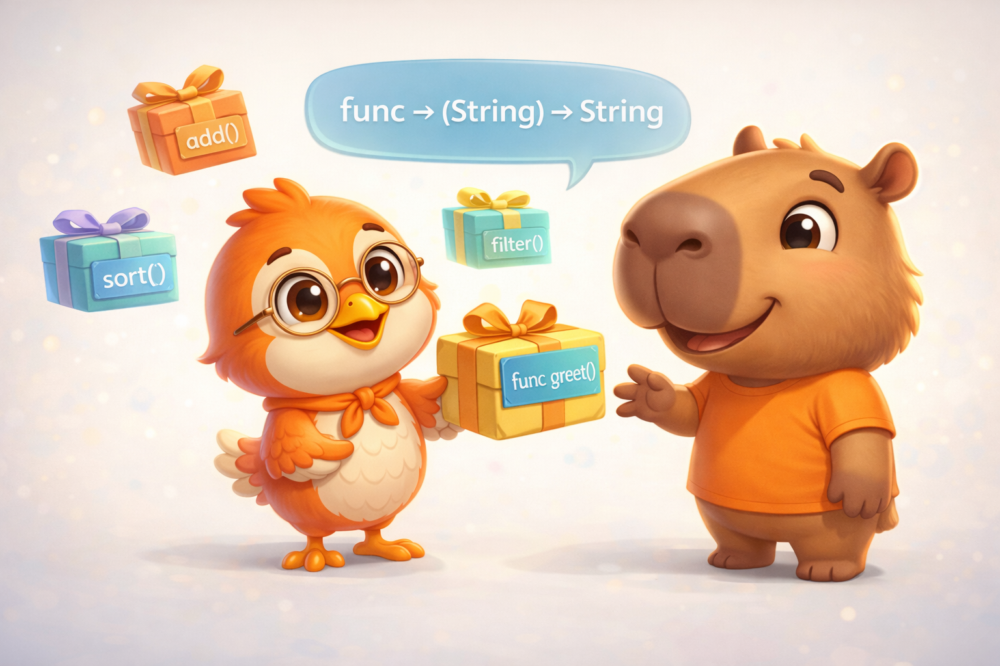

import Callout from '../../../../../components/Callout.astro';
import InfoBox from '../../../../../components/InfoBox.astro';
import FunctionTypesVisualizer from '../../../../../components/blog/FunctionTypesVisualizer';

In the [previous article](/blog/swift-zero-expert-control-flow) we mastered control flow — `switch` with pattern matching, `guard` as a philosophy, and how the compiler turns your decisions into jump tables. Today we take a step that changes everything: functions.

And no, I don't mean "blocks of code that receive parameters and return a value." You've known that since your first day programming. What makes functions special in Swift is that they're **first-class citizens** — values you can store in variables, pass as parameters, and return from other functions. Exactly like an `Int` or a `String`.

Understanding this is the gateway to closures (article #6), functional programming (article #20), and the way Swift thinks.

<div class="pull-quote">
In Swift, a function isn't just something you execute — it's a value you can manipulate. And that idea changes everything.
</div>



## Defining and calling functions

The basic anatomy of a function in Swift, per the [official documentation](https://docs.swift.org/swift-book/documentation/the-swift-programming-language/functions):

```swift
func greet(person: String) -> String {
    let message = "Hello, " + person + "!"
    return message
}

print(greet(person: "Anna"))  // "Hello, Anna!"
print(greet(person: "Brian")) // "Hello, Brian!"
```

Nothing surprising here. But let's take apart each piece to understand the design decisions.

### Implicit return

If your function body is a **single expression**, you can omit `return`:

```swift
func greet(person: String) -> String {
    "Hello, " + person + "!"
}
```

The compiler understands that the only expression is the return value. Same as writing `return` — no extra cost, just less visual noise.

## Parameters and return values

### No parameters

```swift
func sayHello() -> String {
    return "Hello, world"
}
```

### No return value

```swift
func printGreeting(person: String) {
    print("Hello, \(person)!")
}
```

Technically, a function without a return value does return something: `Void` — which is simply an empty tuple `()`.

### Multiple return values with tuples

```swift
func minMax(array: [Int]) -> (min: Int, max: Int)? {
    if array.isEmpty { return nil }

    var currentMin = array[0]
    var currentMax = array[0]

    for value in array[1..<array.count] {
        if value < currentMin {
            currentMin = value
        } else if value > currentMax {
            currentMax = value
        }
    }

    return (currentMin, currentMax)
}

if let bounds = minMax(array: [8, -6, 2, 109, 3, 71]) {
    print("min is \(bounds.min) and max is \(bounds.max)")
    // "min is -6 and max is 109"
}
```

Note the return type is `(min: Int, max: Int)?` — an optional tuple. If the array is empty, it returns `nil`. The labels `min` and `max` let you access values by name instead of `.0` and `.1`.

## Argument Labels and Parameter Names: why Swift has two names

This is one of Swift's most distinctive design decisions. Each parameter has **two names**: an *argument label* (for the caller) and a *parameter name* (for the function body).

```swift
func greet(person: String, from hometown: String) -> String {
    return "Hello \(person)! Glad you could visit from \(hometown)."
}

// When calling, it reads like a sentence:
greet(person: "Bill", from: "Cupertino")
```

- `person` is both label and parameter name (the default)
- `from` is the argument label, `hometown` is the parameter name

Why? Because Swift inherits Objective-C's philosophy that function calls should read like **English sentences**. `greet(person: "Bill", from: "Cupertino")` reads naturally.

### Omitting the label with `_`

```swift
func add(_ a: Int, _ b: Int) -> Int {
    return a + b
}

add(3, 5) // No labels — makes sense for math operations
```

### Default values

```swift
func connect(to host: String, port: Int = 443, secure: Bool = true) {
    print("Connecting to \(host):\(port) (secure: \(secure))")
}

connect(to: "api.example.com")               // port=443, secure=true
connect(to: "api.example.com", port: 8080)    // secure=true
connect(to: "api.example.com", secure: false)  // port=443
```

Parameters with defaults go last. The compiler generates function variants for each combination — it's compile-time sugar with no runtime overhead.

### Variadic Parameters

```swift
func average(_ numbers: Double...) -> Double {
    var total: Double = 0
    for number in numbers {
        total += number
    }
    return total / Double(numbers.count)
}

average(1, 2, 3, 4, 5)  // 3.0
average(3, 8.25, 18.75)  // 10.0
```

Inside the body, `numbers` is a `[Double]` — a regular array. The `...` is syntactic sugar for the caller.

## In-Out Parameters: modifying external values

By default, function parameters are **constants** — you can't modify them. If you need the function to modify an external value, use `inout`:

```swift
func swapValues(_ a: inout Int, _ b: inout Int) {
    let temp = a
    a = b
    b = temp
}

var x = 3
var y = 107
swapValues(&x, &y)
print("x is \(x), y is \(y)")
// "x is 107, y is 3"
```

The `&` when passing the argument indicates the function can modify that variable. It's explicit — no hidden mutations.

<Callout type="info" title="inout and the compiler">
The official semantics of `inout` is **copy-in copy-out**: the value is copied into the function and copied back out when it returns. But the compiler optimizes this to **pass-by-reference** whenever it can — especially when the original variable is local with no aliasing. Result: value semantics are maintained, but performance is that of a reference.
</Callout>

## Function Types: functions as values

This is where things get interesting. Every function has a **type** defined by its parameters and return:

```swift
func addTwoInts(_ a: Int, _ b: Int) -> Int { a + b }
func multiplyTwoInts(_ a: Int, _ b: Int) -> Int { a * b }

// Both functions have type: (Int, Int) -> Int
```

And you can use that type like any other type in Swift:

```swift
// Store a function in a variable
var mathFunction: (Int, Int) -> Int = addTwoInts
print(mathFunction(2, 3))  // 5

// Reassign to another function of the same type
mathFunction = multiplyTwoInts
print(mathFunction(2, 3))  // 6
```


Try it yourself — assign different functions to the same variable, adjust the arguments, and watch how the result changes but the type is always `(Int, Int) -> Int`:

<div class="interactive-content">
  <FunctionTypesVisualizer client:load lang="en" />
</div>

<div class="pull-quote">
When a function fits in a variable, it stops being "something you execute" and becomes "something you manipulate." That's what being a first-class citizen means.
</div>

### Functions as parameters

You can pass functions as arguments to other functions:

```swift
func printMathResult(_ operation: (Int, Int) -> Int, _ a: Int, _ b: Int) {
    print("Result: \(operation(a, b))")
}

printMathResult(addTwoInts, 3, 5)       // "Result: 8"
printMathResult(multiplyTwoInts, 3, 5)  // "Result: 15"
```

`printMathResult` doesn't know or care what `operation` does — it only knows it accepts two `Int`s and returns an `Int`. This is **polymorphism through function types** — one of the pillars of functional programming.

### Functions as return values

```swift
func stepForward(_ input: Int) -> Int { input + 1 }
func stepBackward(_ input: Int) -> Int { input - 1 }

func chooseStepFunction(backward: Bool) -> (Int) -> Int {
    return backward ? stepBackward : stepForward
}

var currentValue = 3
let moveNearerToZero = chooseStepFunction(backward: currentValue > 0)
// moveNearerToZero IS now stepBackward

while currentValue != 0 {
    print("\(currentValue)... ")
    currentValue = moveNearerToZero(currentValue)
}
print("zero!")
// 3... 2... 1... zero!
```

`chooseStepFunction` returns a **function** — not a value, but behavior. The return type `(Int) -> Int` is a function that takes an Int and returns an Int.

## Nested Functions: closures in disguise

You can define functions inside functions:

```swift
func chooseStepFunction(backward: Bool) -> (Int) -> Int {
    func stepForward(input: Int) -> Int { input + 1 }
    func stepBackward(input: Int) -> Int { input - 1 }
    return backward ? stepBackward : stepForward
}
```

Nested functions are hidden from the outside world — only their enclosing function can see them. But when a nested function is **returned** outside its scope, it becomes something more powerful: a **closure**.

Why? Because it can **capture** variables from the surrounding scope. And that has direct memory implications — which we'll explore in depth in the next article.

<Callout type="tip" title="Preview of article #6">
A nested function that captures external variables needs those variables to survive beyond the scope where they were created. Swift solves this by allocating those variables on the **heap** instead of the stack. That's exactly what a closure is — and it's the reason closures are reference types.
</Callout>

## The memory behind functions

### Where does a function live?

The executable code of a function lives in the **`__TEXT`** segment of the Mach-O binary — as we saw in [Mastering Instruments (Part 2)](/blog/dominando-instruments-stack-heap-simbolizacion). It's read-only and shared between processes. When you call a function, the processor jumps to that memory address.

### What happens on the stack?

Each function call creates a **stack frame** (as we saw with the interactive component in article #1):

1. Parameters are copied to the stack frame (if they're value types)
2. Local variables are allocated in the stack frame
3. On return, the stack frame is destroyed

### Function types and the heap

When you store a function in a variable (like `var mathFunction: (Int, Int) -> Int = addTwoInts`), the variable on the stack stores a **pointer** to the function in `__TEXT`. That's just 8 bytes — a pointer.

But when a function **captures context** (a nested function that uses variables from its parent scope), Swift needs something more complex: a **closure context** on the heap. This is what we'll cover in detail in article #6.

### inout and compiler optimization

```swift
func increment(_ value: inout Int) {
    value += 1
}
```

Semantically it's copy-in/copy-out. But the compiler generates:
- **Pass-by-reference** when it can prove there's no aliasing
- **Actual copy-in/copy-out** only when there's concurrent access or potential aliasing

Swift's exclusivity rule (which we'll cover in article #17) is what makes this optimization possible — the compiler can assume exclusive access thanks to the language's rules.

<InfoBox title="Functions and memory — summary">
- Function code → **`__TEXT`** segment (read-only, shared)
- Value type parameters → **Stack** (copied to frame)
- Local variables → **Stack** (destroyed on return)
- Function type in variable → **Pointer** on stack (8 bytes)
- Function capturing context → **Heap** (closure context) — article #6
- inout → **Pass-by-reference** optimized when no aliasing
</InfoBox>

### The compiler as your ally

Swift's compiler can do impressive things with functions:

- **Inlining**: if the function is small, the compiler copies its code directly into the call site, eliminating call overhead
- **Constant folding**: if arguments are compile-time constants, the compiler can calculate the result without generating a call
- **Dead code elimination**: if a function's result isn't used, the compiler can remove the call entirely (if it has no side effects)
- **Specialization**: for generic functions, the compiler generates specialized versions for each concrete type

<div class="pull-quote">
A function isn't just code — it's a contract with the compiler. Parameter types, return type, absence of side effects: all of that is information the compiler uses to optimize.
</div>

## Recap

Today we covered everything about functions in Swift:

- **Basic definition** — `func`, parameters, return, implicit return
- **Parameters** — no parameters, multiple parameters, tuple return, optional tuple return
- **Argument labels** — two names (label + parameter), `_` to omit, sentence-like readability
- **Defaults and variadic** — default values, `...` for variable number of arguments
- **inout** — modify external values, explicit `&`, optimized pass-by-reference
- **Function types** — `(Int, Int) -> Int`, functions in variables, as parameters, as return values
- **Nested functions** — functions inside functions, closures preview
- **Memory** — code in `__TEXT`, parameters on stack, function pointers, inlining

## What's next

The next article is one of the most important in the entire series: **Closures**. We'll explore what happens when a function captures variables from its environment — why that requires the heap, how capture lists work, what `@escaping` means, and why understanding closures is the key to mastering SwiftUI, Combine, and any modern Apple API.

If functions are first-class citizens, closures are their most powerful form.

See you next week.

<div class="pull-quote">
Functions in Swift aren't just tools for organizing code — they're the fundamental unit of abstraction. When you understand that a function is a value, you start thinking in Swift the way Swift was designed to be thought in.
</div>
