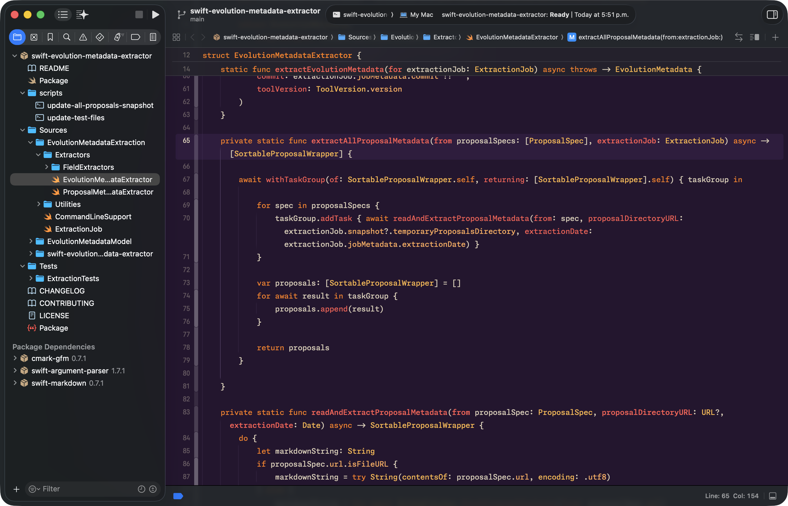
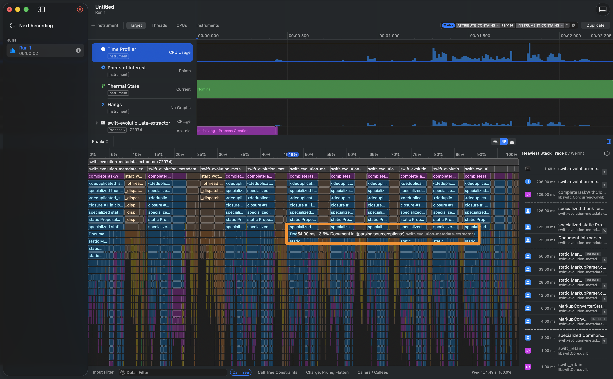
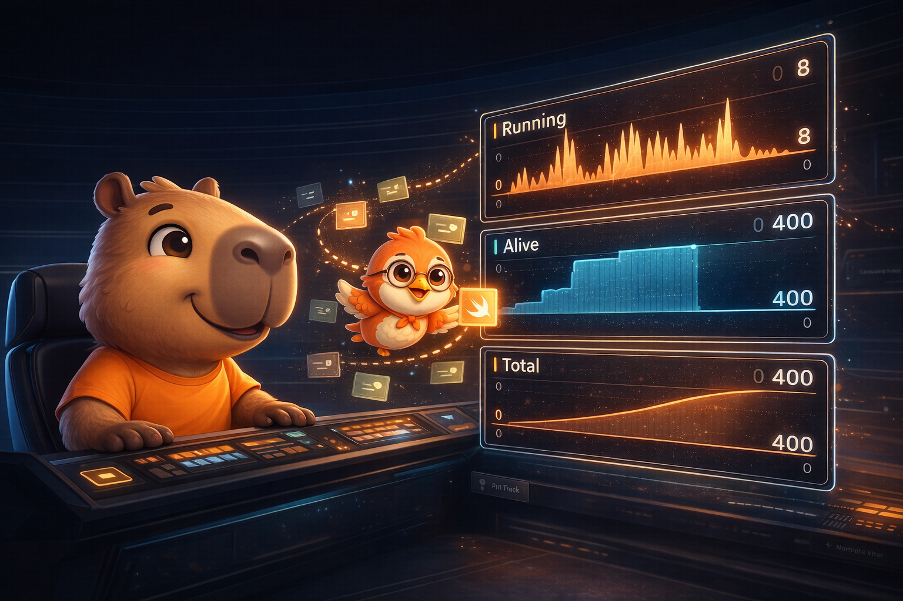
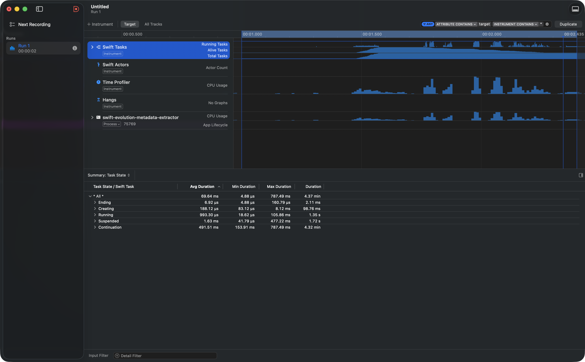
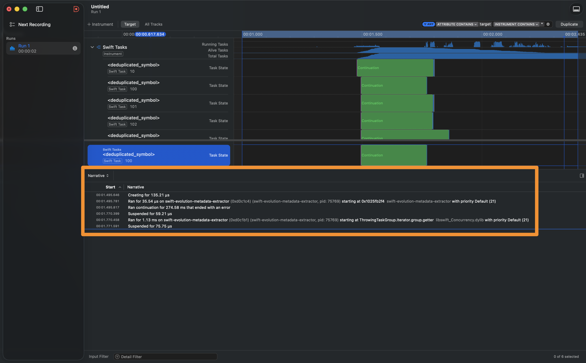
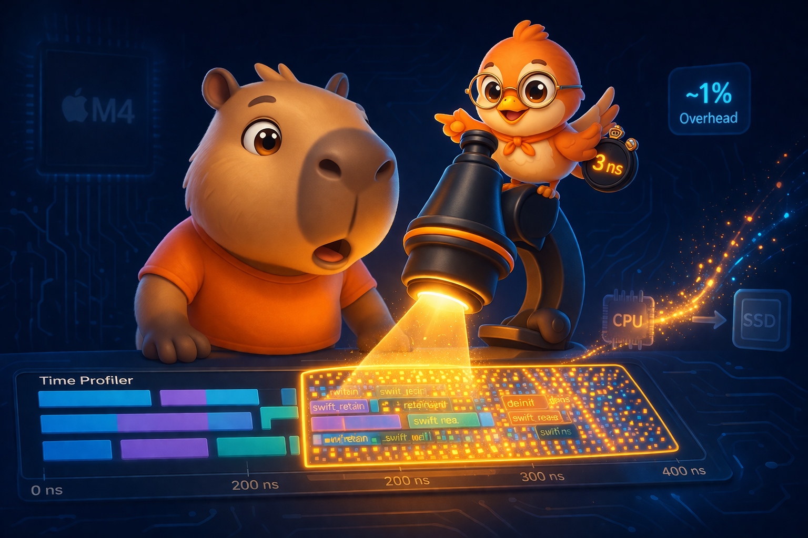

import Callout from '../../../../../components/Callout.astro';
import InfoBox from '../../../../../components/InfoBox.astro';
import FlameGraphVisualizer from '../../../../../components/blog/FlameGraphVisualizer';

In [Part 1](/blog/mastering-xcode-instruments-mental-models-signposts) we learned to use Instruments as technicians. In [Part 2](/blog/mastering-instruments-stack-heap-symbolication) we became doctors. In [Part 2.5](/blog/mastering-instruments-malloc-free-arc) we saw memory in action. In [Part 3](/blog/mastering-instruments-scientific-method-time-profiler) we mastered the scientific method of profiling, the Call Tree surgery operations, and the three levels of analysis — from Time Profiler to Processor Trace.

Today we switch both the scalpel and the patient. We leave the SuperStuff app behind and open an entirely different project: a **command-line tool** that uses Swift Concurrency intensively. And we'll discover visualizations that transform the way we read performance data.

<div class="pull-quote">
It's not about having more data. It's about seeing it in a way that reveals what was previously invisible.
</div>

## New Patient: Swift Evolution Metadata Extractor

The [Swift Evolution Metadata Extractor](https://github.com/swiftlang/swift-evolution-metadata-extractor) is an official tool from the Swift team that generates JSON data for the [Swift Evolution Dashboard](https://swift.org/swift-evolution). It's a real, production project maintained by Apple.

Why is it perfect for our lab?

1. **Massive concurrency** — It uses `withTaskGroup` to process over 400 proposals in parallel. Hundreds of tasks being created, suspended, and resumed.
2. **Intensive parsing** — Each proposal is a Markdown file parsed with `swift-markdown` (Apple's official library). The parser generates a complete AST of the document.
3. **Networking** — It makes HTTP requests to the GitHub API to fetch each proposal's content, using `URLSession` with `async/await`.
4. **No UI** — Being a CLI, there are no run loops, no views, no main thread competing for attention. All performance is measured in pure processing.

```swift
// The extractor's heart: TaskGroup processing proposals in parallel
await withTaskGroup(of: SortableProposalWrapper.self) { taskGroup in
    for spec in proposalSpecs {
        taskGroup.addTask {
            await readAndExtractProposalMetadata(for: spec, ...)
        }
    }
    for await result in taskGroup {
        proposals.append(result)
    }
}
```

<Callout type="info" title="Where do I get the project?">
The source code is on [GitHub](https://github.com/swiftlang/swift-evolution-metadata-extractor). Clone the repository and open it with Xcode. To generate meaningful data in Instruments, run the `extract` command — it will process all available Swift Evolution proposals.
</Callout>



## Flame Graphs — A New Way to See Data

### The Origin: From Netflix to Xcode

Flame Graphs were born in 2011, created by [Brendan Gregg](https://www.brendangregg.com/flamegraphs.html) while working at Netflix. His problem was simple: linear stack traces were impossible to read when you have thousands of samples. The solution was to stack functions visually, where each box's **width** represents the percentage of samples — not chronological time.

This idea was so transformative that it was formally published in [Communications of the ACM](https://queue.acm.org/detail.cfm?id=2927301) in 2016 and adopted universally. Apple integrated Flame Graphs into **Instruments 16.3** as part of the Processor Trace instrument, though the visualization is also available in the standard Time Profiler.

### How to Read a Flame Graph

Unlike the chronological timeline we already know, in a Flame Graph:

- **The X axis is not time.** It represents **100% of captured samples**. A box's width indicates what percentage of total execution time the CPU spent in that function.
- **The Y axis is stack depth.** Deeper functions are lower (in Instruments they appear as "icicles" — top to bottom).
- **Order is by weight.** Instruments places the widest boxes (highest sample percentage) on the left.
- **Colors indicate category:** blue for your code, purple for libraries, gray for system code, magenta for the Swift runtime.

<div class="pull-quote">
In a Call Tree, the bottleneck hides among numbers. In a Flame Graph, it's the widest plateau that jumps out at you.
</div>

### How to Access the Flame Graph in Instruments

1. Profile your app with **Time Profiler** or **Processor Trace**.
2. In the detail view below, look for the **Graph** button in the top-right corner of the Call Tree view.
3. Click it — the view instantly switches to the Flame Graph.



### Visual Cleanup: Flatten to Boundary Frames

When the Flame Graph is dominated by an external library (like `swift-markdown`), you can clean up the noise without losing information:

1. **Control-click** on any function from the library.
2. Select **"Flatten 'swift-markdown' to Boundary Frames"**.
3. All internal functions of that library collapse into a single bar, showing only the entry and exit points.

This is conceptually different from Flatten in the Call Tree (which we covered in Part 3). Here we're not removing an individual function — we're collapsing **an entire library** to its boundaries, so your code stands out above the noise.


<Callout type="tip" title="Sampling vs. deterministic Flame Graph">
When you use Flame Graph with **Time Profiler**, the widths are statistical estimates based on ~1,000 samples per second. When you use it with **Processor Trace** (M4/A18+), each bar reflects the exact count of instructions executed. Same Flame Graph, but with absolute certainty instead of probability.
</Callout>

Experiment with the interactive Flame Graph based on extractor data:

<FlameGraphVisualizer client:load lang="en" />

<InfoBox title="Flame Graph — quick reference">
- **Bar width** = percentage of samples (not chronological time)
- **Depth** = position in the call stack (deeper = lower)
- **Unexpectedly wide bar** = potential bottleneck
- **Colors:** Blue = your code | Purple = libraries | Gray = system | Magenta = runtime
- **Flatten to Boundary Frames** = collapse library to its boundaries (clean up noise)
- **Access:** "Graph" button in the top-right corner of the Call Tree
</InfoBox>

## Swift Concurrency Under the Microscope

The Call Tree and Flame Graphs show us *where* the CPU is spent. But when your app uses Swift Concurrency, there's an equally important question: **what are your tasks doing?** How many are alive? How many are actually running? How many are suspended waiting for something?

### The Swift Concurrency Template

Instruments includes a dedicated template: **Swift Concurrency**. When you select it, you get two main instruments:

- **Swift Tasks** — Tracks the lifecycle of every async task.
- **Swift Actors** — Monitors exclusive access to actors and their wait queues.

For the extractor, Swift Tasks is our star. When profiling the metadata extraction, the instrument captures every `taskGroup.addTask` as a new task with a unique identifier.

### The Three Key Counters

At the top of the Swift Tasks track, Instruments shows three histograms:

1. **Running Tasks** — How many tasks are executing simultaneously at any given moment. In our extractor, you'll see spikes when the `TaskGroup` launches extraction tasks.
2. **Alive Tasks** — How many tasks exist (created but not finalized). The difference between Alive and Running reveals how many tasks are suspended or queued.
3. **Total Tasks** — Cumulative count of tasks created up to that point. Useful for detecting if more tasks are being created than necessary.

<div class="pull-quote">
Running tells you how many tasks are working. Alive tells you how many exist. The difference between them is time your tasks spend waiting — and that's what you should investigate.
</div>





### Task Summary and Task Forest

Below the histograms, the detail panel offers two key views:

- **Task Summary** — A table showing how much time each task spent in each state: running, suspended, waiting for actor access. If you see a task with a lot of "Enqueued" time, it means it's blocked waiting for exclusive access to an actor.
- **Task Forest** — A graphical representation of parent-child relationships between tasks. In our extractor, you'll see the main task (`ExtractionJob.run`) as the root, with hundreds of child tasks (one per proposal) organized under the `TaskGroup`.

### Narrative View: A Task's Biography

Select any task in the Task Summary and right-click → **Pin Track**. Instruments adds a dedicated track for that task in the timeline, and the **Narrative View** appears in the bottom panel.

The Narrative View is like reading a task's biography:

- Which **thread** it started running on.
- Why it was **suspended** (waiting for a continuation, waiting for actor access, etc.).
- How much time it spent in each state.
- If it was waiting for another task, **which** task that was.

For our extractor, this reveals fascinating patterns: each extraction task starts running briefly to parse the Markdown, suspends waiting for I/O if it needs network data, and resumes to write the result.



<Callout type="warning" title="Concurrency ≠ parallelism">
Seeing many "Alive" tasks doesn't mean they're running in parallel. Swift Concurrency uses a cooperative thread pool limited to the number of cores. If you have 400 tasks but 8 cores, at most 8 run simultaneously. The rest wait — and that's fine, it's by design. The problem appears when tasks wait *too long* for actor access or blocking I/O.
</Callout>

<InfoBox title="Swift Tasks instrument — quick reference">
- **Template:** Swift Concurrency (includes Swift Tasks + Swift Actors)
- **Running Tasks** = tasks executing right now (limited by cores)
- **Alive Tasks** = tasks created but not finalized
- **Total Tasks** = historical cumulative
- **Task Summary** = time per state (running, suspended, enqueued)
- **Task Forest** = parent-child relationships (structured concurrency)
- **Narrative View** = complete biography of an individual task
- **Pin Track** = right-click in Task Summary to pin a task to the timeline
</InfoBox>

## Processor Trace — Going Deeper



In [Part 3](/blog/mastering-instruments-scientific-method-time-profiler) we learned about the three profiling levels: Time Profiler (statistical, ~1kHz), CPU Profiler (hardware counters), and Processor Trace (every instruction). We know *what* Processor Trace is. Now let's *use* it.

### Hardware Requirements

Processor Trace requires cutting-edge chips:

- **Mac** with M4 or later
- **iPad Pro** with M4 or later
- **iPhone 16** / iPhone 16 Pro or later

If you don't have this hardware, don't worry — you can analyze traces saved by someone on your team who does, on any Mac with Instruments 16.3+.

### The Overhead Surprise

Perhaps the most counter-intuitive thing about Processor Trace is its overhead. When you're recording *every instruction* executed by every core, you'd expect a brutal performance impact. But Apple reports overhead of only **~1%**. The trick is that the hardware stores the information in a dedicated buffer and flushes it to disk asynchronously — without interfering with normal execution.

The real cost isn't CPU overhead, but **data volume**: a few seconds of recording in a multi-threaded app can generate **gigabytes** of information. That's why Apple recommends keeping recordings short and targeted.

### Processor Trace in Action with the Extractor

1. **Open Instruments** and select the **Processor Trace** template.
2. **Record** 3-5 seconds during metadata extraction.
3. **Zoom in extremely** (Option-drag) on the timeline.

What you'll see is revealing: where Time Profiler showed thick bars, Processor Trace reveals a mosaic of tiny functions. You can literally see every call to `swift_retain` and `swift_release` — the reference counting operations that ARC executes behind the scenes (the ones we studied in [Part 2.5](/blog/mastering-instruments-malloc-free-arc)).

<Callout type="info" title="Don't have M4?">
Processor Trace requires M4/A18 hardware or later. If you don't have access yet, you can explore the screenshots in [Apple's official documentation](https://developer.apple.com/documentation/xcode/analyzing-cpu-usage-with-processor-trace) to see exactly what an instruction-level trace looks like. You can also open traces saved by a teammate who has the hardware, on any Mac with Instruments 16.3+.
</Callout>

### Deterministic Flame Graph

With Processor Trace active, switch to the Flame Graph view (the **Graph** button in Call Tree). Now each bar reflects the **exact count of instructions and cycles** — not a statistical estimate. The difference is subtle but fundamental:

- In Time Profiler's Flame Graph, a fast function that always executes between two samples might never appear.
- In Processor Trace's Flame Graph, **everything shows up**. Nothing escapes.

<Callout type="info" title="Is it worth it for a CLI?">
Absolutely. Command-line tools process data without UI "interference". That makes traces cleaner and bottlenecks more obvious. If you want to understand the real cost of Swift Concurrency — task creation, context switching, the cooperative pool overhead — a CLI is the perfect lab.
</Callout>

<InfoBox title="Processor Trace — quick reference">
- **Hardware:** M4 / A18 or later
- **Overhead:** ~1% (the real cost is data volume, not performance)
- **Recommendation:** Short recordings (3-5 seconds), targeted at the moment of interest
- **Flame Graph:** Deterministic — each bar reflects actual instructions executed
- **Unique capability:** See nanosecond functions (retain/release, destructors, thunks)
- **Remote analysis:** You can open saved traces on any Mac with Instruments 16.3+
</InfoBox>

## Connecting the Dots

We started this series with buttons and templates. Today we analyzed a real CLI tool with hundreds of concurrent tasks, read its Flame Graphs, audited the lifecycle of its async tasks, and saw nanosecond-level operations with Processor Trace.

The arc has been deliberate: from the interface to the mental model, from the mental model to anatomy, from anatomy to the scientific method, and from the scientific method to the most advanced visualization tools. Each part builds on the one before it.

<div class="pull-quote">
Tools change, templates get updated, instruments evolve. But the ability to observe, hypothesize, measure, and interpret is permanent. That's what this series aims to cultivate.
</div>

---

## References

- [Analyzing CPU usage with the Processor Trace instrument — Apple Documentation](https://developer.apple.com/documentation/xcode/analyzing-cpu-usage-with-processor-trace) — Apple's official documentation on Processor Trace, including Flame Graphs and Charge/Prune/Flatten operations.
- [Visualize and optimize Swift concurrency — WWDC22](https://developer.apple.com/videos/play/wwdc2022/110350/) — The session where Apple introduces the Swift Tasks instrument and the Narrative View.
- [Optimize CPU performance with Instruments — WWDC25](https://developer.apple.com/videos/play/wwdc2025/308/) — The most recent session on Processor Trace, Flame Graphs, and CPU Counters.
- [Analyze hangs with Instruments — WWDC23](https://developer.apple.com/videos/play/wwdc2023/10248/) — How to use Instruments to diagnose hangs across all Apple platforms.
- [Flame Graphs — Brendan Gregg](https://www.brendangregg.com/flamegraphs.html) — The official page of the Flame Graph creator, with philosophy, variants, and tools.
- [The Flame Graph — Communications of the ACM](https://queue.acm.org/detail.cfm?id=2927301) — Brendan Gregg's formal article in ACM about the visualization.
- [How to find and fix slow code using Instruments — Paul Hudson (Hacking with Swift)](https://www.hackingwithswift.com/articles/81/how-to-find-and-fix-slow-code-using-instruments) — Paul Hudson's practical guide to optimizing with Instruments.
- [Using Instruments to profile a SwiftUI app — Donny Wals](https://www.donnywals.com/using-instruments-to-profile-a-swiftui-app/) — Donny Wals' tutorial on profiling with Instruments.
- [Xcode Instruments Time Profiler — Antoine van der Lee (AvanderLee)](https://www.avanderlee.com/debugging/xcode-instruments-time-profiler/) — Antoine van der Lee's tutorial on effective Time Profiler usage.
