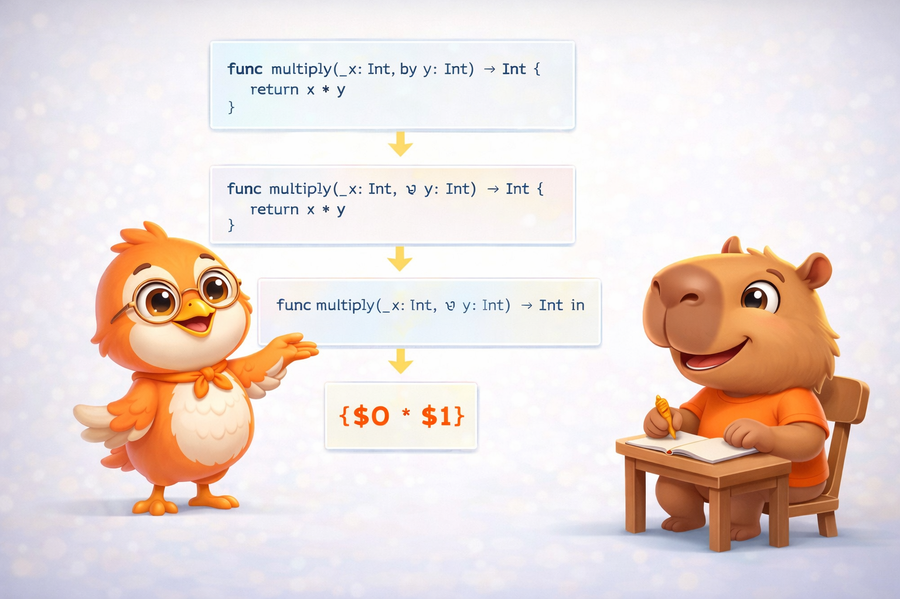
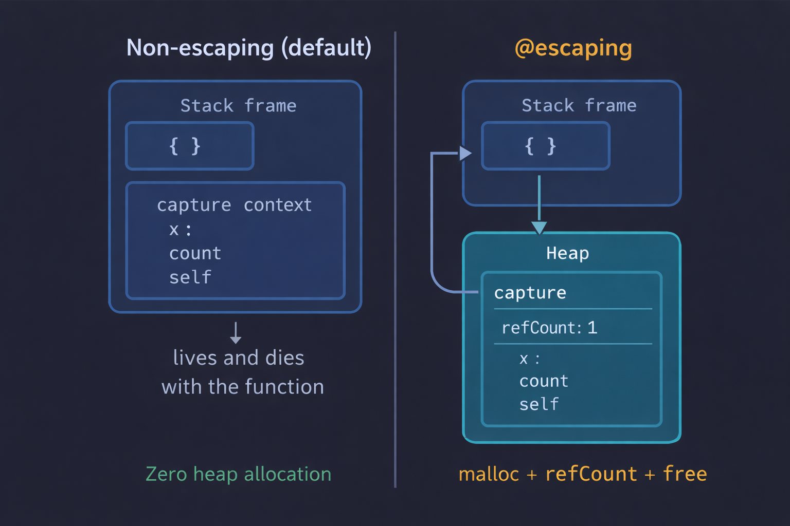

import Callout from '../../../../../components/Callout.astro';
import InfoBox from '../../../../../components/InfoBox.astro';
import ClosureCaptureVisualizer from '../../../../../components/blog/ClosureCaptureVisualizer';

En el [artículo anterior](/es/blog/swift-cero-experto-funciones) descubrimos que las funciones en Swift son ciudadanos de primera clase — valores que puedes almacenar, pasar y retornar. Hoy damos el paso que cambia todo: los **closures**.

Si una función es un bloque de código con nombre, un closure es un bloque de código que **recuerda**. Recuerda las variables que lo rodeaban cuando fue creado, las lleva consigo a donde vaya, y puede modificarlas incluso cuando el scope original ya no existe. Esa capacidad de "recordar" tiene un nombre técnico: **captura**. Y tiene consecuencias directas en memoria que todo desarrollador Swift necesita entender.

Este es, probablemente, el artículo más importante de la serie hasta ahora.

<div class="pull-quote">
Un closure no es solo una función anónima — es una función con memoria. Y esa memoria tiene un costo real que vive en el heap.
</div>


## ¿Qué es un closure?

Antes de ver sintaxis, necesitamos una definición clara:

<Callout type="info" title="Definición: Closure">
Un **closure** es una función (con o sin nombre) + el **contexto** que captura de su entorno. "Closure" viene de "closing over" — encerrar las variables del scope exterior dentro de sí mismo.
</Callout>

En Swift, hay tres formas de closures — y ya conoces dos:

1. **Funciones globales** — tienen nombre, **no** capturan nada
2. **Nested functions** — tienen nombre, **pueden** capturar del scope padre (artículo #5)
3. **Closure expressions** — no tienen nombre, **pueden** capturar del contexto

Las funciones globales y nested functions son casos especiales de closures. Cuando la gente dice "closure" en Swift, generalmente se refiere a la tercera forma: las **closure expressions**.

## Closure Expressions: la sintaxis

Veamos cómo Swift simplifica la sintaxis paso a paso, usando `sorted(by:)` como ejemplo — directamente desde la [documentación oficial](https://docs.swift.org/swift-book/documentation/the-swift-programming-language/closures):

```swift
let names = ["Chris", "Alex", "Ewa", "Barry", "Daniella"]
```

Queremos ordenar en orden inverso. La forma más explícita es con una función:

```swift
// 1. Función completa
func backward(_ s1: String, _ s2: String) -> Bool {
    return s1 > s2
}
var reversed = names.sorted(by: backward)
```

Ahora como closure expression, paso a paso:

```swift
// 2. Closure con tipos explícitos
reversed = names.sorted(by: { (s1: String, s2: String) -> Bool in
    return s1 > s2
})

// 3. Tipos inferidos del contexto
reversed = names.sorted(by: { s1, s2 in return s1 > s2 })

// 4. Implicit return (una sola expresión)
reversed = names.sorted(by: { s1, s2 in s1 > s2 })

// 5. Shorthand argument names
reversed = names.sorted(by: { $0 > $1 })

// 6. Operator method — la forma más corta posible
reversed = names.sorted(by: >)
```



Seis formas de escribir exactamente lo mismo. El compilador genera el **mismo código** para todas — la diferencia es puramente de legibilidad.

<Callout type="tip" title="¿Cuál forma usar?">
No siempre la más corta es la mejor. `$0 > $1` es claro para `sorted(by:)`, pero en closures complejos los nombres descriptivos (`s1, s2 in`) son más legibles. Usa la forma que comunique mejor la intención.
</Callout>

<Callout type="info" title="Definición: Shorthand Argument Names">
Los **shorthand argument names** (`$0`, `$1`, `$2`...) son nombres automáticos que Swift genera para los parámetros de un closure. `$0` es el primer parámetro, `$1` el segundo, etc. Cuando los usas, puedes omitir la lista de parámetros y la keyword `in`.
</Callout>

## Trailing Closures

Cuando el último parámetro de una función es un closure, puedes sacarlo fuera de los paréntesis:

```swift
// Sin trailing closure
names.sorted(by: { $0 > $1 })

// Con trailing closure
names.sorted { $0 > $1 }
```

Si el closure es el **único** argumento, puedes omitir los paréntesis por completo. Esto es lo que hace posible la sintaxis de SwiftUI:

```swift
// SwiftUI usa trailing closures en todo
VStack {
    Text("Hello")
    Text("World")
}
// VStack.init(content:) recibe un closure como último parámetro
```

<Callout type="info" title="Definición: Trailing Closure">
Un **trailing closure** es un closure que se escribe *después* de los parénteses de la llamada a la función, en lugar de dentro. Solo aplica al último parámetro closure (o al primer closure cuando hay múltiples trailing closures).
</Callout>

### Multiple trailing closures

Cuando una función recibe más de un closure, puedes usar esta sintaxis:

```swift
func loadPicture(
    from server: Server,
    completion: (Picture) -> Void,
    onFailure: () -> Void
) { /* ... */ }

// Multiple trailing closures
loadPicture(from: someServer) { picture in
    someView.currentPicture = picture
} onFailure: {
    print("Download failed")
}
```

El primer closure va sin label (trailing), los siguientes llevan su label.

## Capturing Values: donde la magia (y el costo) ocurren

Aquí es donde los closures se separan de las funciones simples. Un closure puede **capturar** constantes y variables del contexto donde fue definido — y luego usarlas y modificarlas incluso después de que ese contexto ya no exista.

<Callout type="info" title="Definición: Captura (Capture)">
**Capturar** una variable significa que el closure retiene una referencia a esa variable para poder accederla después. Si la variable está en un scope que va a desaparecer (como un stack frame), Swift la mueve al **heap** para que sobreviva. Esto se llama una **capture box** — una pequeña estructura en el heap que guarda las variables capturadas.
</Callout>

Veamos el ejemplo clásico de la documentación oficial:

```swift
func makeIncrementer(forIncrement amount: Int) -> () -> Int {
    var runningTotal = 0
    func incrementer() -> Int {
        runningTotal += amount  // captura runningTotal y amount
        return runningTotal
    }
    return incrementer
}
```

`makeIncrementer` retorna una función (`incrementer`) que usa dos variables de su scope padre: `runningTotal` y `amount`. Cuando `makeIncrementer` termina, su stack frame se destruye — pero esas variables necesitan sobrevivir porque `incrementer` las usa.

Swift resuelve esto moviendo `runningTotal` y `amount` a una **capture box en el heap**. El closure apunta a esa box, y cada vez que lo llamas, accede a las variables ahí.

Navega paso a paso para ver cómo funciona:

<div class="interactive-content">
  <ClosureCaptureVisualizer client:load lang="es" />
</div>

```swift
let incrementByTen = makeIncrementer(forIncrement: 10)

incrementByTen()  // 10
incrementByTen()  // 20
incrementByTen()  // 30 — ¡runningTotal persiste entre llamadas!

// Un segundo closure tiene su PROPIA capture box
let incrementBySeven = makeIncrementer(forIncrement: 7)
incrementBySeven() // 7 — independiente de incrementByTen
```

<div class="pull-quote">
Un closure no copia las variables que captura — las comparte. Cada llamada al closure accede a las mismas variables en el heap, y los cambios persisten.
</div>

## Closures son Reference Types

Si los closures capturan variables y viven en el heap, ¿qué pasa cuando asignas un closure a otra variable?

```swift
let alsoIncrementByTen = incrementByTen
alsoIncrementByTen()  // 40
incrementByTen()      // 50 — ¡el mismo runningTotal!
```

Asignar un closure a otra variable **no lo copia**. Ambas variables apuntan al **mismo** closure con la **misma** capture box. Es como tener dos controles remoto para la misma TV.

<Callout type="info" title="Definición: Reference Type">
Un **reference type** es un tipo donde asignar a otra variable no crea una copia — ambas variables apuntan a la misma instancia en el heap. Los closures y las classes son reference types. Los structs y enums son value types (con copy-on-write para colecciones, como vimos en el artículo #2).
</Callout>

Esto es fundamentalmente diferente de los value types como `Int` o `Array`:

```swift
var a = 42
var b = a    // b es una COPIA — cambiar b no afecta a
b += 1       // a sigue siendo 42

// Pero con closures:
let c1 = incrementByTen
let c2 = c1  // c2 apunta al MISMO closure — no hay copia
```

## @escaping vs non-escaping: la decisión del heap

Este es uno de los conceptos que más confusión genera — y el que más impacta en memoria. Necesitamos definirlo con claridad.

<Callout type="info" title="Definición: Escaping Closure">
Un closure **escapa** (escapes) una función cuando sobrevive más allá de la ejecución de esa función. Esto sucede cuando el closure se guarda en una variable externa, se almacena en un array, o se ejecuta de forma asíncrona después de que la función retorna.
</Callout>

<Callout type="info" title="Definición: Non-escaping Closure">
Un closure **non-escaping** se ejecuta *dentro* de la función que lo recibe y no sobrevive después. En Swift, los closures son non-escaping **por defecto** — esta es una decisión de diseño para optimizar rendimiento.
</Callout>

```swift
// Non-escaping (default) — se ejecuta dentro de la función
func doWork(work: () -> Void) {
    work()  // Se ejecuta aquí y muere
}

// @escaping — sobrevive después de la función
var savedClosures: [() -> Void] = []
func saveForLater(closure: @escaping () -> Void) {
    savedClosures.append(closure)  // El closure sobrevive
}
```

¿Por qué importa? Por la **memoria**:



- **Non-escaping**: el compilador puede alocar el closure y su capture context en el **stack**. Cuando la función termina, todo se limpia automáticamente. **Zero heap allocation.**
- **@escaping**: el closure debe vivir en el **heap** porque necesita sobrevivir. El capture context se aloca con `malloc`, tiene refcount, y se libera con ARC cuando ya no hay referencias.

<Callout type="warning" title="self explícito en escaping closures">
En un escaping closure dentro de una clase, debes escribir `self` explícitamente al acceder a propiedades. Esto es intencional — Swift te obliga a ser consciente de que estás capturando `self`, porque es fácil crear **retain cycles** (referencias circulares que nunca se liberan). Profundizaremos en esto en el artículo #16 sobre ARC.

```swift
class DataLoader {
    var data: [String] = []

    func loadData() {
        fetchFromServer { [weak self] result in
            self?.data = result  // self explícito + weak
        }
    }
}
```
</Callout>

## Capture Lists: controlando la captura

Hasta ahora, las capturas han sido automáticas — Swift decide qué capturar y cómo. Pero puedes tomar control explícito con una **capture list**.

<Callout type="info" title="Definición: Capture List">
Una **capture list** es una lista de instrucciones entre corchetes `[]` al inicio de un closure que especifica *cómo* capturar las variables. Puedes capturar por valor (copia), por referencia weak, o por referencia unowned.
</Callout>

### Captura por valor vs por referencia

```swift
var counter = 0

// Sin capture list — captura por REFERENCIA
let byReference = { print(counter) }
counter = 10
byReference() // 10 — ve el valor actual

// Con capture list — captura por VALOR (copia)
counter = 0
let byValue = { [counter] in print(counter) }
counter = 10
byValue() // 0 — tiene su propia copia del momento de la captura
```

![El capibara con un escudo protector marcado [weak self]](./resources/capture-list.png)

### [weak self] y [unowned self]

Estas son las capture lists que más vas a usar en código real:

```swift
class ViewController {
    var label = "Hello"

    func setupTimer() {
        // [weak self] — self puede ser nil
        Timer.scheduledTimer(withTimeInterval: 1, repeats: true) { [weak self] _ in
            guard let self else { return }
            print(self.label)
        }

        // [unowned self] — asumo que self SIEMPRE existe
        // Crashea si self fue deallocado
        someOperation { [unowned self] in
            print(self.label)
        }
    }
}
```

<InfoBox title="¿Cuándo usar cuál?">
- `[weak self]` → Cuando el closure puede sobrevivir al objeto. Ejemplo: timers, network requests, animaciones. **Es la opción segura por defecto.**
- `[unowned self]` → Cuando estás seguro de que self vivirá más que el closure. Más rápido que weak (no necesita side table), pero crashea si te equivocas.
- `[value]` → Cuando quieres congelar el valor actual en lugar de capturar la referencia.
</InfoBox>

## Autoclosures: evaluación diferida

Un **autoclosure** es un closure que el compilador crea automáticamente para envolver una expresión:

<Callout type="info" title="Definición: Autoclosure">
Un **autoclosure** convierte automáticamente una expresión en un closure `() -> T`. La expresión no se evalúa hasta que el closure se ejecuta. Esto permite **evaluación diferida** — el código solo corre cuando realmente se necesita.
</Callout>

```swift
var customers = ["Chris", "Alex", "Ewa", "Barry"]

// Sin autoclosure — necesitas las llaves { }
func serve(customer provider: () -> String) {
    print("Serving \(provider())!")
}
serve(customer: { customers.remove(at: 0) })

// Con @autoclosure — se ve como una llamada normal
func serve(customer provider: @autoclosure () -> String) {
    print("Serving \(provider())!")
}
serve(customer: customers.remove(at: 0))
// Se ve como si pasaras un String, pero es un closure
// La evaluación se difiere hasta que provider() se llama
```

El operador `??` (nil-coalescing) que vimos en el artículo #1 usa `@autoclosure` para el valor por defecto — así solo se evalúa si realmente se necesita.

<Callout type="warning" title="No abuses de @autoclosure">
Puede hacer el código confuso — quien lee la llamada no sabe que la expresión se difiere. Úsalo solo cuando la evaluación diferida es claramente beneficiosa.
</Callout>

## Higher-Order Functions: closures en acción

<Callout type="info" title="Definición: Higher-Order Function">
Una **higher-order function** es una función que recibe otra función como parámetro o retorna una función. `map`, `filter`, `reduce`, `sorted` y `compactMap` son las más comunes en Swift.
</Callout>

Aquí es donde los closures brillan en código real — transformando colecciones:

```swift
let numbers = [1, 2, 3, 4, 5, 6, 7, 8, 9, 10]

// map — transforma cada elemento
let doubled = numbers.map { $0 * 2 }
// [2, 4, 6, 8, 10, 12, 14, 16, 18, 20]

// filter — selecciona elementos que cumplen una condición
let evens = numbers.filter { $0 % 2 == 0 }
// [2, 4, 6, 8, 10]

// reduce — combina todos los elementos en un valor
let sum = numbers.reduce(0) { $0 + $1 }
// 55

// Encadenados — funcional y expresivo
let result = numbers
    .filter { $0 % 2 == 0 }     // Solo pares
    .map { $0 * $0 }             // Elevar al cuadrado
    .reduce(0, +)                // Sumar todo
// 220
```

Volveremos a profundizar en estas funciones en el artículo #19 sobre patrones funcionales. Por ahora, lo importante es que cada una recibe un closure como parámetro.

## La memoria detrás de los closures

Llegamos a la sección que conecta todo con nuestro hilo de memoria.

### Anatomía de un closure en memoria

Un closure en Swift no es solo un puntero a código. Es una estructura de dos partes:

```
┌─────────────────────────┐
│     Closure             │
│  ┌───────────────────┐  │
│  │ function pointer   │──── → código en __TEXT
│  ├───────────────────┤  │
│  │ capture context    │──── → capture box en el heap
│  └───────────────────┘  │
└─────────────────────────┘
```

1. **Function pointer** — apunta al código ejecutable en `__TEXT` (igual que una función normal)
2. **Capture context** — apunta a la capture box en el heap donde viven las variables capturadas

Si el closure no captura nada (como una función global), el capture context es vacío y no hay heap allocation.

### Non-escaping: la optimización del stack

Cuando el compilador sabe que un closure no escapa, puede hacer algo muy inteligente: **alocar el closure y su capture context en el stack** en lugar del heap.

```swift
// Non-escaping — el compilador aloca TODO en el stack
func process(_ items: [Int], using transform: (Int) -> Int) -> [Int] {
    return items.map(transform)
}

let result = process([1, 2, 3]) { $0 * 2 }
// El closure { $0 * 2 } NUNCA toca el heap
```

Esto es enorme para rendimiento. No hay `malloc`, no hay refcount, no hay `free`. Todo se limpia automáticamente cuando el stack frame se destruye.

### @escaping: el costo del heap

Un escaping closure **debe** vivir en el heap:

```swift
var completionHandlers: [() -> Void] = []

func addHandler(handler: @escaping () -> Void) {
    completionHandlers.append(handler)
    // handler sobrevive — va al heap con su capture context
}
```

Cada escaping closure que captura variables implica:
- `malloc` para la capture box
- refcount management (retain/release)
- `free` cuando el último reference se libera

### El compilador optimiza agresivamente

El compilador de Swift no se queda ahí:

- **Inlining de closures**: para closures pasados a `map`, `filter`, `reduce` — el compilador puede copiar el código del closure directamente en el loop, eliminando la indirección por completo
- **Stack promotion**: si el compilador prueba que un `@escaping` closure realmente no escapa en un caso específico, puede promoverlo al stack
- **Capture optimization**: si una variable capturada no se muta, el compilador puede capturar una copia en lugar de una referencia (evitando la capture box)

<InfoBox title="Closures y memoria — resumen">
- **Non-escaping closure sin capturas** → Zero cost, puede vivir en registros
- **Non-escaping closure con capturas** → Stack allocation, zero heap cost
- **@escaping closure** → Heap allocation obligatorio (capture box + refcount)
- **Closures en map/filter/reduce** → El compilador puede inlinear, eliminando overhead
- **Cada capture box** → malloc + refcount + eventual free
- **Closures son reference types** → Asignar = compartir, no copiar
</InfoBox>

<div class="pull-quote">
Non-escaping por defecto no es una restricción — es un regalo del compilador. Le estás diciendo "puedes poner esto en el stack", y el compilador te lo agradece con zero allocations.
</div>

## Recapitulación

Hoy cubrimos uno de los conceptos más profundos de Swift:

- **Closures = funciones + contexto capturado** — tres formas: globales, nested, expressions
- **Sintaxis evolutiva** — de función completa a `>` en 6 pasos, todas generan el mismo código
- **Trailing closures** — la sintaxis que hace posible SwiftUI
- **Capturing values** — variables del scope exterior se mueven a una capture box en el heap
- **Reference types** — asignar un closure = compartir, no copiar
- **@escaping vs non-escaping** — non-escaping vive en el stack (free), escaping en el heap (costo)
- **Capture lists** — `[weak self]`, `[unowned self]`, captura por valor
- **Autoclosures** — evaluación diferida automática
- **Higher-order functions** — `map`, `filter`, `reduce` como closures en acción
- **Memoria** — function pointer + capture context, inlining, stack promotion

## Lo que viene

En el próximo artículo exploramos las **Enumeraciones** — que en Swift son mucho más que una lista de casos. Veremos raw values, associated values, enums recursivos con `indirect`, y cómo el compilador elige la representación más eficiente en memoria. Si vienes de otros lenguajes, los enums de Swift te van a sorprender.

Nos vemos la próxima semana.

<div class="pull-quote">
Entender closures es entender cómo Swift piensa. Cada vez que escribes { }, estás creando un bloque de código que puede recordar su entorno, viajar a otro scope, y ejecutarse cuando sea necesario. Ese poder tiene un costo en memoria — y ahora sabes exactamente cuál es.
</div>
