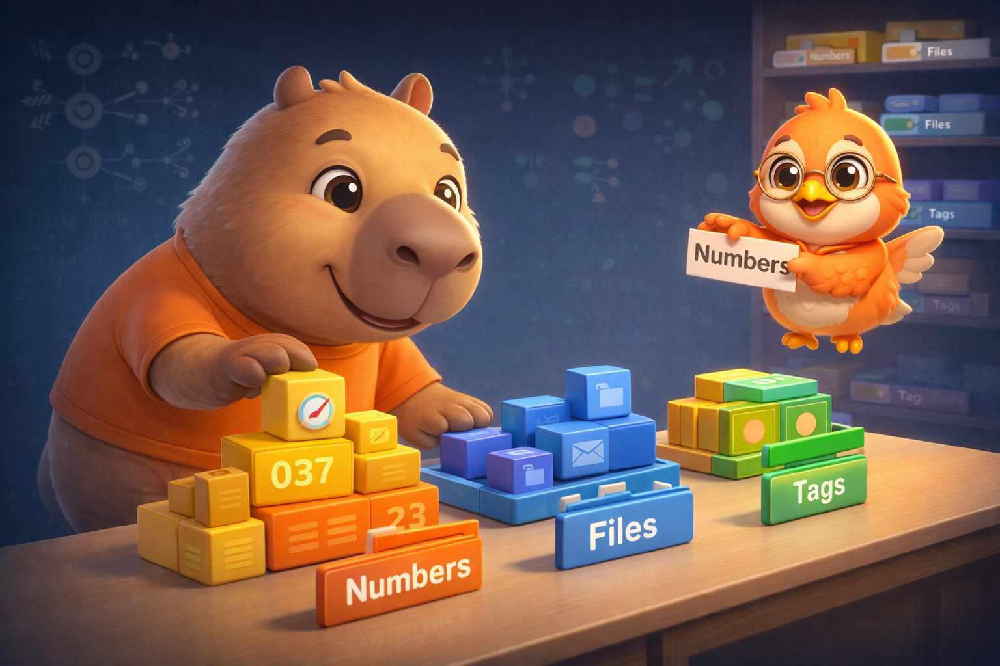
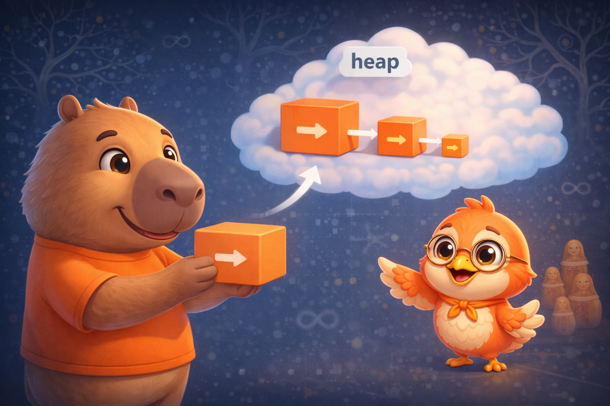

import Callout from '../../../../../components/Callout.astro';
import InfoBox from '../../../../../components/InfoBox.astro';
import EnumMemoryVisualizer from '../../../../../components/blog/EnumMemoryVisualizer';

En el [artículo anterior](/es/blog/swift-cero-experto-closures) descubrimos que los closures son **reference types** que viven en el heap cuando escapan. Hoy cambiamos completamente de dirección: las **enumeraciones** son value types que el compilador optimiza tan agresivamente que pueden representarse con solo 2 bits.

Si vienes de C o Java, probablemente piensas en los enums como una lista de enteros con nombre. En Swift, un enum es un **tipo algebraico completo** — con métodos, computed properties, associated values de distintos tipos, conformance a protocolos, y hasta recursión. Son una de las herramientas más expresivas del lenguaje, y entender cómo el compilador los representa en memoria te va a cambiar la forma en que los diseñas.

<div class="pull-quote">
Un enum de Swift no es una lista de enteros disfrazados — es un tipo algebraico completo que el compilador puede representar en tan solo 2 bits.
</div>



## Definiendo un enum — adiós al entero disfrazado

<Callout type="info" title="Definición: Enumeration">
Una **enumeración** define un tipo con un conjunto finito de valores posibles llamados *cases*. A diferencia de C, los cases de Swift **no** son enteros — son valores completos del tipo del enum.
</Callout>

La forma más básica:

```swift
enum CompassPoint {
    case north
    case south
    case east
    case west
}
```

O en una sola línea:

```swift
enum CompassPoint {
    case north, south, east, west
}
```

Lo crucial aquí es que `CompassPoint.north` **no es el entero 0**. Es un valor del tipo `CompassPoint`:

```swift
var direction = CompassPoint.west
print(type(of: direction))  // CompassPoint — NOT Int

// Cuando el tipo ya se conoce, puedes omitir el nombre del enum
direction = .east
```

<Callout type="tip" title="Dot syntax">
Cuando el tipo ya se conoce por el contexto, puedes escribir solo `.north` en lugar de `CompassPoint.north`. Esto es lo que hace que los enums funcionen tan bien con `switch`, APIs de SwiftUI, y cualquier lugar donde el compilador pueda inferir el tipo.
</Callout>

Por convención, los enums en Swift usan nombre **singular** (`Planet`, no `Planets`) y los cases empiezan con **minúscula** (`north`, no `North`).

## Pattern matching y exhaustividad

Los enums brillan con `switch` — y aquí Swift agrega algo que C nunca tuvo: **exhaustividad obligatoria**.

```swift
func describe(_ point: CompassPoint) -> String {
    switch point {
    case .north:
        return "Going up"
    case .south:
        return "Going down"
    case .east:
        return "Going right"
    case .west:
        return "Going left"
    }
    // No necesitas `default` — el compilador sabe que cubriste todos los casos
}
```

<Callout type="warning" title="La red de seguridad del compilador">
Si agregas un case nuevo al enum y olvidas actualizarlo en un `switch`, el compilador te da un error. Esa exhaustividad no es una molestia — es una red de seguridad que los enteros de C nunca te darán. El día que agregas `.northwest` al enum y olvidaste actualizar 3 switches en tu código, el compilador te salva.
</Callout>

Para cuando no necesitas cubrir todos los casos, puedes usar `if case` o `guard case`:

```swift
let heading = CompassPoint.north

// if case — útil cuando solo te interesa un caso
if case .north = heading {
    print("Heading north!")
}

// guard case — para early exit
func navigate(_ point: CompassPoint) {
    guard case .north = point else {
        print("Not going north")
        return
    }
    print("Full speed ahead!")
}
```

## CaseIterable — recorrer todos los casos

<Callout type="info" title="Definición: CaseIterable">
El protocolo **CaseIterable** le dice al compilador que sintetice una propiedad `allCases` que retorna una colección con todos los valores posibles del enum.
</Callout>

```swift
enum Beverage: CaseIterable {
    case coffee, tea, juice, water
}

print(Beverage.allCases.count)  // 4

for drink in Beverage.allCases {
    print(drink)
}
// coffee, tea, juice, water
```

Esto es extremadamente útil para generar menús, pickers en SwiftUI, o iterar sobre opciones de configuración. Ten en cuenta que `CaseIterable` solo se puede sintetizar automáticamente cuando **ningún case tiene associated values** — porque con associated values, los valores posibles serían infinitos.

## Raw values — un valor fijo para cada case

<Callout type="info" title="Definición: Raw Value">
Un **raw value** es un valor fijo de tipo `String`, `Int`, `Double` o `Character` que se asigna a cada case en tiempo de **compilación**. Todos los cases deben tener el mismo tipo de raw value, y todos deben ser únicos.
</Callout>

### Enteros con auto-incremento

```swift
enum Planet: Int {
    case mercury = 1
    case venus        // 2 (auto)
    case earth        // 3 (auto)
    case mars         // 4 (auto)
    case jupiter      // 5 (auto)
    case saturn       // 6 (auto)
    case uranus       // 7 (auto)
    case neptune      // 8 (auto)
}
```

Si no asignas un valor inicial, Swift empieza en 0 para enteros.

### Strings implícitos

```swift
enum HTTPMethod: String {
    case get       // rawValue = "get"
    case post      // rawValue = "post"
    case put       // rawValue = "put"
    case delete    // rawValue = "delete"
}

print(HTTPMethod.get.rawValue)  // "get"
```

Para strings, el raw value implícito es el nombre del case.

### Failable initializer

Cada enum con raw values obtiene un **initializer que puede fallar**:

```swift
let possiblePlanet = Planet(rawValue: 3)  // Optional<Planet> → .earth
let unknown = Planet(rawValue: 99)         // nil — no existe
```

Esto lo conecta directamente con los opcionales que veremos a profundidad en el artículo #11.

<Callout type="tip" title="Dato de memoria">
Los raw values **no se almacenan** en cada instancia del enum. Son metadata de compilación — el compilador genera una tabla de lookup, pero cada instancia sigue ocupando solo el tamaño del tag (1 byte para enums con pocos casos). Verificaremos esto en la sección de memoria.
</Callout>

## Associated values — cada caso cuenta su propia historia

Aquí es donde los enums de Swift se separan completamente de cualquier otro lenguaje.

<Callout type="info" title="Definición: Associated Values">
Los **associated values** permiten que cada case almacene datos adicionales de tipos diferentes. Es como si cada caso fuera un mini-struct con su propia forma. Se definen inline en la declaración del case y se extraen con pattern matching.
</Callout>

```swift
enum Barcode {
    case upc(Int, Int, Int, Int)
    case qrCode(String)
}

var productBarcode = Barcode.upc(8, 85909, 51226, 3)
productBarcode = .qrCode("ABCDEFGHIJKLMNOP")
```

Un mismo tipo (`Barcode`) puede almacenar datos de formas completamente diferentes — 4 enteros o un string. Esto es un **sum type** (o tipo algebraico de suma) en la teoría de tipos.

### Extracción con pattern matching

```swift
switch productBarcode {
case .upc(let numberSystem, let manufacturer, let product, let check):
    print("UPC: \(numberSystem), \(manufacturer), \(product), \(check)")
case .qrCode(let code):
    print("QR: \(code)")
}

// Shorthand: si todos los associated values son let (o todos var)
switch productBarcode {
case let .upc(numberSystem, manufacturer, product, check):
    print("UPC: \(numberSystem), \(manufacturer), \(product), \(check)")
case let .qrCode(code):
    print("QR: \(code)")
}
```

### Un ejemplo más práctico

```swift
enum NetworkResponse {
    case success(data: Data, response: HTTPURLResponse)
    case failure(Error)
    case loading(progress: Double)
}

func handle(_ response: NetworkResponse) {
    switch response {
    case .success(let data, let response) where response.statusCode == 200:
        print("OK — \(data.count) bytes")
    case .success(_, let response):
        print("Unexpected status: \(response.statusCode)")
    case .failure(let error):
        print("Error: \(error.localizedDescription)")
    case .loading(let progress) where progress > 0.9:
        print("Almost done! \(Int(progress * 100))%")
    case .loading(let progress):
        print("Loading: \(Int(progress * 100))%")
    }
}
```

Fíjate en el `where` — puedes filtrar dentro del mismo case para manejar subcasos. La combinación de associated values + pattern matching + where clauses es increíblemente poderosa.


<Callout type="warning" title="Raw values vs Associated values">
Un enum **no puede tener ambos** — raw values y associated values — al mismo tiempo. Raw values son fijos por case (todos del mismo tipo), associated values son dinámicos por instancia (cada case con su propia forma). Son dos formas distintas de agregar datos a un enum.
</Callout>

## Enums recursivos con `indirect` — cuando un caso se contiene a sí mismo

¿Qué pasa cuando un enum necesita referirse a sí mismo?

<Callout type="info" title="Definición: Indirect Enum">
Un **enum recursivo** es aquel donde uno o más cases tienen associated values del mismo tipo que el enum. Swift requiere la keyword `indirect` porque necesita usar un **puntero al heap** en lugar de alocar el valor directamente — de lo contrario, el tamaño del tipo sería **infinito**.
</Callout>

El ejemplo clásico es una expresión aritmética:

```swift
indirect enum ArithmeticExpression {
    case number(Int)
    case addition(ArithmeticExpression, ArithmeticExpression)
    case multiplication(ArithmeticExpression, ArithmeticExpression)
}
```

Puedes poner `indirect` en el enum completo o solo en los cases recursivos:

```swift
enum ArithmeticExpression {
    case number(Int)
    indirect case addition(ArithmeticExpression, ArithmeticExpression)
    indirect case multiplication(ArithmeticExpression, ArithmeticExpression)
}
```

Y evaluar recursivamente:

```swift
func evaluate(_ expression: ArithmeticExpression) -> Int {
    switch expression {
    case .number(let value):
        return value
    case .addition(let left, let right):
        return evaluate(left) + evaluate(right)
    case .multiplication(let left, let right):
        return evaluate(left) * evaluate(right)
    }
}

// (5 + 4) × 2
let five = ArithmeticExpression.number(5)
let four = ArithmeticExpression.number(4)
let sum = ArithmeticExpression.addition(five, four)
let product = ArithmeticExpression.multiplication(sum, .number(2))

print(evaluate(product))  // 18
```



¿Recuerdas del [artículo #1](/es/blog/swift-cero-experto-tipos-datos-operadores) que los value types viven en el stack? Un enum recursivo necesita romper esa regla — el compilador inserta un puntero al heap para los cases marcados como `indirect`. Sin eso, el compilador no podría calcular el tamaño del tipo: `ArithmeticExpression` contendría `ArithmeticExpression` que contendría `ArithmeticExpression`... infinitamente.

## Métodos, computed properties e initializers

Los enums en Swift no son solo contenedores de constantes — son tipos de primera clase completos:

```swift
enum Planet: Int, CaseIterable {
    case mercury = 1, venus, earth, mars, jupiter, saturn, uranus, neptune

    /// Surface gravity relative to Earth
    var surfaceGravity: Double {
        switch self {
        case .mercury: return 0.378
        case .venus:   return 0.907
        case .earth:   return 1.0
        case .mars:    return 0.377
        case .jupiter: return 2.36
        case .saturn:  return 0.916
        case .uranus:  return 0.889
        case .neptune: return 1.12
        }
    }

    /// Weight on this planet given weight on Earth
    func weight(onEarth earthWeight: Double) -> Double {
        return earthWeight * surfaceGravity
    }
}

let myWeight = Planet.mars.weight(onEarth: 70)
print(myWeight)  // 26.39 kg en Marte
```

### Mutating methods

Los enums son value types, así que para métodos que cambian `self` necesitas `mutating`:

```swift
enum TrafficLight {
    case red, yellow, green

    mutating func next() {
        switch self {
        case .red:    self = .green
        case .green:  self = .yellow
        case .yellow: self = .red
        }
    }
}

var light = TrafficLight.red
light.next()  // .green
light.next()  // .yellow
light.next()  // .red
```

<Callout type="tip" title="Enums como máquinas de estado">
La combinación de cases + mutating methods convierte a los enums en excelentes **máquinas de estado**. Cada case es un estado, cada método mutating es una transición. El compilador garantiza que manejes todas las transiciones posibles.
</Callout>

## Protocolos y síntesis automática

El compilador de Swift puede sintetizar automáticamente conformance a varios protocolos para enums:

```swift
// Equatable y Hashable — automático para enums SIN associated values
enum Direction: Hashable {
    case north, south, east, west
}

let directions: Set<Direction> = [.north, .south]  // Funciona por síntesis

// Con associated values — automático SI todos los tipos conforman
enum Result: Equatable {
    case success(Int)       // Int es Equatable ✓
    case failure(String)    // String es Equatable ✓
}

Result.success(42) == Result.success(42)  // true
Result.success(42) == Result.failure("err")  // false
```

### Comparable automático (SE-0266)

```swift
enum Priority: Comparable {
    case low, medium, high, critical
}

let tasks: [Priority] = [.high, .low, .critical, .medium]
print(tasks.sorted())  // [.low, .medium, .high, .critical]
// El orden es por declaración — el primer case es el "menor"
```

### Codable con associated values (SE-0295)

Desde Swift 5.5, el compilador sintetiza `Codable` para enums con associated values:

```swift
enum Barcode: Codable {
    case upc(Int, Int, Int, Int)
    case qrCode(String)
}

let code = Barcode.qrCode("ABCDEF")
let data = try JSONEncoder().encode(code)
// {"qrCode":{"_0":"ABCDEF"}}
```

Los labels sin nombre obtienen keys generadas (`_0`, `_1`). Si quieres keys personalizadas, puedes declarar `CodingKeys` por case.

## Explorando la memoria

Navega por el componente interactivo para ver cómo cambia el layout en memoria según el tipo de enum:

<div class="interactive-content">
  <EnumMemoryVisualizer client:load lang="es" />
</div>

## La memoria detrás de los enums

Ahora conectemos todo con nuestro hilo de memoria — la parte que distingue a un desarrollador que *usa* enums de uno que los *entiende*.

### Representación mínima: tag bits

Un enum sin associated values ni raw values almacena únicamente un **tag** (también llamado *discriminador*) — un número que identifica qué case es.

```swift
MemoryLayout<CompassPoint>.size  // 1 byte
// 4 cases → necesita ceil(log2(4)) = 2 bits
// Pero el mínimo direccionable es 1 byte
```

El compilador elige la representación más pequeña posible:

<InfoBox title="Tamaño del tag según número de cases">
- **2 cases** → 1 bit, redondeado a 1 byte
- **3-4 cases** → 2 bits, redondeado a 1 byte
- **5-256 cases** → 3-8 bits, redondeado a 1 byte
- **257+ cases** → 2 bytes
- **Enum vacío (0 cases)** → 0 bytes (tipo inhabitable)
</InfoBox>

### Associated values: el caso más grande gana

Cuando el enum tiene associated values, el tamaño es: **tag + payload del caso más grande**.

```swift
enum Barcode {
    case upc(Int, Int, Int, Int)  // 4 × 8 = 32 bytes de payload
    case qrCode(String)           // 16 bytes de payload (String en Swift = 16 bytes inline)
}

MemoryLayout<Barcode>.size       // 33 bytes (32 payload + 1 tag)
MemoryLayout<Barcode>.stride     // 40 bytes (alignment a 8 bytes)
```

Cuando `Barcode` es `.qrCode`, usa 16 de los 32 bytes de payload — los otros 16 quedan sin usar. Es el precio de tener un tamaño fijo para el tipo.

### Spare bit optimization

Esta es la optimización más elegante del compilador. `Optional<Bool>` debería ocupar 2 bytes (1 para Bool + 1 para el tag de Optional), pero ocupa solo **1 byte**:

```swift
MemoryLayout<Bool>.size    // 1 byte
MemoryLayout<Bool?>.size   // 1 byte — ¡no 2!
```

¿Cómo? `Bool` solo usa dos patrones de bits: `0` (false) y `1` (true). Un byte tiene 256 patrones posibles — quedan 254 sin usar. El compilador usa el patrón `2` para representar `.none`. El tag se "esconde" en los spare bits del payload.

Para tipos de referencia (clases), es aún mejor: `Optional<AnyObject>` no necesita **ningún byte extra** porque el compilador usa el null pointer (`0x0`) para representar `.none`. Por eso `Optional<String>.size == String.size` — el tag es gratis.

### indirect: el costo del heap

Cuando un enum usa `indirect`, cada case recursivo almacena un **puntero de 8 bytes** al heap en lugar del valor directamente:

```swift
MemoryLayout<ArithmeticExpression>.size  // 8 bytes (solo el puntero)
```

Sin `indirect`, el compilador necesitaría calcular: tamaño de `ArithmeticExpression` = tamaño de `ArithmeticExpression` + tamaño de `ArithmeticExpression` + ... — una ecuación sin solución. El puntero rompe la recursión y fija el tamaño.

El costo: cada instancia recursiva implica un `malloc` al heap, con su refcount y eventual `free`. Es el mismo trade-off que vimos con los closures escaping en el artículo #6.

<div class="pull-quote">
El compilador de Swift trata cada bit como recurso escaso. Un enum de 4 casos ocupa 1 byte. Un Optional de referencia no añade ni un byte. Esa obsesión por la eficiencia no es accidental — es lo que hace que Swift sea viable para sistemas embebidos, wearables y código de alto rendimiento.
</div>

## Swift Evolution: features avanzadas

Los enums siguen evolucionando con cada versión de Swift. Estas son las adiciones más importantes para desarrolladores avanzados:

### Noncopyable enums (~Copyable) — SE-0390

Desde Swift 5.9, puedes crear enums que **no se pueden copiar** — útil para modelar ownership exclusivo de recursos:

```swift
enum FileHandle: ~Copyable {
    case open(descriptor: Int32)
    case closed

    consuming func close() {
        // Después de consumir, el valor ya no existe
        print("File closed")
    }
}

var handle = FileHandle.open(descriptor: 42)
handle.close()  // consume el valor
// handle ya no es usable aquí — el compilador lo garantiza
```

### @nonexhaustive — SE-0487

Para librerías que evolucionan, puedes marcar un enum como extensible:

```swift
@nonexhaustive public enum APIError {
    case unauthorized
    case notFound
    case serverError
    // Futuros cases no romperán el código del usuario
}

// El usuario de tu librería debe usar @unknown default
switch error {
case .unauthorized: handleAuth()
case .notFound: show404()
case .serverError: retry()
@unknown default: handleUnknown()  // Atrapa futuros cases
}
```

### @c — SE-0495 (Swift 6.3)

Para interoperabilidad con C:

```swift
@c enum Color: CInt {
    case red
    case green
    case blue
}
// Se exporta como enum C en el compatibility header
```

<Callout type="info" title="Sobre versiones">
`~Copyable` requiere Swift 5.9+, `@nonexhaustive` requiere Swift 6.2+, y `@c` requiere Swift 6.3. No necesitas usarlos hoy, pero saber que existen te prepara para cuando los necesites — especialmente si escribes librerías o código de sistemas.
</Callout>

## Recapitulación

Hoy cubrimos uno de los tipos más versátiles de Swift:

- **Enums ≠ enteros** — son tipos de valor completos con nombre, no enteros disfrazados
- **Pattern matching** — `switch` exhaustivo con value binding y `where`, más `if case` y `guard case`
- **CaseIterable** — recorrer todos los casos con `.allCases`
- **Raw values** — valor fijo por case (String, Int), con failable initializer, metadata de compilación
- **Associated values** — datos diferentes por caso, extraídos con pattern matching (sum types)
- **Recursive enums (indirect)** — heap allocation para romper la recursión infinita de tamaño
- **Métodos y propiedades** — enums como tipos de primera clase, mutating para cambiar `self`
- **Protocol synthesis** — Equatable, Hashable, Comparable, Codable automáticos
- **Memoria** — tag bits mínimos, tamaño = caso más grande, spare bit optimization, Optional es un enum
- **Swift Evolution** — ~Copyable, @nonexhaustive, @c para el futuro

## Lo que viene

En el próximo artículo exploramos **Structs vs Classes** — la decisión que define la arquitectura de tu app. Veremos value semantics vs reference semantics, por qué los structs viven en el stack y las clases en el heap, memberwise initializers, y por qué Apple recomienda structs por defecto. Después de entender enums como value types, es el momento perfecto para comparar los otros dos jugadores.

Nos vemos la próxima semana.

<div class="pull-quote">
Las enumeraciones de Swift son tipos algebraicos completos — cada case es un valor con significado, no un entero disfrazado. Y el compilador lo sabe: elige la representación mínima para que tu enum ocupe exactamente los bytes que necesita, ni uno más.
</div>

## Referencias

- [The Swift Programming Language — Enumerations](https://docs.swift.org/swift-book/documentation/the-swift-programming-language/enumerations)
- [SE-0266: Synthesized Comparable conformance for enum types](https://github.com/swiftlang/swift-evolution/blob/main/proposals/0266-synthesized-comparable-for-enumerations.md)
- [SE-0295: Codable synthesis for enums with associated values](https://github.com/swiftlang/swift-evolution/blob/main/proposals/0295-codable-synthesis-for-enums-with-associated-values.md)
- [SE-0390: Noncopyable structs and enums](https://github.com/swiftlang/swift-evolution/blob/main/proposals/0390-noncopyable-structs-and-enums.md)
- [SE-0487: Non-exhaustive enums](https://github.com/swiftlang/swift-evolution/blob/main/proposals/0487-non-exhaustive-enums.md)
- [SE-0495: C interop enums](https://github.com/swiftlang/swift-evolution/blob/main/proposals/0495-c-enums.md)
