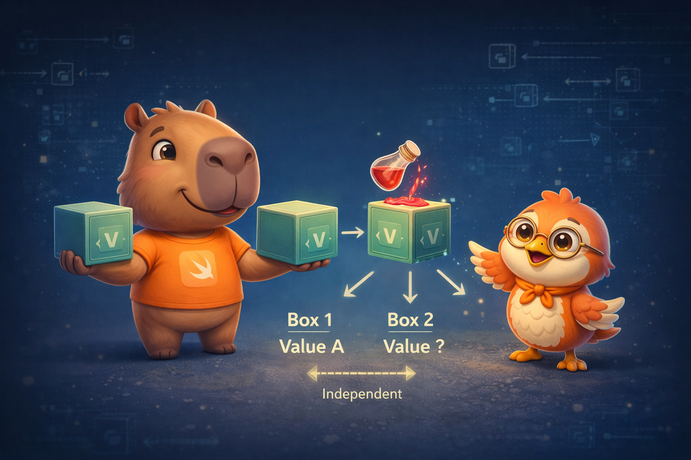

import Callout from '../../../../../components/Callout.astro';
import InfoBox from '../../../../../components/InfoBox.astro';
import ValueVsReferenceVisualizer from '../../../../../components/blog/ValueVsReferenceVisualizer';

En el [artículo anterior](/es/blog/swift-cero-experto-enumeraciones) vimos que los enums son value types con una representación en memoria increíblemente eficiente. Hoy abordamos la decisión más fundamental en Swift: **struct o class**. No es una preferencia estética — es una elección que afecta directamente dónde vive tu dato (stack vs heap), cómo se copia, cómo se despacha cada método, y cuánta presión ejerces sobre el garbage collector (bueno, sobre ARC).

Este artículo te va a cambiar la forma en que piensas sobre tus tipos.

<div class="pull-quote">
Struct o class no es una cuestión de preferencia — es una decisión de arquitectura. Elige mal y pagarás en rendimiento, bugs de estado compartido, o ambos.
</div>



## Lo que comparten

Antes de ver las diferencias, vale la pena notar que structs y classes tienen **mucho en común**:

```swift
// Ambos pueden tener:
// ✓ Stored y computed properties
// ✓ Methods
// ✓ Subscripts
// ✓ Initializers
// ✓ Extensions
// ✓ Protocol conformance
```

Si solo miras la lista de features, parecen casi iguales. Las diferencias están **bajo el capó**.

## Lo que las separa

<InfoBox title="Solo las classes tienen">
- **Herencia** — una class puede heredar de otra
- **Type casting** — verificar el tipo en runtime
- **Deinitializers** — código que corre antes de ser destruida (`deinit`)
- **Reference counting** — múltiples referencias al mismo objeto (ARC)
- **Identity** — el operador `===` para verificar si dos variables apuntan al mismo objeto
</InfoBox>

## Value semantics vs Reference semantics

<Callout type="info" title="Definición: Value Semantics">
Con **value semantics**, cada variable tiene su propia copia independiente del dato. Modificar una copia **no afecta** a las demás. Los structs, enums, y todos los tipos básicos de Swift (Int, String, Array, Dictionary) tienen value semantics.
</Callout>

<Callout type="info" title="Definición: Reference Semantics">
Con **reference semantics**, múltiples variables pueden apuntar al **mismo** objeto. Modificar a través de una referencia afecta a **todas** las demás. Las classes tienen reference semantics.
</Callout>

Veamos esto en acción:

```swift
// VALUE SEMANTICS — struct
struct Size {
    var width: Double
    var height: Double
}

var a = Size(width: 100, height: 200)
var b = a       // b es una COPIA independiente
b.width = 999

print(a.width)  // 100 — intacto
print(b.width)  // 999 — solo b cambió
```

```swift
// REFERENCE SEMANTICS — class
class SizeClass {
    var width: Double
    var height: Double
    init(width: Double, height: Double) {
        self.width = width
        self.height = height
    }
}

var x = SizeClass(width: 100, height: 200)
var y = x       // y apunta al MISMO objeto
y.width = 999

print(x.width)  // 999 — ¡también cambió!
print(y.width)  // 999
```

Explora el componente interactivo para ver paso a paso cómo se comportan en memoria:

<div class="interactive-content">
  <ValueVsReferenceVisualizer client:load lang="es" />
</div>

<Callout type="warning" title="El bug más común con classes">
El estado compartido es la fuente #1 de bugs sutiles. Si pasas un objeto `class` a una función y esa función lo modifica, tu variable original también cambia — sin que nadie te avise. Con structs, cada función trabaja con su propia copia. Es **más seguro por defecto**.
</Callout>

## Dónde viven: Stack vs Heap

### Structs: el stack

Los structs viven directamente en el **stack frame** de la función que los crea:

```swift
func process() {
    var point = Size(width: 10, height: 20)
    // point vive aquí, en el stack de process()
    // Cuando process() termina, point desaparece
    // No hay malloc, no hay free, no hay refcount
}
```

El stack es **LIFO** (Last In, First Out) — alocar y liberar es simplemente mover un puntero. Es la operación de memoria más rápida que existe.

### Classes: el heap

Las classes **siempre** se alocan en el heap:

```swift
func process() {
    var point = SizeClass(width: 10, height: 20)
    // En el stack: 8 bytes (puntero al heap)
    // En el heap: metadata + refcount + width + height
    // malloc() al crear, free() cuando refcount llega a 0
}
```

Cada instancia de class implica:
1. `malloc` — buscar espacio libre en el heap
2. **metadata** — tipo, vtable pointer
3. **refcount** — contador de referencias (ARC)
4. El dato real (propiedades)
5. `free` — cuando el último reference desaparece

<Callout type="tip" title="¿Por qué importa?">
`malloc` es **~100x más lento** que alocar en el stack. No porque sea un mal algoritmo — es que buscar espacio libre en el heap, manejar fragmentación, y mantener thread safety es inherentemente más costoso que mover un puntero. Para un solo objeto no lo notas, pero en un loop que crea miles de objetos, la diferencia es real.
</Callout>

## Memberwise initializers

Los structs obtienen un **initializer automático** con todos sus stored properties:

```swift
struct Color {
    var red: Double
    var green: Double
    var blue: Double
}

// El compilador genera esto gratis:
let white = Color(red: 1.0, green: 1.0, blue: 1.0)
```

Las classes **no** — tienes que escribir tu propio `init`:

```swift
class ColorClass {
    var red: Double
    var green: Double
    var blue: Double

    init(red: Double, green: Double, blue: Double) {
        self.red = red
        self.green = green
        self.blue = blue
    }
}
```

<Callout type="info" title="¿Por qué las classes no tienen memberwise init?">
Por la herencia. Un memberwise init generado podría entrar en conflicto con la cadena de inicialización de subclasses. Los structs no tienen herencia, así que no hay conflicto posible. Profundizaremos en los initializers en el artículo #10.
</Callout>

## Identity: === vs ==

Las classes tienen algo que los structs no: **identidad**. Puedes preguntar si dos variables apuntan al **mismo objeto** (no solo si tienen los mismos valores):

```swift
let point1 = SizeClass(width: 10, height: 20)
let point2 = point1                              // misma instancia
let point3 = SizeClass(width: 10, height: 20)    // otra instancia, mismos valores

point1 === point2  // true — MISMO objeto
point1 === point3  // false — objetos DIFERENTES
```

Los structs no tienen `===` porque no tiene sentido — cada variable es su propia copia. Solo puedes comparar valores con `==` (si el tipo conforma `Equatable`).

## mutating: la keyword que protege tus structs

Como los structs son value types, Swift **prohíbe** mutar sus propiedades desde métodos por defecto:

```swift
struct Counter {
    var count = 0

    mutating func increment() {
        count += 1  // Solo posible con 'mutating'
    }
}

var counter = Counter()
counter.increment()  // OK — counter es var

let fixed = Counter()
// fixed.increment()  // ERROR — no puedes mutar un let
```

`mutating` es un contrato: le dice al compilador "este método va a modificar `self`". En las classes no existe porque las propiedades siempre son mutables a través de cualquier referencia (incluso `let`).

```swift
let classCounter = SomeCounterClass()
classCounter.count += 1  // OK — let solo protege la REFERENCIA, no el objeto
```

<Callout type="warning" title="let en structs vs let en classes">
`let struct` = no puedes cambiar **nada** del struct. `let class` = no puedes cambiar **a qué objeto apunta**, pero sí puedes modificar las propiedades del objeto. Esta asimetría confunde a muchos developers — y es una razón más para preferir structs.
</Callout>

## Static dispatch vs Dynamic dispatch


Esta es la diferencia de rendimiento que menos se discute — y la que más impacta.

<Callout type="info" title="Definición: Static Dispatch">
Con **static dispatch**, el compilador sabe **en compilación** exactamente qué función llamar. No hay indirección en runtime — el CPU salta directamente al código. Los structs usan static dispatch para todos sus métodos.
</Callout>

<Callout type="info" title="Definición: Dynamic Dispatch">
Con **dynamic dispatch**, el programa consulta una **vtable** (virtual table) en runtime para determinar qué función llamar. Es necesario cuando una class podría ser subclaseada y el método overrideado. Cuesta ~2-3 nanosegundos extra por llamada.
</Callout>

```swift
// STRUCT — static dispatch
struct Calculator {
    func add(_ a: Int, _ b: Int) -> Int { a + b }
}
let calc = Calculator()
calc.add(2, 3)
// El compilador inserta directamente: a + b (puede hasta hacer inline)

// CLASS — dynamic dispatch (por defecto)
class Calculator {
    func add(_ a: Int, _ b: Int) -> Int { a + b }
}
let calc = Calculator()
calc.add(2, 3)
// Runtime: busca add() en la vtable → salta al código → ejecuta
```

### final: la optimización que debes conocer

Marcar una class o método como `final` le dice al compilador "nadie va a subclasear/overridear esto" — y habilita static dispatch:

```swift
final class FastCalculator {
    func add(_ a: Int, _ b: Int) -> Int { a + b }
    // static dispatch — igual de rápido que un struct
}
```

<InfoBox title="Dispatch en resumen">
- **Struct methods** → siempre static dispatch (el compilador resuelve en compilación)
- **Class methods** → dynamic dispatch por defecto (vtable lookup en runtime)
- **final class methods** → static dispatch (el compilador sabe que no hay override)
- **Protocol methods** → witness table (similar a vtable, lo veremos en artículo #13)
- **Whole Module Optimization** → el compilador puede inferir `final` si ve que nadie subclasea
</InfoBox>

## Copy-on-Write (CoW): lo mejor de ambos mundos

Si los structs se copian cada vez que los asignas... ¿no es terriblemente lento para un `Array` de 10,000 elementos? No — gracias a **Copy-on-Write**.

<Callout type="info" title="Definición: Copy-on-Write (CoW)">
**Copy-on-Write** es una optimización donde la copia real solo ocurre cuando **modificas** el dato. Mientras solo leas, múltiples variables comparten el mismo storage interno. `Array`, `Dictionary`, `Set` y `String` usan CoW.
</Callout>

```swift
var original = [1, 2, 3, 4, 5]
var copy = original  // NO copia los datos — comparten el buffer interno

// Ambos apuntan al mismo buffer (refcount = 2)

copy.append(6)  // AHORA se copia — copy necesita su propio buffer
// original sigue con [1, 2, 3, 4, 5]
// copy tiene [1, 2, 3, 4, 5, 6] en su propio buffer
```

CoW te da lo mejor de ambos mundos:
- **Seguridad** de value semantics (cada variable es independiente)
- **Rendimiento** de sharing (no copias si no modificas)

<Callout type="tip" title="Para devs avanzados">
Puedes implementar CoW en tus propios structs usando `isKnownUniquelyReferenced()`. Si el storage interno tiene un solo owner, mutas in-place; si tiene más, copias primero. Los tipos de la stdlib como Array hacen exactamente esto.
</Callout>

## ¿Cuándo los structs terminan en el heap?

Los structs **normalmente** viven en el stack, pero el compilador los mueve al heap cuando:

1. **Escape de scope** — capturados por un escaping closure (artículo #6)
2. **Existential containers** — cuando se almacenan como protocolo (`any Drawable`)
3. **Demasiado grandes** — structs muy grandes pueden ser más eficientes en el heap
4. **Dentro de una class** — si un struct es propiedad de una class, vive en el heap allocation de esa class

```swift
protocol Drawable {
    func draw()
}

struct Circle: Drawable {
    var radius: Double
    func draw() { print("Drawing circle") }
}

// Existential container — Circle puede terminar en el heap
let shape: any Drawable = Circle(radius: 5)
```

<Callout type="info" title="Existential containers">
Cuando almacenas un value type como `any Protocol`, Swift usa un **existential container** — una estructura de tamaño fijo que puede guardar el valor inline (si cabe en 3 words / 24 bytes) o un puntero al heap (si es más grande). En Swift 5.9+, `any` es explícito para que seas consciente del costo.
</Callout>

## ¿Cuándo usar struct? ¿Cuándo usar class?

<InfoBox title="Usa struct cuando...">
- Los datos son **auto-contenidos** y no necesitan identidad
- Quieres **value semantics** (copias independientes)
- No necesitas **herencia**
- Quieres el rendimiento del **stack** y **static dispatch**
- Es la opción por **defecto** recomendada por Apple
</InfoBox>

<InfoBox title="Usa class cuando...">
- Necesitas **identidad** (verificar si dos variables son el mismo objeto con `===`)
- Necesitas **herencia** (jerarquías de tipos)
- Necesitas **reference semantics** (múltiples partes del código comparten el mismo estado)
- Interoperas con **Objective-C** (que solo tiene classes)
- El ciclo de vida del objeto necesita **deinit** para cleanup
</InfoBox>

Apple lo resume en una frase: **"Usa structs por defecto. Usa classes solo cuando necesites las capacidades específicas de classes."**

## La memoria: el resumen definitivo

```
┌─────────────────────────────────────────────────┐
│                    STRUCT                       │
│  • Stack allocation (rápido)                    │
│  • Value semantics (copia independiente)        │
│  • Static dispatch (resuelto en compilación)    │
│  • No refcount, no malloc, no free              │
│  • CoW para colecciones (Array, Dict, Set)      │
│  • Memberwise init gratuito                     │
│  • Sin herencia, sin deinit, sin identity       │
└─────────────────────────────────────────────────┘

┌─────────────────────────────────────────────────┐
│                    CLASS                        │
│  • Heap allocation (malloc + free)              │
│  • Reference semantics (estado compartido)      │
│  • Dynamic dispatch (vtable en runtime)         │
│  • Refcount management (ARC)                    │
│  • Metadata + vtable en cada instancia          │
│  • Herencia, deinit, identity (===)             │
│  • final → static dispatch (optimización)       │
└─────────────────────────────────────────────────┘
```

<div class="pull-quote">
No es que las classes sean "malas" — es que los structs son la opción correcta para la mayoría de los casos. Un struct es más rápido, más seguro, y más predecible. Reserva las classes para cuando realmente necesites herencia, identidad, o estado compartido.
</div>

## Recapitulación

- **Value semantics (struct)** — cada variable tiene su propia copia; mutar una no afecta a otras
- **Reference semantics (class)** — múltiples variables comparten el mismo objeto
- **Stack vs Heap** — structs en el stack (rápido), classes en el heap (malloc + refcount + free)
- **Memberwise init** — gratis para structs, manual para classes
- **Identity** — solo classes tienen `===`; structs solo tienen `==`
- **mutating** — necesario en structs para modificar `self`; innecesario en classes
- **Static dispatch (struct)** — el compilador resuelve en compilación
- **Dynamic dispatch (class)** — vtable lookup en runtime; `final` lo convierte en static
- **Copy-on-Write** — Array/Dict/Set copian solo al mutar
- **Structs en el heap** — existential containers, escaping closures, dentro de classes

## Lo que viene

En el próximo artículo exploramos **Propiedades, Métodos y Subscripts** — el tejido conectivo de tus tipos. Veremos la diferencia entre stored y computed properties (y por qué computed = zero storage), property observers, lazy properties, y cómo las propiedades definen el layout en memoria de tus structs y classes.

Nos vemos la próxima semana.

<div class="pull-quote">
La decisión entre struct y class no es de sintaxis — es de semántica. Value semantics te da seguridad y rendimiento por defecto. Reference semantics te da poder y flexibilidad cuando lo necesitas. Elige con intención.
</div>

## Referencias

- [The Swift Programming Language — Structures and Classes](https://docs.swift.org/swift-book/documentation/the-swift-programming-language/classesandstructures)
- [Choosing Between Structures and Classes — Apple](https://developer.apple.com/documentation/swift/choosing-between-structures-and-classes)
- [Understanding Swift Performance — WWDC 2016](https://developer.apple.com/videos/play/wwdc2016/416/)
