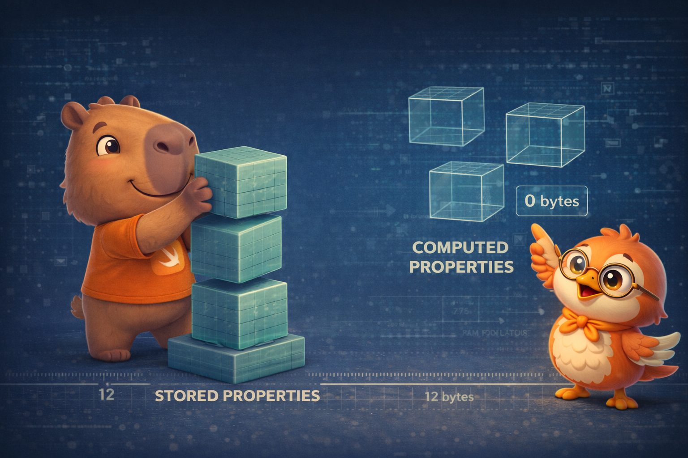

import Callout from '../../../../../components/Callout.astro';
import InfoBox from '../../../../../components/InfoBox.astro';

In the [previous article](/en/blog/swift-zero-expert-structs-vs-classes) we discovered that structs live on the stack and classes on the heap. Today we dive into the connective tissue of both: **properties, methods, and subscripts** — the pieces that define what your type knows, what it can do, and how you access its data.

Not all properties cost the same. A **stored property** takes up real space in your type's memory layout. A **computed property** doesn't take a single byte — it's a function disguised as a property. Understanding that difference is the key to designing efficient types.

<div class="pull-quote">
A stored property occupies real bytes in every instance. A computed property occupies zero — it's simply a function with property syntax.
</div>



## Stored properties: the real data

<Callout type="info" title="Definition: Stored Property">
A **stored property** is a constant (`let`) or variable (`var`) stored as part of every instance of a struct or class. Each instance holds its own copy of the value. These are the properties that define the **size** of your type in memory.
</Callout>

```swift
struct FixedLengthRange {
    var firstValue: Int   // 8 bytes — stored
    let length: Int       // 8 bytes — stored (inmutable)
}

// MemoryLayout<FixedLengthRange>.size == 16 bytes (8 + 8)
var range = FixedLengthRange(firstValue: 0, length: 3)
range.firstValue = 6  // OK — var
// range.length = 4   // ERROR — let es inmutable
```

Remember from article #8: if the struct is assigned to a `let` constant, **none** of its properties can change — not even the `var` ones:

```swift
let fixedRange = FixedLengthRange(firstValue: 0, length: 3)
// fixedRange.firstValue = 6  // ERROR — todo el struct es inmutable
```

With classes it's different — `let` only protects the reference, not the object:

```swift
class SomeClass {
    var value = 42
}
let instance = SomeClass()
instance.value = 99  // OK — let protege la referencia, no las propiedades
```

## Lazy stored properties: deferred allocation

<Callout type="info" title="Definition: Lazy Property">
A **lazy stored property** is one whose initial value is computed the **first time** it's accessed, not when the instance is created. It's declared with `lazy var`. It can never be `let` because its value is assigned after initialization.
</Callout>

```swift
class DataManager {
    lazy var importer = DataImporter()
    var data: [String] = []
}

let manager = DataManager()
// importer NO se ha creado todavía — zero costo hasta que lo necesites
manager.data.append("Some data")

print(manager.importer.filename)
// AHORA se crea DataImporter — solo cuando realmente lo necesitas
```

When should you use `lazy`?

- The value depends on external factors not known until after `init`
- The initial computation is expensive and may never be needed
- The property depends on `self` (which doesn't exist during initialization)

<Callout type="warning" title="Lazy is not thread-safe">
If two threads access a lazy property simultaneously for the first time, the property could be initialized **twice**. If you need thread-safe initialization, use `static` (which relies on `dispatch_once` internally) or an explicit synchronization mechanism.
</Callout>

## Computed properties: functions in disguise

<Callout type="info" title="Definition: Computed Property">
A **computed property** doesn't store a value — it **calculates** it every time it's accessed. It has a `get` (required) and optionally a `set`. It occupies no space in the instance's memory layout.
</Callout>

```swift
struct Rect {
    var origin: Point
    var size: Size

    var center: Point {
        get {
            Point(
                x: origin.x + (size.width / 2),
                y: origin.y + (size.height / 2)
            )
        }
        set {
            origin.x = newValue.x - (size.width / 2)
            origin.y = newValue.y - (size.height / 2)
        }
    }
}

var square = Rect(
    origin: Point(x: 0, y: 0),
    size: Size(width: 10, height: 10)
)
print(square.center)        // Point(x: 5, y: 5)
square.center = Point(x: 15, y: 15)
print(square.origin)        // Point(x: 10, y: 10)
```

`center` takes up no space — it's computed every time. If you only have a getter, you can simplify:

```swift
struct Cuboid {
    var width = 0.0, height = 0.0, depth = 0.0

    var volume: Double {   // read-only computed
        width * height * depth
    }
}
```

<InfoBox title="Stored vs Computed — in memory">
- **Stored property** → occupies real bytes in every instance. Determines `MemoryLayout.size`
- **Computed property** → zero bytes. It's a function the compiler can inline
- **Lazy stored** → occupies bytes + 1 byte flag (to track whether it's been initialized)
- **Compiler trick**: if a computed property is simple enough, the compiler inlines it — equivalent to accessing the field directly
</InfoBox>

## Property observers: willSet and didSet

<Callout type="info" title="Definition: Property Observers">
**Property observers** are blocks of code that run automatically **before** (`willSet`) or **after** (`didSet`) a stored property changes value. They don't add extra storage — they're functions the compiler inserts into the setter.
</Callout>

```swift
class StepCounter {
    var totalSteps: Int = 0 {
        willSet(newTotalSteps) {
            print("A punto de cambiar a \(newTotalSteps)")
        }
        didSet {
            if totalSteps > oldValue {
                print("Agregaste \(totalSteps - oldValue) pasos")
            }
        }
    }
}

let counter = StepCounter()
counter.totalSteps = 200
// "A punto de cambiar a 200"
// "Agregaste 200 pasos"
counter.totalSteps = 360
// "A punto de cambiar a 360"
// "Agregaste 160 pasos"
```

- `willSet` receives the new value as a parameter (default: `newValue`)
- `didSet` has access to the previous value (default: `oldValue`)
- You can use one, both, or neither

<Callout type="tip" title="Optimization SE-0268">
Since Swift 5.3, if your `didSet` **doesn't use** `oldValue`, the compiler **skips the getter call** to retrieve it. This matters for properties that are expensive to read — if you only need to react to a change without comparing against the previous value, it's free.
</Callout>

Observers also work on **inherited** properties — you can add `willSet`/`didSet` to a property you inherit from a superclass.

## Type properties: static and class

<Callout type="info" title="Definition: Type Property">
A **type property** belongs to the **type** itself, not to an instance. Only one copy exists, shared across all instances. It's declared with `static` (or `class` in classes to allow overriding).
</Callout>

```swift
struct AudioChannel {
    static let thresholdLevel = 10
    static var maxInputLevelForAllChannels = 0

    var currentLevel: Int = 0 {
        didSet {
            if currentLevel > AudioChannel.thresholdLevel {
                currentLevel = AudioChannel.thresholdLevel
            }
            if currentLevel > AudioChannel.maxInputLevelForAllChannels {
                AudioChannel.maxInputLevelForAllChannels = currentLevel
            }
        }
    }
}

var leftChannel = AudioChannel()
leftChannel.currentLevel = 7
print(AudioChannel.maxInputLevelForAllChannels)  // 7 — compartido
```

<Callout type="tip" title="Thread-safe by nature">
Stored type properties (`static let/var`) are initialized **lazily and thread-safely** by default. Swift uses `dispatch_once` internally — the first time you access the property, it's initialized exactly once regardless of how many threads access it simultaneously. It's the cleanest singleton pattern there is.
</Callout>

## Property wrappers: reusable logic

<Callout type="info" title="Definition: Property Wrapper">
A **property wrapper** (SE-0258) encapsulates reusable access logic behind an `@` attribute. You define the logic once and apply it to any property with `@WrapperName`.
</Callout>

```swift
@propertyWrapper
struct Clamped {
    var wrappedValue: Int {
        didSet { wrappedValue = min(max(wrappedValue, range.lowerBound), range.upperBound) }
    }
    let range: ClosedRange<Int>

    init(wrappedValue: Int, _ range: ClosedRange<Int>) {
        self.range = range
        self.wrappedValue = min(max(wrappedValue, range.lowerBound), range.upperBound)
    }
}

struct Player {
    @Clamped(0...100) var health: Int = 100
    @Clamped(0...999) var score: Int = 0
}

var player = Player()
player.health = 150   // se clampea a 100
player.health = -10   // se clampea a 0
```

SwiftUI is packed with property wrappers: `@State`, `@Binding`, `@ObservedObject`, `@Environment`. Now you know how they work under the hood.

## Instance methods

Methods are functions that belong to a type:

```swift
class Counter {
    var count = 0

    func increment() {
        count += 1
    }

    func increment(by amount: Int) {
        count += amount
    }

    func reset() {
        count = 0
    }
}

let counter = Counter()
counter.increment()
counter.increment(by: 5)
print(counter.count)  // 6
counter.reset()
```

Every instance method has an implicit `self` parameter that references the instance. You typically omit it unless there's ambiguity:

```swift
struct Point {
    var x = 0.0, y = 0.0

    func isToTheRightOf(x: Double) -> Bool {
        return self.x > x  // self.x es la propiedad, x es el parámetro
    }
}
```

## mutating in structs and enums

As we saw in [article #8](/en/blog/swift-zero-expert-structs-vs-classes), value types (structs and enums) need `mutating` to modify `self`:

```swift
struct Point {
    var x = 0.0, y = 0.0

    mutating func moveBy(x deltaX: Double, y deltaY: Double) {
        x += deltaX
        y += deltaY
    }
}

// Incluso puedes reemplazar self completamente:
enum TriStateSwitch {
    case off, low, high

    mutating func next() {
        switch self {
        case .off:  self = .low
        case .low:  self = .high
        case .high: self = .off
        }
    }
}
```


## Type methods: static and class

Type methods are called on the **type**, not on an instance:

```swift
struct LevelTracker {
    static var highestUnlockedLevel = 1
    var currentLevel = 1

    static func unlock(_ level: Int) {
        if level > highestUnlockedLevel {
            highestUnlockedLevel = level
        }
    }

    static func isUnlocked(_ level: Int) -> Bool {
        return level <= highestUnlockedLevel
    }

    @discardableResult
    mutating func advance(to level: Int) -> Bool {
        if LevelTracker.isUnlocked(level) {
            currentLevel = level
            return true
        }
        return false
    }
}

LevelTracker.unlock(2)
var tracker = LevelTracker()
tracker.advance(to: 2)  // true
```

In classes, use `class func` instead of `static func` if you want to allow subclasses to override the method.

## Subscripts: bracket-based access

<Callout type="info" title="Definition: Subscript">
A **subscript** is a way to access elements of a type using bracket syntax `[]`. They're shortcuts for accessing members of a collection, list, or sequence.
</Callout>

```swift
struct Matrix {
    let rows: Int, columns: Int
    var grid: [Double]

    init(rows: Int, columns: Int) {
        self.rows = rows
        self.columns = columns
        grid = Array(repeating: 0.0, count: rows * columns)
    }

    subscript(row: Int, column: Int) -> Double {
        get {
            assert(row >= 0 && row < rows && column >= 0 && column < columns)
            return grid[(row * columns) + column]
        }
        set {
            assert(row >= 0 && row < rows && column >= 0 && column < columns)
            grid[(row * columns) + column] = newValue
        }
    }
}

var matrix = Matrix(rows: 2, columns: 2)
matrix[0, 1] = 1.5
matrix[1, 0] = 3.2
print(matrix[0, 1])  // 1.5
```

Subscripts can take any number of parameters, be read-only or read-write, and can be type subscripts (`static subscript`).

## Memory: how properties define the layout

A type's stored properties define its **memory layout**:

```swift
struct UserProfile {
    let id: Int            // 8 bytes
    var name: String       // 16 bytes (String = 16 bytes inline)
    var age: Int           // 8 bytes
    var isActive: Bool     // 1 byte + 7 padding (alignment a 8)
}

MemoryLayout<UserProfile>.size       // 41 bytes (dato real)
MemoryLayout<UserProfile>.stride     // 48 bytes (con alignment padding)
MemoryLayout<UserProfile>.alignment  // 8 bytes
```

Computed properties **don't appear** in the layout. No matter how many computed properties you have, the type's size doesn't change:

```swift
struct Circle {
    var radius: Double  // 8 bytes — la ÚNICA propiedad que ocupa espacio

    var diameter: Double { radius * 2 }         // 0 bytes
    var circumference: Double { .pi * diameter } // 0 bytes
    var area: Double { .pi * radius * radius }   // 0 bytes
}

MemoryLayout<Circle>.size  // 8 bytes — solo radius
```

<div class="pull-quote">
Design your types by thinking about what needs to be stored (real data that changes and must persist) versus what can be computed (derived from other data). Fewer stored properties = less memory per instance.
</div>

## Recap

- **Stored properties** — real data, occupy bytes in the memory layout
- **Computed properties** — functions in disguise, zero storage, can be inlined
- **Lazy properties** — allocated on demand, useful for expensive objects
- **Property observers** — willSet/didSet, add no storage, SE-0268 optimizes oldValue
- **Type properties** — `static`, one shared copy, thread-safe via dispatch_once
- **Property wrappers** — reusable logic with `@`, the foundation of SwiftUI
- **Instance methods** — implicit `self`, `mutating` for value types
- **Type methods** — `static func` / `class func`, called on the type
- **Subscripts** — bracket access with `[]`, like computed properties for collections
- **Memory layout** — only stored properties define the size; computed = free

## What's next

In the next article we explore **Inheritance, Initialization, and Deinitialization** — the trinity that defines the lifecycle of classes. We'll cover designated vs convenience initializers, two-phase initialization, failable init, and `deinit` — the final act before ARC reclaims the memory.

See you next week.

<div class="pull-quote">
Properties are the DNA of your types. Stored properties define what your type knows — and how much memory it consumes. Computed properties define what it can derive — at zero cost. Design your types with that distinction in mind.
</div>

## References

- [The Swift Programming Language — Properties](https://docs.swift.org/swift-book/documentation/the-swift-programming-language/properties)
- [The Swift Programming Language — Methods](https://docs.swift.org/swift-book/documentation/the-swift-programming-language/methods)
- [The Swift Programming Language — Subscripts](https://docs.swift.org/swift-book/documentation/the-swift-programming-language/subscripts)
- [SE-0258: Property Wrappers](https://github.com/swiftlang/swift-evolution/blob/main/proposals/0258-property-wrappers.md)
- [SE-0268: Refine didSet Semantics](https://github.com/swiftlang/swift-evolution/blob/main/proposals/0268-didset-semantics.md)
