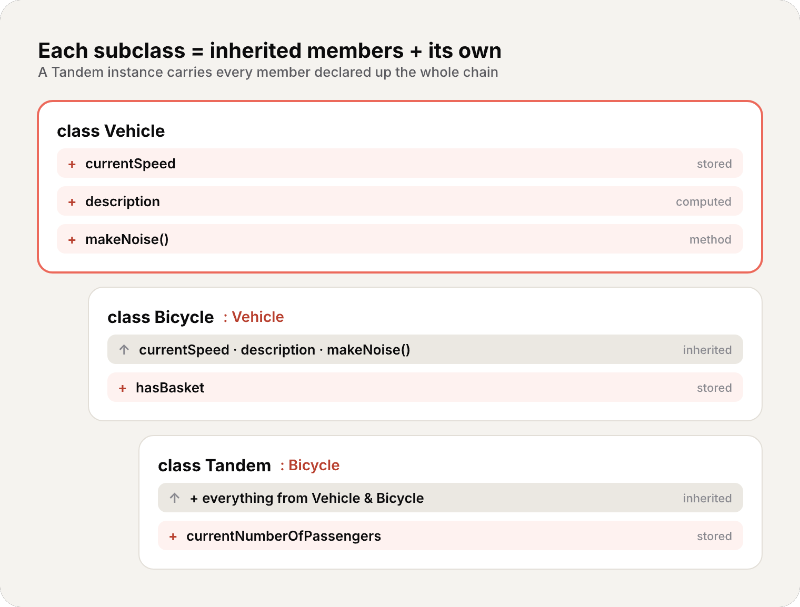
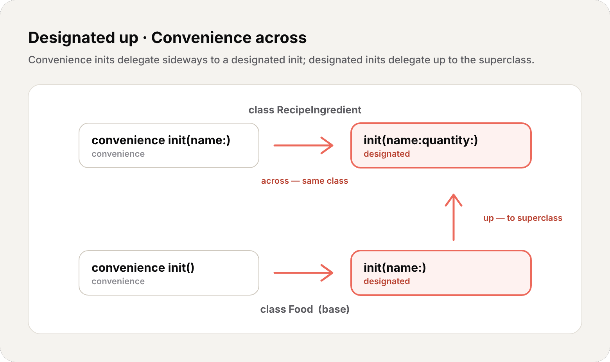

import Callout from '../../../../../components/Callout.astro';
import InfoBox from '../../../../../components/InfoBox.astro';

In the [previous article](/en/blog/swift-zero-expert-properties-methods-subscripts) we dissected properties, methods, and subscripts — the connective tissue of every type. Today we tackle the **lifecycle** of a class from birth to death: how it inherits from another class (**inheritance**), how it's brought to life (**initialization**), and how it's torn down (**deinitialization**).

This is a class-only story. Back in [#8](/en/blog/swift-zero-expert-structs-vs-classes) we learned that only classes have inheritance, identity, and `deinit`. Everything here flows from that one fact: a class instance lives on the **heap**, it can be built on top of another class, and Swift has to guarantee that every stored property — including the ones it inherits — has a valid value before you ever touch the object.

<div class="pull-quote">
Initialization isn't "running some setup code." It's a contract the compiler enforces: by the time `init` returns, every stored property holds a real value — no exceptions, no nil-by-accident.
</div>

## Inheritance: building on top of another class

<Callout type="info" title="Definition: Inheritance">
A class can **inherit** methods, properties, subscripts, and other characteristics from another class. The inheriting class is the **subclass**; the class it inherits from is the **superclass**. Inheritance is the one fundamental behavior that sets classes apart from structs and enums in Swift.
</Callout>

A class that doesn't inherit from anything is a **base class**. Unlike some languages, Swift has no universal root class — your base classes start clean:

```swift
class Vehicle {
    var currentSpeed = 0.0
    var description: String {
        "traveling at \(currentSpeed) miles per hour"
    }
    func makeNoise() {
        // do nothing — an arbitrary vehicle doesn't necessarily make a noise
    }
}

let someVehicle = Vehicle()
print(someVehicle.description)
// traveling at 0.0 miles per hour
```

To subclass, write the subclass name, a colon, then the superclass name. The subclass automatically gains everything the superclass has:

```swift
class Bicycle: Vehicle {
    var hasBasket = false
}

let bicycle = Bicycle()
bicycle.hasBasket = true
bicycle.currentSpeed = 15.0    // inherited from Vehicle
print(bicycle.description)     // also inherited
// traveling at 15.0 miles per hour
```

Subclasses can themselves be subclassed — the chain goes as deep as you want:

```swift
class Tandem: Bicycle {
    var currentNumberOfPassengers = 0
}
```

`Tandem` inherits from `Bicycle`, which inherits from `Vehicle`. A `Tandem` instance carries every property and method declared anywhere up that chain.



## Overriding: replacing inherited behavior

<Callout type="info" title="Definition: Overriding">
A subclass can provide its **own** implementation of an inherited method, property, subscript, or type method. This is **overriding**. You must prefix it with the `override` keyword — Swift checks that a matching declaration really exists in a superclass, so you can't override by accident or by typo.
</Callout>

```swift
class Train: Vehicle {
    override func makeNoise() {
        print("Choo Choo")
    }
}

let train = Train()
train.makeNoise()    // "Choo Choo"
```

That `override` keyword is doing real work. Remember from [#8](/en/blog/swift-zero-expert-structs-vs-classes): class methods use **dynamic dispatch** by default — at runtime, Swift consults the vtable to find which implementation to actually run. Overriding is precisely what makes that indirection meaningful: `Train`'s `makeNoise()` replaces `Vehicle`'s entry in the vtable for `Train` instances.

### Calling up with super

Sometimes you want to **extend** the superclass behavior rather than replace it outright. The `super` prefix reaches the superclass version of a method, property, or subscript:

```swift
class Car: Vehicle {
    var gear = 1
    override var description: String {
        super.description + " in gear \(gear)"
    }
}

let car = Car()
car.currentSpeed = 25.0
car.gear = 3
print(car.description)
// traveling at 25.0 miles per hour in gear 3
```

`Car` overrides the read-only computed property `description`, calls `super.description` to get the base text, then appends its own. You can override **any** inherited property with a custom getter (and setter, if appropriate) — a subclass can't tell whether the inherited property was stored or computed in the superclass; it only knows its name and type.

### Overriding observers on inherited properties

You can also bolt property observers onto an inherited property — even if you never declared the property yourself:

```swift
class AutomaticCar: Car {
    override var currentSpeed: Double {
        didSet {
            gear = Int(currentSpeed / 10.0) + 1
        }
    }
}

let automatic = AutomaticCar()
automatic.currentSpeed = 35.0
print(automatic.description)
// traveling at 35.0 miles per hour in gear 4
```

<Callout type="warning" title="What you can't override">
You can't add `willSet`/`didSet` to an inherited **constant** stored property or an inherited **read-only** computed property — there's nothing to observe because the value can't change. And you can't provide both a custom setter *and* an observer for the same property; if you already have a setter, observe the change from inside it.
</Callout>

### final: shutting the door

Mark a method, property, or subscript `final` to forbid overriding it. Mark the whole class `final` to forbid subclassing it entirely:

```swift
final class APIClient {
    func fetch() { /* ... */ }
}
// class CachedClient: APIClient {}  // ERROR — APIClient is final
```

As we saw in [#8](/en/blog/swift-zero-expert-structs-vs-classes), `final` isn't just a design tool — it's a **performance** tool. With no possible override, the compiler can drop the vtable lookup and use **static dispatch**, jumping straight to the code.

## Initialization: the contract

<Callout type="info" title="Definition: Initialization">
**Initialization** prepares an instance for use: it sets an initial value for **every** stored property and performs any one-time setup. You write this logic in **initializers** (`init`). Unlike Objective-C, Swift initializers don't return a value — their only job is to leave `self` fully and correctly initialized.
</Callout>

The iron rule: classes and structures **must** set all their stored properties to a valid value by the time initialization finishes. There's no "uninitialized" state you can read by accident.

```swift
struct Fahrenheit {
    var temperature: Double
    init() {
        temperature = 32.0
    }
}

var f = Fahrenheit()
print(f.temperature)   // 32.0
```

If a property has a default value in its declaration, you don't even need to set it in `init` — and structs you don't write an initializer for get a **memberwise** one for free, exactly as we saw in [#8](/en/blog/swift-zero-expert-structs-vs-classes). Classes never get a memberwise init, and now we're about to see why: **inheritance** makes class initialization a genuinely harder problem.

## Designated vs convenience initializers

Classes have **two kinds** of initializers, and the distinction is the heart of this whole chapter.

<Callout type="info" title="Definition: Designated Initializer">
A **designated initializer** is a primary initializer. It fully initializes **all** properties introduced by its class and calls a superclass initializer to continue the chain upward. Every class must have at least one (possibly inherited). These are the "funnel" points through which initialization flows.
</Callout>

<Callout type="info" title="Definition: Convenience Initializer">
A **convenience initializer** is a secondary, supporting initializer. It must call another initializer **from the same class**, eventually reaching a designated one. Use it as a shortcut — to provide default values or a friendlier API. You write it with the `convenience` modifier.
</Callout>

```swift
class Food {
    var name: String
    init(name: String) {              // designated
        self.name = name
    }
    convenience init() {              // convenience
        self.init(name: "[Unnamed]")
    }
}

let bacon = Food(name: "Bacon")   // name is "Bacon"
let mystery = Food()              // name is "[Unnamed]"
```

The convenience `init()` doesn't touch `name` directly — it **delegates across** to the designated `init(name:)`. That delegation is mandatory, and it's governed by three rules.

### The three delegation rules

<InfoBox title="Initializer delegation rules">
- **Rule 1** — A designated initializer must call a designated initializer from its **immediate superclass**.
- **Rule 2** — A convenience initializer must call another initializer from the **same class**.
- **Rule 3** — A convenience initializer must **ultimately** call a designated initializer.
</InfoBox>

The mnemonic the Swift book gives you is worth memorizing:

<div class="pull-quote">
Designated initializers always delegate <em>up</em>. Convenience initializers always delegate <em>across</em>.
</div>



## Two-phase initialization: under the hood

Here's the part that explains *why* all those rules exist. Class initialization in Swift runs in **two phases**, and the compiler enforces it.

<Callout type="info" title="Definition: Two-Phase Initialization">
In **phase 1**, every stored property is assigned an initial value, working **up** the chain from the subclass to the base class. Only once the entire object's storage is initialized does **phase 2** begin, working back **down**, letting each class customize the now-valid instance.
</Callout>

Why bother? Because of memory safety. A class instance occupies a single heap allocation holding the storage for **every** class in its chain. Until every one of those slots holds a real value, the object isn't fully formed — and reading `self` would mean reading uninitialized memory.

<Callout type="info" title="Objective-C did it differently">
In Objective-C, phase 1 just zeroes everything (`0` / `nil`). Swift's two-phase model is more flexible: it lets you supply real custom initial values, and it works for types where `0` or `nil` isn't a valid default at all (think a non-optional `let`).
</Callout>

The compiler enforces **four safety checks** to make this airtight:

<InfoBox title="The four safety checks">
- **Check 1** — A designated init must initialize all properties **its own class** introduces *before* delegating up to `super`.
- **Check 2** — A designated init must delegate up to `super` *before* assigning a value to an **inherited** property (otherwise `super` would overwrite it).
- **Check 3** — A convenience init must delegate to another initializer *before* assigning to **any** property.
- **Check 4** — No initializer can read instance properties, call instance methods, or use `self` as a value until **phase 1 is complete**.
</InfoBox>

Let's watch the phases unfold:

```swift
class Bicycle: Vehicle {
    var hasBasket: Bool
    init(hasBasket: Bool) {
        // PHASE 1: set my own property first (safety check 1)
        self.hasBasket = hasBasket
        // ...then delegate up (safety check 2)
        super.init()
        // PHASE 2: now self is valid — I may read/customize it (safety check 4)
        currentSpeed = 10.0   // inherited property, safe to touch now
    }
}
```


This ordering is exactly what Rules 1–3 guarantee. Phase 1 climbs to the top of the chain setting raw storage; phase 2 descends, and only now is `self` a real, usable object.

## Initializer inheritance and overriding

Here's a surprise if you come from Objective-C or Java: **Swift subclasses do not inherit their superclass initializers by default.** This prevents a specialized subclass from being created through a generic superclass initializer that leaves the subclass half-baked.

When you write a subclass initializer that matches a superclass **designated** initializer, you're overriding it — so you write `override`:

```swift
class Vehicle {
    var numberOfWheels = 0
    var description: String { "\(numberOfWheels) wheel(s)" }
    // gets a default initializer init() automatically
}

class Bicycle: Vehicle {
    override init() {
        super.init()           // delegate up first
        numberOfWheels = 2     // then customize inherited property
    }
}

print(Bicycle().description)   // "2 wheel(s)"
```

<Callout type="tip" title="When you can skip super.init()">
If your subclass init does no phase-2 customization and the superclass has a synchronous, zero-argument designated initializer, you may **omit** `super.init()` after assigning all your own stored properties — Swift inserts the implicit call for you. (If the superclass init is `async`, you must write `await super.init()` explicitly.)
</Callout>

### Automatic initializer inheritance

Subclasses **do** inherit superclass initializers automatically — but only when it's safe. Assuming you give default values to every new property your subclass introduces:

<InfoBox title="Automatic inheritance rules">
- **Rule 1** — If your subclass defines **no** designated initializers, it inherits **all** of the superclass's designated initializers.
- **Rule 2** — If your subclass implements **all** of the superclass's designated initializers (by inheriting them via Rule 1 *or* writing them), it also inherits **all** the superclass's convenience initializers.
</InfoBox>

This is why you so rarely have to write boilerplate initializers in practice. Here's the classic three-level hierarchy from the Swift book that ties it together:

```swift
class Food {
    var name: String
    init(name: String) { self.name = name }       // designated
    convenience init() { self.init(name: "[Unnamed]") }
}

class RecipeIngredient: Food {
    var quantity: Int
    init(name: String, quantity: Int) {           // designated
        self.quantity = quantity
        super.init(name: name)
    }
    override convenience init(name: String) {     // overrides Food's designated init
        self.init(name: name, quantity: 1)
    }
}

class ShoppingListItem: RecipeIngredient {
    var purchased = false   // default value, no init needed
    var description: String {
        "\(quantity) x \(name)" + (purchased ? " ✔" : " ✘")
    }
}
```

`RecipeIngredient` overrides `Food`'s designated `init(name:)` — as a **convenience** initializer this time — so it gets marked `override`. Because it now implements all of `Food`'s designated initializers, it automatically inherits `Food`'s convenience `init()`. And `ShoppingListItem` introduces only a defaulted property and no initializers, so it inherits **everything**:

```swift
let a = ShoppingListItem()                          // inherited convenience init()
let b = ShoppingListItem(name: "Bacon")             // inherited, quantity defaults to 1
let c = ShoppingListItem(name: "Eggs", quantity: 6) // inherited designated init
```

<Callout type="warning" title="override on a convenience init?">
Note the subtlety: you write `override` when you match a superclass **designated** initializer — *even if your version is a convenience init*. You do **not** write `override` when you match a superclass **convenience** initializer, because a subclass can never call a superclass convenience init directly, so it isn't truly an override.
</Callout>

## Failable initializers

Sometimes initialization should be allowed to **fail** — bad parameters, a missing resource, an invalid state. Write `init?` and `return nil` at the failure point. The result is an **optional** instance.

```swift
struct Animal {
    let species: String
    init?(species: String) {
        if species.isEmpty { return nil }
        self.species = species
    }
}

let giraffe = Animal(species: "Giraffe")   // Animal?  -> not nil
let nothing = Animal(species: "")          // Animal?  -> nil
```

<Callout type="info" title="init? doesn't really 'return'">
Strictly speaking, initializers never return a value — their job is to leave `self` valid. `return nil` is special syntax that signals *failure*; you never write `return` to signal *success*.
</Callout>

You've already used failable initializers without knowing it. Enums with raw values get `init?(rawValue:)` for free, and numeric conversions like `Int(exactly:)` are failable:

```swift
let pi = 3.14159
let n = Int(exactly: pi)   // nil — the value can't be preserved exactly
```

Failure **propagates**: if a failable init delegates to another failable init that fails, the whole process aborts immediately:

```swift
class Product {
    let name: String
    init?(name: String) {
        if name.isEmpty { return nil }
        self.name = name
    }
}

class CartItem: Product {
    let quantity: Int
    init?(name: String, quantity: Int) {
        if quantity < 1 { return nil }     // fail before delegating up
        self.quantity = quantity
        super.init(name: name)             // may also fail -> aborts whole init
    }
}

CartItem(name: "sock", quantity: 2)   // CartItem? -> not nil
CartItem(name: "shirt", quantity: 0)  // CartItem? -> nil (bad quantity)
CartItem(name: "", quantity: 1)       // CartItem? -> nil (superclass fails on name)
```

<Callout type="tip" title="Overriding direction">
You can override a failable `init?` with a **nonfailable** `init` (a subclass can be stricter and guarantee success), but **not** the other way around. There's also a rarely-used `init!` variant — you can safely ignore it for now; optionals are covered in #11.
</Callout>

## Required initializers

Mark an initializer `required` to force **every** subclass to implement it. Subclasses write `required` too (not `override`) to propagate the requirement down the chain:

```swift
class SomeClass {
    required init() {
        // ...
    }
}

class SomeSubclass: SomeClass {
    required init() {
        // subclass must provide this
    }
}
```

You can skip writing it explicitly if an inherited initializer already satisfies the requirement. `required` matters most for protocol conformance (protocols are coming later in the series) and factory-style APIs (code that creates instances for you from a base type) — where the type system needs a guarantee that the initializer exists on every concrete subclass.

## Deinitialization: the last act

<Callout type="info" title="Definition: Deinitializer">
A **deinitializer** (`deinit`) runs immediately **before** a class instance is deallocated. It takes no parameters, no parentheses, and there can be at most **one per class**. Deinitializers exist only on classes — value types don't have them.
</Callout>

This is the bookend to everything we've covered. Recall from [#8](/en/blog/swift-zero-expert-structs-vs-classes): classes live on the heap and are managed by **ARC** (Automatic Reference Counting). When the last reference to an object disappears — its reference count hits 0 — ARC deallocates it. Just before that happens, your `deinit` gets one final chance to clean up:

```swift
class FileHandle {
    let path: String
    init(path: String) {
        self.path = path
        print("Opened \(path)")
    }
    deinit {
        print("Closing \(path)")   // release the resource before deallocation
    }
}

var handle: FileHandle? = FileHandle(path: "/tmp/data")
// "Opened /tmp/data"
handle = nil
// "Closing /tmp/data"  — refcount hit 0, deinit ran, then memory freed
```

<Callout type="info" title="Who calls deinit?">
You **never** call a deinitializer yourself — ARC does, automatically, at the exact moment of deallocation. Superclass deinitializers are **inherited** and called automatically at the end of a subclass `deinit`, even if the subclass doesn't define one. And because the instance isn't freed *until after* `deinit` returns, you can still read every property inside it.
</Callout>

The Swift book's `Bank`/`Player` example shows why this matters — `deinit` returns a player's coins to the bank the instant they leave the game:

```swift
class Bank {
    static var coinsInBank = 10_000
    static func distribute(coins requested: Int) -> Int {
        let toVend = min(requested, coinsInBank)
        coinsInBank -= toVend
        return toVend
    }
    static func receive(coins: Int) { coinsInBank += coins }
}

class Player {
    var coinsInPurse: Int
    init(coins: Int) { coinsInPurse = Bank.distribute(coins: coins) }
    deinit { Bank.receive(coins: coinsInPurse) }   // return coins on the way out
}

var playerOne: Player? = Player(coins: 100)
print(Bank.coinsInBank)   // 9900
playerOne = nil           // deinit fires -> coins go back
print(Bank.coinsInBank)   // 10000
```

<div class="pull-quote">
`init` is the handshake that guarantees a valid object. `deinit` is the farewell that hands back what it borrowed. ARC decides when both happen — you decide what they do.
</div>

## Memory: the lifecycle in one picture


## Recap

- **Inheritance** — only classes have it; a subclass gains everything from its superclass and can add more
- **Overriding** — replace inherited behavior with `override`; the compiler verifies a real match exists
- **super** — reach the superclass version to extend rather than replace
- **final** — forbids overriding/subclassing; lets the compiler use static dispatch
- **Designated init** — fully initializes its class, delegates **up**
- **Convenience init** — a shortcut, delegates **across** to a designated init
- **Two-phase init** — phase 1 sets storage up the chain, phase 2 customizes down it; four safety checks enforce it
- **No automatic init inheritance** — except under the two automatic-inheritance rules
- **Failable init** — `init?` returns an optional; failure propagates through delegation
- **Required init** — every subclass must implement it
- **deinit** — runs just before ARC deallocates; superclass `deinit` always runs too

## What's next

In the next article we explore **Optionals & Optional Chaining** — Swift's billion-dollar-mistake antidote. We'll see how `Optional` is *just an enum* under the hood, what `?`, `!`, `if let`, `guard let`, and `??` really compile to, and why the type system forces you to confront the absence of a value head-on.

See you next week.

<div class="pull-quote">
A class isn't just data and methods — it's a lifecycle. Master init and deinit and you stop fighting ARC; you start designing with it.
</div>

## References

- [The Swift Programming Language — Inheritance](https://docs.swift.org/swift-book/documentation/the-swift-programming-language/inheritance)
- [The Swift Programming Language — Initialization](https://docs.swift.org/swift-book/documentation/the-swift-programming-language/initialization)
- [The Swift Programming Language — Deinitialization](https://docs.swift.org/swift-book/documentation/the-swift-programming-language/deinitialization)
- [The Swift Programming Language — Automatic Reference Counting](https://docs.swift.org/swift-book/documentation/the-swift-programming-language/automaticreferencecounting)
