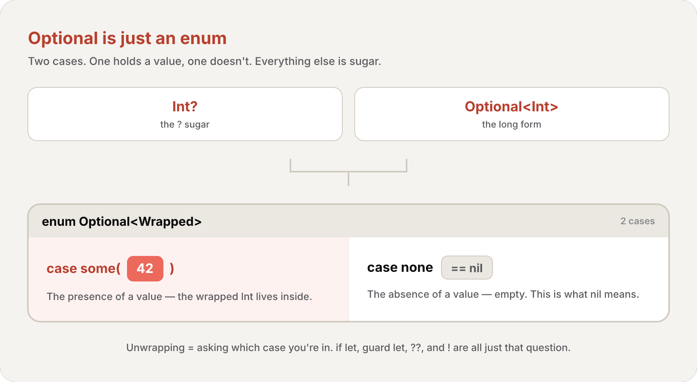

import Callout from '../../../../../components/Callout.astro';
import InfoBox from '../../../../../components/InfoBox.astro';

In the [previous article](/en/blog/swift-zero-expert-inheritance-initialization) we walked a class from birth to death — `init` guaranteeing a valid object, `deinit` handing back what it borrowed. We even saw a **failable initializer** (`init?`) hand you back an *optional* instance, and promised the full story here. This is that story.

Optionals are Swift's answer to the **billion-dollar mistake** — Tony Hoare's name for the null reference he invented in 1965, which has caused untold crashes ever since. Swift's fix isn't a clever runtime trick. It's a type. A value of type `Int` is *always* an integer. A value of type `Int?` is *either* an integer *or* nothing — and the type system won't let you forget the second possibility.

<div class="pull-quote">
An optional isn't a special language feature bolted onto types. It's <em>just an enum</em> with two cases — one that holds a value, one that doesn't. Everything else is syntax over that single idea.
</div>

## nil: the absence of a value

<Callout type="info" title="Definition: Optional">
An **optional** represents two possibilities: either there *is* a value of a given type, or there's no value at all. You write an optional type by adding a `?` to the wrapped type's name — `Int?` means "an `Int`, or nothing." The "nothing" is spelled `nil`.
</Callout>

You've already met optionals without naming them. A failable initializer returns one:

```swift
let possibleNumber = "123"
let convertedNumber = Int(possibleNumber)
// convertedNumber is of type "optional Int", or "Int?"
```

`Int(_:)` can't promise success — `"123"` converts cleanly, but `"hello"` doesn't — so it returns an `Int?` rather than an `Int`. To represent "no value," set an optional to `nil`:

```swift
var serverResponseCode: Int? = 404
serverResponseCode = nil
// serverResponseCode now contains no value
```

If you declare an optional variable without giving it a value, it's automatically set to `nil`:

```swift
var surveyAnswer: String?
// surveyAnswer is automatically set to nil
```

<Callout type="warning" title="nil is not a pointer">
Swift's `nil` is **not** the null pointer from C or Objective-C. It's not "address zero." It's the *absence* of a value — and crucially, only **optional** types can be `nil`. A non-optional `Int` can never be `nil`; the compiler rejects it outright. That single rule is what kills the billion-dollar mistake at compile time instead of at 3 a.m. in production.
</Callout>

## Under the hood: Optional is an enum

Here's the part the series exists for. `Optional` is not magic syntax — it's an ordinary generic enum in the standard library. `<Wrapped>` is a placeholder type that gets filled in with whatever you wrap — `Int?` is `Optional<Int>`, so `Wrapped` becomes `Int`. (Generics get their own article later; here you only need that `Optional<Int>` means "an Optional holding an Int".) Its declaration is essentially:

```swift
enum Optional<Wrapped> {
    case none           // the absence of a value — this is what `nil` means
    case some(Wrapped)  // the presence of a value, stored as Wrapped
}
```

The `?` you write is **pure sugar**: `Int?` is exactly `Optional<Int>`. `nil` is exactly `Optional.none`. Assigning a real value wraps it in `.some`. The two forms are interchangeable:

```swift
let shortForm: Int? = Int("42")
let longForm: Optional<Int> = Int("42")

let number: Int? = Optional.some(42)
let noNumber: Int? = Optional.none
print(noNumber == nil)   // true
```

Once you see this, every operator in this article stops being mysterious. Unwrapping an optional is *literally* the [enum pattern matching from #6](/en/blog/swift-zero-expert-enumerations) — asking "am I in the `.some` case, and if so, what's the associated value?" `if let`, `guard let`, `??`, and `!` are all just ergonomic ways to ask that one question.



## Forced unwrapping: the ! that can crash

If you're *certain* an optional holds a value, you can reach in and grab it with a trailing exclamation mark — **forced unwrapping**:

```swift
let possibleNumber = "123"
let convertedNumber = Int(possibleNumber)

if convertedNumber != nil {
    print("convertedNumber has an integer value of \(convertedNumber!).")
}
// convertedNumber has an integer value of 123.
```

`convertedNumber!` says "I know this isn't nil — give me the `Int` inside." In enum terms, it asserts you're in the `.some` case and returns the associated value.

<Callout type="warning" title="The ! is a promise you can break">
Forcing a `nil` optional **traps at runtime** — your program crashes. `let x = (nil as Int?)!` is an instant fatal error. The `!` is you telling the compiler "trust me," and the runtime holding you to it. Use it only when a `nil` would represent a genuine programmer bug you *want* to crash on; otherwise reach for the safe tools below.
</Callout>

## Optional binding: if let and guard let

<Callout type="info" title="Definition: Optional Binding">
**Optional binding** checks whether an optional contains a value and, if so, makes that value available as a temporary constant or variable — all in one step. You use it with `if let`, `guard let`, `while let`, and `switch`. It's the safe alternative to forced unwrapping.
</Callout>

The `if let` form unwraps into a new constant that's only in scope inside the `if` body:

```swift
let possibleNumber = "123"

if let actualNumber = Int(possibleNumber) {
    print("The string \"\(possibleNumber)\" has an integer value of \(actualNumber)")
} else {
    print("The string \"\(possibleNumber)\" couldn't be converted to an integer")
}
// The string "123" has an integer value of 123
```

If `Int(possibleNumber)` is `.some(value)`, `actualNumber` is bound to that value and the `if` branch runs. If it's `.none`, the `else` branch runs. The unwrapped `actualNumber` is a plain `Int` — no `?`, no `!`.

When the unwrapped constant would share the optional's name, you can use the **shorthand**: just write `if let name` with no `=`:

```swift
if let convertedNumber {
    // convertedNumber is now a non-optional Int, named the same as the optional
    print(convertedNumber)
}
```

You can bind several optionals (and add Boolean clauses) in one `if`, separated by commas. The whole thing succeeds only if *every* binding succeeds:

```swift
if let firstNumber = Int("4"), let secondNumber = Int("42"), firstNumber < secondNumber && secondNumber < 100 {
    print("\(firstNumber) < \(secondNumber) < 100")
}
// 4 < 42 < 100
```

### guard let: bind for the rest of the scope

`if let` binds inside its own little block. Often you want the opposite — unwrap once at the top of a function and use the value through the *rest* of the body. That's `guard let`:

```swift
func greet(_ name: String?) {
    guard let name else {
        print("No name provided")
        return
    }
    // name is a non-optional String from here to the end of the function
    print("Hello, \(name)!")
}
```

A `guard` *requires* its condition to be true to continue. If the binding fails, the `else` block runs and **must** exit the current scope (`return`, `break`, `throw`, etc.). The payoff: the unwrapped `name` stays in scope for everything after the `guard`, with no extra indentation. This is the [early-exit pattern from #5](/en/blog/swift-zero-expert-control-flow), applied to optionals.

<Callout type="tip" title="if let vs guard let — a rule of thumb">
Reach for **`if let`** when both branches matter — you genuinely do something whether or not the value is present. Reach for **`guard let`** when a missing value means "I can't proceed," because it unwraps for the rest of the scope and keeps your happy path un-indented.
</Callout>

## The ?? nil-coalescing operator

<Callout type="info" title="Definition: Nil-Coalescing Operator">
The **nil-coalescing operator** (`a ?? b`) unwraps an optional `a` if it contains a value, or returns a default `b` if `a` is `nil`. It's shorthand for `a != nil ? a! : b`, but without the unsafe forced unwrap.
</Callout>

```swift
let defaultColorName = "red"
var userDefinedColorName: String?   // defaults to nil

var colorNameToUse = userDefinedColorName ?? defaultColorName
// userDefinedColorName is nil, so colorNameToUse is set to "red"
```

The right-hand side `b` must match the type of the *unwrapped* `a`. Here `userDefinedColorName` is `String?` and `defaultColorName` is `String`, so the result is a non-optional `String`.

<Callout type="info" title="?? short-circuits — the default is lazy">
The default expression is marked `@autoclosure` in the standard library, which means **it's only evaluated if the left side is `nil`**. So `expensiveDefault()` in `maybe ?? expensiveDefault()` never runs when `maybe` has a value. That's the same short-circuiting you get from `&&` and `||`.
</Callout>

Because `??` can take another optional on its right, you can chain it to express "try this, then that, then fall back":

```swift
let imagePaths = ["star": "/glyphs/star.png"]
let defaultImagePath = "/images/default.png"

let shapePath = imagePaths["cir"] ?? imagePaths["squ"] ?? defaultImagePath
print(shapePath)
// /images/default.png  — both lookups failed, so the final default wins
```

## Implicitly unwrapped optionals

<Callout type="info" title="Definition: Implicitly Unwrapped Optional">
An **implicitly unwrapped optional** is an optional written with `!` instead of `?` after the type (`String!`). It's still an optional — it can be `nil` — but Swift unwraps it *automatically* every time you use it, as if the `!` were already there. It's for values that start out `nil` but are guaranteed to have a value by the time you read them.
</Callout>

The motivating case: a value that's `nil` for a brief window during setup, then permanently non-`nil` afterward. Writing `?` and unwrapping it on every single access would be pure noise.

```swift
let possibleString: String? = "An optional string."
let forcedString: String = possibleString!   // requires an explicit !

let assumedString: String! = "An implicitly unwrapped optional string."
let implicitString: String = assumedString   // no ! needed — unwrapped automatically
```

You can still treat an implicitly unwrapped optional like a normal optional — check it against `nil`, bind it with `if let`. But every plain *use* of it forces an unwrap behind the scenes:

```swift
if assumedString != nil {
    print(assumedString!)
}

if let definiteString = assumedString {
    print(definiteString)
}
```

<Callout type="warning" title="It still crashes if it's nil">
An implicitly unwrapped optional is a forced unwrap on *every* access. If `assumedString` is `nil` when you use it as a plain `String`, you trap — exactly like writing `!`. Use it only when a value is genuinely guaranteed to exist after some initial setup (Interface Builder outlets are the classic example). When in doubt, use a normal optional.
</Callout>

## Optional chaining: querying through nil

We've spent the chapter unwrapping a *single* optional. But real models nest — a `Person` has an optional `Residence`, which has an optional `Address`, which has an optional `street`. **Optional chaining** lets you reach down through all of them in one expression, failing gracefully the moment any link is `nil`.

<Callout type="info" title="Definition: Optional Chaining">
**Optional chaining** is a process for querying and calling properties, methods, and subscripts on an optional that might currently be `nil`. If the optional holds a value, the call succeeds; if it's `nil`, the whole call returns `nil`. You write it by placing a `?` after the optional value. Multiple queries chain together, and the entire chain **fails gracefully** if any link is `nil`.
</Callout>

Optional chaining is the *safe* sibling of forced unwrapping. Where `!` traps on `nil`, `?` returns `nil`. Start with two simple classes:

```swift
class Person {
    var residence: Residence?
}

class Residence {
    var numberOfRooms = 1
}
```

A fresh `Person` has `residence == nil` (optionals default to `nil`). Forcing through it crashes:

```swift
let john = Person()
let roomCount = john.residence!.numberOfRooms
// this triggers a runtime error — residence is nil
```

Swap the `!` for `?` and the call **fails gracefully** instead, returning `nil`:

```swift
if let roomCount = john.residence?.numberOfRooms {
    print("John's residence has \(roomCount) room(s).")
} else {
    print("Unable to retrieve the number of rooms.")
}
// Unable to retrieve the number of rooms.
```

<Callout type="info" title="The result is ALWAYS optional">
Here's the crucial rule. `numberOfRooms` is a non-optional `Int`. But accessed through `john.residence?`, the result is an `Int?`. **Optional chaining always wraps the result in an optional**, because the access itself might fail. That's why we unwrap it with `if let` above. A property that returns `T` returns `T?` through a chain.
</Callout>


### Chaining multiple levels deep

You can chain as deep as your model goes. Add an `Address` with an optional `street`:

```swift
class Residence {
    var rooms: [Room] = []
    var numberOfRooms: Int { rooms.count }
    subscript(i: Int) -> Room { rooms[i] }
    var address: Address?
}

class Room {
    let name: String
    init(name: String) { self.name = name }
}

class Address {
    var street: String?
}
```

Now reach through *two* optional links at once:

```swift
if let johnsStreet = john.residence?.address?.street {
    print("John's street name is \(johnsStreet).")
} else {
    print("Unable to retrieve the address.")
}
// Unable to retrieve the address.
```

<Callout type="info" title="Chaining doesn't stack optionals">
Two levels of chaining don't give you an `Int??`. The rule: if the value you're retrieving *isn't* optional, chaining makes it optional; if it's *already* optional, chaining doesn't make it *more* optional. `street` is a `String?`, and `john.residence?.address?.street` is still just `String?` — the chain **flattens**.
</Callout>

### Chaining on subscripts and methods

The `?` goes *before* a subscript's brackets — it always follows immediately after the optional part of the expression:

```swift
if let firstRoomName = john.residence?[0].name {
    print("The first room name is \(firstRoomName).")
} else {
    print("Unable to retrieve the first room name.")
}
// Unable to retrieve the first room name.
```

Calling a method through a chain works even for methods that return nothing. A `Void`-returning method becomes `Void?` through a chain — and comparing that against `nil` tells you whether the call actually happened:

```swift
if john.residence?.printNumberOfRooms() != nil {
    print("It was possible to print the number of rooms.")
} else {
    print("It was not possible to print the number of rooms.")
}
// It was not possible to print the number of rooms.
```

The same trick works for **setting** through a chain. The assignment returns `Void?`; if the chain was `nil`, nothing on the right-hand side is even evaluated:

```swift
let someAddress = Address()
john.residence?.address = someAddress
// residence is nil, so someAddress is never assigned — and the chain silently no-ops
```

<div class="pull-quote">
Forced unwrapping says "this is never nil — crash if I'm wrong." Optional chaining says "this might be nil — and that's fine, just give me nil back." Same `?`/`!` duality, all the way down.
</div>

## Recap


- **Optional** — a value that's either present (`.some`) or absent (`.none` / `nil`); written `T?`, which is exactly `Optional<T>`
- **Under the hood** — `Optional` is *just an enum* with two cases; every unwrap is enum pattern matching
- **nil** — the absence of a value, *not* a null pointer; only optionals can be `nil`
- **Forced unwrapping (`!`)** — grabs the value but **traps** if `nil`; a promise you can break
- **Optional binding (`if let` / `guard let`)** — safely unwrap into a non-optional constant; `guard let` keeps it in scope for the rest of the body
- **Nil-coalescing (`??`)** — unwrap-or-default; the default is lazy (`@autoclosure`) and short-circuits
- **Implicitly unwrapped (`T!`)** — an optional unwrapped automatically on every use; still crashes if `nil`
- **Optional chaining (`?`)** — query through nested optionals; the result is **always** optional and the chain **flattens** and **fails gracefully**

## What's next

In the next article we explore [**Error Handling**](/en/blog/swift-zero-expert-error-handling) — `throws`, `try`, `do`/`catch`, and `Result`. We'll see how Swift draws a sharp line between an *expected* absence of a value (an optional) and an *expected failure with a reason* (a thrown error), and why `try?` quietly turns one into the other.

See you next week.

<div class="pull-quote">
The billion-dollar mistake wasn't null itself — it was making *every* reference nullable by default. Swift's fix is to make absence visible in the type. Once you internalize "an optional is just an enum," nil stops being scary and starts being honest.
</div>

## References

- [The Swift Programming Language — The Basics (Optionals)](https://docs.swift.org/swift-book/documentation/the-swift-programming-language/thebasics#Optionals)
- [The Swift Programming Language — Optional Chaining](https://docs.swift.org/swift-book/documentation/the-swift-programming-language/optionalchaining)
- [Swift Standard Library — Optional](https://developer.apple.com/documentation/swift/optional)
