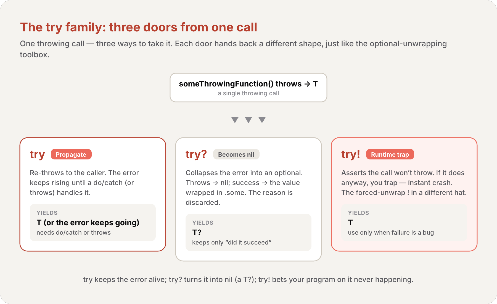
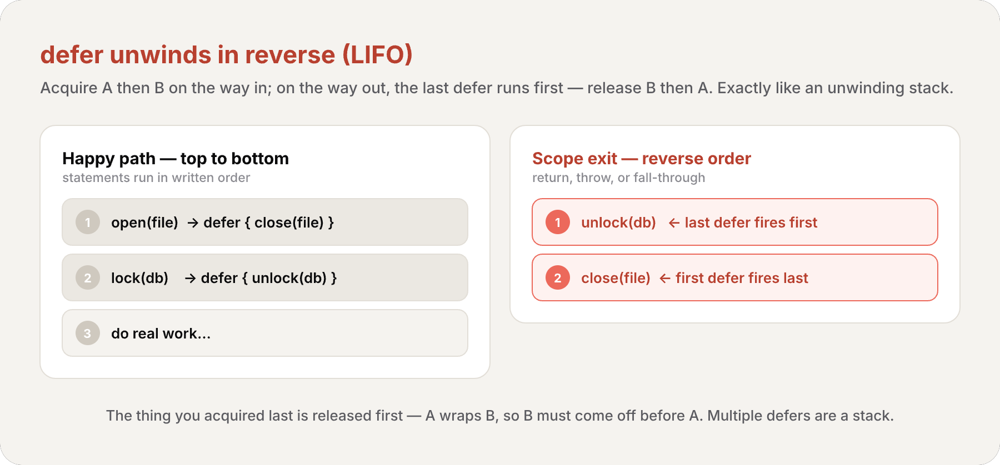

import Callout from '../../../../../components/Callout.astro';
import InfoBox from '../../../../../components/InfoBox.astro';

In the [previous article](/en/blog/swift-zero-expert-optionals) we drew a line: an optional is Swift's way of saying "there might be **no value here**." But absence isn't always the whole story. When `Int("hello")` returns `nil`, you know it failed — but you don't know *why*. For a string-to-int conversion, "it didn't parse" is enough. For "open this file," it isn't: did the file not exist? Was it locked? Corrupt? **Error handling** is the half of the story optionals leave out — an *expected failure, with a reason attached*.

And just like an optional turned out to be *just an enum*, an error turns out to be *just a value*. There's no special exception object, no magic runtime unwinding the stack. A Swift error is a value of a type that conforms to one empty protocol — and `throw`, `try`, and `catch` are the plumbing that routes that value from where it happened to where you handle it.

<div class="pull-quote">
Swift errors aren't exceptions. Throwing an error has the performance characteristics of a <em>return</em>, not a stack-unwinding catastrophe. An error is a value that travels up the call chain — nothing more exotic than that.
</div>

## The Error protocol: errors are values

<Callout type="info" title="Definition: The Error Protocol">
In Swift, errors are represented by values of types that conform to the **`Error`** protocol. `Error` is an **empty** protocol — it has no requirements. Conforming to it is simply a marker that says "a value of this type can be thrown and caught as an error."
</Callout>

Because `Error` has no requirements, *any* type can be an error. But [enumerations from #6](/en/blog/swift-zero-expert-enumerations) are the natural fit: a group of related failure conditions is exactly a set of cases, and associated values let each case carry extra detail about what went wrong.

```swift
enum VendingMachineError: Error {
    case invalidSelection
    case insufficientFunds(coinsNeeded: Int)
    case outOfStock
}
```

`insufficientFunds` doesn't just say "not enough money" — it carries *how many more coins* are needed. That's the whole point of an error over a bare `nil`: it answers **why**, not just **whether**.

To signal a failure, you `throw` one of these values:

```swift
throw VendingMachineError.insufficientFunds(coinsNeeded: 5)
```

A `throw` statement transfers control immediately, exactly like `return` — except instead of handing a value *back* to the caller, it hands an error value *up* the chain until someone catches it.

## throws: marking a function that can fail

<Callout type="info" title="Definition: Throwing Function">
A function, method, or initializer that can throw an error is a **throwing function**. You mark it by writing `throws` after its parameter list (and *before* the return arrow `->`, if there is one). A throwing function **propagates** any error thrown inside it up to the code that called it.
</Callout>

```swift
func canThrowErrors() throws -> String

func cannotThrowErrors() -> String
```

The `throws` keyword is a contract, enforced by the compiler in both directions. Inside the function, you're *allowed* to `throw`. Outside, every caller is *forced* to acknowledge that it might.

<Callout type="warning" title="Only throwing functions propagate">
Errors don't leak. Any error thrown inside a **nonthrowing** function must be handled *inside* that function — the compiler won't let it escape. If you want an error to travel further up, the function has to advertise it with `throws`. There's no silent propagation, and no "unchecked" escape hatch.
</Callout>

Here's the canonical example from the Swift book — a vending machine whose `vend` method uses [the early-exit `guard` from #5](/en/blog/swift-zero-expert-control-flow) to throw the right error the moment a precondition fails:

```swift
struct Item {
    var price: Int
    var count: Int
}

class VendingMachine {
    var inventory = [
        "Candy Bar": Item(price: 12, count: 7),
        "Chips": Item(price: 10, count: 4),
        "Pretzels": Item(price: 7, count: 11),
    ]
    var coinsDeposited = 0

    func vend(itemNamed name: String) throws {
        guard let item = inventory[name] else {
            throw VendingMachineError.invalidSelection
        }
        guard item.count > 0 else {
            throw VendingMachineError.outOfStock
        }
        guard item.price <= coinsDeposited else {
            throw VendingMachineError.insufficientFunds(coinsNeeded: item.price - coinsDeposited)
        }

        coinsDeposited -= item.price
        var newItem = item
        newItem.count -= 1
        inventory[name] = newItem
        print("Dispensing \(name)")
    }
}
```

Because a `throw` immediately transfers control, the item is vended **only** if every `guard` passes. The happy path stays flat and un-indented; the failures peel off at the top.

## try: the visible cost of calling a thrower

You can't call a throwing function silently. Every call to one must be marked with `try` — a keyword that makes the *possibility of failure visible at the call site*.

```swift
let favoriteSnacks = [
    "Alice": "Chips",
    "Bob": "Licorice",
    "Eve": "Pretzels",
]

func buyFavoriteSnack(person: String, vendingMachine: VendingMachine) throws {
    let snackName = favoriteSnacks[person] ?? "Candy Bar"
    try vendingMachine.vend(itemNamed: snackName)
}
```

`buyFavoriteSnack` doesn't *handle* the error — it has no `do`/`catch`. So it must itself be `throws`, and the error from `vend` flows straight through it to *its* caller. That's **propagation**: an error rises through every `try` in its path until some scope decides to stop it.

Throwing **initializers** propagate the same way — useful when [the init contract from #10](/en/blog/swift-zero-expert-inheritance-initialization) can't be satisfied because a dependency failed:

```swift
struct PurchasedSnack {
    let name: String
    init(name: String, vendingMachine: VendingMachine) throws {
        try vendingMachine.vend(itemNamed: name)
        self.name = name
    }
}
```


<div class="pull-quote">
Every <code>try</code> is an admission: "the call I'm about to make might not finish normally." Swift refuses to hide that from you — propagation is always spelled out, one <code>try</code> at a time.
</div>

## do / catch: stopping the error

The four ways to handle a thrown error are: propagate it (we just saw that), turn it into an optional, assert it can't happen, or — the workhorse — catch it with `do`/`catch`.

<Callout type="info" title="Definition: do-catch">
A **`do`-`catch`** statement runs a block of code (the `do` clause) that may throw. If an error is thrown, execution jumps immediately to the `catch` clauses, which are matched against the error in order — the first matching pattern handles it. If no error is thrown, the `catch` clauses are skipped entirely.
</Callout>

The general shape lets you match specific errors, add `where` conditions, group patterns with commas, and end with a catch-all:

```swift
var vendingMachine = VendingMachine()
vendingMachine.coinsDeposited = 8
do {
    try buyFavoriteSnack(person: "Alice", vendingMachine: vendingMachine)
    print("Success! Yum.")
} catch VendingMachineError.invalidSelection {
    print("Invalid Selection.")
} catch VendingMachineError.outOfStock {
    print("Out of Stock.")
} catch VendingMachineError.insufficientFunds(let coinsNeeded) {
    print("Insufficient funds. Please insert an additional \(coinsNeeded) coins.")
} catch {
    print("Unexpected error: \(error).")
}
// Insufficient funds. Please insert an additional 2 coins.
```

Notice `catch VendingMachineError.insufficientFunds(let coinsNeeded)` — this is [enum pattern matching from #6](/en/blog/swift-zero-expert-enumerations) again, binding the associated value right out of the caught error. And the final bare `catch` is special:

<Callout type="info" title="The bare catch binds 'error'">
A `catch` clause with **no pattern** matches *any* error and binds it to a local constant automatically named **`error`**. It's the default case of error handling — the safety net that catches whatever the specific clauses missed. You don't declare `error`; Swift gives it to you.
</Callout>

### Partial handling and re-propagation

The `catch` clauses **don't** have to handle every possible error. If none of them match, the error keeps propagating to the surrounding scope — which then bears the same responsibility. You can catch by *type* with the `is` pattern, handling a whole family at once and letting everything else pass through:

```swift
func nourish(with item: String) throws {
    do {
        try vendingMachine.vend(itemNamed: item)
    } catch is VendingMachineError {
        print("Couldn't buy that from the vending machine.")
    }
}

do {
    try nourish(with: "Beet-Flavored Chips")
} catch {
    print("Unexpected non-vending-machine-related error: \(error)")
}
// Couldn't buy that from the vending machine.
```

Or list several related errors after a single `catch`, separated by commas:

```swift
func eat(item: String) throws {
    do {
        try vendingMachine.vend(itemNamed: item)
    } catch VendingMachineError.invalidSelection,
            VendingMachineError.insufficientFunds,
            VendingMachineError.outOfStock {
        print("Invalid selection, out of stock, or not enough money.")
    }
}
```

<Callout type="warning" title="An unhandled error at the top is a crash">
The propagated error must be handled by *some* surrounding scope. In a nonthrowing function, an enclosing `do`-`catch` must handle it. In a throwing function, either an enclosing `do`-`catch` *or* the caller must. If an error propagates all the way to the top-level scope without being caught, you get a **runtime error** — your program crashes.
</Callout>

## try? and try!: collapsing an error into an optional (or a crash)

Sometimes you don't want a `do`/`catch` ceremony. Two variants of `try` shrink the whole thing to a single keyword — and this is exactly the bridge back to [last chapter's optionals](/en/blog/swift-zero-expert-optionals) we promised.

<Callout type="info" title="Definition: try?">
**`try?`** handles an error by converting it to an optional. If the expression throws, the result is `nil`; otherwise it's the returned value wrapped in `.some`. A throwing call that returns `T` becomes a `T?` under `try?` — the error's *reason* is discarded, leaving only "did it succeed."
</Callout>

```swift
func someThrowingFunction() throws -> Int {
    // ...
}

let x = try? someThrowingFunction()

// x behaves exactly like y below:
let y: Int?
do {
    y = try someThrowingFunction()
} catch {
    y = nil
}
```

This is `try?`'s entire personality: it throws away the *why* and keeps only the *whether*, turning an error back into the `nil` we started the last chapter with. It shines when you want to try several approaches and fall back, leaning on [the if-let binding from #11](/en/blog/swift-zero-expert-optionals):

```swift
func fetchData() -> Data? {
    if let data = try? fetchDataFromDisk() { return data }
    if let data = try? fetchDataFromServer() { return data }
    return nil
}
```

The reckless sibling is `try!`:

<Callout type="warning" title="try! is the ! all over again">
**`try!`** disables error propagation and wraps the call in a runtime assertion that *no error will be thrown*. If one is thrown anyway, you **trap** — instant crash. It's the [forced unwrap `!` from #11](/en/blog/swift-zero-expert-optionals) wearing a different hat: a promise to the compiler that the runtime will hold you to. Use it only when a failure would be a genuine programmer bug, like loading a resource you ship inside the app:
</Callout>

```swift
let photo = try! loadImage(atPath: "./Resources/John Appleseed.jpg")
```



## defer: cleanup that always runs

You open a file, you must close it. You acquire a lock, you must release it. The problem: between acquire and release, *anything* might `throw` — and an early exit would skip your cleanup. `defer` solves this.

<Callout type="info" title="Definition: defer">
A **`defer`** statement schedules a block of code to run *just before* execution leaves the current scope — **no matter how** it leaves: a normal fall-through, a `return`, a `break`, or a thrown error. It's how you guarantee cleanup happens on every path out.
</Callout>

```swift
func processFile(filename: String) throws {
    if exists(filename) {
        let file = open(filename)
        defer {
            close(file)
        }
        while let line = try file.readline() {
            // Work with the file.
        }
        // close(file) runs here, at the end of the scope —
        // and just as reliably if file.readline() throws.
    }
}
```

The `try file.readline()` might throw mid-loop. Without `defer`, the `close(file)` after the loop would be skipped on that path. With it, `close(file)` is guaranteed to run on the way out — error or no error.

<Callout type="info" title="defer runs in reverse order">
If a scope has multiple `defer` statements, they run in the **reverse** of the order written — last `defer` first, first `defer` last. This mirrors how resources nest: the thing you acquired last is the thing you release first, exactly like an unwinding stack. A deferred block can't itself transfer control out (no `break`, `return`, or `throw` inside it).
</Callout>



## rethrows: throwing only if your closure does

Consider a function that takes a closure and calls it — like `map`. Should it be `throws`? Only if the closure you hand it throws. If you pass a non-throwing closure, the function can't possibly fail, and forcing a `try` on every call would be noise. `rethrows` expresses exactly this conditional contract.

<Callout type="info" title="Definition: rethrows">
A function marked **`rethrows`** throws *only if* one of its **closure arguments** throws. Called with a non-throwing closure, it's treated as non-throwing (no `try` needed). Called with a throwing closure, it's treated as throwing (a `try` is required). The function's own body may only `throw` by propagating from one of those closures.
</Callout>

```swift
func transform(_ value: Int, using f: (Int) throws -> Int) rethrows -> Int {
    try f(value)
}

// non-throwing closure -> no try needed:
let doubled = transform(21) { $0 * 2 }

// throwing closure -> try required:
let parsed = try transform(21) { try riskyTransform($0) }
```

This is why standard-library higher-order functions on collections — `map`, `filter`, `reduce`, the ones we met with [closures in #7](/en/blog/swift-zero-expert-closures) — are `rethrows`. They stay invisible when your closure is pure, and become throwing the moment you hand them work that can fail.

## Result: an error you can hold and pass around

`throw`/`try`/`catch` route an error *through control flow* — it happens, it propagates, you catch it, it's gone. But sometimes you need to *store* the outcome of a fallible operation as an ordinary value: to hand it to a completion callback, stash it, compare it, or transform it later. That's `Result`.

<Callout type="info" title="Definition: Result">
**`Result<Success, Failure>`** is a standard-library enum with two cases — `success(Success)` and `failure(Failure)` — where `Failure` conforms to `Error`. It's a first-class *value* representing "either a value or an error," the same way `Optional` is a value representing "either a value or nothing."
</Callout>

Stripped down, it's an enum you could almost have written yourself:

```swift
enum Result<Success, Failure> where Failure: Error {
    case success(Success)
    case failure(Failure)
}
```

You consume it with [the same `switch` pattern matching from #6](/en/blog/swift-zero-expert-enumerations):

```swift
func loadConfig() -> Result<Config, ConfigError> { /* ... */ }

switch loadConfig() {
case .success(let config):
    print("Loaded \(config).")
case .failure(let error):
    print("Failed: \(error).")
}
```

The bridge between the two worlds — thrown errors and stored results — is built right into the type. The `init(catching:)` initializer runs a throwing closure and *captures* the outcome into a `Result`; `get()` does the reverse, *re-throwing* the stored error if there is one:

```swift
// throwing world -> value world:
let result = Result { try someThrowingFunction() }
// result is Result<Int, any Error>

// value world -> throwing world:
do {
    let value = try result.get()   // returns the success, or re-throws the failure
    print(value)
} catch {
    print("Got error: \(error)")
}
```

Here `any Error` means "some value whose concrete type conforms to `Error`, decided at runtime" — the `any` keyword signals type erasure; we'll meet it properly with protocols in #13.

<Callout type="info" title="Result is the value form of try">
`throw`/`try` is error handling as **control flow** — the failure moves through your code. `Result` is error handling as **data** — the failure sits in a value you can store, pass, and `map` over. `Result { try f() }` and `result.get()` are the two doors between them. `Result` even uses [typed throws](#typed-throws-naming-the-error) in its modern signatures: `init(catching:)` is `init(catching: () throws(Failure) -> Success)` and `get()` is `func get() throws(Failure) -> Success`.
</Callout>

## Typed throws: naming the error

Everything so far type-erases the error. A plain `throws` function can throw *any* `Error` — at a `catch`, all you statically know is "some error," which is why you reach for a catch-all. Most of the time that's the right default: new library versions throw new errors, and you don't want to know every one ahead of time.

But occasionally you *can* enumerate every failure — a small library, an embedded system, a closure that only forwards a known error — and you'd like the compiler to hold you to it. **Typed throws** (Swift 6) lets you name the exact error type.

<Callout type="info" title="Definition: Typed Throws">
Writing **`throws(SomeError)`** instead of plain `throws` declares that a function throws *only* values of type `SomeError`. The compiler then verifies you never throw anything else, and a `catch` on that function sees a concretely-typed error rather than `any Error`. Plain `throws` is exactly shorthand for `throws(any Error)`.
</Callout>

```swift
enum StatisticsError: Error {
    case noRatings
    case invalidRating(Int)
}

func summarize(_ ratings: [Int]) throws(StatisticsError) {
    guard !ratings.isEmpty else { throw .noRatings }

    var counts = [1: 0, 2: 0, 3: 0]
    for rating in ratings {
        guard rating > 0 && rating <= 3 else { throw .invalidRating(rating) }
        counts[rating]! += 1
    }
    print("*", counts[1]!, "-- **", counts[2]!, "-- ***", counts[3]!)
}
```

Two payoffs are visible already. First, because the error type is fixed, you can write the **shorthand** `throw .noRatings` instead of `throw StatisticsError.noRatings` — Swift infers the type. Second, if you tried to `throw VendingMachineError.outOfStock` from inside `summarize`, it would **fail at compile time**: that's not the declared error type.

A typed-throws function slots cleanly into the untyped world — `StatisticsError` is a valid `any Error`:

```swift
func someThrowingFunction() throws {            // i.e. throws(any Error)
    let ratings = [1, 2, 3, 2, 2, 1]
    try summarize(ratings)
}
```

You can type a `do`-`catch` too. The reward is an **exhaustive, type-safe** catch — the caught `error` is a concrete `StatisticsError`, so you can `switch` over it with no catch-all:

```swift
let ratings: [Int] = []
do throws(StatisticsError) {
    try summarize(ratings)
} catch {
    switch error {          // error is a StatisticsError, not any Error
    case .noRatings:
        print("No ratings available")
    case .invalidRating(let rating):
        print("Invalid rating: \(rating)")
    }
}
// No ratings available
```

<Callout type="tip" title="Add a case, get a compile error — on purpose">
Because `error` is concretely typed, the `switch` must be **exhaustive**. Add a new case to `StatisticsError` later and forget to handle it, and the compiler flags the now-incomplete `switch`. That's the whole appeal of typed throws for a self-contained library: new failures can't slip through silently. Swift even *infers* typed throws when a `do` block throws only one error type, so the explicit `do throws(StatisticsError)` above is often optional.
</Callout>

<Callout type="info" title="throws(Never): a function that can't throw">
There's one more corner. `Never` is Swift's empty type — a type with no possible values, so a function returning it can never actually return, and nothing can ever be thrown as a `Never`. A function declared **`throws(Never)`** can therefore never throw — because you can't create a value of type `Never` to throw. It's the type-level proof of "this is non-throwing," and it's how typed throws unifies throwing and non-throwing functions under one syntax.
</Callout>

<div class="pull-quote">
Plain <code>throws</code> says "something might go wrong — I won't promise what." <code>throws(E)</code> says "only an <code>E</code> can go wrong, and the compiler will hold me to it." <code>throws(Never)</code> says "nothing can." Three precise points on one dial.
</div>

## Recap


- **Error protocol** — errors are *values* of types conforming to the empty `Error` protocol; enums with associated values are the natural fit
- **throw** — transfers control immediately, like `return`, but hands an error *up* the chain; as cheap as a return, not an exception
- **throws** — marks a function that can fail; only throwing functions propagate, and callers *must* acknowledge with `try`
- **try / try? / try!** — `try` propagates; `try?` converts the error to `nil` (a `T?`); `try!` asserts no error and traps if wrong
- **do / catch** — stops a thrown error; bare `catch` binds `error`; clauses can match by pattern, by `is` type, or by comma-separated lists; an unhandled error at top level crashes
- **defer** — cleanup that runs on *every* exit path; multiple defers run in reverse order
- **rethrows** — throws only if a closure argument throws; how `map`/`filter`/`reduce` stay non-throwing for pure closures
- **Result&lt;Success, Failure&gt;** — error handling as a stored *value*; `Result { try f() }` captures, `get()` re-throws
- **Typed throws** — `throws(E)` names the exact error type for compile-time exhaustiveness; plain `throws` is `throws(any Error)`; `throws(Never)` can't throw

## What's next

In the next article we explore **Protocols** — the contracts that let unrelated types share an interface without sharing a superclass. We've leaned on one already: `Error` is a protocol, and conforming to it is what made our enums throwable. Next we'll see how protocols define requirements, how types adopt them, and why protocol-oriented design is the backbone of idiomatic Swift.

See you next week.

<div class="pull-quote">
An optional answered "is there a value?" An error answers "and if not, why not?" Together they cover the two honest failure modes of any operation — and neither one is magic. One is an enum with two cases; the other is a value routed up your call stack. Once you see that, error handling stops being scary and starts being just another shape your data can take.
</div>

## References

- [The Swift Programming Language — Error Handling](https://docs.swift.org/swift-book/documentation/the-swift-programming-language/errorhandling)
- [Swift Evolution — SE-0413: Typed throws](https://github.com/swiftlang/swift-evolution/blob/main/proposals/0413-typed-throws.md)
- [Swift Standard Library — Result](https://developer.apple.com/documentation/swift/result)
- [Swift Standard Library — Error](https://developer.apple.com/documentation/swift/error)
