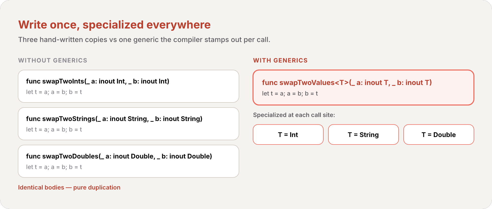

import Callout from '../../../../../components/Callout.astro';
import InfoBox from '../../../../../components/InfoBox.astro';

At the end of [#13](/en/blog/swift-zero-expert-protocols) we left a promise. `any Shape` and `[any TextRepresentable]` *boxed* their values at a runtime cost, and we said the answer was **generics** — where the *caller* picks one concrete type, the compiler specializes the code, and the box disappears. We've also been quietly using generics for chapters: `Array<Element>`, `Dictionary<Key, Value>`, `Optional<Wrapped>`, and `Result<Success, Failure>` are *all* generic types. Every `[Int]` you wrote was `Array<Int>`. This article is where that machinery finally gets its name.

Generics let you write **flexible, reusable** functions and types that work with *any* type, subject to requirements you define — without duplication, and without erasing type information the way `any` does. They're one of the most powerful features of Swift, and much of the standard library is built with them.

<div class="pull-quote">
<code>any</code> hides the concrete type behind a box and pays for it at runtime. A generic keeps the concrete type — the caller names it, the compiler bakes it in. Same flexibility, no box. That's the trade the whole chapter turns on.
</div>

## The problem generics solve

Here's a perfectly ordinary, *nongeneric* function that swaps two `Int` values using [the in-out parameters from #6](/en/blog/swift-zero-expert-functions):

```swift
func swapTwoInts(_ a: inout Int, _ b: inout Int) {
    let temporaryA = a
    a = b
    b = temporaryA
}
```

It works — but *only* for `Int`. Want to swap two `String`s? Two `Double`s? You write the same body again, changing nothing but the type:

```swift
func swapTwoStrings(_ a: inout String, _ b: inout String) {
    let temporaryA = a
    a = b
    b = temporaryA
}

func swapTwoDoubles(_ a: inout Double, _ b: inout Double) {
    let temporaryA = a
    a = b
    b = temporaryA
}
```

The bodies are *identical*. The only difference is the type. That repetition is exactly the itch generics scratch — and notice the one rule hiding in plain sight: in every version, `a` and `b` must be the *same* type. Swift is type-safe; you can't swap a `String` with a `Double`. Whatever we write next has to preserve that constraint.

## Generic functions: a single type parameter `<T>`

A **generic function** works with any type. Here's the generic version of all three functions above, called `swapTwoValues(_:_:)`:

```swift
func swapTwoValues<T>(_ a: inout T, _ b: inout T) {
    let temporaryA = a
    a = b
    b = temporaryA
}
```

The body is unchanged. Only the first line differs — compare them:

```swift
func swapTwoInts(_ a: inout Int, _ b: inout Int)
func swapTwoValues<T>(_ a: inout T, _ b: inout T)
```

<Callout type="info" title="Definition: Type Parameter">
A **type parameter** is a *placeholder* type name, written in angle brackets after the function's name (such as `<T>`). It names a type without saying what that type is. The placeholder says nothing about what `T` *must* be — only that everywhere `T` appears, it stands for the *same* type. The actual type to use in place of `T` is determined each time the function is called.
</Callout>

The brackets are how Swift knows `T` is a placeholder rather than an actual type named `T` — it won't go looking for a type called `T` somewhere. And because *both* parameters are typed `T`, the type-safety rule survives: the caller can pass any type, as long as both arguments are the same type. The type to use for `T` is **inferred** from the arguments at each call:

```swift
var someInt = 3
var anotherInt = 107
swapTwoValues(&someInt, &anotherInt)
// T is inferred to be Int; someInt is now 107, anotherInt is now 3

var someString = "hello"
var anotherString = "world"
swapTwoValues(&someString, &anotherString)
// T is inferred to be String; someString is now "world", anotherString is now "hello"
```



<Callout type="info" title="Swift already ships this one">
`swapTwoValues(_:_:)` is inspired by the standard library's own `swap(_:_:)`, which is generic and always available. You don't need to write your own — but building it once is the clearest way to *see* what a type parameter does.
</Callout>

### Naming type parameters

Where a type parameter has a *meaningful* relationship to what it stands for, give it a descriptive name: `Key` and `Value` in `Dictionary<Key, Value>`, `Element` in `Array<Element>`. When there's no such relationship — as with `swapTwoValues` — tradition uses single upper-camel-case letters: `T`, then `U`, then `V`.

<Callout type="tip" title="Upper camel case signals 'type, not value'">
Always name type parameters in upper camel case (`T`, `Element`, `MyTypeParameter`). The convention visually marks them as placeholders for a *type*, distinguishing them from the lowerCamelCase you use for values and properties. You can declare several at once by separating them with commas inside the brackets: `<Key, Value>`.
</Callout>

## Generic types: building `Stack<Element>` from the ground up

Generics aren't just for functions — you can define your own generic *types*: classes, structures, and enumerations that work with any type, exactly like `Array` and `Dictionary`. Let's build one: a **stack**, an ordered collection where you only ever add to the end (*push*) and remove from the end (*pop*) — strict last-in, first-out.

First, the *nongeneric* version, locked to `Int`:

```swift
struct IntStack {
    var items: [Int] = []
    mutating func push(_ item: Int) {
        items.append(item)
    }
    mutating func pop() -> Int {
        return items.removeLast()
    }
}
```

It stores values in an `[Int]`, and `push`/`pop` are [`mutating` from #8](/en/blog/swift-zero-expert-structs-vs-classes) because they change the struct's `items`. Useful — but forever an `Int` stack. Now the *generic* version:

```swift
struct Stack<Element> {
    var items: [Element] = []
    mutating func push(_ item: Element) {
        items.append(item)
    }
    mutating func pop() -> Element {
        return items.removeLast()
    }
}
```

It's the same code, with the actual type `Int` replaced by a type parameter `Element`, written in angle brackets after the struct's name. `Element` is a placeholder used in three places: the `items` array's element type, the `push(_:)` parameter type, and the `pop()` return type — all guaranteed to be the *same* type.

You create an instance by writing the concrete type in angle brackets — `Stack<String>()` for a stack of strings:

```swift
var stackOfStrings = Stack<String>()
stackOfStrings.push("uno")
stackOfStrings.push("dos")
stackOfStrings.push("tres")
stackOfStrings.push("cuatro")
// the stack now contains 4 strings

let fromTheTop = stackOfStrings.pop()
// fromTheTop is "cuatro", and the stack now contains 3 strings
```


<Callout type="info" title="This is exactly how Array works">
`Stack<Element>` isn't a toy. It's the same shape as `Array<Element>` — the only reason `Array` feels built-in is that Apple wrote it the same way you just did. When you write `[String]`, that's sugar for `Array<String>`: a generic type with `Element` set to `String`. You've been creating generic instances since [#4](/en/blog/swift-zero-expert-collections).
</Callout>

### Extending a generic type

When you [extend a generic type from #9](/en/blog/swift-zero-expert-properties-methods-subscripts), you **don't** repeat the type parameter list. The original parameter names are simply available inside the extension. Here's an extension adding a read-only `topItem` that peeks at the top without popping:

```swift
extension Stack {
    var topItem: Element? {
        return items.isEmpty ? nil : items[items.count - 1]
    }
}
```

No `<Element>` after `extension Stack` — yet `Element` is in scope, used here as the [optional from #11](/en/blog/swift-zero-expert-optionals) `Element?`. `topItem` returns `nil` for an empty stack, otherwise the last item:

```swift
if let topItem = stackOfStrings.topItem {
    print("The top item on the stack is \(topItem).")
}
// Prints "The top item on the stack is tres."
```

## Type constraints: requiring conformance

`swapTwoValues` and `Stack` accept *any* type. But sometimes a generic *needs* its types to be able to do something. `Dictionary`, for instance, requires its keys to be [`Hashable` from #4](/en/blog/swift-zero-expert-collections) — it can't tell whether to insert or replace a key without a way to compare keys. That requirement is a **type constraint**.

<Callout type="info" title="Definition: Type Constraint">
A **type constraint** specifies that a type parameter must inherit from a particular class, or conform to a particular protocol or protocol composition. You write it by placing the class or protocol after the type parameter's name, separated by a colon — the same colon syntax you've used for inheritance and [protocol conformance in #13](/en/blog/swift-zero-expert-protocols).
</Callout>

```swift
func someFunction<T: SomeClass, U: SomeProtocol>(someT: T, someU: U) {
    // function body goes here
}
```

Here `T` must be a subclass of `SomeClass`, and `U` must conform to `SomeProtocol`. The syntax is identical for generic types.

### A `findIndex` that needs `Equatable`

Watch a constraint become *necessary*. Here's a nongeneric function that finds the index of a `String` in an array of strings:

```swift
func findIndex(ofString valueToFind: String, in array: [String]) -> Int? {
    for (index, value) in array.enumerated() {
        if value == valueToFind {
            return index
        }
    }
    return nil
}
```

The principle isn't string-specific, so let's make it generic by replacing `String` with `T`. But this version **does not compile**:

```swift
func findIndex<T>(of valueToFind: T, in array: [T]) -> Int? {
    for (index, value) in array.enumerated() {
        if value == valueToFind {   // ❌ error: not every T supports ==
            return index
        }
    }
    return nil
}
```

The problem is `value == valueToFind`. Not every type in Swift can be compared with `==` — for a custom struct or class, Swift can't guess what "equal" means. So it *can't* guarantee this works for every possible `T`, and reports an error.

The fix is to *promise* that `T` supports `==`. The standard library's `Equatable` protocol requires exactly that — `==` and `!=` — and every standard type conforms. Constrain `T` to `Equatable`:

```swift
func findIndex<T: Equatable>(of valueToFind: T, in array: [T]) -> Int? {
    for (index, value) in array.enumerated() {
        if value == valueToFind {
            return index
        }
    }
    return nil
}
```

`<T: Equatable>` reads "any type `T` that conforms to `Equatable`." Now it compiles, and works for any equatable type:

```swift
let doubleIndex = findIndex(of: 9.3, in: [3.14159, 0.1, 0.25])
// doubleIndex is nil — 9.3 isn't in the array
let stringIndex = findIndex(of: "Andrea", in: ["Mike", "Malcolm", "Andrea"])
// stringIndex is Optional(2)
```

<div class="pull-quote">
A type constraint isn't bureaucracy — it's the function telling the compiler precisely which capabilities it leans on. <code>T: Equatable</code> means "I'm going to use <code>==</code>, so only let in types that have it." The constraint is the contract that makes the body provably safe.
</div>

## Associated types: a generic protocol

Here's the bridge back to [#13](/en/blog/swift-zero-expert-protocols). A protocol can have a placeholder type too — and *a protocol with an associated type is a generic protocol*. Where a generic type writes `<Element>` in angle brackets, a protocol declares an **associated type** with the `associatedtype` keyword.

<Callout type="info" title="Definition: Associated Type">
An **associated type** gives a placeholder name to a type used as part of a protocol. The actual type isn't specified until the protocol is *adopted* — each conforming type fills it in. You declare one with the `associatedtype` keyword inside the protocol body.
</Callout>

Consider a `Container` protocol: anything that can append an item, report its count, and retrieve items by subscript. But *what type* of item? That's left open with an associated type called `Item`:

```swift
protocol Container {
    associatedtype Item
    mutating func append(_ item: Item)
    var count: Int { get }
    subscript(i: Int) -> Item { get }
}
```

`Item` is a placeholder for whatever element the container holds. The protocol guarantees that the value you `append` and the value the [subscript from #9](/en/blog/swift-zero-expert-properties-methods-subscripts) returns are the *same* type — without ever naming that type. Each conformer decides.

A `struct` can conform and pin `Item` down. Here's `IntStack` adapted — it sets `Item` to `Int` with a `typealias`:

```swift
struct IntStack: Container {
    // original IntStack implementation
    var items: [Int] = []
    mutating func push(_ item: Int) {
        items.append(item)
    }
    mutating func pop() -> Int {
        return items.removeLast()
    }
    // conformance to the Container protocol
    typealias Item = Int
    mutating func append(_ item: Int) {
        self.push(item)
    }
    var count: Int {
        return items.count
    }
    subscript(i: Int) -> Int {
        return items[i]
    }
}
```

<Callout type="info" title="Type inference fills in the associated type">
You rarely need the `typealias Item = Int` line. Because `append(_:)` takes an `Int` and the subscript returns an `Int`, Swift *infers* that `Item` is `Int`. Delete the `typealias` and everything still compiles. The associated type gets resolved from how you actually implement the requirements.
</Callout>

The *generic* `Stack<Element>` can conform too — and here Swift infers `Item` to be the type parameter `Element`:

```swift
struct Stack<Element>: Container {
    // original Stack<Element> implementation
    var items: [Element] = []
    mutating func push(_ item: Element) {
        items.append(item)
    }
    mutating func pop() -> Element {
        return items.removeLast()
    }
    // conformance to the Container protocol
    mutating func append(_ item: Element) {
        self.push(item)
    }
    var count: Int {
        return items.count
    }
    subscript(i: Int) -> Element {
        return items[i]
    }
}
```

### Conforming via an extension

Swift's own `Array` already has `append(_:)`, a `count`, and an `Int` subscript — it *already* meets every `Container` requirement. So, as with the [empty-extension adoption from #13](/en/blog/swift-zero-expert-protocols), one empty extension makes it official:

```swift
extension Array: Container {}
```

Swift infers `Item` from `Array`'s existing members. After this, any `Array` is a `Container`.


<Callout type="info" title="Why associated types break the any box">
This is the loose end from [#13](/en/blog/swift-zero-expert-protocols): a protocol with an `associatedtype` is a *generic protocol*, and you can't always use it as a plain `any Container` — the box wouldn't know what `Item` is. The clean way to hand one back is the opaque `some` keyword — which is exactly what #15 covers next. Associated types are the reason `some` exists.
</Callout>

### Constraining an associated type

You can require the associated type itself to conform to a protocol, right where you declare it:

```swift
protocol Container {
    associatedtype Item: Equatable
    mutating func append(_ item: Item)
    var count: Int { get }
    subscript(i: Int) -> Item { get }
}
```

Now only types whose `Item` is `Equatable` can conform.

## Generic `where` clauses: constraining associated types

Type constraints govern the type parameters in the brackets. But sometimes you need to constrain the *associated types* of those parameters — or require two associated types to be *the same*. That's a **generic `where` clause**.

<Callout type="info" title="Definition: Generic where Clause">
A **generic `where` clause** lets you state requirements on associated types: that an associated type must conform to a protocol, or that two types (or associated types) must be identical (`==`). It begins with the `where` keyword and goes right before the opening brace of a type or function's body.
</Callout>

The classic example is `allItemsMatch`, which checks whether two containers hold the same items in the same order. The two containers needn't be the same *kind* of container — but they must hold the same *type* of item, and that item must be `Equatable`:

```swift
func allItemsMatch<C1: Container, C2: Container>
        (_ someContainer: C1, _ anotherContainer: C2) -> Bool
        where C1.Item == C2.Item, C1.Item: Equatable {

    // Check that both containers contain the same number of items.
    if someContainer.count != anotherContainer.count {
        return false
    }

    // Check each pair of items to see if they're equivalent.
    for i in 0..<someContainer.count {
        if someContainer[i] != anotherContainer[i] {
            return false
        }
    }

    // All items match, so return true.
    return true
}
```

Read the requirements off the signature: `C1` and `C2` both conform to `Container` (in the brackets); their `Item` types are *identical* — `C1.Item == C2.Item` — and that shared `Item` is `Equatable` (in the `where` clause). Those last two are exactly what makes `someContainer[i] != anotherContainer[i]` legal: the items are the same type, and that type supports `!=`.

Because of the `where` clause, a `Stack<String>` and a plain `[String]` — different container types, same `Item` — can be compared:

```swift
var stackOfStrings = Stack<String>()
stackOfStrings.push("uno")
stackOfStrings.push("dos")
stackOfStrings.push("tres")

var arrayOfStrings = ["uno", "dos", "tres"]

if allItemsMatch(stackOfStrings, arrayOfStrings) {
    print("All items match.")
} else {
    print("Not all items match.")
}
// Prints "All items match."
```

### Extensions with a generic `where` clause

You met this exact idea in [#13's constrained extensions](/en/blog/swift-zero-expert-protocols) — now you can see it's a generic `where` clause. Extend `Stack` with an `isTop(_:)` method that only exists when `Element` is `Equatable`:

```swift
extension Stack where Element: Equatable {
    func isTop(_ item: Element) -> Bool {
        guard let topItem = items.last else {
            return false
        }
        return topItem == item
    }
}
```

Without the `where`, the `==` inside `isTop(_:)` wouldn't compile — `Stack` doesn't require equatable elements. The clause adds that requirement *only for this extension*, so `isTop(_:)` appears on a `Stack<String>` but not on a `Stack<NotEquatable>`:

```swift
if stackOfStrings.isTop("tres") {
    print("Top element is tres.")
} else {
    print("Top element is something else.")
}
// Prints "Top element is tres."
```

The same works on a protocol extension. Here `Container` gains `startsWith(_:)`, but only when `Item` is `Equatable`:

```swift
extension Container where Item: Equatable {
    func startsWith(_ item: Item) -> Bool {
        return count >= 1 && self[0] == item
    }
}
```

A `where` clause can also pin an associated type to a *specific* type with `==`, not just a protocol:

```swift
extension Container where Item == Double {
    func average() -> Double {
        var sum = 0.0
        for index in 0..<count {
            sum += self[index]
        }
        return sum / Double(count)
    }
}
print([1260.0, 1200.0, 98.6, 37.0].average())
// Prints "648.9"
```

### Contextual `where` clauses

When you're *already* inside a generic context — a method or subscript on a generic type — you can attach a `where` clause to that one declaration, instead of writing a whole separate constrained extension. These are **contextual `where` clauses**:

```swift
extension Container {
    func average() -> Double where Item == Int {
        var sum = 0.0
        for index in 0..<count {
            sum += Double(self[index])
        }
        return sum / Double(count)
    }
    func endsWith(_ item: Item) -> Bool where Item: Equatable {
        return count >= 1 && self[count-1] == item
    }
}
let numbers = [1260, 1200, 98, 37]
print(numbers.average())     // Prints "648.75"
print(numbers.endsWith(37))  // Prints "true"
```

`average()` is available only when `Item == Int`; `endsWith(_:)` only when `Item: Equatable` — *both in the same extension*. Without contextual clauses you'd need two separate extensions, one per requirement. They have identical behavior; the contextual form just lets related methods share one extension.

### Associated types with their own `where` clause

An associated type can carry a `where` clause of its own. This is how the standard library's `Sequence` ties its iterator to its elements — and you can do the same, requiring a container's iterator to traverse the *same* `Item` type it stores:

```swift
protocol Container {
    associatedtype Item
    mutating func append(_ item: Item)
    var count: Int { get }
    subscript(i: Int) -> Item { get }

    associatedtype Iterator: IteratorProtocol where Iterator.Element == Item
    func makeIterator() -> Iterator
}
```

The `where Iterator.Element == Item` guarantees the iterator yields exactly the type the container holds, whatever iterator type a conformer chooses. (`IteratorProtocol` / `makeIterator()` mirror the stdlib's `Sequence`: an iterator is just the object a `for`-in loop pulls one element at a time from — you don't need that deep dive to read the `where` pattern here.) And for a protocol that *inherits* another, you constrain an inherited associated type with a `where` clause on the declaration itself:

```swift
protocol ComparableContainer: Container where Item: Comparable { }
```

## Generic subscripts

[Subscripts from #9](/en/blog/swift-zero-expert-properties-methods-subscripts) can be generic too — with their own type parameters in angle brackets after `subscript`, and their own `where` clause. This one takes *any sequence of integer indices* and returns the items at those positions:

```swift
extension Container {
    subscript<Indices: Sequence>(indices: Indices) -> [Item]
            where Indices.Iterator.Element == Int {
        var result: [Item] = []
        for index in indices {
            result.append(self[index])
        }
        return result
    }
}
```

`Indices` must conform to `Sequence`, and the `where` clause requires that sequence's elements to be `Int` — so the parameter is provably a sequence of integers. Pass a `Range`, an `Array<Int>`, anything that fits.

## Recap


- **The problem** — three identical `swapTwo*` functions differ only in type; generics collapse them into one
- **Generic function** — `func swapTwoValues<T>(...)`; `T` is a *type parameter* (a placeholder), inferred at each call; both arguments must be the *same* `T`
- **Naming** — descriptive (`Element`, `Key`, `Value`) when there's a relationship, single letters (`T`, `U`, `V`) when not; always upper camel case
- **Generic type** — `struct Stack<Element>`; the placeholder threads through stored properties, parameters, and return types; `[String]` is just `Array<String>`
- **Extending a generic type** — no type-parameter list on the extension; the original names (`Element`) are already in scope
- **Type constraint** — `<T: SomeClass>` / `<T: Protocol>`; `findIndex(of:in:)` needs `T: Equatable` to use `==`
- **Associated type** — `associatedtype Item` makes a protocol generic; conformers fill it in (often inferred); the reason `some` (#15) exists
- **Generic `where` clause** — constrains or equates associated types: `allItemsMatch` needs `C1.Item == C2.Item, C1.Item: Equatable`
- **Constrained / contextual / associated-type `where`** — add requirements to extensions, single methods, or associated types
- **Generic subscript** — `subscript<Indices: Sequence>(...) where ...` — subscripts get type parameters and `where` clauses too

## Challenges

Open a playground and try each one before opening the solution.

### Challenge 1: Make it generic

This function returns the larger of two `Int`s. Rewrite it as a generic `func maximum<T>(_:_:)` that works for *any* comparable type. (Hint: it needs a constraint to use `>`.)

```swift
func maximumInt(_ a: Int, _ b: Int) -> Int {
    return a > b ? a : b
}
```

<details class="challenge">
<summary>Show solution</summary>

```swift
func maximum<T: Comparable>(_ a: T, _ b: T) -> T {
    return a > b ? a : b
}

print(maximum(3, 9))            // 9
print(maximum("apple", "pear")) // pear
print(maximum(2.5, 1.1))        // 2.5
```

The body uses `>`, which comes from the `Comparable` protocol — so `T` must be constrained to `Comparable`. Without the constraint, the compiler can't guarantee every `T` supports `>` and rejects the code, exactly like the unconstrained `findIndex`. With it, `T` is inferred at each call: `Int`, then `String`, then `Double`.

</details>

### Challenge 2: Why won't it compile?

This generic `Stack` extension fails to build. Explain why, and fix it so `peekEquals(_:)` works.

```swift
struct Stack<Element> {
    var items: [Element] = []
    mutating func push(_ item: Element) { items.append(item) }
    mutating func pop() -> Element { return items.removeLast() }
}

extension Stack {
    func peekEquals(_ item: Element) -> Bool {
        return items.last == item   // error
    }
}
```

<details class="challenge">
<summary>Show solution</summary>

```swift
extension Stack where Element: Equatable {
    func peekEquals(_ item: Element) -> Bool {
        return items.last == item
    }
}
```

`Stack<Element>` places *no* constraint on `Element`, so inside a plain `extension Stack` there's no guarantee that `Element` supports `==`. The `==` on `items.last == item` is therefore illegal. Adding a generic `where Element: Equatable` clause to the extension supplies the missing requirement — `peekEquals(_:)` now exists only when the stack's elements are equatable, which is precisely when `==` is available. (Note `items.last` is an `Element?`, and comparing an optional to a non-optional `Element` works because `Optional` itself is `Equatable` when `Wrapped` is.)

</details>

### Challenge 3: Read the constraints

Without running it, what does this print — and why is the `where` clause necessary?

```swift
protocol Container {
    associatedtype Item
    var count: Int { get }
    subscript(i: Int) -> Item { get }
}
extension Array: Container {}

func firstsMatch<A: Container, B: Container>(_ a: A, _ b: B) -> Bool
        where A.Item == B.Item, A.Item: Equatable {
    guard a.count > 0, b.count > 0 else { return false }
    return a[0] == b[0]
}

print(firstsMatch([1, 2, 3], [1, 9, 9]))
print(firstsMatch(["x"], ["y"]))
```

<details class="challenge">
<summary>Show solution</summary>

```
true
false
```

The first call compares `1 == 1` → `true`; the second compares `"x" == "y"` → `false`. The `where` clause does two essential jobs. `A.Item == B.Item` forces both containers to hold the *same* element type — without it, `a[0] == b[0]` could be comparing an `Int` to a `String`, which is meaningless. `A.Item: Equatable` guarantees that shared type supports `==` at all. Drop either requirement and the body stops compiling. This is the same machinery as `allItemsMatch`, trimmed to its first element.

</details>

## What's next

We've now seen all three doors out of "I don't want to name the concrete type." `any` (#13) boxes it and pays at runtime. **Generics** (this chapter) let the *caller* name it, with no box. The third door is **opaque types** — the `some` keyword — where a *function* hides one specific concrete type while keeping it fully concrete, and it's the clean way to return a value of a protocol that has an `associatedtype`. That's #15, next week.

See you then.

<div class="pull-quote">
A generic is a promise kept twice: "write this once" to you, and "I'll specialize it per type, with full type safety and no box" to the compiler. Once you see that <code>Array</code>, <code>Dictionary</code>, <code>Optional</code>, and <code>Result</code> were generics all along, the standard library stops being magic and starts being a worked example.
</div>

## References

- [The Swift Programming Language — Generics](https://docs.swift.org/swift-book/documentation/the-swift-programming-language/generics)
- [The Swift Programming Language — Protocols](https://docs.swift.org/swift-book/documentation/the-swift-programming-language/protocols)
- [The Swift Programming Language — Opaque and Boxed Protocol Types](https://docs.swift.org/swift-book/documentation/the-swift-programming-language/opaquetypes)
- [Swift Standard Library — Equatable](https://developer.apple.com/documentation/swift/equatable)
