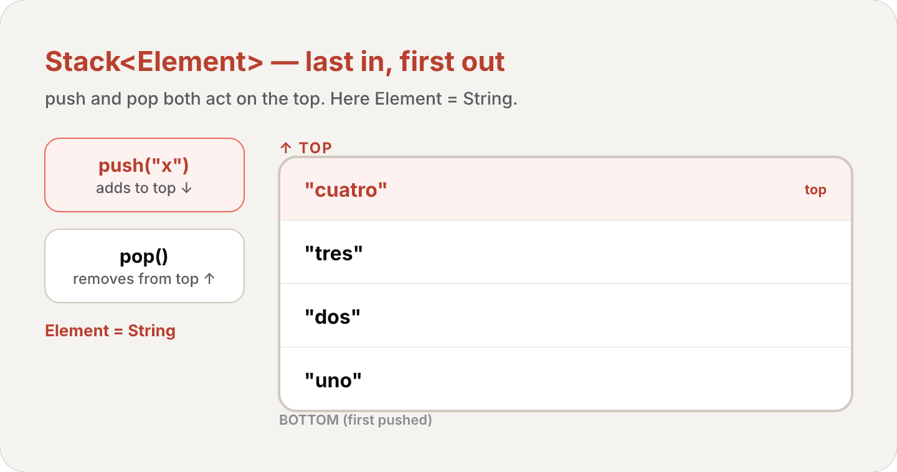
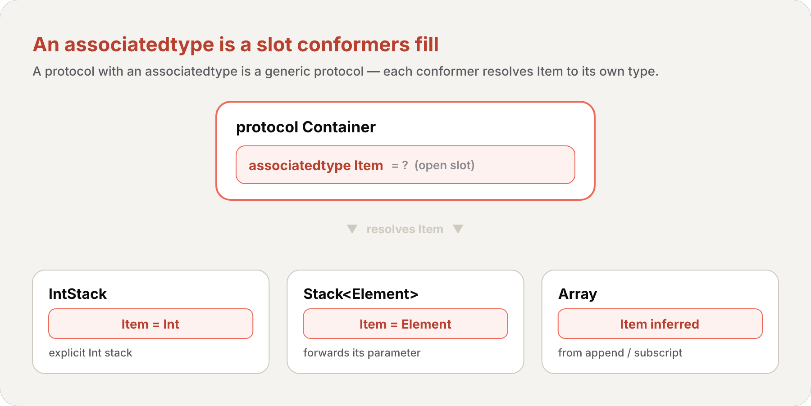

import Callout from '../../../../../components/Callout.astro';
import InfoBox from '../../../../../components/InfoBox.astro';

Al final del [#13](/es/blog/swift-cero-experto-protocolos) dejamos una promesa. `any Shape` y `[any TextRepresentable]` *encajaban* sus valores a un costo de runtime, y dijimos que la respuesta eran los **genéricos** — donde *el llamador* elige un tipo concreto, el compilador especializa el código, y la caja desaparece. También hemos estado usando genéricos en silencio durante capítulos: `Array<Element>`, `Dictionary<Key, Value>`, `Optional<Wrapped>` y `Result<Success, Failure>` son *todos* tipos genéricos. Cada `[Int]` que escribiste era un `Array<Int>`. Este artículo es donde esa maquinaria por fin recibe su nombre.

Los genéricos te dejan escribir funciones y tipos **flexibles y reutilizables** que funcionan con *cualquier* tipo, sujeto a los requisitos que tú definas — sin duplicación, y sin borrar la información de tipo como hace `any`. Son una de las funciones más poderosas de Swift, y buena parte de la librería estándar está construida con ellos.

<div class="pull-quote">
<code>any</code> oculta el tipo concreto tras una caja y lo paga en runtime. Un genérico conserva el tipo concreto — el llamador lo nombra, el compilador lo hornea adentro. La misma flexibilidad, sin caja. Ese es el trato sobre el que gira todo el capítulo.
</div>

## El problema que los genéricos resuelven

Aquí una función perfectamente ordinaria y *no genérica* que intercambia dos valores `Int` usando [los parámetros in-out del #6](/es/blog/swift-cero-experto-funciones):

```swift
func swapTwoInts(_ a: inout Int, _ b: inout Int) {
    let temporaryA = a
    a = b
    b = temporaryA
}
```

Funciona — pero *solo* para `Int`. ¿Quieres intercambiar dos `String`? ¿Dos `Double`? Escribes el mismo cuerpo otra vez, sin cambiar nada salvo el tipo:

```swift
func swapTwoStrings(_ a: inout String, _ b: inout String) {
    let temporaryA = a
    a = b
    b = temporaryA
}

func swapTwoDoubles(_ a: inout Double, _ b: inout Double) {
    let temporaryA = a
    a = b
    b = temporaryA
}
```

Los cuerpos son *idénticos*. La única diferencia es el tipo. Esa repetición es exactamente la picazón que los genéricos rascan — y nota la única regla escondida a plena vista: en cada versión, `a` y `b` deben ser del *mismo* tipo. Swift es type-safe; no puedes intercambiar un `String` con un `Double`. Lo que escribamos a continuación tiene que preservar esa restricción.

## Funciones genéricas: un único parámetro de tipo `<T>`

Una **función genérica** funciona con cualquier tipo. Aquí la versión genérica de las tres funciones de arriba, llamada `swapTwoValues(_:_:)`:

```swift
func swapTwoValues<T>(_ a: inout T, _ b: inout T) {
    let temporaryA = a
    a = b
    b = temporaryA
}
```

El cuerpo no cambia. Solo difiere la primera línea — compáralas:

```swift
func swapTwoInts(_ a: inout Int, _ b: inout Int)
func swapTwoValues<T>(_ a: inout T, _ b: inout T)
```

<Callout type="info" title="Definición: Parámetro de Tipo">
Un **parámetro de tipo** (type parameter) es un nombre de tipo *marcador de posición*, escrito entre corchetes angulares tras el nombre de la función (como `<T>`). Nombra un tipo sin decir qué tipo es. El marcador no dice nada sobre lo que `T` *debe* ser — solo que en cada lugar donde aparece `T`, representa el *mismo* tipo. El tipo real a usar en lugar de `T` se determina cada vez que se llama la función.
</Callout>

Los corchetes son cómo Swift sabe que `T` es un marcador y no un tipo real llamado `T` — no irá a buscar un tipo llamado `T` por algún lado. Y como *ambos* parámetros son de tipo `T`, la regla de type-safety sobrevive: el llamador puede pasar cualquier tipo, siempre que ambos argumentos sean el mismo tipo. El tipo a usar para `T` se **infiere** de los argumentos en cada llamada:

```swift
var someInt = 3
var anotherInt = 107
swapTwoValues(&someInt, &anotherInt)
// T se infiere como Int; someInt ahora es 107, anotherInt ahora es 3

var someString = "hello"
var anotherString = "world"
swapTwoValues(&someString, &anotherString)
// T se infiere como String; someString ahora es "world", anotherString ahora es "hello"
```


<Callout type="info" title="Swift ya trae esta">
`swapTwoValues(_:_:)` está inspirada en la propia `swap(_:_:)` de la librería estándar, que es genérica y siempre está disponible. No necesitas escribir la tuya — pero construirla una vez es la forma más clara de *ver* qué hace un parámetro de tipo.
</Callout>

### Nombrar parámetros de tipo

Donde un parámetro de tipo tiene una relación *significativa* con lo que representa, dale un nombre descriptivo: `Key` y `Value` en `Dictionary<Key, Value>`, `Element` en `Array<Element>`. Cuando no hay tal relación — como con `swapTwoValues` — la tradición usa letras sueltas en upper camel case: `T`, luego `U`, luego `V`.

<Callout type="tip" title="El upper camel case señala 'tipo, no valor'">
Nombra siempre los parámetros de tipo en upper camel case (`T`, `Element`, `MyTypeParameter`). La convención los marca visualmente como marcadores de un *tipo*, distinguiéndolos del lowerCamelCase que usas para valores y propiedades. Puedes declarar varios a la vez separándolos con comas dentro de los corchetes: `<Key, Value>`.
</Callout>

## Tipos genéricos: construir `Stack<Element>` desde cero

Los genéricos no son solo para funciones — puedes definir tus propios *tipos* genéricos: clases, estructuras y enumeraciones que funcionan con cualquier tipo, igual que `Array` y `Dictionary`. Construyamos uno: una **pila** (stack), una colección ordenada donde solo agregas al final (*push*) y quitas del final (*pop*) — estricto último en entrar, primero en salir.

Primero, la versión *no genérica*, atada a `Int`:

```swift
struct IntStack {
    var items: [Int] = []
    mutating func push(_ item: Int) {
        items.append(item)
    }
    mutating func pop() -> Int {
        return items.removeLast()
    }
}
```

Guarda valores en un `[Int]`, y `push`/`pop` son [`mutating` del #8](/es/blog/swift-cero-experto-structs-vs-classes) porque cambian el `items` del struct. Útil — pero por siempre una pila de `Int`. Ahora la versión *genérica*:

```swift
struct Stack<Element> {
    var items: [Element] = []
    mutating func push(_ item: Element) {
        items.append(item)
    }
    mutating func pop() -> Element {
        return items.removeLast()
    }
}
```

Es el mismo código, con el tipo real `Int` reemplazado por un parámetro de tipo `Element`, escrito entre corchetes angulares tras el nombre del struct. `Element` es un marcador usado en tres lugares: el tipo de elemento del array `items`, el tipo del parámetro de `push(_:)`, y el tipo de retorno de `pop()` — todos garantizados de ser el *mismo* tipo.

Creas una instancia escribiendo el tipo concreto entre corchetes — `Stack<String>()` para una pila de cadenas:

```swift
var stackOfStrings = Stack<String>()
stackOfStrings.push("uno")
stackOfStrings.push("dos")
stackOfStrings.push("tres")
stackOfStrings.push("cuatro")
// la pila ahora contiene 4 cadenas

let fromTheTop = stackOfStrings.pop()
// fromTheTop es "cuatro", y la pila ahora contiene 3 cadenas
```



<Callout type="info" title="Así funciona exactamente Array">
`Stack<Element>` no es un juguete. Tiene la misma forma que `Array<Element>` — la única razón por la que `Array` se siente incorporado es que Apple lo escribió igual que acabas de hacerlo tú. Cuando escribes `[String]`, eso es azúcar para `Array<String>`: un tipo genérico con `Element` puesto en `String`. Has estado creando instancias genéricas desde el [#4](/es/blog/swift-cero-experto-colecciones).
</Callout>

### Extender un tipo genérico

Cuando [extiendes un tipo genérico del #9](/es/blog/swift-cero-experto-propiedades-metodos-subscripts), **no** repites la lista de parámetros de tipo. Los nombres de parámetro originales simplemente están disponibles dentro de la extensión. Aquí una extensión que agrega un `topItem` de solo lectura que mira la cima sin hacer pop:

```swift
extension Stack {
    var topItem: Element? {
        return items.isEmpty ? nil : items[items.count - 1]
    }
}
```

Sin `<Element>` tras `extension Stack` — y aun así `Element` está en alcance, usado aquí como el [opcional del #11](/es/blog/swift-cero-experto-opcionales) `Element?`. `topItem` retorna `nil` para una pila vacía, si no el último ítem:

```swift
if let topItem = stackOfStrings.topItem {
    print("The top item on the stack is \(topItem).")
}
// Prints "The top item on the stack is tres."
```

## Restricciones de tipo: exigir conformidad

`swapTwoValues` y `Stack` aceptan *cualquier* tipo. Pero a veces un genérico *necesita* que sus tipos sepan hacer algo. `Dictionary`, por ejemplo, exige que sus claves sean [`Hashable` del #4](/es/blog/swift-cero-experto-colecciones) — no puede saber si insertar o reemplazar una clave sin una forma de comparar claves. Ese requisito es una **restricción de tipo** (type constraint).

<Callout type="info" title="Definición: Restricción de Tipo">
Una **restricción de tipo** especifica que un parámetro de tipo debe heredar de una clase particular, o conformar a un protocolo o composición de protocolos particular. La escribes colocando la clase o el protocolo tras el nombre del parámetro de tipo, separados por dos puntos — la misma sintaxis de dos puntos que usaste para la herencia y [la conformidad de protocolo del #13](/es/blog/swift-cero-experto-protocolos).
</Callout>

```swift
func someFunction<T: SomeClass, U: SomeProtocol>(someT: T, someU: U) {
    // function body goes here
}
```

Aquí `T` debe ser una subclase de `SomeClass`, y `U` debe conformar a `SomeProtocol`. La sintaxis es idéntica para los tipos genéricos.

### Un `findIndex` que necesita `Equatable`

Observa cómo una restricción se vuelve *necesaria*. Aquí una función no genérica que encuentra el índice de un `String` en un array de cadenas:

```swift
func findIndex(ofString valueToFind: String, in array: [String]) -> Int? {
    for (index, value) in array.enumerated() {
        if value == valueToFind {
            return index
        }
    }
    return nil
}
```

El principio no es específico de cadenas, así que hagámoslo genérico reemplazando `String` por `T`. Pero esta versión **no compila**:

```swift
func findIndex<T>(of valueToFind: T, in array: [T]) -> Int? {
    for (index, value) in array.enumerated() {
        if value == valueToFind {   // ❌ error: no todo T soporta ==
            return index
        }
    }
    return nil
}
```

El problema es `value == valueToFind`. No todo tipo en Swift puede compararse con `==` — para un struct o clase propios, Swift no puede adivinar qué significa "igual". Así que *no puede* garantizar que esto funcione para todo `T` posible, y reporta un error.

El arreglo es *prometer* que `T` soporta `==`. El protocolo `Equatable` de la librería estándar exige exactamente eso — `==` y `!=` — y todo tipo estándar conforma. Restringe `T` a `Equatable`:

```swift
func findIndex<T: Equatable>(of valueToFind: T, in array: [T]) -> Int? {
    for (index, value) in array.enumerated() {
        if value == valueToFind {
            return index
        }
    }
    return nil
}
```

`<T: Equatable>` se lee "cualquier tipo `T` que conforme a `Equatable`". Ahora compila, y funciona para cualquier tipo equatable:

```swift
let doubleIndex = findIndex(of: 9.3, in: [3.14159, 0.1, 0.25])
// doubleIndex es nil — 9.3 no está en el array
let stringIndex = findIndex(of: "Andrea", in: ["Mike", "Malcolm", "Andrea"])
// stringIndex es Optional(2)
```

<div class="pull-quote">
Una restricción de tipo no es burocracia — es la función diciéndole al compilador precisamente en qué capacidades se apoya. <code>T: Equatable</code> significa "voy a usar <code>==</code>, así que solo deja entrar tipos que lo tengan". La restricción es el contrato que vuelve demostrablemente seguro al cuerpo.
</div>

## Tipos asociados: un protocolo genérico

Aquí está el puente de vuelta al [#13](/es/blog/swift-cero-experto-protocolos). Un protocolo también puede tener un tipo marcador — y *un protocolo con un tipo asociado es un protocolo genérico*. Donde un tipo genérico escribe `<Element>` entre corchetes, un protocolo declara un **tipo asociado** (associated type) con la palabra clave `associatedtype`.

<Callout type="info" title="Definición: Tipo Asociado">
Un **tipo asociado** da un nombre marcador a un tipo usado como parte de un protocolo. El tipo real no se especifica hasta que el protocolo se *adopta* — cada tipo conforme lo rellena. Declaras uno con la palabra clave `associatedtype` dentro del cuerpo del protocolo.
</Callout>

Considera un protocolo `Container`: cualquier cosa que pueda agregar un ítem, reportar su conteo, y recuperar ítems por subscript. Pero ¿*de qué tipo* es el ítem? Eso se deja abierto con un tipo asociado llamado `Item`:

```swift
protocol Container {
    associatedtype Item
    mutating func append(_ item: Item)
    var count: Int { get }
    subscript(i: Int) -> Item { get }
}
```

`Item` es un marcador para cualquier elemento que el contenedor guarde. El protocolo garantiza que el valor que haces `append` y el valor que retorna el [subscript del #9](/es/blog/swift-cero-experto-propiedades-metodos-subscripts) son del *mismo* tipo — sin nombrar nunca ese tipo. Cada conformador decide.

Un `struct` puede conformar y fijar `Item`. Aquí `IntStack` adaptado — pone `Item` en `Int` con un `typealias`:

```swift
struct IntStack: Container {
    // original IntStack implementation
    var items: [Int] = []
    mutating func push(_ item: Int) {
        items.append(item)
    }
    mutating func pop() -> Int {
        return items.removeLast()
    }
    // conformance to the Container protocol
    typealias Item = Int
    mutating func append(_ item: Int) {
        self.push(item)
    }
    var count: Int {
        return items.count
    }
    subscript(i: Int) -> Int {
        return items[i]
    }
}
```

<Callout type="info" title="La inferencia de tipos rellena el tipo asociado">
Rara vez necesitas la línea `typealias Item = Int`. Como `append(_:)` toma un `Int` y el subscript retorna un `Int`, Swift *infiere* que `Item` es `Int`. Borra el `typealias` y todo sigue compilando. El tipo asociado se resuelve a partir de cómo implementas en realidad los requisitos.
</Callout>

El `Stack<Element>` *genérico* también puede conformar — y aquí Swift infiere que `Item` es el parámetro de tipo `Element`:

```swift
struct Stack<Element>: Container {
    // original Stack<Element> implementation
    var items: [Element] = []
    mutating func push(_ item: Element) {
        items.append(item)
    }
    mutating func pop() -> Element {
        return items.removeLast()
    }
    // conformance to the Container protocol
    mutating func append(_ item: Element) {
        self.push(item)
    }
    var count: Int {
        return items.count
    }
    subscript(i: Int) -> Element {
        return items[i]
    }
}
```

### Conformar vía una extensión

El propio `Array` de Swift ya tiene `append(_:)`, un `count`, y un subscript de `Int` — *ya* cumple cada requisito de `Container`. Así que, como con la [adopción por extensión vacía del #13](/es/blog/swift-cero-experto-protocolos), una extensión vacía lo oficializa:

```swift
extension Array: Container {}
```

Swift infiere `Item` a partir de los miembros existentes de `Array`. Tras esto, cualquier `Array` es un `Container`.



<Callout type="info" title="Por qué los tipos asociados rompen la caja any">
Este es el cabo suelto del [#13](/es/blog/swift-cero-experto-protocolos): un protocolo con un `associatedtype` es un *protocolo genérico*, y no siempre puedes usarlo como un simple `any Container` — la caja no sabría qué es `Item`. La forma limpia de devolver uno es la palabra clave opaca `some` — que es exactamente lo que cubre el #15 a continuación. Los tipos asociados son la razón por la que `some` existe.
</Callout>

### Restringir un tipo asociado

Puedes exigir que el propio tipo asociado conforme a un protocolo, justo donde lo declaras:

```swift
protocol Container {
    associatedtype Item: Equatable
    mutating func append(_ item: Item)
    var count: Int { get }
    subscript(i: Int) -> Item { get }
}
```

Ahora solo los tipos cuyo `Item` es `Equatable` pueden conformar.

## Cláusulas `where` genéricas: restringir tipos asociados

Las restricciones de tipo gobiernan los parámetros de tipo en los corchetes. Pero a veces necesitas restringir los *tipos asociados* de esos parámetros — o exigir que dos tipos asociados sean *el mismo*. Eso es una **cláusula `where` genérica**.

<Callout type="info" title="Definición: Cláusula where Genérica">
Una **cláusula `where` genérica** te deja declarar requisitos sobre tipos asociados: que un tipo asociado deba conformar a un protocolo, o que dos tipos (o tipos asociados) deban ser idénticos (`==`). Empieza con la palabra clave `where` y va justo antes de la llave de apertura del cuerpo de un tipo o función.
</Callout>

El ejemplo clásico es `allItemsMatch`, que verifica si dos contenedores contienen los mismos ítems en el mismo orden. Los dos contenedores no necesitan ser del mismo *tipo* de contenedor — pero deben contener el mismo *tipo* de ítem, y ese ítem debe ser `Equatable`:

```swift
func allItemsMatch<C1: Container, C2: Container>
        (_ someContainer: C1, _ anotherContainer: C2) -> Bool
        where C1.Item == C2.Item, C1.Item: Equatable {

    // Check that both containers contain the same number of items.
    if someContainer.count != anotherContainer.count {
        return false
    }

    // Check each pair of items to see if they're equivalent.
    for i in 0..<someContainer.count {
        if someContainer[i] != anotherContainer[i] {
            return false
        }
    }

    // All items match, so return true.
    return true
}
```

Lee los requisitos en la firma: `C1` y `C2` conforman ambos a `Container` (en los corchetes); sus tipos `Item` son *idénticos* — `C1.Item == C2.Item` — y ese `Item` compartido es `Equatable` (en la cláusula `where`). Esos dos últimos son exactamente lo que vuelve legal `someContainer[i] != anotherContainer[i]`: los ítems son del mismo tipo, y ese tipo soporta `!=`.

Gracias a la cláusula `where`, un `Stack<String>` y un simple `[String]` — tipos de contenedor distintos, mismo `Item` — pueden compararse:

```swift
var stackOfStrings = Stack<String>()
stackOfStrings.push("uno")
stackOfStrings.push("dos")
stackOfStrings.push("tres")

var arrayOfStrings = ["uno", "dos", "tres"]

if allItemsMatch(stackOfStrings, arrayOfStrings) {
    print("All items match.")
} else {
    print("Not all items match.")
}
// Prints "All items match."
```

### Extensiones con una cláusula `where` genérica

Te topaste con esta idea exacta en [las extensiones restringidas del #13](/es/blog/swift-cero-experto-protocolos) — ahora puedes ver que es una cláusula `where` genérica. Extiende `Stack` con un método `isTop(_:)` que solo existe cuando `Element` es `Equatable`:

```swift
extension Stack where Element: Equatable {
    func isTop(_ item: Element) -> Bool {
        guard let topItem = items.last else {
            return false
        }
        return topItem == item
    }
}
```

Sin el `where`, el `==` dentro de `isTop(_:)` no compilaría — `Stack` no exige elementos equatable. La cláusula agrega ese requisito *solo para esta extensión*, así que `isTop(_:)` aparece en un `Stack<String>` pero no en un `Stack<NotEquatable>`:

```swift
if stackOfStrings.isTop("tres") {
    print("Top element is tres.")
} else {
    print("Top element is something else.")
}
// Prints "Top element is tres."
```

Lo mismo funciona en una extensión de protocolo. Aquí `Container` gana `startsWith(_:)`, pero solo cuando `Item` es `Equatable`:

```swift
extension Container where Item: Equatable {
    func startsWith(_ item: Item) -> Bool {
        return count >= 1 && self[0] == item
    }
}
```

Una cláusula `where` también puede fijar un tipo asociado a un tipo *específico* con `==`, no solo a un protocolo:

```swift
extension Container where Item == Double {
    func average() -> Double {
        var sum = 0.0
        for index in 0..<count {
            sum += self[index]
        }
        return sum / Double(count)
    }
}
print([1260.0, 1200.0, 98.6, 37.0].average())
// Prints "648.9"
```

### Cláusulas `where` contextuales

Cuando *ya* estás dentro de un contexto genérico — un método o subscript sobre un tipo genérico — puedes adjuntar una cláusula `where` a esa sola declaración, en vez de escribir toda una extensión restringida aparte. Estas son las **cláusulas `where` contextuales**:

```swift
extension Container {
    func average() -> Double where Item == Int {
        var sum = 0.0
        for index in 0..<count {
            sum += Double(self[index])
        }
        return sum / Double(count)
    }
    func endsWith(_ item: Item) -> Bool where Item: Equatable {
        return count >= 1 && self[count-1] == item
    }
}
let numbers = [1260, 1200, 98, 37]
print(numbers.average())     // Prints "648.75"
print(numbers.endsWith(37))  // Prints "true"
```

`average()` está disponible solo cuando `Item == Int`; `endsWith(_:)` solo cuando `Item: Equatable` — *ambos en la misma extensión*. Sin cláusulas contextuales necesitarías dos extensiones separadas, una por requisito. Tienen comportamiento idéntico; la forma contextual solo deja que métodos relacionados compartan una extensión.

### Tipos asociados con su propia cláusula `where`

Un tipo asociado puede llevar una cláusula `where` propia. Así es como la `Sequence` de la librería estándar ata su iterador a sus elementos — y tú puedes hacer lo mismo, exigiendo que el iterador de un contenedor recorra el *mismo* tipo `Item` que almacena:

```swift
protocol Container {
    associatedtype Item
    mutating func append(_ item: Item)
    var count: Int { get }
    subscript(i: Int) -> Item { get }

    associatedtype Iterator: IteratorProtocol where Iterator.Element == Item
    func makeIterator() -> Iterator
}
```

El `where Iterator.Element == Item` garantiza que el iterador entregue exactamente el tipo que el contenedor guarda, sea cual sea el tipo de iterador que elija un conformador. (`IteratorProtocol` / `makeIterator()` reflejan la `Sequence` de la librería estándar: un iterador es simplemente el objeto del que un bucle `for`-in saca un elemento a la vez — no necesitas ese detalle para leer el patrón `where` de aquí.) Y para un protocolo que *hereda* de otro, restringes un tipo asociado heredado con una cláusula `where` en la declaración misma:

```swift
protocol ComparableContainer: Container where Item: Comparable { }
```

## Subscripts genéricos

Los [subscripts del #9](/es/blog/swift-cero-experto-propiedades-metodos-subscripts) también pueden ser genéricos — con sus propios parámetros de tipo entre corchetes tras `subscript`, y su propia cláusula `where`. Este toma *cualquier secuencia de índices enteros* y retorna los ítems en esas posiciones:

```swift
extension Container {
    subscript<Indices: Sequence>(indices: Indices) -> [Item]
            where Indices.Iterator.Element == Int {
        var result: [Item] = []
        for index in indices {
            result.append(self[index])
        }
        return result
    }
}
```

`Indices` debe conformar a `Sequence`, y la cláusula `where` exige que los elementos de esa secuencia sean `Int` — así el parámetro es demostrablemente una secuencia de enteros. Pasa un `Range`, un `Array<Int>`, cualquier cosa que encaje.

## Recapitulación


- **El problema** — tres funciones `swapTwo*` idénticas difieren solo en el tipo; los genéricos las colapsan en una
- **Función genérica** — `func swapTwoValues<T>(...)`; `T` es un *parámetro de tipo* (un marcador), inferido en cada llamada; ambos argumentos deben ser el *mismo* `T`
- **Nombrado** — descriptivo (`Element`, `Key`, `Value`) cuando hay una relación, letras sueltas (`T`, `U`, `V`) cuando no; siempre upper camel case
- **Tipo genérico** — `struct Stack<Element>`; el marcador atraviesa propiedades almacenadas, parámetros y tipos de retorno; `[String]` es solo `Array<String>`
- **Extender un tipo genérico** — sin lista de parámetros de tipo en la extensión; los nombres originales (`Element`) ya están en alcance
- **Restricción de tipo** — `<T: SomeClass>` / `<T: Protocol>`; `findIndex(of:in:)` necesita `T: Equatable` para usar `==`
- **Tipo asociado** — `associatedtype Item` vuelve genérico un protocolo; los conformadores lo rellenan (a menudo inferido); la razón por la que existe `some` (#15)
- **Cláusula `where` genérica** — restringe o iguala tipos asociados: `allItemsMatch` necesita `C1.Item == C2.Item, C1.Item: Equatable`
- **`where` restringida / contextual / de tipo asociado** — agrega requisitos a extensiones, métodos sueltos, o tipos asociados
- **Subscript genérico** — `subscript<Indices: Sequence>(...) where ...` — los subscripts también reciben parámetros de tipo y cláusulas `where`

## Desafíos

Abre un playground y prueba cada uno antes de abrir la solución.

### Desafío 1: Hazlo genérico

Esta función retorna el mayor de dos `Int`. Reescríbela como una función genérica `func maximum<T>(_:_:)` que funcione para *cualquier* tipo comparable. (Pista: necesita una restricción para usar `>`.)

```swift
func maximumInt(_ a: Int, _ b: Int) -> Int {
    return a > b ? a : b
}
```

<details class="challenge">
<summary>Ver solución</summary>

```swift
func maximum<T: Comparable>(_ a: T, _ b: T) -> T {
    return a > b ? a : b
}

print(maximum(3, 9))            // 9
print(maximum("apple", "pear")) // pear
print(maximum(2.5, 1.1))        // 2.5
```

El cuerpo usa `>`, que viene del protocolo `Comparable` — así que `T` debe restringirse a `Comparable`. Sin la restricción, el compilador no puede garantizar que todo `T` soporte `>` y rechaza el código, exactamente como el `findIndex` sin restricción. Con ella, `T` se infiere en cada llamada: `Int`, luego `String`, luego `Double`.

</details>

### Desafío 2: ¿Por qué no compila?

Esta extensión de `Stack` genérico falla al compilar. Explica por qué, y arréglala para que `peekEquals(_:)` funcione.

```swift
struct Stack<Element> {
    var items: [Element] = []
    mutating func push(_ item: Element) { items.append(item) }
    mutating func pop() -> Element { return items.removeLast() }
}

extension Stack {
    func peekEquals(_ item: Element) -> Bool {
        return items.last == item   // error
    }
}
```

<details class="challenge">
<summary>Ver solución</summary>

```swift
extension Stack where Element: Equatable {
    func peekEquals(_ item: Element) -> Bool {
        return items.last == item
    }
}
```

`Stack<Element>` no pone *ninguna* restricción sobre `Element`, así que dentro de un simple `extension Stack` no hay garantía de que `Element` soporte `==`. El `==` en `items.last == item` es por tanto ilegal. Agregar una cláusula `where Element: Equatable` genérica a la extensión suministra el requisito faltante — `peekEquals(_:)` ahora existe solo cuando los elementos de la pila son equatable, que es precisamente cuando `==` está disponible. (Nota que `items.last` es un `Element?`, y comparar un opcional con un `Element` no opcional funciona porque el propio `Optional` es `Equatable` cuando `Wrapped` lo es.)

</details>

### Desafío 3: Lee las restricciones

Sin ejecutarlo, ¿qué imprime esto — y por qué es necesaria la cláusula `where`?

```swift
protocol Container {
    associatedtype Item
    var count: Int { get }
    subscript(i: Int) -> Item { get }
}
extension Array: Container {}

func firstsMatch<A: Container, B: Container>(_ a: A, _ b: B) -> Bool
        where A.Item == B.Item, A.Item: Equatable {
    guard a.count > 0, b.count > 0 else { return false }
    return a[0] == b[0]
}

print(firstsMatch([1, 2, 3], [1, 9, 9]))
print(firstsMatch(["x"], ["y"]))
```

<details class="challenge">
<summary>Ver solución</summary>

```
true
false
```

La primera llamada compara `1 == 1` → `true`; la segunda compara `"x" == "y"` → `false`. La cláusula `where` hace dos trabajos esenciales. `A.Item == B.Item` fuerza a ambos contenedores a contener el *mismo* tipo de elemento — sin ella, `a[0] == b[0]` podría comparar un `Int` con un `String`, lo que no tiene sentido. `A.Item: Equatable` garantiza que ese tipo compartido soporta `==` siquiera. Quita cualquiera de los dos requisitos y el cuerpo deja de compilar. Esta es la misma maquinaria que `allItemsMatch`, recortada a su primer elemento.

</details>

## Lo que viene

Ahora hemos visto las tres puertas para salir de "no quiero nombrar el tipo concreto". `any` (#13) lo encaja y lo paga en runtime. Los **genéricos** (este capítulo) dejan que *el llamador* lo nombre, sin caja. La tercera puerta son los **tipos opacos** — la palabra clave `some` — donde una *función* oculta un tipo concreto específico manteniéndolo plenamente concreto, y es la forma limpia de devolver un valor de un protocolo que tiene un `associatedtype`. Eso es el #15, la próxima semana.

Nos vemos entonces.

<div class="pull-quote">
Un genérico es una promesa cumplida dos veces: "escribe esto una vez" para ti, y "lo especializaré por tipo, con type-safety completo y sin caja" para el compilador. Una vez que ves que <code>Array</code>, <code>Dictionary</code>, <code>Optional</code> y <code>Result</code> fueron genéricos todo el tiempo, la librería estándar deja de ser magia y empieza a ser un ejemplo resuelto.
</div>

## Referencias

- [The Swift Programming Language — Generics](https://docs.swift.org/swift-book/documentation/the-swift-programming-language/generics)
- [The Swift Programming Language — Protocols](https://docs.swift.org/swift-book/documentation/the-swift-programming-language/protocols)
- [The Swift Programming Language — Opaque and Boxed Protocol Types](https://docs.swift.org/swift-book/documentation/the-swift-programming-language/opaquetypes)
- [Swift Standard Library — Equatable](https://developer.apple.com/documentation/swift/equatable)
