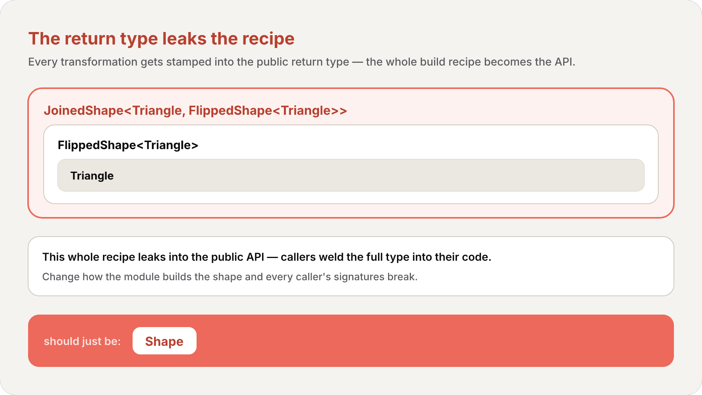

import Callout from '../../../../../components/Callout.astro';
import InfoBox from '../../../../../components/InfoBox.astro';

Al final del [#14](/es/blog/swift-cero-experto-genericos) contamos tres puertas para salir de "no quiero nombrar el tipo concreto". `any` (del [#13](/es/blog/swift-cero-experto-protocolos)) **encajona** el valor y lo paga en runtime. Los **genéricos** (#14) dejan que *el llamador* nombre un tipo concreto, sin caja. Este artículo abre la tercera puerta: los **tipos opacos** — la palabra clave `some` — donde una *función* oculta un tipo concreto específico manteniéndolo plenamente concreto. Y cierra el cabo suelto que el #14 dejó pendiente: ¿cómo *devuelves* un protocolo que tiene un `associatedtype`? `some` es la respuesta.

Swift te da dos formas de ocultar detalles del tipo de un valor, y este capítulo trata de distinguirlas: los **tipos opacos** (`some`) y los **tipos de protocolo encajonados** (`any`). Ambos ocultan el tipo concreto al *llamador*. La diferencia — todo el capítulo — es si el *compilador* lo sigue conociendo.

<div class="pull-quote">
<code>some</code> oculta el tipo de <em>ti</em> pero no del <em>compilador</em>: un tipo concreto, identidad conservada, sin caja. <code>any</code> lo oculta de <em>ambos</em>: una caja de runtime que puede contener un tipo concreto distinto de un momento al siguiente. El mismo objetivo, mecanismo opuesto.
</div>

## El problema que los tipos opacos resuelven

Imagina un pequeño módulo que dibuja figuras en ASCII-art. Lo único que toda figura sabe hacer es `draw()` (dibujarse) en una cadena — así que ese es el protocolo `Shape`, y `Triangle` es un primer conformador (exactamente el protocolo del [#13](/es/blog/swift-cero-experto-protocolos)):

```swift
protocol Shape {
    func draw() -> String
}

struct Triangle: Shape {
    var size: Int
    func draw() -> String {
        var result: [String] = []
        for length in 1...size {
            result.append(String(repeating: "*", count: length))
        }
        return result.joined(separator: "\n")
    }
}
let smallTriangle = Triangle(size: 3)
print(smallTriangle.draw())
// *
// **
// ***
```

Ahora usa [los genéricos del #14](/es/blog/swift-cero-experto-genericos) para construir operaciones *sobre* figuras. Un `FlippedShape<T: Shape>` envuelve otra figura y la dibuja al revés:

```swift
struct FlippedShape<T: Shape>: Shape {
    var shape: T
    func draw() -> String {
        let lines = shape.draw().split(separator: "\n")
        return lines.reversed().joined(separator: "\n")
    }
}
let flippedTriangle = FlippedShape(shape: smallTriangle)
print(flippedTriangle.draw())
// ***
// **
// *
```

Y un `JoinedShape<T: Shape, U: Shape>` apila una figura sobre otra:

```swift
struct JoinedShape<T: Shape, U: Shape>: Shape {
    var top: T
    var bottom: U
    func draw() -> String {
        return top.draw() + "\n" + bottom.draw()
    }
}
let joinedTriangles = JoinedShape(top: smallTriangle, bottom: flippedTriangle)
print(joinedTriangles.draw())
// *
// **
// ***
// ***
// **
// *
```

Funciona — pero mira el *tipo* de `joinedTriangles`. Es `JoinedShape<Triangle, FlippedShape<Triangle>>`. Cada transformación que aplicas queda estampada en el tipo de retorno, y ese tipo deletrea la receta completa de construcción: un join, de un triángulo, con un flip, de un triángulo. Apila unas cuantas operaciones más y el nombre del tipo se infla en algo ilegible — y, peor aún, *público*.

<Callout type="info" title="Por qué importa esta fuga">
`JoinedShape` y `FlippedShape` son *detalles de implementación* del módulo. Un llamador pidió "una figura que es un triángulo unido a su volteo" — debería recibir de vuelta un `Shape`, punto. En su lugar recibe `JoinedShape<Triangle, FlippedShape<Triangle>>` soldado a su código. Cambia *cómo* el módulo construye esa figura y las firmas de tipo de cada llamador se rompen. El tipo de retorno detallado filtra la receta y vuelve frágil la API.
</Callout>



La interfaz pública del módulo debería ser *"unir y voltear devuelven otro `Shape`."* Los tipos envoltura no deberían ser visibles en absoluto. Eso es exactamente lo que te compra un tipo de retorno opaco.

## Devolver un tipo opaco

<Callout type="info" title="Definición: Tipo Opaco">
Una función que devuelve un **tipo opaco** (opaque type) oculta la información de tipo de su valor de retorno. En vez de nombrar un tipo concreto, el tipo de retorno se describe solo por los protocolos a los que conforma, escrito **`some ProtocolName`**. Los tipos opacos **conservan la identidad de tipo** — el compilador tiene acceso al tipo concreto, pero los llamadores de la función no.
</Callout>

Agrega un `Square`, luego escribe un `makeTrapezoid()` que construye un trapecio a partir de triángulos y un cuadrado — y devuelve `some Shape`:

```swift
struct Square: Shape {
    var size: Int
    func draw() -> String {
        let line = String(repeating: "*", count: size)
        let result = Array<String>(repeating: line, count: size)
        return result.joined(separator: "\n")
    }
}

func makeTrapezoid() -> some Shape {
    let top = Triangle(size: 2)
    let middle = Square(size: 2)
    let bottom = FlippedShape(shape: top)
    let trapezoid = JoinedShape(
        top: top,
        bottom: JoinedShape(top: middle, bottom: bottom)
    )
    return trapezoid
}
let trapezoid = makeTrapezoid()
print(trapezoid.draw())
// *
// **
// **
// **
// **
// *
```

El tipo de retorno es `some Shape` — "algún tipo específico que conforma a `Shape`, y no te diré cuál". Por dentro, el trapecio es en realidad un `JoinedShape<Triangle, JoinedShape<Square, FlippedShape<Triangle>>>`. El llamador nunca ve eso. Recibe *una figura*. Reescribe `makeTrapezoid()` para construir la misma imagen de otra forma — con tipos envoltura completamente distintos — y el tipo de retorno público sigue siendo `some Shape`. La receta queda sellada por dentro.

<div class="pull-quote">
Un tipo opaco es el <em>reverso</em> de un genérico. Un genérico deja que el <em>llamador</em> elija el tipo concreto; el cuerpo de la función debe funcionar con lo que entre. <code>some</code> deja que la <em>función</em> elija el tipo concreto; el llamador debe funcionar con lo que salga — sin llegar a conocer su nombre.
</div>

Vale la pena retener esta relación de espejo. Con un genérico `max<T>(_:_:)`, los argumentos del llamador deciden `T`. Con `func makeTrapezoid() -> some Shape`, el cuerpo de la función decide el tipo subyacente, y el llamador es el que está escrito "de forma general" — solo puede apoyarse en lo que `Shape` garantiza.

También puedes combinar `some` con genéricos. `flip` y `join` son genéricos *porque sus entradas son genéricas*, pero ocultan sus resultados `FlippedShape`/`JoinedShape` tras `some Shape`:

```swift
func flip<T: Shape>(_ shape: T) -> some Shape {
    return FlippedShape(shape: shape)
}
func join<T: Shape, U: Shape>(_ top: T, _ bottom: U) -> some Shape {
    JoinedShape(top: top, bottom: bottom)
}

let opaqueJoinedTriangles = join(smallTriangle, flip(smallTriangle))
print(opaqueJoinedTriangles.draw())
// *
// **
// ***
// ***
// **
// *
```

`opaqueJoinedTriangles` dibuja *exactamente* la misma imagen que el `joinedTriangles` anterior. La única diferencia es lo que el llamador puede ver: `joinedTriangles` tenía el tipo `JoinedShape<Triangle, FlippedShape<Triangle>>` escrito encima; `opaqueJoinedTriangles` es solo `some Shape`. Los tipos envoltura quedan ocultos.

### La única regla: cada ruta de retorno, el mismo tipo

Hay una sola regla que gobierna `some`, y es estricta: **todas las rutas de retorno de una función opaca deben devolver el *mismo* tipo concreto subyacente.** El compilador conoce el tipo concreto con precisión — así que no puedes elegir uno distinto en distintas ramas. Aquí la versión *inválida* de `flip` que intenta tratar los cuadrados como caso especial:

```swift
func invalidFlip<T: Shape>(_ shape: T) -> some Shape {
    if shape is Square {
        return shape // Error: Return types don't match.
    }
    return FlippedShape(shape: shape) // Error: Return types don't match.
}
```

Llamada con un `Square` esto devuelve un `Square`; si no, un `FlippedShape`. *Dos tipos subyacentes distintos de una sola función opaca* — y eso es un error de compilación. El arreglo es empujar el caso especial *dentro* de `FlippedShape.draw()`, de modo que la función siempre entregue un `FlippedShape`:

```swift
struct FlippedShape<T: Shape>: Shape {
    var shape: T
    func draw() -> String {
        if shape is Square {
            return shape.draw()
        }
        let lines = shape.draw().split(separator: "\n")
        return lines.reversed().joined(separator: "\n")
    }
}
```

<Callout type="info" title="Los genéricos siguen permitidos — un tipo, no una rama">
"El mismo tipo" no significa "sin genéricos". El tipo subyacente puede *depender* de los parámetros de tipo de la función, siempre que se resuelva a un único tipo por llamada. Esto compila bien:

```swift
func `repeat`<T: Shape>(shape: T, count: Int) -> some Collection {
    return Array<T>(repeating: shape, count: count)
}
```

El tipo subyacente siempre es `[T]` — un tipo, parametrizado. La regla prohíbe *ramificar* hacia dos tipos distintos, no *parametrizar* uno.
</Callout>


## Tipos de protocolo encajonados

Ahora la otra puerta. Un **tipo de protocolo encajonado** es lo que escribes con `any` — el existencial del [#13](/es/blog/swift-cero-experto-protocolos).

<Callout type="info" title="Definición: Tipo de Protocolo Encajonado (Existencial)">
Un **tipo de protocolo encajonado** (boxed protocol type), escrito **`any ProtocolName`**, puede almacenar una instancia de *cualquier* tipo que conforme al protocolo. El nombre *existencial* viene de "existe un tipo *T* tal que *T* conforma al protocolo". Los tipos de protocolo encajonados **no** conservan la identidad de tipo — el tipo específico del valor no se conoce hasta runtime, y puede cambiar durante la vida del valor a medida que se almacenan valores distintos.
</Callout>

Un `VerticalShapes` que contiene un `[any Shape]` puede mezclar tipos concretos con libertad — un triángulo aquí, un cuadrado allá:

```swift
struct VerticalShapes: Shape {
    var shapes: [any Shape]
    func draw() -> String {
        return shapes.map { $0.draw() }.joined(separator: "\n\n")
    }
}

let largeTriangle = Triangle(size: 5)
let largeSquare = Square(size: 5)
let vertical = VerticalShapes(shapes: [largeTriangle, largeSquare])
print(vertical.draw())
```

Cada elemento de `[any Shape]` puede ser de un tipo *distinto*, decidido en runtime, mientras conforme a `Shape`. Para lograrlo, Swift envuelve cada valor en una **caja** — un nivel de indirección que agrega cuando es necesario, y esa indirección tiene un costo de rendimiento. Dentro de `VerticalShapes` puedes llamar a `draw()` porque `Shape` lo exige; alcanzar el `size` de un triángulo es un error, porque la caja solo expone la superficie del protocolo.

<Callout type="info" title="any puede cambiar de opinión; some no">
Una sola `var s: any Shape` puede contener un `Triangle` ahora y un `Square` una línea después — a la caja le da igual intercambiar su contenido. Un `some Shape` queda fijado a *un* tipo subyacente para siempre. Esa mutabilidad es la cara visible de la división más profunda: `any` borró el tipo, así que no hay nada que mantener estable; `some` lo conservó, así que *no puede* cambiar.
</Callout>

Cuando de verdad sabes qué hay en la caja, un cast `as?` (el [downcast del #12/#13](/es/blog/swift-cero-experto-protocolos)) te devuelve al tipo concreto:

```swift
if let downcastTriangle = vertical.shapes[0] as? Triangle {
    print(downcastTriangle.size)
}
// Prints "5".
```

Ese cast es la señal. Con `any`, regresar al tipo concreto es una cuestión de *runtime* — `as?` puede fallar y te entrega un opcional. Con `some`, no hay cast que escribir: el compilador conocía el tipo todo el tiempo.


## some vs any: las diferencias que importan

Devolver `some Shape` *se parece* casi por completo a devolver `any Shape`. La división es si la **identidad de tipo** sobrevive. Un tipo opaco refiere a *un* tipo específico que el llamador no puede ver; un tipo de protocolo encajonado puede referir a *cualquier* tipo conforme. Aquí el mismo `flip` escrito con un tipo de retorno encajonado — nota que devuelve `Shape` encajonado (`any Shape`), no `some Shape`:

```swift
func protoFlip<T: Shape>(_ shape: T) -> any Shape {
    return FlippedShape(shape: shape)
}
```

Como el contrato es solo "devuelve *algo* `Shape`", `protoFlip` es libre de devolver tipos distintos en distintas ramas — justo lo que a `invalidFlip` se le prohibía:

```swift
func protoFlip<T: Shape>(_ shape: T) -> any Shape {
    if shape is Square {
        return shape
    }
    return FlippedShape(shape: shape)
}
```

Esa flexibilidad es real, pero te cuesta. Como el tipo concreto se borra, **las operaciones que dependen de la información de tipo desaparecen**. Dos resultados de `protoFlip` no pueden compararse con `==`, aunque le agregues `==` a `Shape`:

```swift
let protoFlippedTriangle = protoFlip(smallTriangle)
let sameThing = protoFlip(smallTriangle)
protoFlippedTriangle == sameThing  // Error
```

La razón de fondo: un `==` para `Shape` necesitaría saber que ambos lados son del *mismo* tipo concreto (`Self`), y ese requisito `Self` es exactamente lo que la caja borra. La caja tampoco conforma *estáticamente* a `Shape`: un `any Shape` desnudo no se puede componer donde se exige una conformidad estática a `Shape` (por ejemplo, como la restricción `T` dentro de otro envoltorio que almacena `var shape: T`). Pasarlo a un parámetro genérico `<T: Shape>`, en cambio, *sí* funciona — Swift abre implícitamente el existencial, así que `protoFlip(protoFlip(smallTriangle))` en realidad compila, con la caja interna reabierta a un tipo concreto para la llamada externa. Cambia a `some Shape` y las operaciones que dependen de la identidad (`==`, inferir un `associatedtype`) vuelven también, porque el tipo subyacente se conserva.

Aquí el contraste destilado:

| | `some Shape` (opaco) | `any Shape` (encajonado) |
| --- | --- | --- |
| **Identidad de tipo** | conservada — un tipo concreto fijo | borrada — tipo concreto oculto, incluso del compilador |
| **Cuántos tipos** | exactamente un tipo subyacente | heterogéneo — puede contener tipos distintos durante su vida |
| **Caja / indirección** | sin caja, sin indirección | encajonado; un nivel de indirección con costo de runtime |
| **Despacho / momento** | tiempo de compilación, amistoso al despacho estático | runtime, dinámico |
| **Posición** | genérico inverso (la función decide, el llamador no ve) | a nivel de valor (una caja que almacenas y pasas) |
| **Retornos `Self` / associatedtype** | funciona como tipo de retorno | no puede, o requiere cuidado |

<div class="pull-quote">
El trato es identidad por flexibilidad. <code>any</code> contendrá cualquier cosa, cambiará en cualquier momento, y la encajona por el privilegio. <code>some</code> contiene exactamente una cosa, para siempre, sin caja — y a cambio conserva toda operación que necesite conocer el tipo real.
</div>

### La razón por la que existe `some`: devolver un protocolo con associatedtype

Este es el cabo suelto del [#14](/es/blog/swift-cero-experto-genericos). Recuerda el protocolo `Container` con su `associatedtype Item`:

```swift
protocol Container {
    associatedtype Item
    var count: Int { get }
    subscript(i: Int) -> Item { get }
}
extension Array: Container { }
```

Devolver `Container` (es decir, `any Container`) *está permitido*, pero no te da lo que quieres — como tiene un tipo asociado, la caja borra `Item` hasta `Any`, así que no puedes recuperar el tipo del elemento estáticamente. Y tampoco puedes meterlo en una posición de retorno genérica, porque no hay suficiente información *fuera* del cuerpo de la función para inferir el tipo:

```swift
// any Container está permitido, pero Item se borra a Any — no puedes recuperar el tipo del elemento estáticamente.
func makeProtocolContainer<T>(item: T) -> Container {
    return [item]
}

// Error: Not enough information to infer C.
func makeProtocolContainer<T, C: Container>(item: T) -> C {
    return [item]
}
```

`some Container` es la salida limpia. Dice "devuelvo un contenedor, pero no nombraré su tipo" — y como la identidad se conserva, el compilador aún puede inferir el `Item` asociado:

```swift
func makeOpaqueContainer<T>(item: T) -> some Container {
    return [item]
}
let opaqueContainer = makeOpaqueContainer(item: 12)
let twelve = opaqueContainer[0]
print(type(of: twelve))
// Prints "Int".
```

El contenedor subyacente es `[T]`; con `T == Int` el `Item` se resuelve a `Int`, así que `twelve` es un `Int` — el tipo de retorno del subscript fluyó hasta el final, aunque el llamador nunca viera `[Int]`. (`type(of:)` es la función integrada de Swift que reporta el tipo real en runtime de un valor — aquí confirma que el compilador sigue rastreando el `Int` concreto detrás de `some Container`.) *Esta* es la respuesta que el #14 prometió: `some` es cómo devuelves un protocolo que tiene un `associatedtype`. Los tipos asociados son la razón por la que `some` existe.

![makeOpaqueContainer(item: 12) devuelve some Container; el tipo subyacente es [Int] así que Item se infiere como Int, y opaqueContainer[0] es Int — el tipo de retorno del subscript fluye hasta el llamador; contrastado con any Container, donde la caja no puede saber Item y no compila](./resources/associatedtype-flow.png)

## Tipos de parámetro opacos

Hay un lugar más donde aparece `some` — y ahí significa algo ligeramente distinto. Puedes escribir `some` en el tipo de un *parámetro*, donde es **azúcar abreviada para un genérico**, no un retorno opaco. Estas dos funciones son equivalentes:

```swift
func drawTwiceGeneric<SomeShape: Shape>(_ shape: SomeShape) -> String {
    let drawn = shape.draw()
    return drawn + "\n" + drawn
}

func drawTwiceSome(_ shape: some Shape) -> String {
    let drawn = shape.draw()
    return drawn + "\n" + drawn
}
```

`some Shape` en posición de parámetro crea un parámetro de tipo genérico sin nombre, restringido a `Shape` — exactamente lo que hace `<SomeShape: Shape>`, solo que sin darle al tipo un nombre que puedas referenciar en otro lado. Escribe `some` en más de un parámetro y cada uno es un genérico *independiente*:

```swift
func combine(shape s1: some Shape, with s2: some Shape) -> String {
    return s1.draw() + "\n" + s2.draw()
}

combine(shape: smallTriangle, with: trapezoid)
```

`s1` y `s2` deben cada uno conformar a `Shape`, pero no necesitan ser del *mismo* tipo — así que un triángulo y un trapecio son ambos válidos. Esta sintaxis ligera no puede llevar una cláusula `where` genérica ni restricciones de mismo-tipo (`==`); recurre a la forma nombrada `<T: Shape>` cuando necesites esas.

<Callout type="warning" title="some cambia de significado según la posición">
`some` en posición de **retorno** es un tipo opaco: la *función* fija un tipo concreto oculto, el llamador no lo ve. `some` en posición de **parámetro** es azúcar de genéricos: el *llamador* fija el tipo, igual que `<T: Shape>`. La misma palabra clave, roles en espejo — y ese espejo es el mismo que hay entre los tipos opacos y los genéricos desde el inicio de este capítulo. Y recuerda el contraste con `any`: `func f(_ p: some Shape)` es un tipo conocido estáticamente, elegido por el llamador (sin caja); `func f(_ p: any Shape)` toma una caja de runtime que puede ser cualquier conformador.
</Callout>

## Bajo el capó: `some` es tiempo de compilación, `any` es runtime

Quita la sintaxis y todo el capítulo se reduce a *cuándo* se conoce el tipo concreto.

- **`some` = tiempo de compilación.** Un tipo concreto, fijo para siempre, identidad conservada. Sin caja, sin indirección. El compilador conoce el tipo real, así que puede especializar y despachar estáticamente — y conservar operaciones (como `==`, o inferir un `associatedtype`) que necesitan el tipo real. El llamador queda a oscuras; el compilador no.
- **`any` = runtime.** Una caja, un existencial. El tipo concreto se borra — desconocido hasta runtime, libre de cambiar a medida que almacenas nuevos valores. La flexibilidad (colecciones heterogéneas, retornos dependientes de la rama) se paga con un nivel de indirección y la pérdida de operaciones específicas del tipo.

Ese es el mismo eje que el [#13](/es/blog/swift-cero-experto-protocolos) y el [#14](/es/blog/swift-cero-experto-genericos) han estado rodeando. `any` encajona y paga en runtime. Los genéricos dejan que el llamador nombre el tipo sin caja. `some` deja que la función nombre el tipo sin caja. Tres puertas — y ahora has cruzado todas.

## Recapitulación


- **El problema** — envoltorios genéricos como `FlippedShape<Triangle>` y `JoinedShape<Triangle, FlippedShape<Triangle>>` filtran la receta de construcción al tipo de retorno público, volviendo frágil la API
- **Tipo opaco** — `func makeTrapezoid() -> some Shape` devuelve un tipo concreto específico que el llamador no puede ver; el reverso de un genérico (la función elige el tipo, no el llamador)
- **La única regla** — cada ruta de retorno debe producir el *mismo* tipo subyacente; `invalidFlip` devolviendo `Square` en una rama y `FlippedShape` en otra es un error de compilación
- **Identidad conservada** — con `some`, el compilador conoce el tipo concreto; está oculto del llamador, no borrado
- **Tipo de protocolo encajonado** — `any Shape` es una caja existencial que puede contener tipos conformes distintos durante su vida, al costo de indirección en runtime
- **some vs any** — identidad conservada vs borrada; un tipo vs heterogéneo; sin caja vs encajonado; tiempo de compilación vs runtime; posición de genérico inverso vs a nivel de valor
- **Devolver un protocolo con associatedtype** — no puedes devolver `any Container` (la caja no puede saber `Item`), pero `some Container` funciona y el `Item` se sigue infiriendo — la respuesta a la pregunta abierta del #14
- **Tipos de parámetro opacos** — `func f(_ p: some Shape)` es azúcar para `<T: Shape>` (el llamador elige), no un retorno opaco; contrasta con `func f(_ p: any Shape)` (caja de runtime)
- **Bajo el capó** — `some` = tiempo de compilación, un tipo, sin caja, amistoso al despacho estático; `any` = caja existencial de runtime, dinámico

## Desafíos

Abre un playground y prueba cada uno antes de abrir la solución.

### Desafío 1: ¿Por qué no compila?

Esta función pretende devolver un tipo de figura oculto, pero no compila. Explica por qué, y describe el arreglo.

```swift
protocol Shape { func draw() -> String }
struct Triangle: Shape { var size: Int; func draw() -> String { "△" } }
struct Square: Shape { var size: Int; func draw() -> String { "□" } }

func pick(big: Bool) -> some Shape {
    if big {
        return Square(size: 10)
    } else {
        return Triangle(size: 1)
    }
}
```

<details class="challenge">
<summary>Ver solución</summary>

Falla porque las dos rutas de retorno producen tipos subyacentes **distintos** — `Square` en una rama, `Triangle` en la otra. Una función opaca `some Shape` debe devolver un *único* tipo concreto desde cada ruta; el compilador rastrea ese único tipo con precisión y no aceptará dos. (`error: function declares an opaque return type 'some Shape', but the return statements in its body do not have matching underlying types`.)

El arreglo depende de la intención. Si los llamadores de verdad necesitan *cualquiera* de los dos tipos elegido en runtime, no quieres un tipo opaco en absoluto — devuelve el encajonado `any Shape`, al que se le permite contener tipos concretos distintos:

```swift
func pick(big: Bool) -> any Shape {
    return big ? Square(size: 10) : Triangle(size: 1)
}
```

Si en cambio quieres un único tipo oculto fijo, haz que cada ruta devuelva el mismo tipo. La ramificación por tipo pertenece *dentro* de un tipo concreto, no a lo largo de las sentencias de retorno — la misma jugada que arregló `invalidFlip`.

</details>

### Desafío 2: Lee la identidad

Sin ejecutarlo, ¿qué imprime esto — y por qué funciona con `some` pero fallaría con `any`?

```swift
protocol Container {
    associatedtype Item
    var count: Int { get }
    subscript(i: Int) -> Item { get }
}
extension Array: Container {}

func wrap<T>(_ value: T) -> some Container {
    return [value, value, value]
}

let c = wrap("hi")
print(c.count)
print(type(of: c[0]))
```

<details class="challenge">
<summary>Ver solución</summary>

```
3
String
```

`wrap("hi")` construye `["hi", "hi", "hi"]`, así que `count` es `3`, y cada elemento es un `String`. La parte interesante es *por qué esto compila siquiera*. `Container` tiene un `associatedtype Item`. Devolver `-> Container` (es decir, `-> any Container`) *está permitido*, pero la caja borra `Item` hasta `Any`, así que `c[0]` regresaría como `Any` y perderías el tipo del elemento estático. `some Container` en cambio **conserva la identidad de tipo**: el tipo subyacente es `[String]`, así que el compilador infiere `Item == String`, y `c[0]` es estáticamente un `String`. Por eso `type(of: c[0])` imprime `String` y no el `Any` borrado. Los tipos opacos son la única forma de devolver un protocolo con tipo asociado conservando conocido su `Item`.

</details>

### Desafío 3: ¿some, any o genérico?

Para cada declaración de parámetro de abajo, di si significa lo mismo que un genérico `<T: Shape>`, y si encajona el valor.

```swift
func a(_ p: some Shape) { print(p.draw()) }
func b(_ p: any Shape)  { print(p.draw()) }
func c<T: Shape>(_ p: T) { print(p.draw()) }
```

<details class="challenge">
<summary>Ver solución</summary>

`a` y `c` son **equivalentes**. `some Shape` en posición de *parámetro* es solo azúcar abreviada para un parámetro de tipo genérico sin nombre, restringido a `Shape` — exactamente lo que declara `<T: Shape>`, solo que sin un nombre que puedas reutilizar en otro lado. El llamador elige un tipo concreto, el compilador lo conoce estáticamente, y **no hay caja**.

`b` es distinto. `any Shape` es un *tipo de protocolo encajonado* — un existencial. El llamador puede pasar cualquier conformador, el tipo concreto se borra a runtime, y el valor carga una **caja** con su nivel de indirección. Recurrirías a `b` solo cuando de verdad necesites aceptar figuras de tipos distintos a través de un parámetro (p. ej. iterando un `[any Shape]`); si no, `a`/`c` son más baratos.

La palabra clave `some` invierte su significado según la posición: opaco (la función elige) en un tipo de *retorno*, azúcar genérica (el llamador elige) en un *parámetro*.

</details>

## Lo que viene

Eso cierra el arco de protocolos y abstracción: un protocolo es un contrato ([#13](/es/blog/swift-cero-experto-protocolos)), los genéricos dejan que el llamador abstraiga sobre tipos ([#14](/es/blog/swift-cero-experto-genericos)), y los tipos opacos dejan que una función abstraiga sobre su propio tipo de retorno (#15). Ahora tienes las tres puertas — `any`, genérico `<T>` y `some` — y, igual de importante, el criterio para saber *cuál* tomar: encajona solo cuando de verdad necesites heterogeneidad, si no conserva el tipo y pierde la caja.

Nos vemos la próxima semana.

<div class="pull-quote">
<code>any</code>, <code>&lt;T&gt;</code>, <code>some</code> — tres formas de decir "preferiría no nombrar el tipo", cada una con una promesa distinta. <code>any</code>: "podría ser cualquier cosa, y pagaré la caja". Genérico: "<em>tú</em> lo nombras". <code>some</code>: "<em>yo</em> lo conozco, tú no, y no hay caja". Conocer la diferencia es saber dónde gasta — y dónde ahorra — Swift en runtime.
</div>

## Referencias

- [The Swift Programming Language — Opaque and Boxed Protocol Types](https://docs.swift.org/swift-book/documentation/the-swift-programming-language/opaquetypes)
- [The Swift Programming Language — Generics](https://docs.swift.org/swift-book/documentation/the-swift-programming-language/generics)
- [The Swift Programming Language — Protocols](https://docs.swift.org/swift-book/documentation/the-swift-programming-language/protocols)
- [The Swift Programming Language — Type Casting](https://docs.swift.org/swift-book/documentation/the-swift-programming-language/typecasting)
